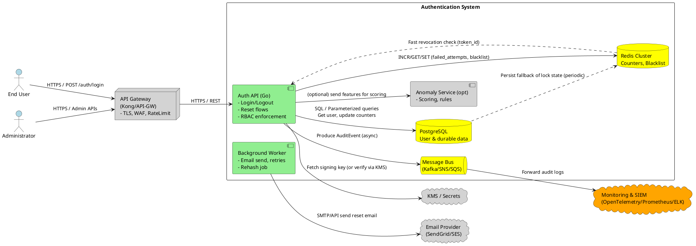
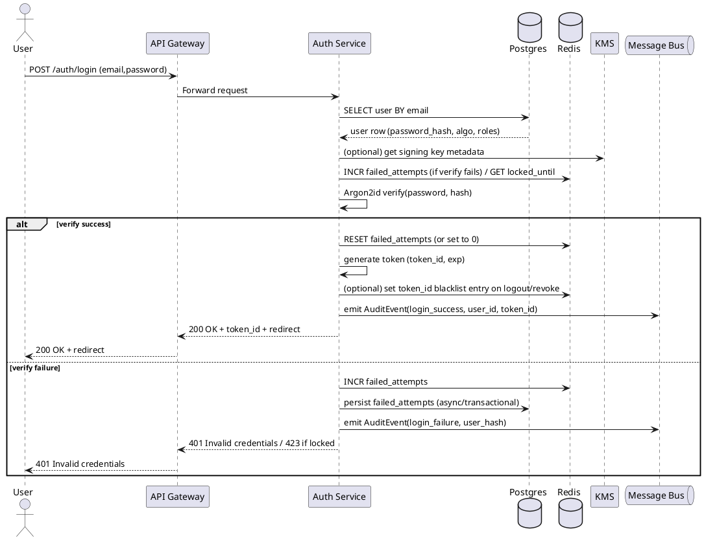

# Architecture Design

## Project Overview
A secure, auditable, and user-friendly Email+Password Authentication Service that provides login, logout, password reset, account lockout, role-based redirect and server-side enforcement, optional TOTP MFA, and optional adaptive rate-limiting/CAPTCHA. Targets: end users (customers/employees/admins), support and security teams, and resource servers that consume issued tokens.

## Architecture Goals
- Secure: Protect credentials, tokens, and PII; follow OWASP/NIST guidance.
- Highly available and responsive: p95 authentication success (end-to-end) ≤ 2s; server-side p95 auth processing ≤ 500 ms.
- Auditable: Structured audit events emitted and queryable within SIEM within 30s.
- Scalable and maintainable: Stateless service instances; horizontal scale; clear separation of concerns.
- Extensible: Pluggable adapters for email, MFA, CAPTCHA, and OIDC/SSO.

## Non-Functional Requirements
- NFR-001: Latency — System MUST authenticate and return a redirect within 2s (95th percentile) end-to-end. Server-side auth processing (DB lookup + Argon2 verify + token sign) MUST complete p95 ≤ 500 ms under nominal load.
- NFR-002: Availability — Authentication service MUST target 99.95% uptime (monthly). DB and cache MUST be multi-AZ with automated failover.
- NFR-003: Security & Crypto — Passwords MUST be Argon2id hashed with algorithm/version metadata; keys MUST be stored in KMS; all traffic MUST use TLS. Key rotation policy: signing keys rotated at least annually; KMS-backed rotation supported.
- NFR-004: Observability & Auditing — Auth events MUST be emitted as structured JSON logs and forwarded to SIEM within 30s. Metrics required: auth RPS, failure rate, lockout count, token revocation rate; traces correlated via OpenTelemetry.
- NFR-005: Consistency & Atomicity — Failed_attempts, lock state, and token revocation MUST be enforced consistently across instances (atomic updates). Revoked tokens MUST be rejected within 60 seconds (cache TTL/propagation objective).
- NFR-006: Privacy & Data Protection — No raw passwords or reset tokens logged. PII in logs MUST be hashed or redacted. Audit logs retention and deletion policies MUST comply with regulation (DR-003).
- NFR-007: Scalability — System MUST scale horizontally to meet expected auth peak RPS (TBD). Redis cluster and Postgres sizing MUST support atomic counters and transactional user updates at scale.
- NFR-008: Testability & Maintainability — All security-critical flows MUST have unit & integration tests; regression tests for Argon2 parameters and token revocation. CI must include SAST and dependency scanning.

Note: NFRs include measurable thresholds (latency, availability, forwarding time, revocation window).

## Data Requirements
- DR-001: User & Credential Data — System MUST store user records with fields: id (UUID), email (unique), password_hash, password_algo, password_algo_version, roles (relation or JSONB), failed_attempts, locked_until, mfa_enabled, created_at, updated_at. All fields typed and constrained (Postgres).
- DR-002: Reset Tokens — System MUST store only hashed reset tokens with user_id, created_at, expires_at, used_flag. Reset tokens MUST be single-use and expire by default after 1 hour.
- DR-003: Audit Log Retention — Audit events MUST be forwarded to SIEM/Log store and retained per policy (TBD); system MUST support deletion requests (GDPR/CCPA) and provide an audit of deletion actions.
- DR-004: Backup & Disaster Recovery — User DB MUST have automated backups and PITR; daily full backups and PITR window configured per org (e.g., 7–30 days). Redis snapshots and replication MUST be configured; ensure token blacklist durability as needed.
- DR-005: Token Revocation Store — Fast revocation blacklist (Redis) MUST store token_id keys with TTL matching token expiry; revocations logged to durable store for audit (Postgres events table).
- DR-006: [UNCLEAR] Data Residency & Compliance — System MUST support data residency requirements if mandated (region selection for DB, logs). Clarify required regions and retention windows before implementation.

## AI Consideration

Status: Applicable

Rationale: Adaptive rate-limiting/CAPTCHA (FR-011) is tagged [HYBRID] and may benefit from ML/heuristics for anomaly detection. AI use is optional and must be auditable and explainable.

AI Requirements
- AIR-001: Adaptive Detection — System SHOULD provide an auditable anomaly scoring service for login patterns; scores MUST be explainable and stored with events for at least 30 days.
- AIR-002: Guardrails & Explainability — Any ML-derived decision that escalates mitigation (CAPTCHA, temporary block) MUST include rationale fields and be reviewable by security ops; ML inference logs MUST be stored (no PII).
- AIR-003: [UNCLEAR] Model Hosting & Data — If ML is used, specify model hosting (on-prem/cloud) and training data retention/PII handling before production.

AI Architecture Pattern
Selected Pattern: Hybrid (Deterministic rules + ML-based anomaly scoring as optional plug-in)
- Context: Deterministic rules cover base rate-limits; ML augments for adaptive escalation.
- Decision: Hybrid balances auditability, determinism, and adaptability.
- Benefit: Predictive detection of credential-stuffing while remaining auditable.

## Technology Stack

| Layer | Technology | Version | Justification (NFR/DR/AIR) |
|-------|------------|---------|----------------------------|
| Frontend | SPA (React) or server-rendered app (existing) | N/A | UI handles client-side validation and secure token storage (HttpOnly cookies) — NFR-001, NFR-006 |
| API Gateway | Kong / AWS API Gateway / Cloud Gateway | Latest stable | TLS termination, WAF, global rate-limits, CAPTCHA routing — NFR-003, NFR-001 |
| Auth Service (Backend) | Go (recommended) / Node.js (TypeScript) | Go 1.21+ or Node 18+ | Go recommended for low-latency Argon2 handling and memory efficiency. Node viable if team expertise is stronger — NFR-001, NFR-007 |
| Database | PostgreSQL (managed) | 13+ | ACID, JSONB for metadata, migrations, audit exports — DR-001..DR-005 |
| Cache / Fast Store | Redis (clustered) | 6.2+ | Atomic counters, token blacklist, locks, lua scripts — NFR-005, DR-005 |
| Message Bus | Kafka / AWS SNS+SQS | Latest | Async audit pipeline and email tasks (non-blocking) — NFR-004 |
| Email Provider | SES / SendGrid / Mailgun | Provider-specific | Delivery webhooks for status and retries — FR-007 |
| Secrets & KMS | AWS KMS / Azure Key Vault / HashiCorp Vault | Managed | Key storage and rotation for signing keys — NFR-003 |
| Observability | OpenTelemetry, Prometheus, Grafana, ELK / Datadog | Latest | Tracing, metrics, logs — NFR-004 |
| Container Orchestration | Kubernetes (EKS/GKE/AKS) | 1.24+ | Horizontal scaling, deployments, canary releases — NFR-007 |
| CI/CD & Scanning | GitHub Actions / GitLab CI, SAST, dependency scanning | Latest | Security gating and automated tests — NFR-008 |
| Argon2 Library | libsodium / argon2 bindings (language-specific) | Latest stable | Secure hashing with rehash support — FR-008 |

Alternative Technology Options
- Auth Service: Node.js + TypeScript — faster dev velocity for JS-heavy teams; must mitigate event-loop blocking for Argon2 via worker threads.
- Serverless (Lambda + API Gateway) — possible for low-traffic deployments; Argon2 costs and cold starts must be profiled.
- Message Bus: AWS SNS+SQS for simpler managed setup; Kafka for high-throughput, high-durability needs.

Technology Stack Validation
- Latency: Go + Argon2 tuned parameters meets p95 server-side ≤ 500ms under target concurrency; Node.js requires offloading Argon2 to worker threads.
- Security: KMS + managed Postgres + Redis with AUTH and TLS meet NFR-003.
- Observability: OpenTelemetry + Prometheus satisfy NFR-004.

Technology Decision

| Metric (from NFR/DR/AIR) | Go (Recommended) | Node.js (TS) | Rationale |
|--------------------------|------------------|--------------|-----------|
| Low-latency Argon2 handling (p95) | 8/10 | 6/10 | Go's native performance and goroutine model simplify Argon2 calls; Node requires worker threads for CPU-bound hashing |
| Developer productivity | 6/10 | 8/10 | Node has faster iteration for JS teams |
| Operational footprint | 8/10 | 6/10 | Go typically smaller memory/CPU per instance |
| Ecosystem (libs) | 7/10 | 9/10 | Node has broader libs; validate security maturity of Argon2 binding |
| Final decision | Recommended | Acceptable | Choose based on team expertise; default to Go for low-latency security-critical service (NFR-001, NFR-003) |

### AI Component Stack (Conditional)
| Component | Technology | Purpose |
|-----------|------------|---------|
| Anomaly Scoring Service | Python FastAPI / Go microservice | Host ML model for login anomaly scoring (auditable) — AIR-001 |
| Model Provider | On-prem model or cloud (SageMaker/Vertex) | Model training and hosting (if used) — AIR-003 |
| Storage | Audit DB / Feature Store | Store scores and features for retraining and audit — AIR-001 |
| Guardrails | Rules Engine + Explainability logs | Ensure ML decisions attach rationale and allow overrides — AIR-002 |

## Technical Requirements
- TR-001: Service Architecture — System MUST be implemented as a stateless Authentication Microservice behind an API Gateway, designed for horizontal scaling and independent deployment (satisfies NFR-007, NFR-002).
- TR-002: Crypto & Secret Management — System MUST use Argon2id for password hashing with stored algorithm/version metadata and KMS for token signing keys; support rehash-on-login (satisfies NFR-003, DR-001).
- TR-003: Token Strategy — System MUST by default issue short-lived signed JWTs (TTL 30m, configurable) with token_id claim and support a revocation store (Redis); refresh token support is optional and must be configurable (satisfies FR-004, FR-009, NFR-005).
- TR-004: Atomic Counters & Lockout — System MUST use Redis (with Lua scripts or atomic ops) for failed_attempt counters and lock state to provide distributed atomicity and fallback persistence to Postgres (satisfies FR-006, NFR-005).
- TR-005: Audit & Eventing — System MUST emit structured auth events to a message bus (Kafka or SNS+SQS) and forward to SIEM within 30s; auth flows must not block on audit delivery (satisfies FR-010, NFR-004).
- TR-006: Integrations & Extensibility — System MUST provide pluggable adapters for Email provider, CAPTCHA provider, MFA module, and future OIDC clients (satisfies FR-011, FR-012, FR-013).
- TR-007: Observability & Testing — System MUST implement OpenTelemetry traces, Prometheus metrics, structured JSON logging, and have unit, integration, performance tests for critical paths (satisfies NFR-004, NFR-008).
- TR-008: Security Controls — All DB access MUST use parameterized queries/ORM to prevent injection; cookies set HttpOnly/Secure/SameSite where used; API gateway to enforce TLS and WAF rules (satisfies NFR-003).

## Domain Entities
- User
  - Represents a registered account.
  - Attributes: id (UUID), email, email_normalized, password_hash, password_algo, password_algo_version, roles, failed_attempts, locked_until, mfa_enabled, created_at, updated_at, last_login_at.
  - Relationships: One-to-many with ResetToken and AuditEvent.
- ResetToken
  - Represents a hashed single-use password reset token.
  - Attributes: id (UUID), user_id, hashed_token, created_at, expires_at, used_flag.
- SessionToken / TokenRecord
  - Represents token revocation metadata.
  - Attributes: token_id, user_id, revoked_at, expires_at.
  - Stored in Redis (fast) and replicated to Postgres for audit.
- AuditEvent
  - Auth events emitted as structured logs/events.
  - Attributes: event_id, user_id (or hashed email), event_type, timestamp, source_ip, user_agent, outcome, anomaly_score (optional).
- Role
  - Represents RBAC roles.
  - Attributes: role_id, name, permissions (mapping).
- MFARecord (optional)
  - Attributes: user_id, totp_secret_hash, recovery_codes_hash (one-way), enrolled_at.

## Technical Constraints & Assumptions
- All endpoints served over TLS by API Gateway or load balancer.
- Existing user DB can be extended; migration tooling (Flyway/pg-migrate) available.
- Cloud provider not fixed — design uses managed services where possible; choose providers early to finalize KMS and managed DB choices.
- Email provider availability SLA is out-of-scope; system must retry and log delivery status.
- Token TTL defaults: access token 30 minutes, reset token 1 hour—configurable feature flags.
- Team expertise may influence language choice (Go vs Node).

## Component Architecture

High-level component diagram (PlantUML)


Sequence diagram: Login happy path (PlantUML)


Data flow: Forgot/reset (PlantUML)
```plantuml
@startuml
actor User
participant "Auth Service" as Auth
database "Postgres" as PG
database "Redis" as Redis
participant "Background Worker" as Worker
component "Email Provider" as Email
queue "Message Bus" as MQ

User -> Auth : POST /auth/forgot-password (email)
Auth -> PG : find user by email (non-revealing flow)
Auth -> PG : insert ResetToken (hashed_token, expires_at)
Auth -> MQ : emit AuditEvent(reset_requested)
Auth -> Worker : enqueue send-reset-email (token reference)
Worker -> Email : send email with link (token)
Email --> Worker : delivery status
Worker -> MQ : emit AuditEvent(email_delivery_status)
MQ --> SIEM : (audit ingestion)
User -> Auth : POST /auth/reset-password (token, new_password)
Auth -> PG : validate hashed token, expiry
Auth -> Auth : Argon2id hash new password (with new version if needed)
Auth -> PG : update user.password_hash, mark token used
Auth -> MQ : emit AuditEvent(reset_complete)
@enduml
```

(Each PlantUML block adheres to single-story principle.)

## Integration Architecture
- API Gateway: Enforces TLS, global rate limits, IP blocks, and WAF. Gateway routes to Auth Service and Admin APIs.
- Email Provider: Async send via background worker; delivery webhooks consumed to update delivery status and emitted to audit pipeline.
- KMS / Secrets: Signing keys kept in KMS; Auth Service requests signing operations or retrieves public keys. Private keys not stored in plaintext in service config.
- Message Bus & SIEM: AuditEvents produced to message bus and consumed by SIEM/logging pipeline; critical events (multiple lockouts) generate alerts.
- Existing User DB: If Auth service extends an existing DB, migrations and compatibility ensured; migration plan for existing password hashes provided.
- Monitoring/Tracing: OpenTelemetry collector ingests traces; Prometheus scrapes metrics; Grafana dashboards and alerting rules defined.

## Security Architecture
- Password Storage: Argon2id with parameters in config (time, memory, parallelism). Each user record stores password_algo and version; rehash-on-login for older versions (FR-008).
- Token Strategy: Short-lived JWTs (default 30 min) with token_id for revocation. Signing keys managed in KMS; key rotation supported. Revocation via Redis blacklist and durable revocation events in Postgres for audit (FR-004, FR-009).
- Account Lockout: Failed_attempts incremented atomically via Redis; when threshold met, locked_until set in Postgres and Redis. Locked accounts return HTTP 423 (or 403 with code) (FR-006).
- Input Validation & Injection Protection: All DB calls use parameterized queries/ORM; server-side strict validation prevents injection (FR-002).
- Transport & Cookies: TLS enforced. If using cookies, set Secure, HttpOnly, SameSite=Strict. For SPAs, recommend HttpOnly refresh cookie + in-memory access token pattern.
- Secrets: No hard-coded secrets. All secrets in KMS/Vault. CI/CD secrets retrieved from secure store.
- Logging & PII: No passwords or reset tokens in logs. Use hashed email or user_id in logs where possible. Structured JSON logs with correlation_id. Sensitive fields redacted.
- Rate Limiting & CAPTCHA: API Gateway enforces deterministic per-IP and per-account limits. Adaptive decisions may use Anomaly Service; ML decisions must be auditable and overridable (FR-011).
- Pen Testing & Scanning: SAST/DAST, dependency scanning, and penetration testing before production; regular review of Argon2 parameters and key rotations.
- Error Messages: Generic messages for auth failures to avoid user enumeration (FR-002).

## Deployment Architecture
- Kubernetes (recommended)
  - Deploy Auth Service as Deployment with HPA (CPU/memory-based). Liveness & readiness probes.
  - Background Workers as separate Deployment scaled independently.
  - Redis in clustered mode (managed) deployed multi-AZ.
  - Postgres as managed service with read replicas; backups & PITR enabled.
  - Message Bus: Managed Kafka or SNS+SQS.
  - KMS: Managed cloud KMS.
- Release Strategy
  - Canary or Blue/Green deployments for production changes.
  - Feature flags for lockout threshold, CAPTCHA enablement, MFA requirement.
  - Automated migrations using migration tool during deployment with backward-compatible schema changes.
- CI/CD
  - Build, test (unit/integration), SAST, dependency scanning, container image scanning.
  - Deployment pipelines with approvals for production changes.
- Infrastructure as Code
  - Terraform/CloudFormation for infra provisioning; Kubernetes manifests/Helm charts for apps.

## Cross-Cutting Concerns

Logging
- Structured JSON logs with correlation_id per request.
- Events: login_success, login_failure, lock, unlock, reset_requested, reset_completed, revoke.
- No PII or secrets in logs; hash emails when necessary.
- Log levels: INFO for security events, ERROR for failures. Debug gated by environment variable.

Monitoring & Tracing
- Traces: instrument DB queries, Argon2 verify, token sign/verify, external calls.
- Metrics: p50/p95/p99 auth latency, login RPS, failed_attempt rate, lockout rate, reset token issuance rate, email delivery success rate.
- Alerts: spike in failed_attempts, elevated lockouts, email delivery failure rate > threshold, high auth latency.

Error Handling
- Fail-fast validation (400 for malformed input).
- 401 for invalid credentials; 423 for locked.
- Generic messages to clients; detailed logs for ops.
- Retry/backoff for transient external failures; circuit-breaker for persistent downstream failures.
- Idempotency: logout and reset operations designed idempotent.

Operational Runbooks & SLOs
- SLOs: p95 auth latency ≤ 2s (end-to-end); availability 99.95%.
- Runbooks for Redis outage, DB failover, KMS key unavailability, email provider outage, and surge in failed logins.
- Health checks: readiness checks include DB, Redis, KMS connectivity; liveness indicates service health.

Testing & QA
- Unit tests: crypto, token handling, RBAC.
- Integration tests: DB transactions, lockout flow, reset token lifecycle.
- Performance tests: Argon2 parameter validation, p95 under anticipated concurrent load.
- Security tests: SAST/DAST, dependency scanning, fuzzing.

CI/CD & Governance
- Enforce PR reviews, SAST, dependency CVE checks, and unit test coverage threshold.
- Periodic review and rotation of crypto parameters and keys.

## Development Workflow

1. Finalize cloud/provider choices and KMS provider; decide on implementation language (Go recommended or Node.js per team).
2. Create schema migrations for User, ResetToken, TokenRevocations, AuditEvent.
3. Implement Auth Service core flows: login, logout, forgot/reset, role mapping, lock/unlock endpoints.
4. Implement Redis atomic scripts for counter/lock logic and token blacklist.
5. Add background worker for email and rehashing jobs; integrate message bus for audit events.
6. Integrate observability (OpenTelemetry, Prometheus) and automated tests; add SAST/dependency scanning in CI.

## Previous Analysis and Reasoning
- Pattern: Stateless Authentication Microservice behind API Gateway chosen for clear separation, scalability, and independent security hardening.
- Token Strategy: Short-lived JWTs + token_id blacklist chosen to balance performance and revocation capability; refresh tokens optional.
- Password Storage: Argon2id preferred with rehash-on-login and algorithm metadata to support migration and parameter tuning.
- Atomicity: Redis chosen for counters/blacklist because of atomic ops and TTL semantics; persisted state to Postgres for audit and durability.
- Observability and audit pipeline decoupled from auth latency using message bus.
- ML usage limited to optional anomaly scoring for adaptive CAPTCHA; deterministic controls implemented by default.

## Open Questions / Clarifications Required
- Target peak and sustained auth RPS to finalize Argon2 parameter tuning and capacity planning.
- Primary cloud provider (affects KMS, managed Postgres/Redis choices).
- Data residency and retention policy details (DR-003, DR-006).
- Exact SSO/OIDC requirements and provider list (FR-013).
- MFA policy details: which roles require mandatory MFA and recovery flows (FR-012).

---

End of Architecture Design document.