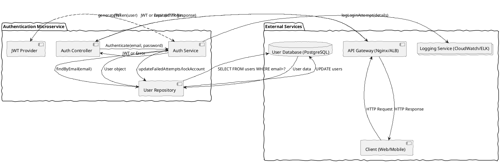

# System Architecture Document: Login & Authentication Service

## 1. Introduction

This document details the system architecture for the Login & Authentication feature, a core component designed to provide secure, scalable, and highly available user authentication and authorization for the application. It translates the product specifications into a comprehensive technical blueprint, covering architectural patterns, technology choices, data models, security measures, and deployment strategies.

## 2. Architecture Overview and Patterns

The Login & Authentication feature will be implemented as a dedicated **Authentication Microservice**. This pattern provides modularity, independent scalability, and enhanced security, aligning perfectly with the critical nature and stringent non-functional requirements outlined in the product specification.

**Key Benefits of Microservice Architecture for Authentication:**

*   **Modularity and Isolation:** The authentication logic is decoupled from other application functionalities, allowing independent development, deployment, and scaling. This reduces the blast radius in case of a security incident or failure.
*   **Scalability:** The Authentication Service can be scaled horizontally to handle high volumes of concurrent login attempts (NFR-SCAL-001) without impacting other services.
*   **Security Focus:** A dedicated service allows for specialized security measures, rigorous auditing (NFR-SEC-007), and specific hardening without affecting other parts of the system.
*   **Resilience:** Failures within the Authentication Service are isolated and less likely to cascade to other services.

### High-Level Component Diagram

```plantuml
@startuml
skinparam handwritten true
skinparam actorStyle awesome

actor "End User" as User
participant "Web/Mobile Client" as Client
cloud "Internet" as Internet
box "Application Backend" #LightBlue
    boundary "API Gateway" as APIGateway
    component "Authentication Service" as AuthSvc
    database "User Database" as UserDB
    collections "Logging Service" as LoggingSvc
    component "Authorization Service" as AuthzSvc
end box

User -down-> Internet : HTTPS (FR-005, NFR-SEC-002)
Internet -down-> Client : HTTPS (FR-005, NFR-SEC-002)

Client -up-> APIGateway : Login Request (Email/Password)
APIGateway -down-> AuthSvc : Authenticate User

AuthSvc --up--> UserDB : Retrieve User Data (FR-006, NFR-SEC-001)
AuthSvc --up--> LoggingSvc : Log Login Attempts (NFR-SEC-007)
AuthSvc --down--> APIGateway : Auth Token (JWT) / Error (FR-009, FR-013, FR-014, FR-015)

APIGateway -down-> Client : Auth Token / Error
Client -up-> User : Redirect to Dashboard (FR-011)

Client -right-> APIGateway : Subsequent API Calls (with JWT)
APIGateway -down-> AuthzSvc : Validate Token / Authorize (FR-012, FR-016, NFR-SEC-006)
AuthzSvc --> APIGateway : Authorization Decision
APIGateway -left-> "Other Microservices" as OtherSvc : Authorized Request
OtherSvc --> APIGateway : Response
APIGateway -up-> Client : Response

@enduml
```

## 3. Technology Stack

### 3.1. Frontend (Web/Mobile Client)

*   **Framework:** **React (or Angular/Vue.js)**
    *   **Justification:** Provides a robust component-based architecture for building interactive UIs, facilitates client-side validation (FR-004), and offers well-established patterns for secure token handling (NFR-SEC-006).
*   **Communication:** **HTTPS (TLS 1.2+)**
    *   **Justification:** Mandated by FR-005 and NFR-SEC-002 for secure credential transmission.

### 3.2. Backend (Authentication Service)

*   **Language & Framework:** **Java with Spring Boot**
    *   **Justification:** Enterprise-grade maturity, strong security features (e.g., Spring Security for password encoding, JWT integration), excellent performance, and a vast ecosystem of libraries crucial for robust authentication. High scalability and maintainability.
*   **Authentication & Authorization Libraries:**
    *   **`Spring Security`:** For overall security framework, password encoding (bcrypt/Argon2), and integration with JWT.
    *   **`java-jwt` (Auth0 library):** For generation, signing, and validation of JWTs (FR-009, FR-012, FR-016).
    *   **`jBCrypt` (or `BcryptPasswordEncoder` in Spring Security):** For strong, one-way password hashing with salt (NFR-SEC-001, FR-BR-001).
*   **API Gateway:** **Nginx (or cloud-native API Gateway like AWS API Gateway)**
    *   **Justification:** Acts as the entry point for all client requests. Handles responsibilities such as SSL/TLS termination (NFR-SEC-002), rate limiting (NFR-SEC-003), request routing, and potentially initial input sanitization before requests reach the Authentication Service.

### 3.3. Database

*   **Type:** **PostgreSQL**
    *   **Justification:** A robust, open-source, and highly scalable relational database. It offers strong transactional integrity, advanced indexing capabilities (for `email` lookups), and native support for data-at-rest encryption provided by cloud services, aligning with NFR-SEC-001 and FR-006.

### 3.4. Infrastructure & Operations

*   **Cloud Provider:** **AWS (Amazon Web Services)**
    *   **Justification:** Offers a comprehensive suite of managed services for high availability, scalability, and security (e.g., EC2, RDS, EKS, ALB, CloudWatch, KMS).
*   **Containerization:** **Docker**
    *   **Justification:** Standardizes packaging of the Authentication Service and its dependencies, ensuring consistent environments across development and production.
*   **Orchestration:** **Kubernetes (EKS in AWS)**
    *   **Justification:** Manages containerized applications, enabling automated deployment, scaling, load balancing, and self-healing (NFR-SCAL-001, NFR-AVAIL-001).
*   **Load Balancer:** **AWS Application Load Balancer (ALB)**
    *   **Justification:** Distributes incoming traffic across multiple instances of the Authentication Service, essential for scalability and high availability (NFR-SCAL-001, NFR-AVAIL-001). Handles SSL/TLS termination.
*   **Logging:** **AWS CloudWatch Logs + ELK Stack (Elasticsearch, Logstash, Kibana)**
    *   **Justification:** Centralized, secure logging and monitoring capabilities for all login attempts, system errors, and performance metrics (NFR-SEC-007). CloudWatch for initial ingestion, ELK for advanced analytics and long-term retention.

## 4. Non-Functional Requirements (NFR-XXX)

This section details the critical non-functional requirements derived from the product specification.

### 4.1. Security (NFR-SEC)

*   **NFR-SEC-001: Password Encryption at Rest**
    *   **Description:** All user passwords stored in the database MUST be encrypted using a strong, one-way hashing algorithm with a salt.
    *   **Measurable Criteria:** Passwords SHALL be hashed using **bcrypt** with a minimum work factor of 10 or **Argon2** with recommended parameters. Each hash MUST incorporate a unique 128-bit or higher cryptographically secure salt. Verification of stored passwords MUST take less than 200ms (95th percentile).
*   **NFR-SEC-002: Secure Communication**
    *   **Description:** All communication between the client and server during the login process MUST be encrypted.
    *   **Measurable Criteria:** All login-related HTTP requests MUST use **HTTPS (TLS 1.2 or higher)**. The server SHALL redirect 100% of HTTP requests to HTTPS, verified by security scans.
*   **NFR-SEC-003: Brute-Force Attack Prevention**
    *   **Description:** The system MUST implement measures to prevent brute-force attacks on user accounts.
    *   **Measurable Criteria:** An account lockout SHALL be triggered after **5 consecutive failed login attempts** from any source for a specific email. The lockout duration SHALL be **30 minutes**. The API Gateway SHALL implement a **rate-limiting mechanism of 10 login attempts per minute per IP address**.
*   **NFR-SEC-004: Protection Against Injection Attacks**
    *   **Description:** The system MUST protect against SQL injection and other command injection vulnerabilities.
    *   **Measurable Criteria:** 100% of database queries involving user input SHALL use parameterized queries or prepared statements. Input sanitization SHALL be applied to all user-provided data before processing, verified through code review and penetration testing.
*   **NFR-SEC-005: Protection Against Cross-Site Scripting (XSS)**
    *   **Description:** The login interface and error messages MUST be protected against XSS attacks.
    *   **Measurable Criteria:** All user-provided input displayed on the page SHALL be properly escaped using context-aware escaping libraries (e.g., OWASP ESAPI). Frontend frameworks' built-in XSS protection features MUST be utilized.
*   **NFR-SEC-006: Secure Token Handling**
    *   **Description:** Authentication tokens MUST be handled securely throughout their lifecycle.
    *   **Measurable Criteria:** Tokens SHALL be stored client-side in `HttpOnly` and `Secure` cookies, or securely in browser memory. Tokens MUST NOT appear in URLs or server-side logs. The server MUST validate token signature and expiration for 100% of protected requests.
*   **NFR-SEC-007: Auditing and Logging**
    *   **Description:** All login attempts, both successful and failed, MUST be securely logged.
    *   **Measurable Criteria:** Logs MUST include timestamp, email address (or user ID on success), IP address, and outcome. Sensitive information (plaintext passwords) MUST NEVER be logged. Logs MUST be retained for a minimum of **90 days** in a centralized, WORM-compliant storage system with strict access controls.

### 4.2. Performance (NFR-PERF)

*   **NFR-PERF-001: Login Response Time**
    *   **Description:** The system SHALL process a successful login request within an acceptable timeframe.
    *   **Measurable Criteria:** A successful login (from clicking "Login" to dashboard redirection) MUST complete within **2 seconds** for 95% of users under normal load (up to 100 concurrent logins/minute). The Authentication API endpoint response time MUST be less than **500 milliseconds** (95th percentile).

### 4.3. Scalability (NFR-SCAL)

*   **NFR-SCAL-001: Concurrent Users**
    *   **Description:** The login system SHALL support a high volume of concurrent login requests.
    *   **Measurable Criteria:** The system MUST support at least **1,000 concurrent active users** without degradation of NFR-PERF-001. The system MUST gracefully handle spikes up to **2,000 concurrent login attempts** without service failure, though with potential temporary performance degradation up to 5 seconds response time (99th percentile).

### 4.4. Usability (NFR-USAB)

*   **NFR-USAB-001: Clear Error Messages**
    *   **Description:** Error messages displayed to users SHALL be clear, concise, and actionable.
    *   **Measurable Criteria:** All error messages (FR-004, FR-013, FR-014, FR-015) MUST be presented in a consistent UI style, limited to one sentence, and avoid technical jargon. User testing will confirm clarity.
*   **NFR-USAB-002: Intuitive User Interface**
    *   **Description:** The login form SHALL be intuitive and easy for users to navigate.
    *   **Measurable Criteria:** Input fields MUST have clear labels. The "Login" button MUST be prominently displayed. Confirmed via UI/UX review.

### 4.5. Availability (NFR-AVAIL)

*   **NFR-AVAIL-001: Login System Uptime**
    *   **Description:** The login functionality MUST be highly available.
    *   **Measurable Criteria:** The Authentication Service, including its dependent database, MUST maintain an uptime of **99.9% measured monthly**, excluding planned maintenance windows.
*   **NFR-AVAIL-002: Disaster Recovery**
    *   **Description:** The authentication system shall be resilient to regional outages.
    *   **Measurable Criteria:** The system SHALL be recoverable in an alternate AWS region with a Recovery Time Objective (RTO) of **4 hours** and a Recovery Point Objective (RPO) of **15 minutes**.

## 5. Technical Requirements (TR-XXX)

These requirements define the specific technical functionalities and implementations needed to satisfy the functional and non-functional requirements.

*   **TR-001: API Endpoint Specification**
    *   The Authentication Service SHALL expose a RESTful API endpoint for login: `POST /api/auth/login`.
    *   Request Body: `{"email": "user@example.com", "password": "securepassword"}`.
    *   Successful Response (200 OK): `{"token": "JWT_TOKEN", "user_id": "uuid", "role": "Customer"}`.
    *   Error Responses: 400 Bad Request (client-side validation), 401 Unauthorized ("Invalid credentials"), 403 Forbidden ("Account is locked"), 500 Internal Server Error (generic error).
*   **TR-002: Password Hashing Implementation**
    *   The Authentication Service SHALL use the `bcrypt` algorithm for password hashing with a minimum cost factor of 10. The hash and salt SHALL be stored together in the `password_hash` column.
    *   Upon login, the provided password SHALL be compared against the stored hash using `bcrypt`'s verification function (FR-BR-001, NFR-SEC-001).
*   **TR-003: JWT Structure and Signing**
    *   Generated JWTs (FR-009) SHALL include the following claims: `sub` (user_id), `role`, `exp` (expiration time), `iat` (issued at time).
    *   Tokens SHALL be signed using `HS256` algorithm with a securely managed, long, random secret key, or `RS256` with a private/public key pair, ensuring server-side validation (NFR-SEC-006).
*   **TR-004: Failed Attempt Management**
    *   The Authentication Service SHALL increment the `failed_attempts` counter in the `users` table for each failed login for a given email (FR-007).
    *   If `failed_attempts` reaches 5, the `is_locked` flag SHALL be set to `TRUE`, and `lockout_until` SHALL be set to `current_time + 30 minutes` (FR-008, FR-BR-002, NFR-SEC-003).
    *   Upon successful login, `failed_attempts` SHALL be reset to 0, and `is_locked` and `lockout_until` SHALL be reset if applicable (FR-007).
*   **TR-005: Session Expiration Enforcement**
    *   The Authentication Service (or API Gateway's Authorization Service) SHALL reject any request with an expired JWT (checked against the `exp` claim) with a `401 Unauthorized` HTTP status code (FR-016).
*   **TR-006: Input Validation Logic**
    *   Server-side input validation SHALL confirm email format (regex), email max length (254 chars), password min length (8 chars), and password max length (64 chars) (FR-002, FR-003).
*   **TR-007: Centralized Logging Integration**
    *   The Authentication Service SHALL integrate with the centralized logging system (e.g., CloudWatch, ELK) to emit structured logs for all login attempts, including required details (NFR-SEC-007).

## 6. Data Requirements (DR-XXX)

This section defines the data model and storage strategy for the authentication feature.

### 6.1. User Data Model

The `users` table in the PostgreSQL database will store essential user authentication information.

*   **DR-001: `users` Table Schema**

| Column          | Data Type     | Constraints                                   | Description                                                 |
| :-------------- | :------------ | :-------------------------------------------- | :---------------------------------------------------------- |
| `id`            | UUID          | PRIMARY KEY, NOT NULL                         | Unique identifier for the user.                             |
| `email`         | VARCHAR(254)  | NOT NULL, UNIQUE, INDEX                       | User's email address, used for login.                       |
| `password_hash` | VARCHAR(255)  | NOT NULL                                      | Stores bcrypt/Argon2 hash and salt.                         |
| `role`          | VARCHAR(50)   | NOT NULL, INDEX                               | User's assigned role (e.g., 'Customer', 'Admin', 'Employee'). |
| `failed_attempts` | INT           | NOT NULL, DEFAULT 0                           | Consecutive failed login attempts count.                    |
| `is_locked`     | BOOLEAN       | NOT NULL, DEFAULT FALSE                       | Flag indicating if the account is currently locked.         |
| `lockout_until` | TIMESTAMP WITH TIME ZONE | NULLABLE                                      | Timestamp when account lockout expires.                     |
| `created_at`    | TIMESTAMP WITH TIME ZONE | NOT NULL, DEFAULT CURRENT_TIMESTAMP   | Record creation timestamp.                                  |
| `updated_at`    | TIMESTAMP WITH TIME ZONE | NOT NULL, DEFAULT CURRENT_TIMESTAMP   | Last update timestamp.                                      |

*   **DR-002: Data at Rest Encryption**
    *   The PostgreSQL database instance SHALL be configured to use encryption at rest (e.g., AWS RDS encryption with KMS keys).
*   **DR-003: Password Hashing Storage**
    *   The `password_hash` column MUST only store the output of the bcrypt/Argon2 hashing function, never plaintext passwords.
*   **DR-004: Indexing Strategy**
    *   Indexes SHALL be created on `email` (for fast user lookup during login) and `role` (for efficient role-based queries if needed).

## 7. Component Architecture

The Authentication Microservice comprises several internal logical components interacting with external systems.

### Component Diagram



### 7.1. Authentication Controller (`AuthController`)

*   **Responsibility:** Handles incoming HTTP requests for login, delegates to `AuthService`, and formats HTTP responses.
*   **Key Functions:**
    *   Receives POST requests to `/api/auth/login`.
    *   Performs initial request body validation (e.g., JSON format).
    *   Delegates authentication logic to `AuthService`.
    *   Catches exceptions and maps them to appropriate HTTP status codes and error messages (FR-013, FR-014, FR-015).

### 7.2. Authentication Service (`AuthService`)

*   **Responsibility:** Contains the core business logic for user authentication, password verification, account lockout management, and JWT generation.
*   **Key Functions:**
    *   Retrieves user by email from `UserRepository` (FR-006).
    *   Compares provided password with stored hashed password (FR-006, NFR-SEC-001).
    *   Tracks and updates failed login attempts (FR-007).
    *   Implements account lockout/unlock logic (FR-008, NFR-SEC-003).
    *   Generates JWT upon successful authentication using `JwtProvider` (FR-009).
    *   Determines user role (FR-010).
    *   Logs all login attempts via `LoggingService` (NFR-SEC-007).

### 7.3. User Repository (`UserRepository`)

*   **Responsibility:** Abstracts database access for user-related data.
*   **Key Functions:**
    *   `findByEmail(email)`: Retrieves a user record by email (FR-006).
    *   `updateFailedAttempts(userId, count)`: Updates the failed attempts counter.
    *   `lockAccount(userId, lockoutUntil)`: Sets account `is_locked` flag and `lockout_until` timestamp (FR-008).
    *   `resetFailedAttempts(userId)`: Resets `failed_attempts`, `is_locked`, `lockout_until`.

### 7.4. JWT Provider (`JwtProvider`)

*   **Responsibility:** Encapsulates the logic for generating, signing, and potentially validating JWTs.
*   **Key Functions:**
    *   `generateToken(user)`: Creates a JWT with user ID, role, and expiration (FR-009, FR-016).
    *   Signs the token using a configured secret key or private key (TR-003).

## 8. Integration Architecture

### 8.1. Client-Backend Integration

*   **Protocol:** RESTful API over HTTPS (FR-005, NFR-SEC-002).
*   **Authentication Flow:**
    1.  Client submits credentials (email, password) to `POST /api/auth/login` endpoint via the API Gateway.
    2.  Upon successful authentication, the Authentication Service returns a JWT.
    3.  Client stores the JWT securely (e.g., HttpOnly, Secure cookie or browser memory - NFR-SEC-006).
    4.  For subsequent protected requests, the client includes the JWT in the `Authorization: Bearer <token>` header.

### 8.2. Backend-Database Integration

*   **Method:** JDBC (Java Database Connectivity) for PostgreSQL.
*   **Access:** The Authentication Service is the sole direct consumer of the `users` table for authentication-related operations (read user, update failed attempts, lock account). Other services requiring user data will access it via dedicated User/Profile microservices, not directly via the Authentication Service's database.

### 8.3. Backend-Logging Integration

*   **Method:** Asynchronous logging library (e.g., Logback/Log4j2 with Appenders) configured to send logs to a centralized logging service (e.g., AWS CloudWatch Logs, then potentially streamed to ELK stack).
*   **Data:** Login attempts (success/failure, user ID/email, IP, timestamp), service health, errors (NFR-SEC-007).

### 8.4. Cross-Service Authorization

*   **Method:** JWT-based authorization (FR-012).
*   **Flow:**
    1.  Client sends JWT with every protected request to the API Gateway.
    2.  API Gateway (or a dedicated Authorization Service co-located or proxied by the gateway) intercepts the request.
    3.  It validates the JWT's signature and expiration (NFR-SEC-006, FR-016).
    4.  It extracts user roles from the JWT.
    5.  It performs role-based access control (RBAC) against the requested resource's requirements.
    6.  If authorized, the request is forwarded to the appropriate downstream microservice; otherwise, a `403 Forbidden` is returned (FR-012, FR-BR-004).

## 9. Security Architecture

The security architecture for the Login & Authentication Service is designed around a "defense-in-depth" strategy, incorporating multiple layers of security controls as mandated by the NFR-SEC requirements.

*   **Secure Communication (NFR-SEC-002):**
    *   All external traffic to the API Gateway will enforce HTTPS (TLS 1.2+).
    *   Internal microservice communication will also be encrypted using TLS where possible (e.g., mTLS within Kubernetes).
*   **Credential Storage (NFR-SEC-001, FR-BR-001):**
    *   User passwords will be stored as bcrypt/Argon2 hashes with unique salts in the PostgreSQL database.
    *   The database itself will utilize encryption at rest.
*   **Brute-Force Protection (NFR-SEC-003, FR-008, FR-BR-002):**
    *   **Account Lockout:** Server-side tracking of failed attempts (5 attempts, 30-minute lockout).
    *   **Rate Limiting:** API Gateway will implement IP-based rate limiting (10 attempts/minute/IP).
*   **Input Validation & Sanitization (NFR-SEC-004, NFR-SEC-005):**
    *   Both client-side (FR-004) and server-side validation (TR-006) will be performed.
    *   Parameterized queries/prepared statements for all database interactions.
    *   Context-aware output encoding to prevent XSS.
*   **Authentication Token Management (NFR-SEC-006, FR-009, FR-016):**
    *   JWTs used are cryptographically signed.
    *   Short expiration times (30 minutes).
    *   Tokens stored in `HttpOnly`, `Secure` cookies or secure browser memory.
    *   Tokens are never exposed in URLs or logs.
    *   Signature and expiration validated on every protected request.
*   **Auditing and Logging (NFR-SEC-007):**
    *   Comprehensive logging of all login attempts (success/failure, user ID/email, IP, timestamp).
    *   No sensitive data (plaintext passwords) in logs.
    *   Centralized, immutable logging system with strict access controls and 90-day retention.
*   **Role-Based Access Control (FR-012, FR-BR-004):**
    *   Authorization logic implemented at the API Gateway or a dedicated Authorization Service, validating user roles against resource access permissions.

## 10. Deployment Architecture

The Authentication Service will be deployed on a containerized, cloud-native infrastructure, leveraging AWS for scalability, reliability, and security.

### Deployment Diagram

```plantuml
@startuml
skinparam handwritten true
skinparam actorStyle awesome

cloud "AWS Region 1 (Primary)" as AWS1 {
    component "Route 53" as R53
    component "Application Load Balancer (ALB)" as ALB
    component "Web Application Firewall (WAF)" as WAF
    folder "Kubernetes Cluster (EKS)" as EKS1 {
        node "Worker Node 1" as WN1_1
        node "Worker Node 2" as WN1_2

        rectangle "Auth Service Pods" as AuthSvcPods1 {
            [Auth Service Instance 1] as Auth1_1
            [Auth Service Instance 2] as Auth1_2
            Auth1_1 -up- WN1_1
            Auth1_2 -up- WN1_2
        }
        rectangle "Fluentd/Logstash Pods" as LoggingAgent1 {
            [Fluentd/Logstash 1] as LogAgent1_1
            [Fluentd/Logstash 2] as LogAgent1_2
            LogAgent1_1 -up- WN1_1
            LogAgent1_2 -up- WN1_2
        }
    }
    database "RDS PostgreSQL (Multi-AZ)" as RDS1
    collections "CloudWatch Logs" as CW1
}

cloud "AWS Region 2 (DR)" as AWS2 {
    folder "Kubernetes Cluster (EKS)" as EKS2 {
        node "Worker Node 1" as WN2_1
        rectangle "Auth Service Pods" as AuthSvcPods2 {
            [Auth Service Instance 1 (Standby)] as Auth2_1
            Auth2_1 -up- WN2_1
        }
        rectangle "Fluentd/Logstash Pods" as LoggingAgent2 {
            [Fluentd/Logstash 1 (Standby)] as LogAgent2_1
            LogAgent2_1 -up- WN2_1
        }
    }
    database "RDS PostgreSQL Read Replica" as RDS2
    collections "CloudWatch Logs" as CW2
}

actor "End User" as User
component "Client" as Client

User -- Internet --> Client
Client --> R53 : auth.example.com
R53 --> WAF : Route to Primary Region
WAF --> ALB : Filter Malicious Traffic (NFR-SEC-003)
ALB --> AuthSvcPods1 : Distribute Login Requests (NFR-SCAL-001)

AuthSvcPods1 <--> RDS1 : Database Operations (FR-006, DR-001)
AuthSvcPods1 --> CW1 : Send Logs (NFR-SEC-007)
LoggingAgent1 --> CW1 : Forward Logs

RDS1 <--> RDS2 : Asynchronous Replication (NFR-AVAIL-002)

' Failover scenario (not active in diagram, but implied)
R53 -[hidden]down-> AWS2 : On Primary Region Failure
ALB -[hidden]down-> AuthSvcPods2
AuthSvcPods2 <--> RDS2
AuthSvcPods2 --> CW2

@enduml
```

### 10.1. Infrastructure Components

*   **DNS:** AWS Route 53 for global routing and potential disaster recovery failover.
*   **Security:** AWS Web Application Firewall (WAF) for L7 protection (SQLi, XSS, rate limiting) (NFR-SEC-003, NFR-SEC-004, NFR-SEC-005).
*   **Load Balancing:** AWS Application Load Balancer (ALB) distributes traffic to EKS clusters, handles SSL termination (NFR-SCAL-001, NFR-SEC-002).
*   **Compute:** AWS Elastic Kubernetes Service (EKS) for container orchestration, auto-scaling, and self-healing (NFR-SCAL-001, NFR-AVAIL-001).
*   **Database:** AWS Relational Database Service (RDS) for PostgreSQL. Configured for Multi-AZ for high availability and automated backups (NFR-AVAIL-001).
*   **Logging:** AWS CloudWatch Logs for centralized log collection (NFR-SEC-007).

### 10.2. Scalability (NFR-SCAL-001)

*   **Horizontal Scaling:** EKS will automatically scale the number of Authentication Service pods based on CPU utilization or request queue length.
*   **Load Balancing:** ALB efficiently distributes incoming requests across healthy pods.
*   **Database Scaling:** RDS Read Replicas can be used for scaling read-heavy workloads (though login is write-intensive for failed attempts), and RDS instance types can be scaled vertically.

### 10.3. High Availability (NFR-AVAIL-001)

*   **Multi-AZ Deployment:** RDS PostgreSQL configured for Multi-AZ provides automatic failover within a region.
*   **Kubernetes:** EKS ensures application resilience by distributing pods across multiple EC2 instances and automatically restarting failed containers.
*   **ALB:** Health checks ensure traffic is only routed to healthy pods.

### 10.4. Disaster Recovery (NFR-AVAIL-002)

*   **Cross-Region Replication:** RDS PostgreSQL will have a cross-region read replica (or logical replication) in a designated DR region.
*   **DR Cluster:** A scaled-down EKS cluster with Authentication Service pods pre-deployed (or deployed quickly via CI/CD) will exist in the DR region.
*   **Failover Strategy:** In case of primary region failure, Route 53 DNS records will be updated to point to the DR region's ALB, and the RDS replica will be promoted to primary.

## 11. Cross-Cutting Concerns

### 11.1. Logging and Monitoring

*   **Centralized Logging (NFR-SEC-007):** All application logs (access, error, debug, security events) will be collected by Fluentd/Logstash agents within EKS pods and forwarded to AWS CloudWatch Logs. From CloudWatch, logs will be streamed to an ELK stack (Elasticsearch for storage, Kibana for visualization) for analysis and long-term retention (90 days minimum).
*   **Metrics & Alerts:**
    *   **Application Metrics:** Custom metrics (e.g., successful/failed login counts, latency of password hashing, database queries) will be emitted using Prometheus-compatible libraries and scraped by Prometheus in EKS.
    *   **Infrastructure Metrics:** EKS, ALB, RDS metrics will be collected by AWS CloudWatch.
    *   **Alerting:** CloudWatch Alarms and Prometheus Alertmanager will trigger alerts (e.g., via PagerDuty, Slack) for critical events such as high error rates (FR-015), slow response times (NFR-PERF-001), or service unavailability (NFR-AVAIL-001).

### 11.2. Error Handling

*   **Client-Side (FR-004, NFR-USAB-001):** Immediate feedback to the user for invalid/empty inputs without server round-trip.
*   **Server-Side Specific Errors (FR-013, FR-014, NFR-USAB-001):** The Authentication Service will return distinct HTTP status codes (401, 403) and specific, user-friendly messages for known failure scenarios (invalid credentials, account locked).
*   **Generic Server Error (FR-015, NFR-USAB-001):** For unexpected backend failures (e.g., database connection issues), a generic "An unexpected error occurred. Please try again later." message will be returned to the client, without exposing internal details.
*   **Error Logging:** All server-side errors will be logged with full stack traces (excluding sensitive data) to the centralized logging system for debugging and analysis.

### 11.3. Configuration Management

*   **Externalized Configuration:** All sensitive configurations (database credentials, JWT secrets, logging endpoints) will be externalized from the application code.
*   **Secrets Management:** AWS Secrets Manager or Kubernetes Secrets (encrypted at rest) will be used to securely store and retrieve sensitive configuration parameters, ensuring they are not hardcoded or exposed.
*   **Environment Variables:** Non-sensitive configurations will be managed via environment variables within the Docker containers and Kubernetes deployments.

### 11.4. Deployment Automation

*   **CI/CD Pipeline:** A Continuous Integration/Continuous Deployment pipeline (e.g., Jenkins, GitLab CI/CD, AWS CodePipeline) will automate the build, test, containerization, and deployment of the Authentication Service to EKS environments. This ensures consistent, repeatable, and fast deployments.