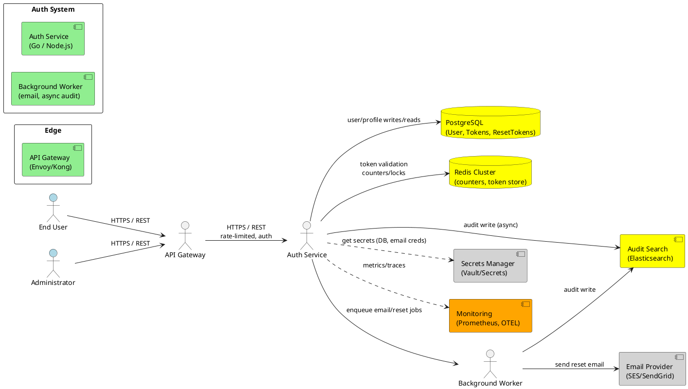
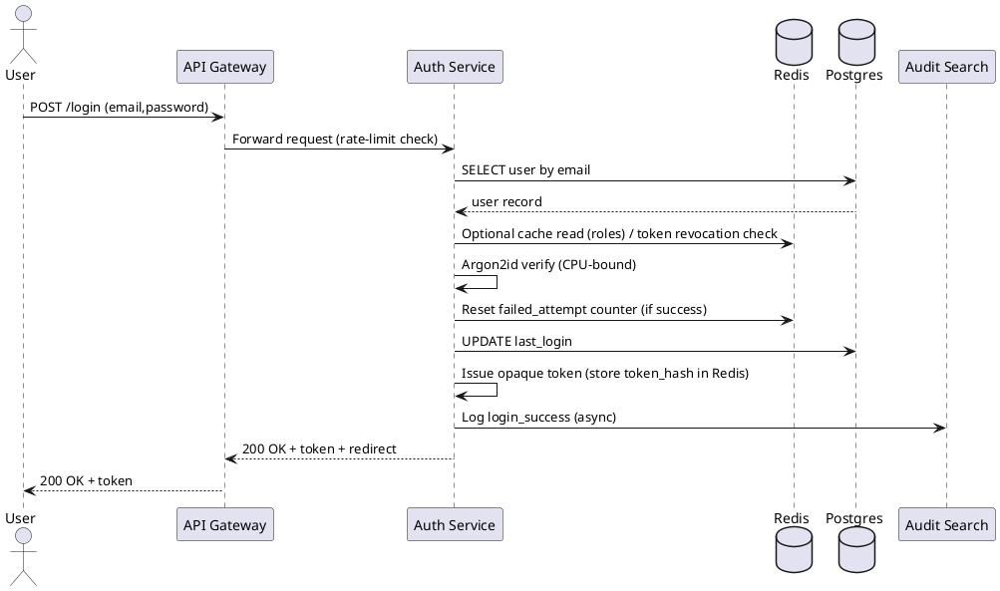

# Architecture Design

## Project Overview
Secure Email/Password Authentication Service (Auth Service) — purpose: provide deterministic, auditable email/password authentication, enforce role-based post-login routing, protect accounts from brute-force attacks, enable secure account recovery, and provide admin remediation UI. Target users: application end-users (Admins, Employees, Customers) and system administrators. High-level capabilities: login/logout, token issuance/validation, account lockout, password reset, audit logging, admin unlock and investigation.

### Architecture Overview and Patterns
- Selected primary pattern: Dedicated Authentication Microservice (bounded context) deployed as stateless service tier + supporting stateful stores.
  - Context → Decision → Benefit
    - Context: Authentication requires independent security controls, independent scaling, and strict auditability.
    - Decision: Use a dedicated stateless Auth Service behind an API Gateway, with Redis for ephemeral state and PostgreSQL for authoritative data + an audit/search store for logs.
    - Benefit: Isolation of sensitive logic, independent autoscaling for spikes (login bursts), simple horizontal scaling and predictable revocation semantics.
- Pattern Rationale (concise):
  - Single Responsibility: Auth concerns are isolated (no presentation or unrelated domain logic).
  - Scalability & Availability: Stateless app tier scaled independently; Redis enables distributed counters and token revocation.
  - Auditability & Compliance: Append-only audit pipeline to searchable store supports investigations and retention policies.
- Alternatives considered:
  - Modular Monolith: faster initial delivery, but less isolation for security and harder operational separation.
  - Serverless: lower ops, but Argon2 CPU tuning and cold-start latency risk; acceptable only after load testing.

## Architecture Goals
- G1: Secure storage and validation of credentials using Argon2id (or bcrypt fallback).
- G2: Meet p95 auth latency < 200 ms under normal load.
- G3: Prevent account enumeration and mitigate brute-force attacks.
- G4: Provide auditable, searchable authentication events with configurable retention.
- G5: Support horizontal scaling and stateless request handling with distributed coordination for revocation/locks.

## Non-Functional Requirements
- NFR-001: Security — System MUST enforce TLS 1.2+ for all authentication endpoints.
  - Measurable: 100% of inbound traffic uses TLS; periodic scan (monthly) reports no HTTP endpoints exposed.
- NFR-002: Performance — Authentication p95 MUST be < 200 ms under normal load.
  - Measurable: p95 measured over 24-hour staging run representing expected traffic ≤ 200 ms.
- NFR-003: Availability — Service MUST target 99.9% uptime.
  - Measurable: 30-day uptime ≥ 99.9% (excluding scheduled maintenance) reported by monitoring.
- NFR-004: Scalability — Service MUST scale horizontally; token validation MUST be stateless or use distributed store for revocation.
  - Measurable: Adding instances in load test maintains error rate ≤ 0.1% and latency degradation ≤ 10%.
- NFR-005: Observability — System MUST emit metrics and logs for key auth KPIs.
  - Measurable: Dashboards and alerts configured for login_success_rate, login_failure_rate, account_locks, reset_requests, rate_limit_events; alert thresholds defined and validated.
- NFR-006: Privacy & Compliance — Data at rest MUST be encrypted (AES-256); audit retention default 1 year; PII minimized in logs.
  - Measurable: At-rest encryption enabled for DB/backups; audit retention policy enforceable via config; no plaintext passwords in logs (verified by automated log scanner).
- NFR-007: Usability & Accessibility — Flows MUST meet WCAG 2.1 AA.
  - Measurable: Accessibility audit score meets WCAG 2.1 AA criteria; user testing average success rate ≥ 95%.
- NFR-008: Configurability — Security thresholds (failed attempts, TTLs, lock duration, rate limits) MUST be configurable at runtime via environment or config service.
  - Measurable: Changing config values takes effect without code deploy (validated in staging).

**Note**: Mark unclear requirements with [UNCLEAR] as needed (none of the above are ambiguous).

## Data Requirements
- DR-001: User data model — System MUST store user authentication attributes (id, email, password_hash, hash_algorithm, roles, last_login, created_at, updated_at).
  - Measurable: DB schema includes fields with proper indexes (email unique), and migrations are versioned.
- DR-002: Audit logging — System MUST capture structured audit entries for auth events including timestamp, event_type, user_id (nullable), client_ip, user_agent, metadata.
  - Measurable: Audit records searchable within 1 minute of event ingestion; retention policy applied.
- DR-003: Token storage — For opaque tokens or refresh tokens, token records MUST be stored with token_hash, user_id, issued_at, expires_at, revoked_flag.
  - Measurable: Token validation latency p95 < 5 ms for Redis lookup; token revocation propagated within 1s.
- DR-004: Failed-attempt counters & locks — System MUST store counters and lock state in Redis (fast-path) and persist authoritative state to Postgres for long-term.
  - Measurable: Atomic counter updates with Redis LUA scripts; lock state persisted within 5s of lock event.
- DR-005: Reset tokens — System MUST store only hashed reset tokens with expiry and used_flag.
  - Measurable: Reset tokens expire per TTL (default 1 hour); used_flag prevents reuse; audit records for request/completion exist.
- DR-006: Backups & retention — System MUST support encrypted backups and Point-in-Time Recovery (PITR) for primary DB; audit retention configurable (default 1 year).
  - Measurable: Backup schedule configured; PITR tested quarterly.
- DR-007: [UNCLEAR] Audit indexing scale — Expected query volume & retention window for audit search to decide Elasticsearch vs DB-based indexing needs confirmation.

**Note**: Mark unclear requirements with [UNCLEAR] tag.

## AI Consideration

Status: Applicable

Rationale: FR-011 is classified [HYBRID] and describes optional heuristic/ML-based suspicious-activity detection that may be added as a later feature. The architecture must provide hooks for plugging an anomaly detector (rules or ML).

### AI Requirements
- AIR-001: System MUST support pluggable suspicious-activity detection (rule-based by default; optional ML model) and expose alerts to admin UI.
  - Trace: NFR-005 (observability), NFR-006 (privacy), DR-002 (audit logging).
  - Measurable: Detector latency < 2s for typical batch, false positive rate target defined during rollout.
- AIR-002: If ML used, model decisions MUST be auditable, versioned, and reversible by admins.
  - Trace: NFR-006 (compliance), DR-002 (audit).
  - Measurable: Model version included in alert logs; training data provenance recorded.
- AIR-003: [UNCLEAR] System MUST define acceptable false positive/negative thresholds for ML detector before production enablement.
  - Trace: NFR-005, FR-011.
  - Measurable: Thresholds defined in requirements prior to deployment.

AI Architecture Pattern
- Selected Pattern: Hybrid (Rule-based detection with optional ML model for advanced anomalies). Start with deterministic rule-engine (sliding-window, geo/IP heuristics) and provide ML component as a separately deployed service that subscribes to auth events.

## Technology Stack
| Layer | Technology | Version | Justification (NFR/DR/AIR) |
|-------|------------|---------|----------------------------|
| Frontend | React (SPA) + Accessible components | 18+ | Provides client-side validation and WCAG 2.1 AA support; NFR-007 |
| Backend | Go (recommended) or Node.js + TypeScript | Go 1.20 / Node 18+ | Go recommended for predictable latency and Argon2 CPU-bound tuning (NFR-002, NFR-004). Node.js considered for faster delivery if team JS-savvy (trade-offs documented). |
| API Gateway / Edge | Envoy / Kong / Cloud API Gateway | Latest stable | TLS termination, WAF, edge rate-limiting (NFR-001, NFR-010) |
| Database | PostgreSQL (managed) | 13+ | ACID, JSONB for metadata, migrations, strong indexing (DR-001..DR-006) |
| Cache / Ephemeral Store | Redis (cluster, managed) | 6.2+ | Counters, token store, rate-limiter, lock coordination (NFR-004, DR-004) |
| Queue / Worker | Redis Streams / RabbitMQ / SQS | Latest | Background email jobs, async audit writes (DR-002) |
| Email Provider | Amazon SES / SendGrid / Postmark | N/A | Reliable delivery; SLA to meet 95% within 2 minutes (FR-007) |
| Audit Search | Elasticsearch or Managed Hosted ELK | 7.x+ | Searchable audit logs with retention and RBAC (DR-002, NFR-006) |
| Secrets Manager | AWS Secrets Manager / HashiCorp Vault | N/A | Secrets storage (NFR-001, NFR-006) |
| Observability | Prometheus + Grafana; OpenTelemetry; ELK or Datadog | Latest | Metrics, traces, logs (NFR-005) |
| CI/CD | GitHub Actions / GitLab CI | N/A | Automated testing, SAST, dependency scanning (security best practices) |
| Container Platform | Kubernetes (EKS/GKE/AKS) or managed containers | N/A | Autoscaling, multi-AZ deploys (NFR-003, NFR-004) |
| Password Hashing | Argon2id (library binding) | Latest secure binding | Strong hashing (FR-002) |
| Token Strategy | Opaque tokens (Redis) or short-lived JWT + revocation list | N/A | Simpler revocation with opaque tokens; JWT option for stateless read-heavy flows (FR-004) |
| Rate Limiter | Redis-based token bucket + API Gateway limits | N/A | Per-IP and per-account limits (FR-010) |

### Alternative Technology Options
- Backend alternative: Node.js + Fastify — faster development, larger ecosystem; trade-off: JS event loop for Argon2 CPU tuning requires worker threads.
- Audit store alternative: Use Postgres + partitioned tables for audits if search load low to avoid operational cost of ES.
- Hosting alternative: Serverless (Lambda) for cost/ops — trade-off: cold-starts and Argon2 performance.

### Technology Stack Validation
- Go chosen to meet NFR-002 with deterministic CPU sizing for Argon2; Node acceptable if team expertise offsets tuning complexity.
- PostgreSQL provides transactional guarantees for user state; Redis provides low-latency counters and revocation semantics to satisfy DR-003/DR-004.
- Email provider must meet SLA to satisfy FR-007; select provider with regional support.

### Technology Decision
| Metric (from NFR/DR/AIR) | Go (Candidate 1) | Node.js (Candidate 2) | Rationale |
|--------------------------|------------------|-----------------------|-----------|
| Latency (p95) | 1 (best) | 2 | Go's compiled concurrency yields lower latency for Argon2 CPU-bound ops |
| Developer Velocity | 2 | 1 (best) | Node has larger ecosystem and faster iteration for JS teams |
| Operational Complexity (Argon2 tuning) | 1 | 2 | Node may require worker threads/processes for heavy hashing |
| Final | Winner: Go if performance prioritized; Node if delivery speed prioritized | |

### AI Component Stack
| Component | Technology | Purpose |
|-----------|------------|---------|
| Detector (Rule Engine) | In-process or small service (Go/Node) | Real-time heuristic detection (sliding window, geo/IP) — AIR-001 |
| Detector (ML) | Managed model or custom model (TensorFlow/PyTorch service or external SaaS) | Optional ML-based anomaly detection — AIR-002 |
| Alert Router | Kafka / Redis Streams / SNS | Route alerts to admin UI and incident pipeline — AIR-001 |
| Model Registry & Logging | MLflow or equivalent | Model versioning and audit logs — AIR-002 |

## Technical Requirements
- TR-001: System MUST implement password hashing with Argon2id and configurable parameters stored in secure config (maps to FR-002, NFR-006).
- TR-002: System MUST use stateless app instances behind API Gateway and use Redis for counters and token revocation to support horizontal scaling (maps to NFR-004, DR-004).
- TR-003: System MUST provide audited, append-only authentication events to a searchable store with retention configuration (maps to FR-008, DR-002).
- TR-004: System MUST implement per-IP and per-account rate limiting at both edge and application level; thresholds configurable (maps to FR-010, NFR-008).
- TR-005: [UNCLEAR] System MUST define production-grade SLOs for reset email delivery and suspicious-activity false-positive targets (maps to FR-007, AIR-003).

**Note**: Mark unclear requirements with [UNCLEAR] tag. Each TR traces to NFR/DR/AIR.

## Domain Entities
- User
  - Represents: Registered user account
  - Attributes: id (UUID), email (unique, indexed), password_hash, hash_algorithm, created_at, updated_at, last_login, roles (normalized table or JSONB), locked_until (nullable)
  - Relationships: has many AuditEvent, has many SessionToken
- SessionToken
  - Represents: Active/issued session (opaque or refresh token)
  - Attributes: token_hash, user_id, issued_at, expires_at, revoked_flag
- PasswordResetToken
  - Represents: Single-use reset tokens
  - Attributes: token_hash, user_id, purpose, created_at, expires_at, used_flag
- AuditEvent
  - Represents: Authentication events (login_success, login_failure, account_locked, account_unlocked, password_reset_requested, password_reset_completed)
  - Attributes: event_id, timestamp, event_type, user_id (nullable), client_ip, user_agent, metadata (JSONB)
- Role
  - Represents: RBAC role (Admin, Employee, Customer) and permissions
  - Attributes: role_id, name, permissions (JSONB or normalized)

**Note**: Include only if feature involves data; yes.

## Technical Constraints & Assumptions
- Constraints:
  - Integrates with existing user DB schema — migrations must be planned and executed without downtime.
  - Email provider SLAs/will impact password reset delivery times.
  - No SSO/social login for initial release.
  - Argon2 resource usage must be tuned on target instance types to meet p95 latency (NFR-002).
- Assumptions:
  - Users have unique, verified email addresses.
  - Admins have separate auth/roles and higher privilege.
  - Organization provides secrets manager and managed PostgreSQL/Redis services.
  - Operational team runs CI/CD, SAST/DAST pipelines.

### Cross-Cutting Concerns
- Logging:
  - Structured JSON logs; correlation_id, request_id, user_id (if authenticated), event_type, timestamp.
  - Operational logs vs audit logs separated; audit logs append-only and access-controlled.
  - Redaction rules: mask/omit passwords, tokens, and PII.
- Monitoring & Metrics:
  - Expose metrics: auth_latency_p95, login_success_rate, login_failure_rate, account_lock_rate, reset_request_rate, rate_limit_events.
  - Tracing: OpenTelemetry for request correlation across gateway, auth service, worker.
  - Alerts: spike in failure rate, lockout rate > threshold, email delivery failures.
- Error Handling:
  - Centralized error middleware mapping to safe HTTP responses: 400 (validation), 401 (invalid credentials), 403 (forbidden), 423 (locked), 429 (rate limit), 500 (server errors).
  - Generic credential error response to prevent account enumeration.
- Rate Limiting:
  - Edge: coarse per-IP in API Gateway.
  - App: fine-grained per-account and per-IP token-bucket in Redis (atomic LUA).
  - Responses include Retry-After header and descriptive codes.
- Security:
  - Principle of least privilege for DB and secrets access.
  - Parameterized DB queries only; no string concatenation for SQL.
  - Secure cookie attributes if cookies used: HttpOnly, Secure, SameSite=Strict.
  - Regular SAST/DAST scans, dependency scanning, and periodic pen tests.
- Testing:
  - Unit, integration, contract and security tests.
  - Load tests to validate p95 and false-positive lock rate.
- Privacy:
  - Minimize PII in logs; encrypt at-rest; RBAC on audit access.

## Component Architecture (text + PlantUML)
Left-to-right component diagram (one story, limited elements)

PlantUML Component Diagram:

Sequence Diagram: Successful Login Flow

## Integration Architecture
- API Gateway provides TLS termination, WAF, and edge rate-limits.
- Email provider integrated via secure API keys stored in Secrets Manager; background worker handles retries and logs.
- Secrets Manager used by services to read DB and email credentials at startup or via short-lived secrets.
- Observability integrates with OpenTelemetry, Prometheus (metrics), and ELK (logs/search).
- Admin UI calls the same Auth Service APIs over secure network with RBAC checks.

## Security Architecture
- Transport: TLS 1.2+ enforced at edge; HSTS header set.
- Authentication & Tokens:
  - Token strategy: prefer opaque tokens stored in Redis for straightforward revocation; alternative short-lived JWT + revocation supported.
  - Logout/invalidation: remove token entry in Redis or add jti to revocation with TTL.
- Password Storage:
  - Argon2id with configurable params (memory, iterations, parallelism) stored in secure config; fallback bcrypt if needed.
  - Store only password_hash and hash_algorithm; no plaintext.
- Input Validation:
  - Strong server-side validation; parameterized SQL queries only.
- Rate-Limiting & Brute-force mitigation:
  - Multi-layered: API Gateway + Redis per-account/token-bucket + progressive backoff.
- Secrets & Keys:
  - Secrets stored in Vault/AWS Secrets Manager; access via IAM roles; no hard-coded secrets.
- Audit Logging:
  - Append-only audit store (ELK or DB partition); strict RBAC; logs do not contain plaintext passwords or tokens.
- Deployment Hardening:
  - Least-privilege IAM roles, network segmentation (private subnets for DB/Redis), security groups limit ingress.
- Automated Security:
  - SAST/DAST in pipeline, dependency scanning, monthly vulnerability scans, periodic pen tests.
- OWASP Coverage:
  - Input validation prevents injection (A03), secure config avoids misconfiguration (A05), hashed passwords avoid cryptographic failures (A02), rate limiting mitigates brute force (A01).

## Deployment Architecture
- Multi-AZ Kubernetes cluster (or managed container service).
  - Deployments: API Gateway (managed), Auth Service (horizontal pod autoscaler), Background Worker (K8s jobs/replicas), Redis cluster (managed), Postgres (managed with HA/PITR), Elasticsearch (managed or hosted).
- CI/CD:
  - Pipelines: build → unit tests → integration tests → security scans → canary deploy → promote.
  - Image registry and immutable tags; config via environment or config service.
- Scaling & Resilience:
  - Auth Service: horizontal autoscaling by CPU and custom metric (request latency).
  - Redis: clustered with replicas and persistence configured for sessions.
  - Postgres: managed HA with read replicas for read-heavy workloads; migrations via versioned tool (Flyway/Liquibase) with rolling/zero-downtime strategy.
- Blue/Green or Canary deployments to reduce blast radius.
- Health checks and readiness probes for graceful shutdown.

## Development Workflow

1. Define API contract (OpenAPI) and tests for POST /login, /logout, /forgot-password, /reset-password, /admin/unlock-account, /admin/login-attempts.
2. Implement schema migration and add fields to user table with backward-compatible toggles.
3. Implement Argon2id hashing module with configurable params and migration for legacy hashes.
4. Implement Auth Service endpoints with unit/integration tests and instrumentation (metrics/tracing).
5. Integrate Redis for counters and token store; implement atomic LUA scripts for counters/lock semantics.
6. Implement background worker for email and audit ingestion; integrate with Email provider.
7. Add admin UI/API for unlock and investigation UI; secure with RBAC.
8. Load test to validate p95 latency and false positive lock rate; tune Argon2 parameters.
9. Deploy with canaries, monitor KPIs, and iterate configuration (lock thresholds, TTLs).

## Previous Analysis and Reasoning:
1) Key technical requirements and constraints (summary)
- Core functional:
  - Email/password authentication, secure salted hashing (Argon2id), role-based auth with post-login routing, tokens with TTL, account lockout after 5 failed attempts, safe generic error messaging, secure reset flow with single-use tokens, structured audit logging, admin unlock UI, rate limiting/IP throttling.
- Non-functional constraints:
  - p95 auth request latency < 200 ms; 99.9% availability; horizontal scaling requirement; observability; TLS 1.2+; AES-256 at rest; audit retention default 1 year; WCAG 2.1 AA; config-driven thresholds.
- Operational constraints & assumptions:
  - Existing user DB schema must be extended; email provider SLA impacts reset delivery; no SSO/social login initially.

2) Architecture pattern recommendation
- Dedicated Authentication Service with API Gateway, stateless auth service instances, PostgreSQL for authoritative state, Redis for ephemeral state, background workers for email and async work, and search-backed audit store.

3) Technology stack considerations
- Recommend Go for backend if low latency is prioritized; Node.js + TypeScript acceptable for teams with JS expertise. PostgreSQL recommended, Redis for ephemeral state, Argon2id for password hashing, opaque tokens preferred for revocation simplicity, SendGrid/SES for email, Prometheus/OpenTelemetry/ELK for observability, Vault for secrets.

4) Non-functional mapping & operational strategy
- Performance: tune Argon2 parameters and provision CPU accordingly; cache non-sensitive metadata; pre-warm instances.
- Availability: multi-AZ, rolling deployments, managed DB with HA.
- Security: enforce TLS, secure cookies, secrets manager, SAST/DAST, OWASP mitigations.
- Observability: metrics, tracing, alerts for spikes in failures and lockouts.

5) Data requirements & storage strategies
- Users table extended with password_hash and lock metadata; reset tokens stored hashed; sessions in Redis; audit logs append-only and searchable; counters in Redis with atomic LUA.

6) Integration points
- Email provider for reset delivery, API Gateway/WAF for edge, secrets manager, monitoring providers, CI/CD.

7) Cross-cutting concerns
- Structured logging with redaction, metrics, tracing, centralized alerts, rate-limiting, and security telemetry.

8) Operational workflows
- Login success: validate, Argon2 verify, issue token, log success.
- Login invalid: constant-time compare, increment counter, lock when threshold reached, log failure.
- Reset: generate hashed token, enqueue email job, validate on completion, invalidate sessions.

9) Tradeoffs & open questions
- Token strategy (opaque vs JWT): choose based on immediate invalidation needs; [UNCLEAR] if existing systems use JWTs.
- Argon2 tuning must be benchmarked on target hardware.
- Audit indexing scale and email provider selection require org-specific inputs.
- Define false-positive lock target in production (goal <0.1%).

10) Implementation milestones (high level)
- Schema migration, hashing module, core endpoints, Redis integration, password reset flow, admin UI, observability, security scans, load testing, canary deployment.

End of document.