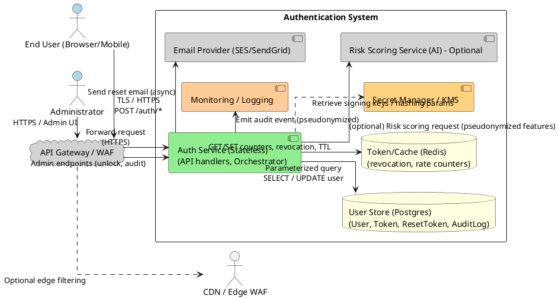
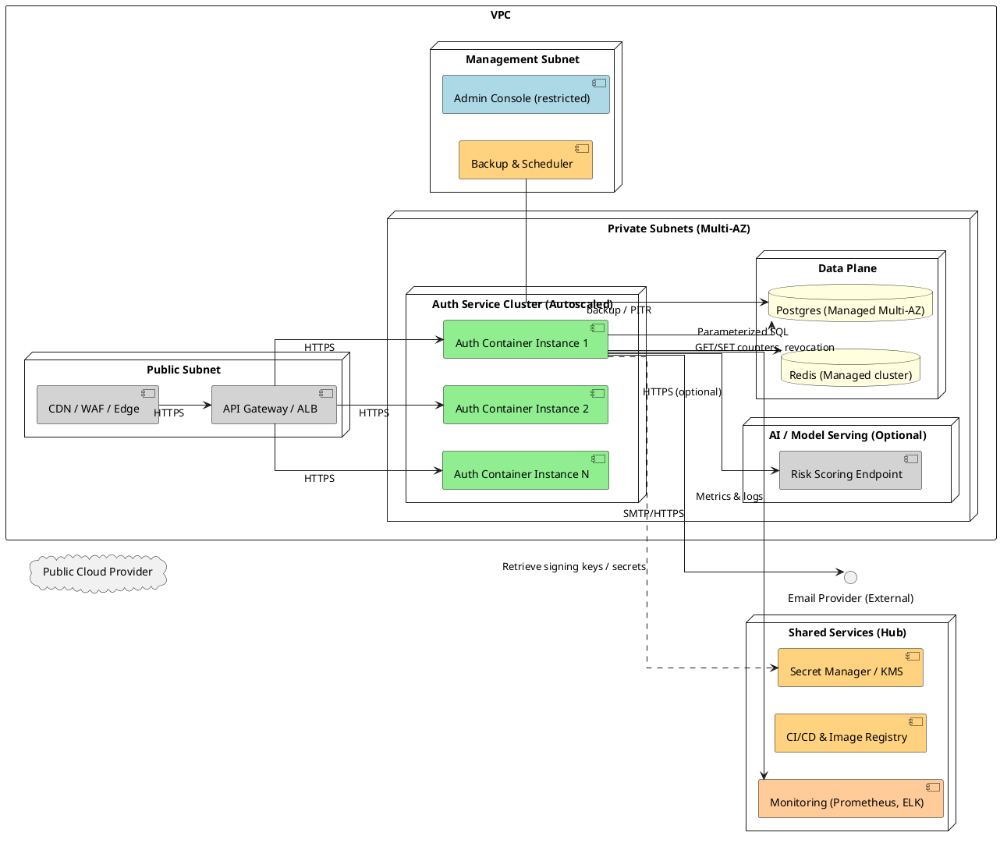
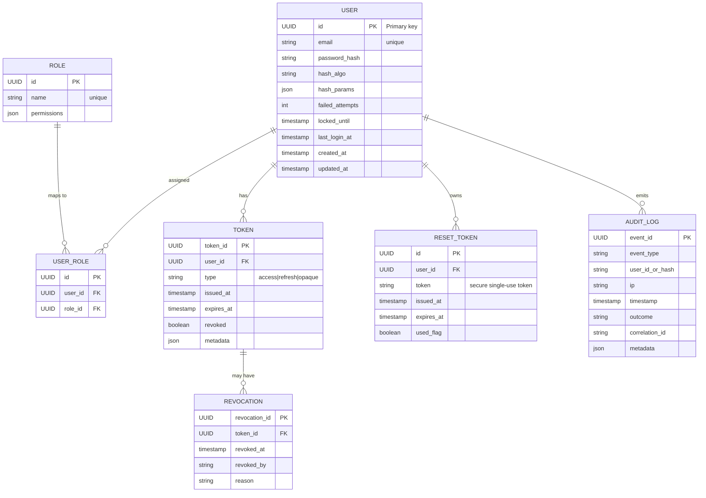
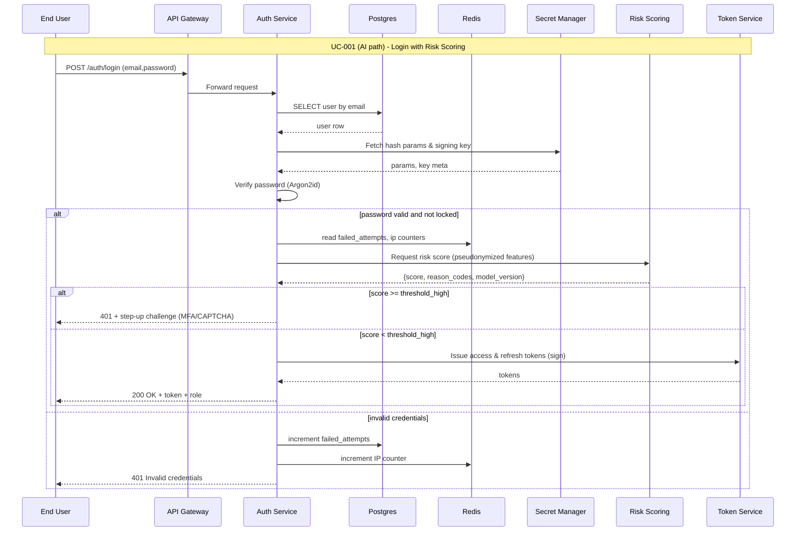
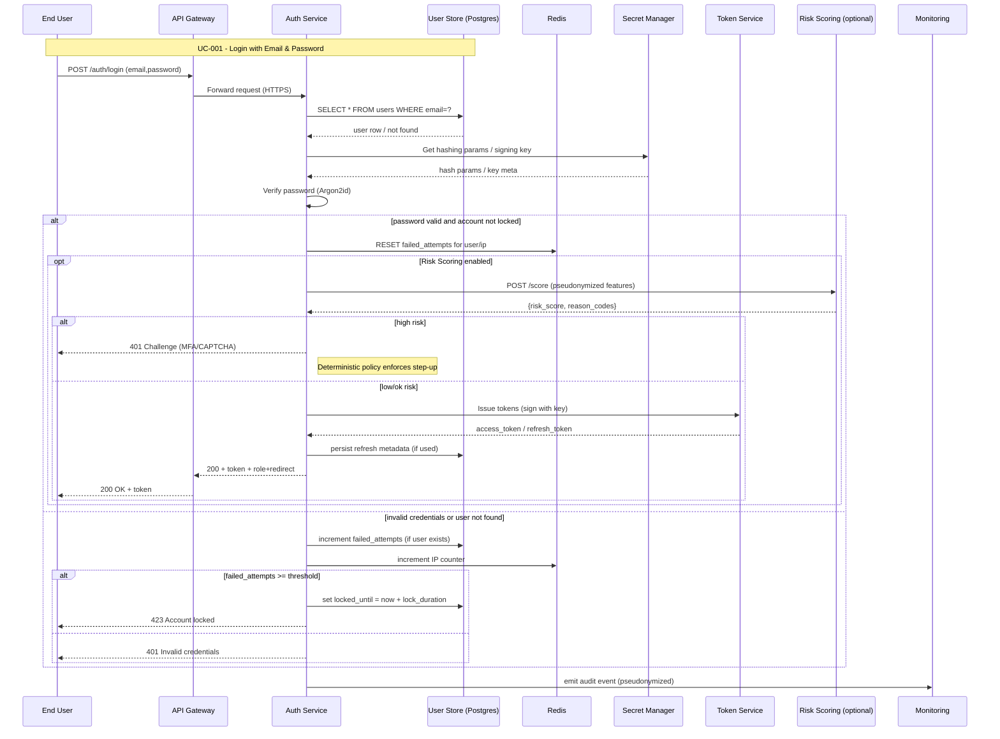
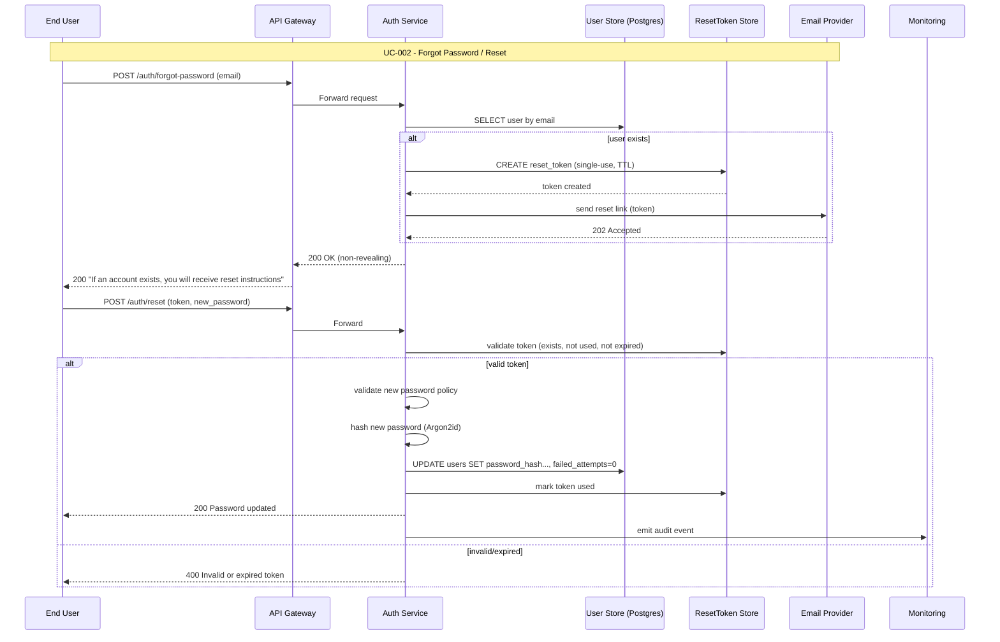
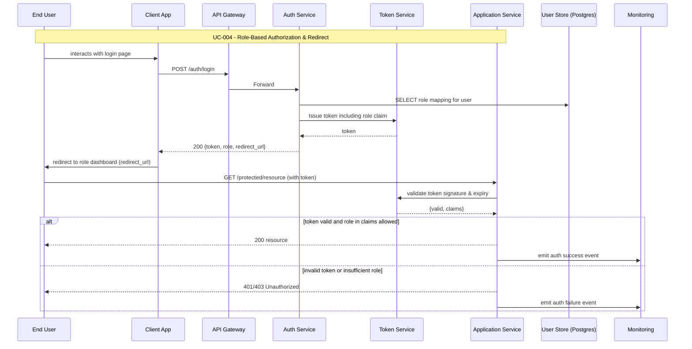

# Design Modelling

## UML Models Overview
This document contains the UML visual models for the Email/Password Authentication Service: system context, component view, deployment, data flows, logical data model (ERD), AI risk-scoring pipeline, and one sequence diagram per use case (UC-001..UC-004). Diagrams follow architecture decisions: Argon2id for password hashing, Redis for low-latency revocation and counters, PostgreSQL as canonical store, Secret Manager for signing keys, and an optional Risk Scoring service (AIR-*). Rationale (context → decision → benefit):
- NFR drivers: latency, availability, security, auditability.
- Decision: stateless Auth Service + Redis caching + Postgres canonical store + Secret Manager + optional ML risk scorer.
- Benefit: low-latency auth checks, durable audit trail, secure secrets handling, safe AI integration with deterministic enforcement.

NFR-to-architecture decision mapping:
| NFR | Architectural Decision |
|-----|------------------------|
| NFR-001 (latency) | Go or low-latency runtime + Redis for token checks and caching; local signing via Secret Manager keys |
| NFR-002 (availability) | Stateless auth containers + autoscaling, multi-AZ DB and Redis |
| NFR-003 (security) | Argon2id hashing, TLS 1.2+, secure cookies, Secret Manager for keys |
| NFR-005 (consistency) | Postgres as authoritative store for failed_attempts/locked_until; reconcile jobs for caches |
| AIR-* (AI requirements) | Isolated Risk Scoring service + deterministic policy layer and circuit-breaker

## Architectural Views

### System Context Diagram


### Component Architecture Diagram
```mermaid
graph LR
  classDef actor fill:#add8e6
  classDef core fill:#90ee90
  classDef data fill:#ffffe0
  classDef external fill:#d3d3d3
  classDef infra fill:#ffd27f

  Client[Client\n(Web/Mobile)]:::actor
  APIGW[API Gateway / WAF]:::external

  subgraph "Auth Platform"
    AuthAPI[HTTP API Layer\n(Handlers, Routing)]:::core
    Validator[Input Validator\n(email/password rules)]:::core
    Orchestrator[Auth Orchestrator\n(login/reset flows)]:::core
    Hasher[Hashing Service\n(Argon2id wrapper)]:::core
    TokenSvc[Token Service\n(JWT sign / opaque)]:::core
    LockoutSvc[Lockout Service\n(failed_attempts, locked_until)]:::core
    RateLimiter[RateLimiter\n(Per-IP/account Redis)]:::core
    Revocation[RevocationService\n(Redis + Postgres)]:::core
    Audit[Audit Logger\n(structured events)]:::core
    SecretsClient[Secrets Client\n(KMS/Secret Manager)]:::infra
    AdminAPI[Admin API\n(unlock & audit)]:::core
  end

  DB[(Postgres\nUser, Tokens, ResetTokens, AuditLog)]:::data
  REDIS[(Redis\ncounters, revocation)]:::data
  EmailSvc[Email Provider\n(SES/SendGrid)]:::external
  Monitoring[Monitoring & Logs\nPrometheus / ELK]:::infra
  RiskSvc[Risk Scoring Service\n(optional)]:::external

  Client --> APIGW --> AuthAPI
  AuthAPI --> Validator
  AuthAPI --> Orchestrator
  Orchestrator --> Hasher : verify/hash
  Orchestrator --> TokenSvc : issue / validate / revoke
  Orchestrator --> LockoutSvc : read/update failed_attempts
  RateLimiter --> REDIS
  LockoutSvc --> DB
  TokenSvc --> REDIS
  Revocation --> REDIS
  Orchestrator --> Audit
  SecretsClient --> Hasher
  SecretsClient --> TokenSvc
  Orchestrator --> EmailSvc
  Audit --> Monitoring
  Orchestrator --> RiskSvc : (opt) risk_score request
  AdminAPI --> DB
```

### Deployment Architecture Diagram


### Data Flow Diagram
```plantuml
@startuml
!define PROCESS rectangle
!define DATASTORE database
!define EXTERNAL component

left to right direction
EXTERNAL "Client (Browser / Mobile)" as client
PROCESS "Auth API\n(Validate & Orchestrate)" as auth
PROCESS "Hashing Module\n(Argon2id verifier/rehash)" as hash
PROCESS "Token Service\n(issue/verify tokens)" as token
DATASTORE "Postgres\n(User, Token, ResetToken, AuditLog)" as db
DATASTORE "Redis\n(revocation, counters, short cache)" as redis
EXTERNAL "Secret Manager / KMS" as kms
EXTERNAL "Email Provider" as email
EXTERNAL "Risk Scoring Service (optional)" as risk
EXTERNAL "Monitoring / Logging" as mon

client -> auth : POST /auth/login\nemail,password
auth -> db : SELECT user by email
db --> auth : user row
auth -> hash : Verify password with hash params
hash --> auth : match / no match
opt password match
  auth -> risk : (optional) request risk score\n(pseudonymized features)
  risk --> auth : risk_score
  alt low risk
    auth -> token : Sign token (get key)
    token -> kms : Get signing key (or fetch cached)
    kms --> token : signing key
    token --> auth : access token + refresh token metadata
    auth -> redis : write revocation/TTL for refresh token
    auth -> db : persist refresh token metadata (if used)
    auth --> client : 200 OK + token
  else step-up / high risk
    auth --> client : 401 + challenge (MFA/CAPTCHA)
  end
else password mismatch
  auth -> db : increment failed_attempts
  auth -> redis : increment IP counter
  alt lockout threshold reached
    auth -> db : set locked_until
    auth --> client : 423 Account locked
  else
    auth --> client : 401 Invalid credentials
  end
end

client -> auth : POST /auth/forgot-password\nemail
auth -> db : lookup email (if exists)
alt exists
  auth -> db : create ResetToken
  auth -> email : send reset link
end
auth --> client : 200 (non-revealing)

auth -> mon : emit audit events
mon -> db : (optional) archive / indexing
@enduml
```

### Logical Data Model (ERD)


## AI Architecture Diagrams

### Risk Scoring Pipeline (Mermaid flow)
```mermaid
graph LR
  classDef external fill:#d3d3d3
  classDef infra fill:#ffd27f
  classDef core fill:#90ee90

  Auth[Auth Service\n(Event source)]:::core
  Stream[Event Stream\n(Kafka/Kinesis)]:::infra
  FS[Feature Store / Cache\n(Redis/Feast)]:::infra
  ETL[ETL / Feature Jobs]:::infra
  Train[Training Pipeline\n(Batch)]:::infra
  Registry[Model Registry / MLFlow]:::infra
  ModelServe[Model Server\n(Endpoint)]:::infra
  AIGW[AI Gateway\n(timeout, CB, cache)]:::infra
  Telemetry[Model Telemetry & Explainability]:::infra
  Audit[Audit Store / DB]:::infra

  Auth -->|publish events| Stream
  Stream --> ETL
  ETL --> FS
  ETL --> Train
  Train --> Registry
  Registry --> ModelServe
  Auth -->|scoring request| AIGW
  AIGW --> ModelServe
  ModelServe -->|score+meta| AIGW
  AIGW --> Auth
  ModelServe --> Telemetry
  Auth --> Audit
  Telemetry --> Registry
```

### AI Sequence Diagram — Risk-scored Login (Mermaid)


## Use Case Sequence Diagrams

### UC-001: Login with Email & Password
**Source**: spec.md#UC-001



### UC-002: Forgot Password / Reset Flow
**Source**: spec.md#UC-002



### UC-003: Account Lockout Handling (includes Admin Unlock)
**Source**: spec.md#UC-003

```mermaid
sequenceDiagram
    participant User as End User
    participant APIGW as API Gateway
    participant Auth as Auth Service
    participant DB as User Store (Postgres)
    participant Redis as Redis
    participant Admin as Administrator

    Note over User,Admin: UC-003 - Account Lockout Handling

    %% Failed attempts flow (invoked by login failures)
    User->>APIGW: POST /auth/login (bad credentials)
    APIGW->>Auth: Forward
    Auth->>DB: increment failed_attempts
    Auth->>Redis: increment IP counter
    alt failed_attempts < threshold
        Auth-->>User: 401 Invalid credentials
    else failed_attempts >= threshold
        Auth->>DB: set locked_until = now + lock_duration
        Auth->>Redis: mark lock
        Auth->>Email: optional notify user (non-revealing)
        Auth-->>User: 423 Account locked
        Auth->>Monitoring: emit lockout audit event
    end

    %% Admin unlock
    Admin->>APIGW: POST /admin/users/{id}/unlock
    APIGW->>Auth: Forward (admin auth)
    Auth->>DB: verify admin role
    alt admin authorized
        Auth->>DB: set failed_attempts=0; locked_until=NULL
        Auth-->>Admin: 200 Unlocked
        Auth->>Monitoring: emit admin unlock audit event
    else
        Auth-->>Admin: 403 Forbidden
    end

    %% Auto-unlock on expiry (background)
    loop periodic checks
      Auth->>DB: SELECT users WHERE locked_until <= now
      DB-->>Auth: list unlocked_users
      alt entries exist
        Auth->>DB: reset failed_attempts, locked_until=NULL
        Auth->>Monitoring: emit unlock audit event
      end
    end
```

### UC-004: Role-Based Authorization Enforcement & Redirect
**Source**: spec.md#UC-004



---