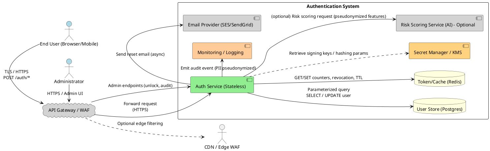
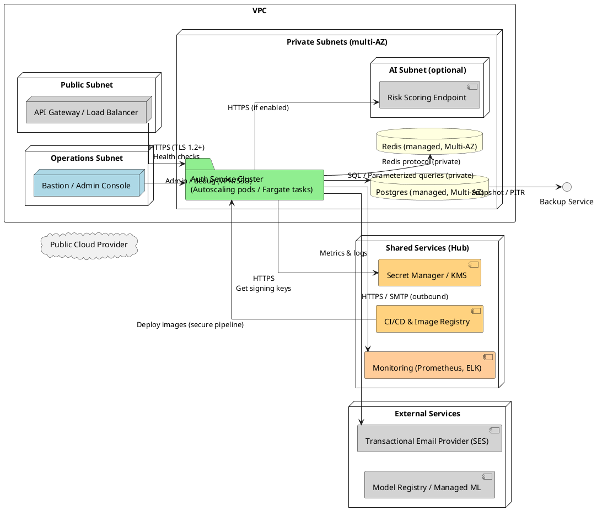
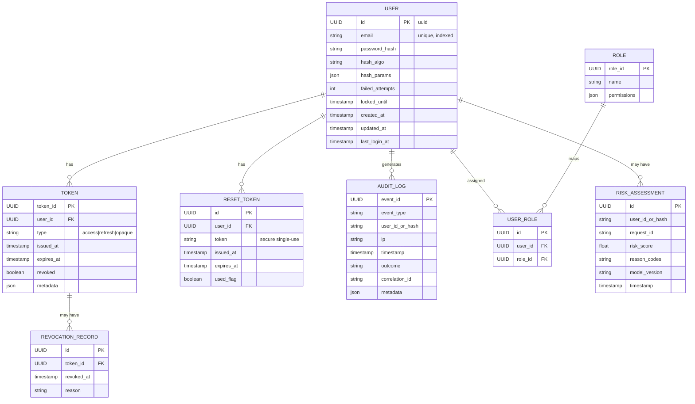
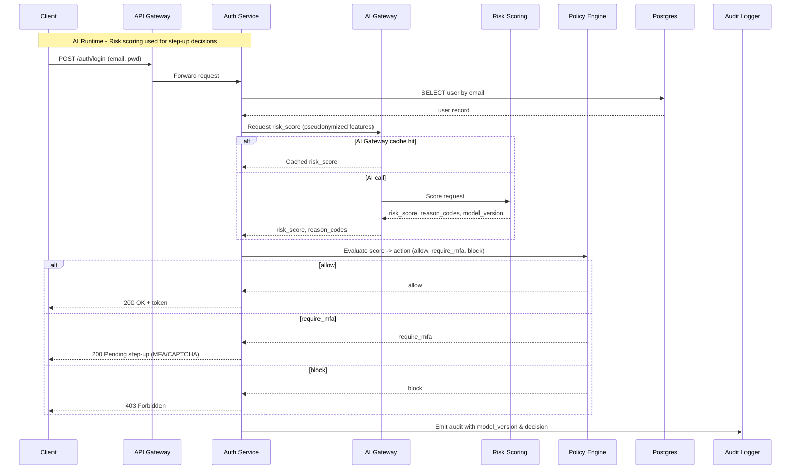
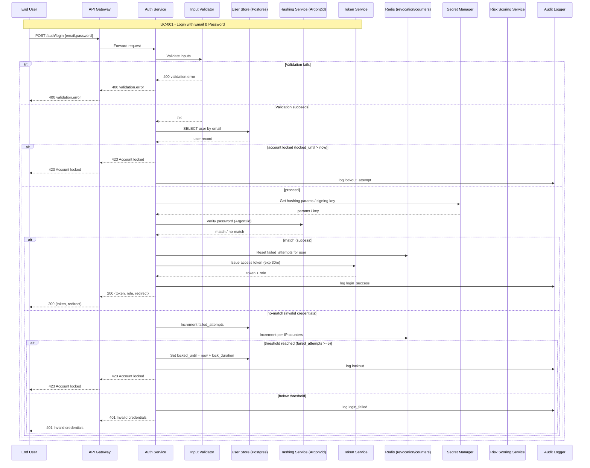
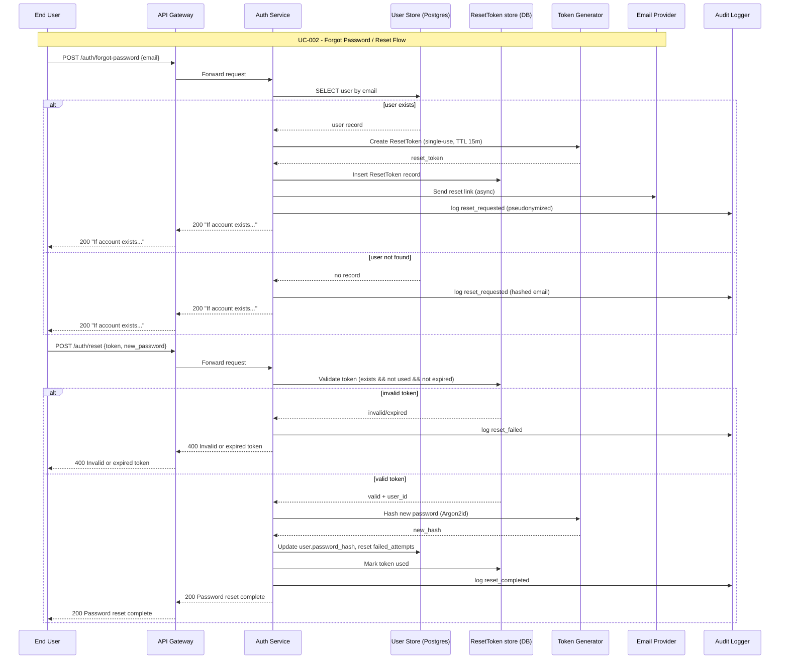
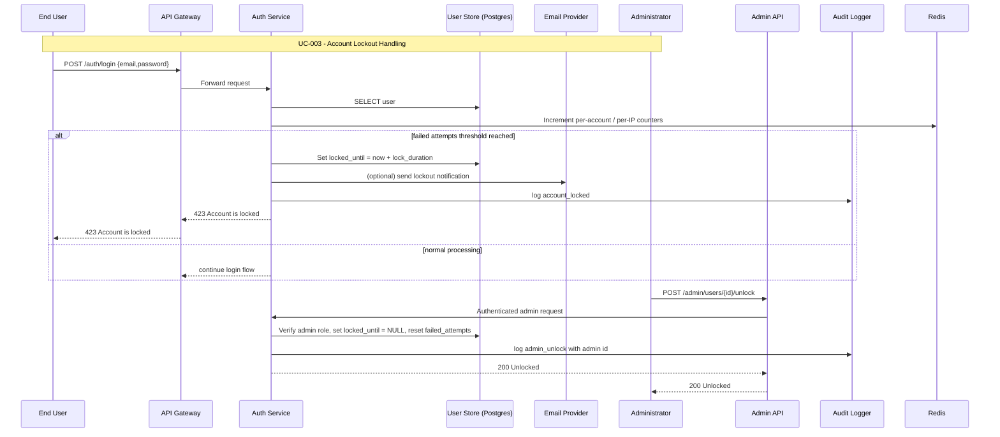
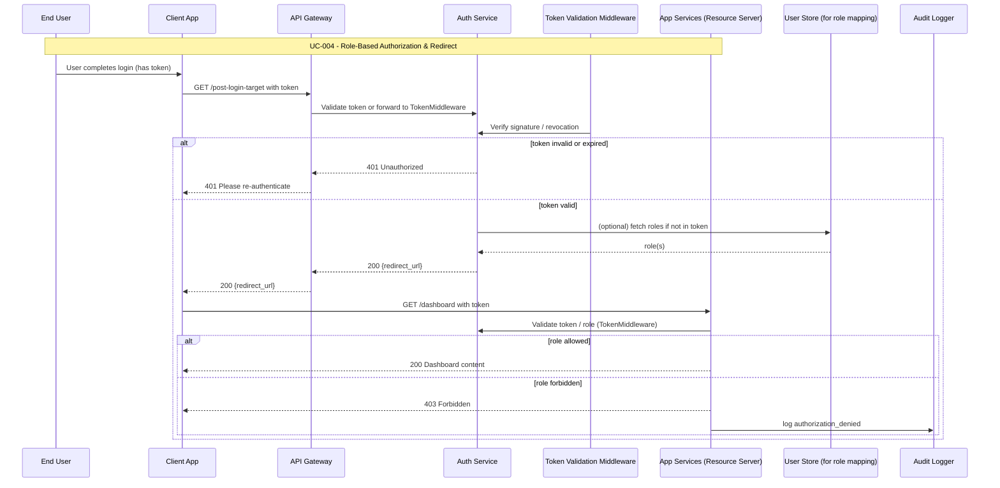

## Design Modelling

## UML Models Overview
This document contains the complete set of UML visual models for the Authentication Service: system context, component view, deployment, data flows, logical data model (ERD), AI flow diagrams (risk scoring), and one sequence diagram per use case (UC-001..UC-004). Diagrams follow the architecture decisions: Argon2id for password hashing (FR-003), Redis for low-latency revocation/rate counters (TR-002), PostgreSQL as canonical store (TR-001), secret manager for signing keys (TR-004), and an optional ML Risk Scoring service with deterministic policy enforcement (AIR-*). Rationale: NFR drivers (latency, auditability, safety) require fast ephemeral state (Redis), durable canonical records (Postgres), strong adaptive hashing (Argon2id) and managed secrets (KMS/Secret Manager).

NFR-to-architecture decision mapping:
| NFR | Architectural Decision |
|-----|------------------------|
| NFR-001 (latency) | Use Go or low-latency runtime + Redis for token checks and caching; token creation local signing via Secret Manager keys |
| NFR-002 (availability) | Stateless auth service containers + autoscaling behind API Gateway, multi-AZ DB and Redis |
| NFR-003 (security) | Argon2id hashing, TLS 1.2+, secure cookies, Secret Manager for keys |
| NFR-005 (consistency) | Postgres as authoritative store for failed_attempts/locked_until; reconcile jobs for edge caches |
| AIR-* (AI requirements) | Separate Risk Scoring service behind AI Gateway; deterministic policy layer for final decisions |

## Architectural Views

### System Context Diagram


### Component Architecture Diagram
```mermaid
graph LR
  classDef actor fill:#add8e6
  classDef core fill:#90ee90
  classDef data fill:#ffffe0
  classDef external fill:#d3d3d3
  classDef infra fill:#ffd27f

  User[Client\n(Web/Mobile)]:::actor
  APIGW[API Gateway / WAF]:::external

  subgraph "Auth Platform"
    AuthAPI[HTTP API Layer\n(Handlers, Routing)]:::core
    Validator[Input Validator\n(email/password rules)]:::core
    Orchestrator[Auth Orchestrator\n(login/reset flows)]:::core
    Hasher[Hashing Service\n(Argon2id wrapper)]:::core
    TokenSvc[Token Service\n(JWT sign/opaque store)]:::core
    LockoutSvc[LockoutService\nfailed_attempts / policy]:::core
    RateLimiter[RateLimiter\nper-IP/account Redis]:::core
    Revocation[RevocationService\nchecks Redis+Postgres]:::core
    Audit[Audit Logger\nstructured events]:::core
    SecretsClient[Secrets Client\n(KMS/Secret Manager)]:::infra
    AdminAPI[Admin API\nunlock & audit]:::core
  end

  DB[(Postgres\nUser, Tokens, ResetTokens, AuditLog)]:::data
  REDIS[(Redis\ncounters, revocation)]:::data
  EmailSvc[Email Provider\n(SES/SendGrid)]:::external
  Monitoring[Monitoring & Logs\nPrometheus / ELK]:::infra
  RiskSvc[Risk Scoring Service\n(optional)]:::external

  User --> APIGW --> AuthAPI
  AuthAPI --> Validator
  AuthAPI --> Orchestrator
  Orchestrator --> Hasher : verify/hash
  Orchestrator --> TokenSvc : issue / validate / revoke
  Orchestrator --> LockoutSvc : read/update failed_attempts
  RateLimiter --> REDIS
  LockoutSvc --> DB
  TokenSvc --> REDIS
  Revocation --> REDIS
  Orchestrator --> Audit
  SecretsClient --> Hasher
  SecretsClient --> TokenSvc
  Orchestrator --> EmailSvc
  Audit --> Monitoring
  Orchestrator --> RiskSvc : (opt) risk_score request
  AdminAPI --> DB
```

### Deployment Architecture Diagram


### Data Flow Diagram
```plantuml
@startuml
!define PROCESS rectangle
!define DATASTORE database
!define EXTERNAL component

left to right direction

EXTERNAL "Client (Browser/Mobile)" as client
PROCESS "API Gateway / WAF" as gateway
PROCESS "Auth Service\n(Login / Forgot / Reset)" as auth
DATASTORE "Postgres - User/Token/Reset/Audit" as pg
DATASTORE "Redis - Revocation / Counters" as redis
EXTERNAL "Email Provider\n(SES/SendGrid)" as email
EXTERNAL "Secret Manager / KMS" as kms
EXTERNAL "Risk Scoring Service (optional)" as risk
EXTERNAL "Monitoring / Event Stream" as stream

client -> gateway : POST /auth/login\nTLS
gateway -> auth : Forward request\n(HTTPS)
auth -> kms : Fetch signing key / hash params
auth -> pg : SELECT user by email
auth -> auth : Verify password via Hashing Service
auth -> redis : Check rate-limit / revocation
alt password valid & not locked
  auth -> redis : Reset failed_attempts
  auth -> pg : Write token session record (if opaque)
  auth -> redis : Store revocation TTL (if needed)
  auth -> stream : Emit audit event (login_success)
  auth -> client : 200 OK + token / redirect
else invalid credentials
  auth -> pg : Increment failed_attempts
  auth -> stream : Emit audit event (login_failed)
  opt lockout threshold reached
    auth -> pg : Set locked_until
    auth -> email : (optional) send lockout notice
  end
  auth -> client : 401 Invalid credentials / 423 Locked
end

' Forgot password flow
client -> gateway : POST /auth/forgot-password
gateway -> auth : Forward
auth -> pg : Lookup user (if exists)
auth -> pg : Insert ResetToken (single-use, TTL)
auth -> email : Send reset link (if user exists)
auth -> stream : Emit audit event (reset_requested)
auth -> client : 200 "If account exists..."

' Reset flow
client -> gateway : POST /auth/reset (token + new password)
gateway -> auth : Forward
auth -> pg : Validate ResetToken (single-use)
auth -> auth : Hash new password (Argon2id)
auth -> pg : Update user.password_hash; invalidate ResetToken
auth -> stream : Emit audit event (reset_completed)
auth -> client : 200 OK

' Risk scoring (optional)
auth -> risk : Request risk_score (pseudonymized features)
risk --> auth : risk_score, reason_codes
auth -> stream : Emit audit entry with model_version
@enduml
```

### Logical Data Model (ERD)


## AI Architecture Diagrams

### Risk Scoring Pipeline (Mermaid flow)
```mermaid
flowchart LR
  classDef data fill:#ffffe0
  classDef core fill:#90ee90
  classDef external fill:#d3d3d3

  Events[Auth Events\n(Kafka/Kinesis)]:::data
  FE[Feature Engineering\nJobs/Materialization]:::core
  FS[Feature Store / Cache\n(Feast / Redis)]:::data
  TRAIN[Model Training\n(batch jobs)]:::core
  MODEL_REG[Model Registry / MLFlow]:::external
  SERVE[Model Serving\n(SageMaker / FastAPI)]:::external
  AI_GW[AI Gateway\n(timeout, cache, CB)]:::core
  APISVC[Auth Service\n(consumer)]:::core
  AUDIT[Model Telemetry & Audit]:::external

  Events --> FE --> FS
  FE --> TRAIN --> MODEL_REG
  MODEL_REG --> SERVE
  APISVC --> AI_GW --> SERVE
  SERVE --> APISVC
  SERVE --> AUDIT
  APISVC --> AUDIT
```

### AI Runtime Sequence (Mermaid sequence)


## Use Case Sequence Diagrams

> Note: Sources point to spec.md anchors for traceability.

#### UC-001: Login with Email & Password
**Source**: [.propel/context/docs/spec.md#UC-001](.propel/context/docs/spec.md#UC-001)



#### UC-002: Forgot Password / Reset Flow
**Source**: [.propel/context/docs/spec.md#UC-002](.propel/context/docs/spec.md#UC-002)



#### UC-003: Account Lockout Handling
**Source**: [.propel/context/docs/spec.md#UC-003](.propel/context/docs/spec.md#UC-003)



#### UC-004: Role-Based Authorization Enforcement & Redirect
**Source**: [.propel/context/docs/spec.md#UC-004](.propel/context/docs/spec.md#UC-004)



## Notes & Traceability
- All ERD entities correspond to definitions in design.md (User, Token, ResetToken, AuditLog, Role, etc.).
- Sequence diagrams include alternative paths (validation failure, invalid credentials, lockout) and optional AI interactions (UC-001 shows AI optional path via separate AI sequence diagram).
- Secret retrievals (signing keys, hashing params) use Secret Manager (KMS) and are shown where required.

## Change / Extension Guidance
- To enable refresh-token rotation (FR-011), extend Token entity with rotation_id and add rotation logic in Token Service; update sequence diagrams to include refresh rotation step.
- To enable AI enforcement in production, deploy Risk Scoring with canary (MODEL_REG) and enable AI Gateway circuit-breaker; policy remains deterministic and must be auditable (AIR-004 / AIR-005).

