Design Model Template

## UML Models Overview
This document contains a complete set of UML views for the Email+Password Authentication Service:
- System Context (PlantUML) — boundary and external actors
- Component Architecture (Mermaid) — service modules & responsibilities
- Deployment Topology (PlantUML) — cloud landing zone & network placement
- Data Flow (PlantUML) — major data transformations and control points
- Logical Data Model / ERD (Mermaid) — entities, attributes, relationships
- AI Architecture (Mermaid) — optional adaptive detection pipeline
- Use Case Sequence Diagrams (Mermaid) — one sequence per UC-001..UC-008 from spec

Architecture Pattern Rationale (<12 lines):
- Pattern Selected: Layered microservice (single focused Auth microservice) with modular subcomponents.
- NFR Drivers: Security (confidentiality/integrity), auditability, low-latency auth (2s p95), availability.
- Key Decisions: Use KMS for signing keys, Argon2id for password hashing + versioning and rehash-on-login, Redis for fast counters/blacklist, token strategy: short-lived JWT (30m) with token_id for revocation/blacklist.
- Trade-offs: Stateless tokens simplify scale (short TTL + blacklist adds cache dependency) — chosen for simplicity + revocation responsiveness.

NFR-to-Architecture Mapping:
| NFR | Architectural Decision | Justification |
|-----|-----------------------|---------------|
| Auth latency (2s p95) | API Gateway + Autoscaled Auth Service; short synchronous flows | Keeps request path minimal; autoscale to meet 2s p95 target |
| Password security | Argon2id with algorithm versioning + rehash-on-login | Strong hashing, upgrade path for legacy hashes |
| Token revocation | Short-lived JWT (30m) + Redis blacklist by token_id | Allows stateless verification with fast revocation within 1 minute |
| Brute-force protection | Redis counters + API Gateway rate limiting + account lockout (5 attempts) | Low-latency counters for atomic increments and global enforcement |
| Auditability | Structured JSON logs emitted to SIEM within 30s | Enables security/ops querying and compliance evidence |
| Email delivery | Background worker + external Email Provider | Asynchronous delivery with retry and delivery logging |

## Architectural Views

### System Context Diagram
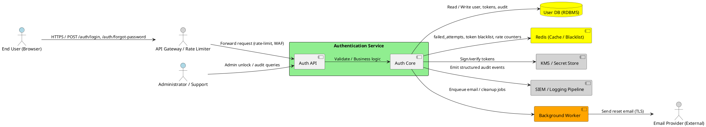

### Component Architecture Diagram
```mermaid
graph LR
  subgraph Client Layer
    Browser[Web Client (SPA) - UI & client validation]
  end

  subgraph Edge Layer
    APIGW[API Gateway (Ingress) - Rate limiting, WAF, CAPTCHA gating]
  end

  subgraph "Authentication Service (Auth)" 
    direction TB
    AuthAPI[Auth API (HTTP) - Endpoints: /login, /logout, /forgot, /reset]
    AuthCore[Auth Core (C# / Go) - Credential verification, RBAC, token orchestration]
    PasswordSvc[Password Service (Argon2id) - Hash & verify, rehash-on-login]
    TokenSvc[Token Service - token_id generation, JWT creation/validation]
    LockCoordinator[Lock & Rate Coordinator - increments, lock semantics]
    ResetManager[Reset Manager - token create + hashed store]
    MFA[Optional MFA Module - TOTP enrollment & verify]
    AuditEmitter[Audit Logger - structured events -> SIEM]
    SessionStore[(Session / Blacklist Connector) - Redis]
  end

  subgraph Data Layer
    UserDB[(User DB - PostgreSQL) - Users, Roles, tokens (hashed), audit])
    Redis[(Redis) - counters, blacklist, rate windows]
    KMS[(KMS / Secret Store) - signing keys, OTP secrets]
  end

  subgraph Infra
    Worker[Background Worker - jobs: email, cleanup, retries]
    EmailProv[Email Provider - SMTP/API]
    SIEM[SIEM / Logging Pipeline]
  end

  Browser -->|HTTPS| APIGW
  APIGW -->|HTTPS| AuthAPI
  AuthAPI --> AuthCore
  AuthCore --> PasswordSvc
  AuthCore --> TokenSvc
  AuthCore --> LockCoordinator
  AuthCore --> ResetManager
  AuthCore --> MFA
  AuthCore --> AuditEmitter
  AuthCore --> SessionStore
  PasswordSvc -->|SQL| UserDB
  ResetManager -->|SQL| UserDB
  SessionStore -->|TCP| Redis
  TokenSvc -->|KMS API| KMS
  AuditEmitter -->|HTTPS| SIEM
  Worker -->|SMTP/API| EmailProv
  AuthCore -->|Enqueue| Worker
```

### Deployment Architecture Diagram
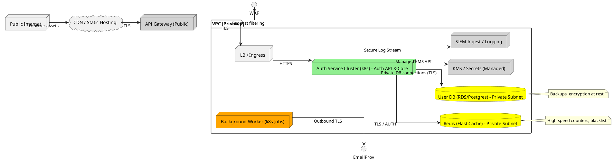

### Data Flow Diagram
```plantuml
@startuml
!define PROCESS rectangle
!define DATASTORE database
!define EXTERNAL component

EXTERNAL "End User (Browser)" as user
PROCESS "API Gateway" as gw
PROCESS "Auth Service - Login Flow" as auth
DATASTORE "User DB" as db
DATASTORE "Redis (Counters/Blacklist)" as cache
EXTERNAL "KMS (Signing Keys)" as kms
EXTERNAL "Email Provider" as email
PROCESS "Background Worker" as worker
EXTERNAL "SIEM / Logging" as siem

user -> gw : POST /auth/login (email,password) over TLS
gw -> auth : Forward request (rate-limit, CAPTCHA)
auth -> cache : Check account lock / rate counters
auth -> db : SELECT user by email
db --> auth : user record (hash, roles, metadata)
auth -> auth : Verify password (Argon2id, constant-time)
alt password valid
  auth -> kms : Sign token (or retrieve key) 
  kms --> auth : signature
  auth -> cache : Reset failed_attempts
  auth -> db : Update last_login_at, optional rehash
  auth -> siem : Emit login_success event
  auth --> gw : 200 OK + token / redirect (role)
else invalid
  auth -> cache : Increment failed_attempts
  auth -> cache : If threshold -> set locked_until
  auth -> siem : Emit login_failure event
  auth --> gw : 401 Invalid credentials (generic)
end

user -> gw : POST /auth/forgot-password (email)
gw -> auth : Forward, validate
auth -> db : Create PasswordResetToken (store hashed token, expiry)
auth -> worker : Enqueue send-email job
worker -> email : Send reset link
worker -> siem : Emit reset_email_sent (delivery status)
@enduml
```

### Logical Data Model (ERD)
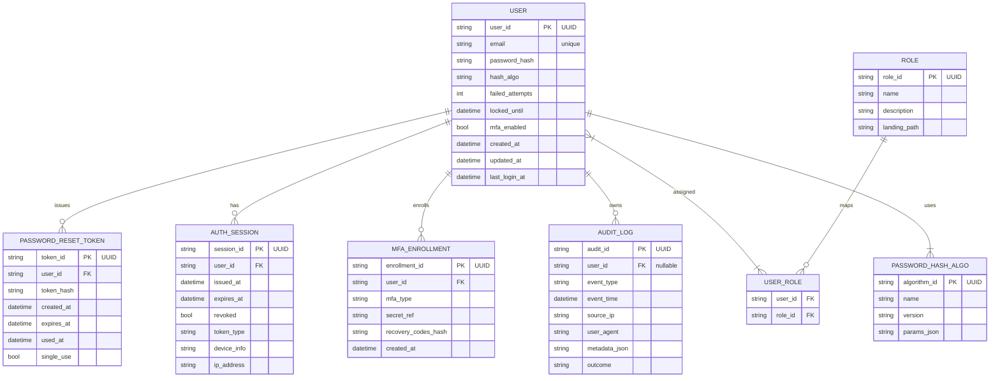

## AI Architecture Diagrams (adaptive detection - optional)
Rationale: FR-011 labeled [HYBRID] — adaptive detection is optional and auditable. The pipeline below is an optional, auditable component that scores login risk and recommends CAPTCHA/block.

Component overview (Mermaid):
```mermaid
graph LR
  LoginEvents[Login Events Stream]
  FeatureStore[Feature Store (Redis/TS DB)]
  ModelService[Anomaly Detection Model (Scoring) - auditable]
  DecisionEngine[Decision Engine - rules + score thresholds]
  AuthSvc[Auth Service]
  SIEM[SIEM / Audit]
  AdminUI[Security Ops Console]

  LoginEvents --> FeatureStore
  FeatureStore --> ModelService
  ModelService --> DecisionEngine
  DecisionEngine --> AuthSvc : risk_score / action (allow, captcha, block)
  DecisionEngine --> SIEM : explanation + features
  SIEM --> AdminUI : alerts, audit
```

AI-assisted flow (Mermaid sequence):
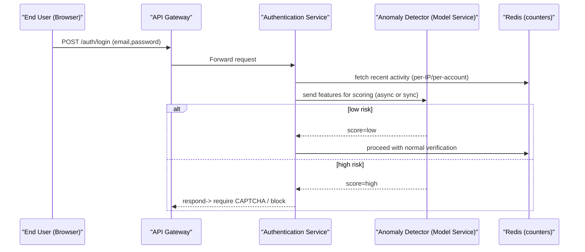

## Use Case Sequence Diagrams

> Note: Each sequence diagram below references the relevant use case definition in the spec.

#### UC-001: User Login (Happy Path)
**Source**: [spec.md#UC-001](.propel/context/docs/spec.md#UC-001)

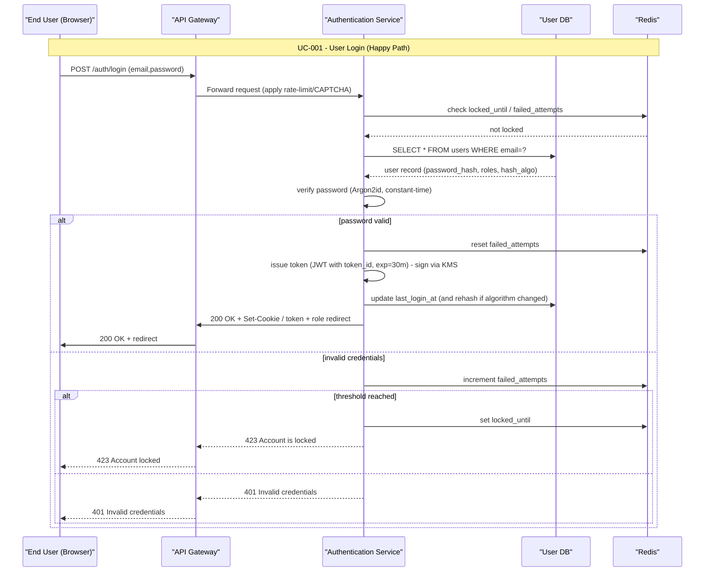

#### UC-002: Login Failed — Invalid Credentials
**Source**: [spec.md#UC-002](.propel/context/docs/spec.md#UC-002)

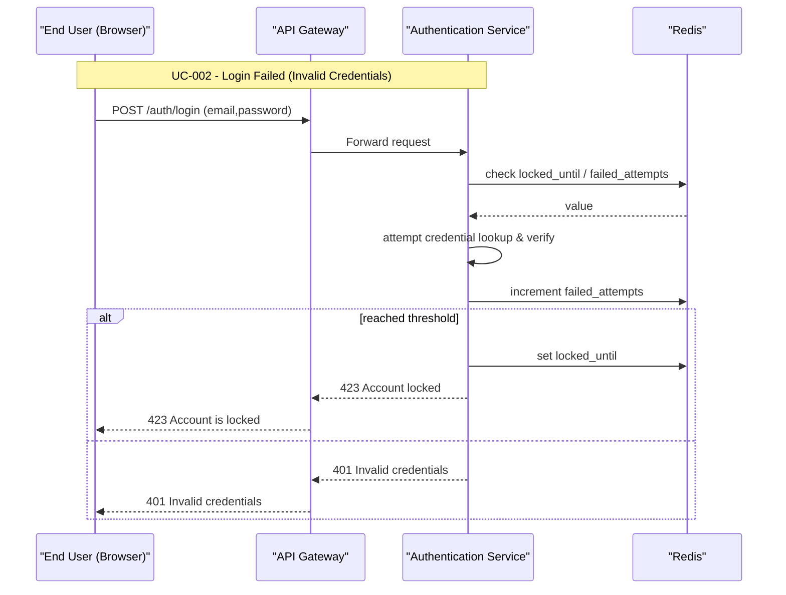

#### UC-003: Login Validation — Empty/Invalid Fields
**Source**: [spec.md#UC-003](.propel/context/docs/spec.md#UC-003)

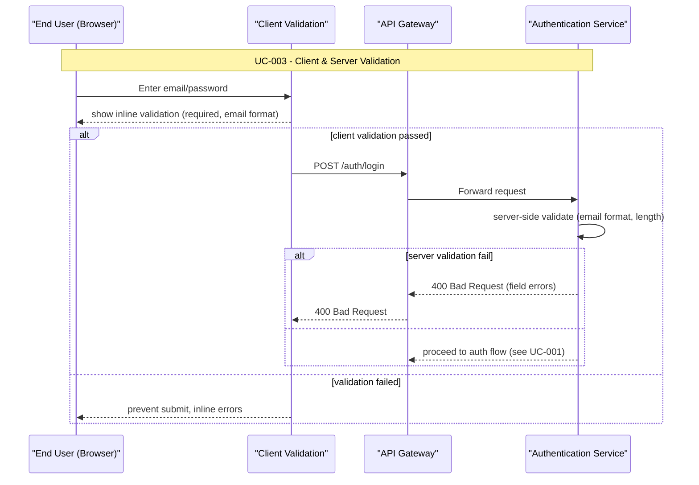

#### UC-004: Account Lockout (Failed Attempts -> Locked)
**Source**: [spec.md#UC-004](.propel/context/docs/spec.md#UC-004)

```mermaid
sequenceDiagram
    participant EndUser as "End User (Browser)"
    participant APIGateway as "API Gateway"
    participant Auth as "Authentication Service"
    participant Cache as "Redis"
    participant Admin as "Administrator"

    Note over EndUser,Admin: UC-004 - Account Lockout & Admin Unlock

    EndUser->>APIGateway: POST /auth/login (bad creds)
    APIGateway->>Auth: Forward
    Auth->>Cache: increment failed_attempts
    Cache-->>Auth: failed_attempts count
    alt failed_attempts >= threshold
      Auth->>Cache: set locked_until
      Auth->>Auth: emit audit log (lock event)
      Auth-->>APIGateway: 423 Account is locked
      APIGateway-->>EndUser: 423 Account is locked
    else
      Auth-->>APIGateway: 401 Invalid credentials
      APIGateway-->>EndUser: 401 Invalid credentials
    end

    Admin->>APIGateway: POST /admin/unlock (user_id)
    APIGateway->>Auth: Forward admin request (authz)
    Auth->>Cache: reset failed_attempts; clear locked_until
    Auth->>Auth: emit audit log (unlock by admin)
    Auth-->>APIGateway: 200 OK
    APIGateway-->>Admin: 200 OK
```

#### UC-005: Forgot Password (Request Reset)
**Source**: [spec.md#UC-005](.propel/context/docs/spec.md#UC-005)

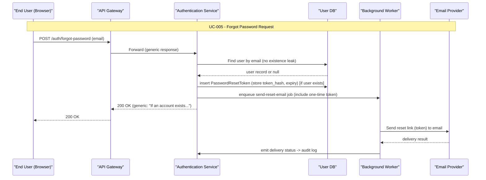

#### UC-006: Reset Password (via Emailed Token)
**Source**: [spec.md#UC-006](.propel/context/docs/spec.md#UC-006)

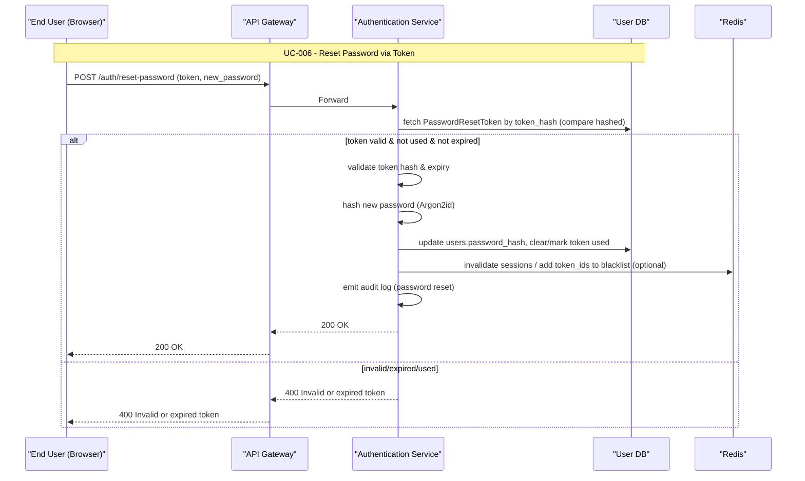

#### UC-007: Logout / Token Revocation
**Source**: [spec.md#UC-007](.propel/context/docs/spec.md#UC-007)

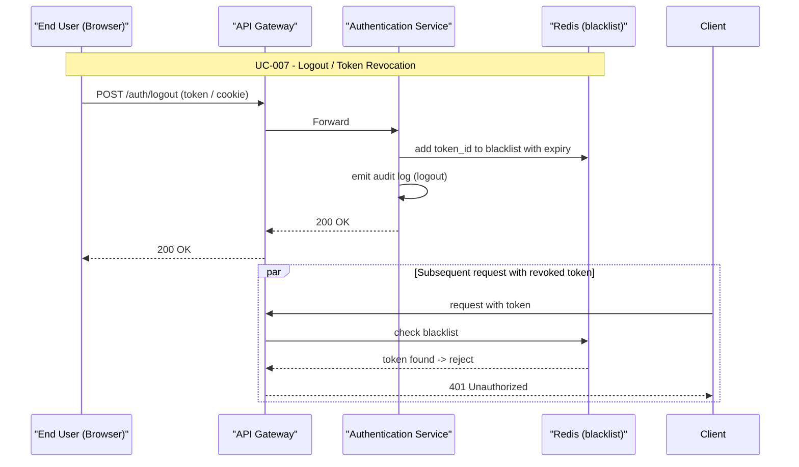

#### UC-008: Role-Based Access & Redirect
**Source**: [spec.md#UC-008](.propel/context/docs/spec.md#UC-008)

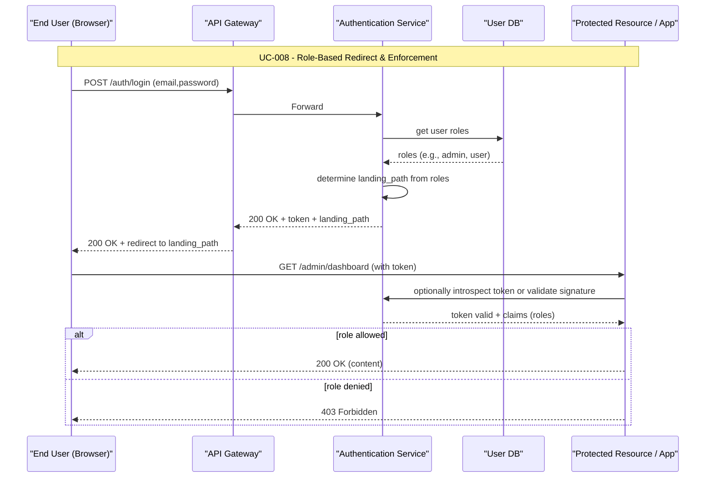

## Previous Analysis and Reasoning
- The diagrams and entities above were derived directly from the provided Requirements Specification and align to the design choices: Argon2id hashing, KMS for keys, Redis for counters/blacklist, token_id for revocation, short JWT TTL, audit logging to SIEM, and optional adaptive detection (auditable). The ERD maps entities required for acceptance criteria (password reset single-use tokens, failed_attempts and locked_until, session/token records, roles, audit logs).

End of Design Model document.