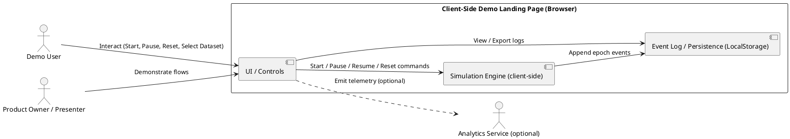
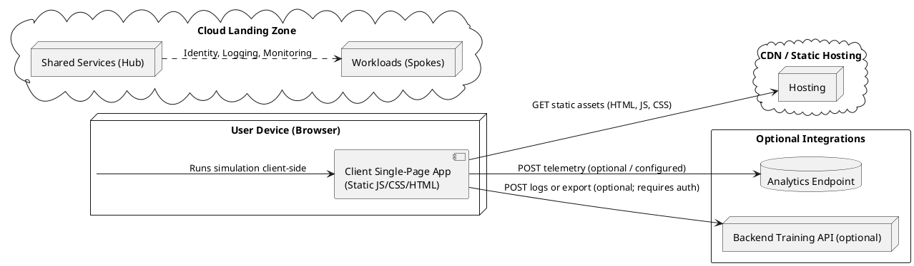
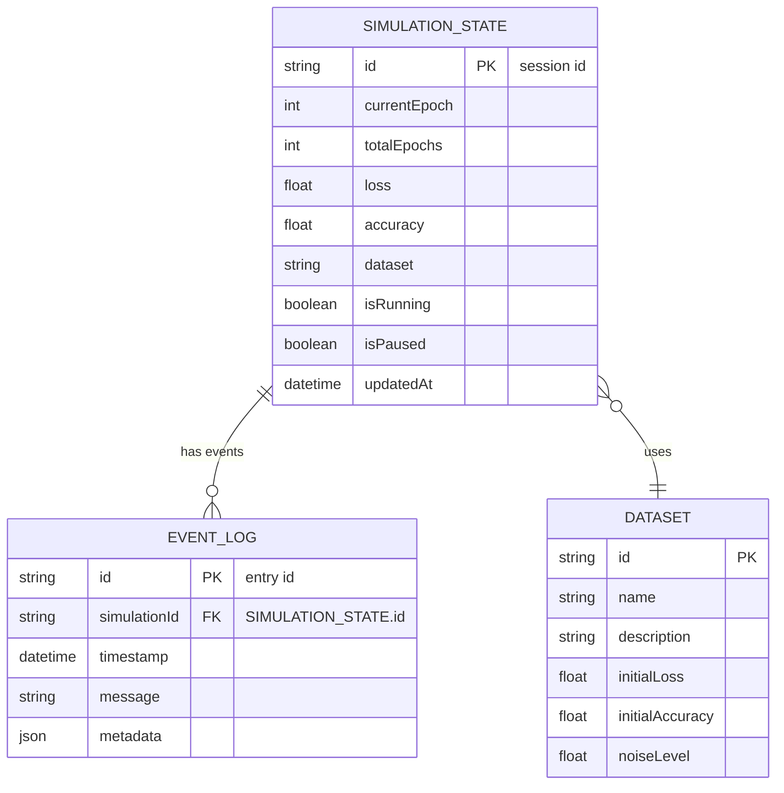
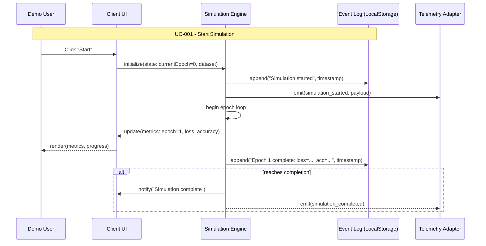
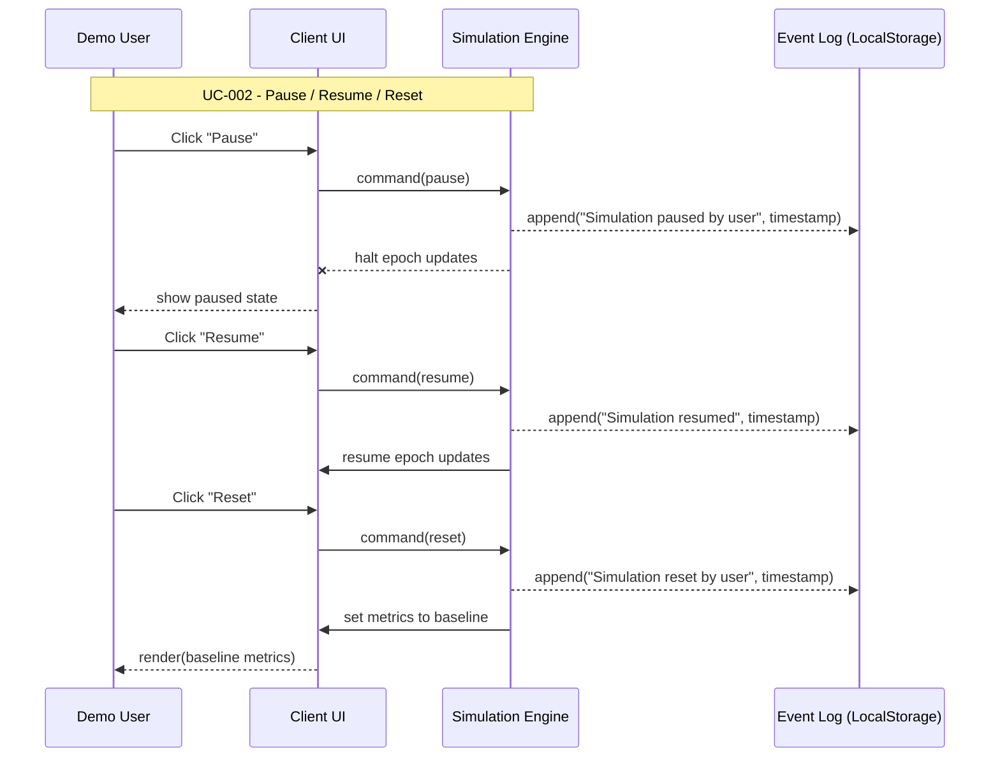
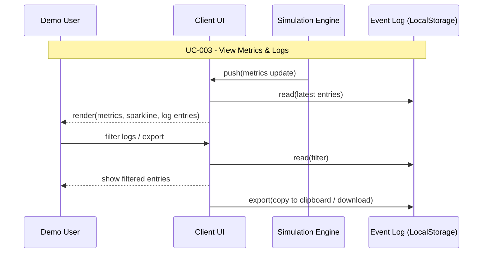
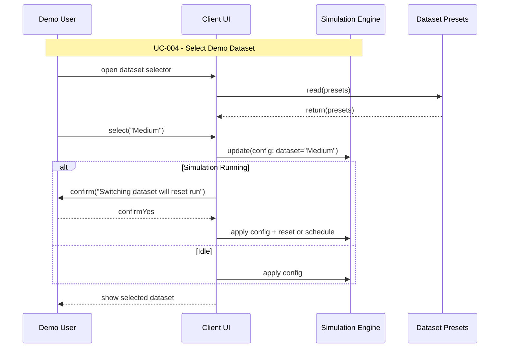

# Design Modelling

## UML Models Overview
This document provides a unified set of textual UML models for the Client-Side Demo Landing Page described in the requirements. It includes: a System Context (PlantUML), Component Architecture (Mermaid), Deployment Architecture (PlantUML), Data Flow (PlantUML), Logical Data Model / ERD (Mermaid), and one Mermaid sequence diagram per use case (UC-001..UC-004). Diagrams map directly to the use cases and design decisions in the project spec to ensure traceability and implementation-ready views.

## Architectural Views

### System Context Diagram


### Component Architecture Diagram
```mermaid
flowchart LR
    subgraph Frontend["Presentation Layer"]
        UI[UI / Controls\n(React) - Render + ARIA]
        Metrics[Metrics & Visualizations\n(Sparklines, Tiles)]
        LogPanel[Event Log Panel\n(Export/Copy)]
        DatasetSelector[Dataset Selector\n(3 Presets)]
    end

    subgraph Backend["Business / Simulation Layer (Client)"]
        SimEngine[Simulation Engine\n(seedrandom) - Deterministic PRNG]
        NLG[Optional NLG (Handlebars)\nTemplates - Opt-in]
        Telemetry[Telemetry Adapter\n(no-op by default)]
    end

    subgraph Data["Persistence & Storage"]
        LocalStore[(localStorage)] 
    end

    UI -->|User actions| SimEngine
    UI --> Metrics
    UI --> LogPanel
    DatasetSelector --> SimEngine
    SimEngine -->|epoch events| LogPanel
    SimEngine -->|persist settings| LocalStore
    SimEngine -->|telemetry events| Telemetry
    NLG --> UI
    Telemetry -->|optional HTTP| Analytics[(Analytics Service)]
    
    classDef actor fill:#add8e6,stroke:#000;
    classDef core fill:#90ee90,stroke:#000;
    classDef data fill:#ffffe0,stroke:#000;
    class UI,Metrics,LogPanel,DatasetSelector class actor;
    class SimEngine,NLG,Telemetry class core;
    class LocalStore class data;
```

### Deployment Architecture Diagram


### Data Flow Diagram
```plantuml
@startuml
!define EXTERNAL component
!define PROCESS rectangle
!define DATASTORE database

EXTERNAL "Demo User (Browser)" as User
PROCESS "UI / Controls" as UI
PROCESS "Simulation Engine" as Sim
DATASTORE "Event Log (localStorage)" as Log
EXTERNAL "Analytics Service (optional)" as Analytics
DATASTORE "Dataset Presets (client-bundled)" as Datasets

User -> UI : Click Start / Pause / Reset / Select Dataset
UI -> Sim : Start / Control commands
Sim -> Datasets : Read preset parameters (startLoss, noise)
Sim -> Log : Append epoch event (timestamp, epoch, loss, acc)
Sim -> UI : Update metrics (epoch, loss, accuracy)
UI -> User : Render updated metrics & progress
UI -> Log : Export / Copy log request
UI -> Analytics : Emit telemetry event (simulation_started, metric_report) [optional]
Log -->|persist| Log : localStorage writes/reads

@enduml
```

### Logical Data Model (ERD)


### Use Case Sequence Diagrams

> **Note**: Create one sequence diagram for each use case (UC-XXX) defined in `.propel/context/docs/spec.md` or `.propel/context/docs/codeanalysis.md`. Each sequence diagram details the dynamic message flow and timing for its corresponding use case. Do NOT duplicate the use case diagrams (those remain in spec.md/codeanalysis.md only).

#### UC-001: Start Simulation
**Source**: [spec.md#UC-001](.propel/context/docs/spec.md#UC-001)



#### UC-002: Control Simulation (Pause / Resume / Reset)
**Source**: [spec.md#UC-002](.propel/context/docs/spec.md#UC-002)



#### UC-003: View Metrics & Logs
**Source**: [spec.md#UC-003](.propel/context/docs/spec.md#UC-003)



#### UC-004: Select Demo Dataset
**Source**: [spec.md#UC-004](.propel/context/docs/spec.md#UC-004)



## Arch Content
The models above are aligned to the spec's constraints: client-side-first, deterministic simulation, optional telemetry and optional opt-in NLG. Component names are consistent across diagrams (UI, Simulation Engine, Event Log, Telemetry). Sequence diagrams link to source use cases for traceability. The ERD models the minimal persisted state (session state, event log, dataset presets). Deployment shows a static-hosting-first approach with optional integrations gated by explicit configuration.

---

Output Summary (Console Only)

- Rules Used by Workflow:
  - ai-assistant-usage-policy
  - dry-principle-guidelines
  - markdown-styleguide
  - uml-text-code-standards
  - iterative-development-guide
  - security-standards-owasp
  - performance-best-practices
  - software-architecture-patterns

- Use Cases Processed:
  - UC-001
  - UC-002
  - UC-003
  - UC-004

- Evaluation Scores:

| Criterion                     | Score (1-5) |
|------------------------------:|:-----------:|
| Completeness                   | 5           |
| Testability                    | 5           |
| Clarity                        | 5           |
| Traceability                   | 5           |
| Accessibility Considerations   | 5           |
| AI Triage Appropriateness      | 4           |
| **Average Score**              | **4.83**    |

- Evaluation Summary:
The generated models are complete, traceable to use cases, and aligned with the design constraints (client-side deterministic simulation). Accessibility and performance are emphasized; AI features are optional and opt-in. Backend integration (FR-010) remains flagged for clarification.