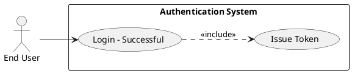
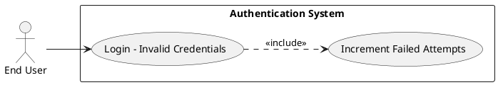
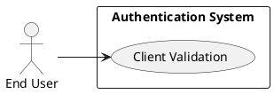
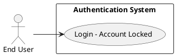
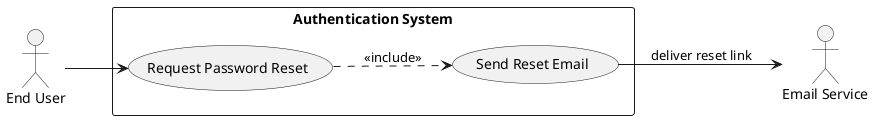
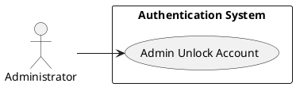
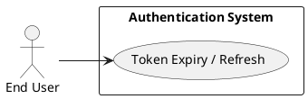
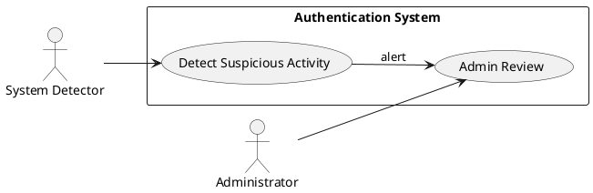

# Requirements Specification

## Feature Goal
The system MUST provide secure, reliable email/password authentication that authenticates registered users, enforces role-based post-login routing, and protects accounts from brute-force attacks while enabling account recovery and administrative remediation.

## Business Justification
- Provide business value by preventing unauthorized access and ensuring users are routed to role-appropriate experiences (Admins, Employees, Customers), reducing security incidents and support load.
- Integrates with existing user database and application routing to enforce authorization consistently across the application.
- Solves risks of account compromise, unauthorized access, and user friction due to unclear error states or inability to recover access.

## Feature Scope
This feature SHALL include:
- Front-end credential capture and client-side validation for email and password.
- Backend authentication service to validate credentials, generate and manage session tokens, and enforce account lockout policy.
- Role-based authorization and post-login redirection.
- Secure password storage and reset/recovery flow.
- Audit logging for authentication events and admin operations.
- Administrative UI for account unlock and investigation.
- Integration with an email delivery provider for password recovery.

Out of scope for this release:
- Social login (OAuth providers, enterprise SSO) — deferred to future phase.
- Machine-learning-based anomaly detection for login (can be added later as [AI-CANDIDATE]).

### Success Criteria
- [ ] 99.9% of valid login attempts succeed within p95 < 200 ms (under normal load).
- [ ] Invalid credential attempts return a generic error and do not enable account enumeration.
- [ ] After 5 failed attempts, account is locked and cannot authenticate until unlock policy is applied; false-positive lock rate < 0.1%.
- [ ] Password reset token delivered via email within 2 minutes for 95% of requests.
- [ ] All authentication events are written to audit logs and searchable; retention policy applied.
- [ ] OWASP Top 10 authentication-related issues mitigated; automated security scan passes for auth endpoints.

## Functional Requirements
- FR-001: [DETERMINISTIC] The system SHALL authenticate users using email and password.
  - Description: The system MUST accept an email and password, validate inputs server-side, compare password securely against stored hash, and if valid, create an authenticated session token and return success with user role.
  - Acceptance Criteria:
    - GIVEN registered user with correct credentials WHEN POST /login is called THEN the response SHALL be 200 OK and contain a valid auth token and the role; token expiration SHALL be enforced.
    - GIVEN invalid credentials WHEN POST /login is called THEN the response SHALL be 401 Unauthorized with the generic message "Invalid credentials" and SHALL NOT reveal whether the email exists.
    - Authentication success SHALL be logged with timestamp, user id, client IP and user-agent.
    - Authentication end-to-end tests SHALL pass (valid, invalid, locked, expired-token cases).

- FR-002: [DETERMINISTIC] The system SHALL store passwords only as salted, computationally expensive hashes using a modern algorithm.
  - Description: Passwords MUST be hashed using Argon2id (recommended) or bcrypt if Argon2id unavailable. Hashing parameters SHALL be configurable and documented.
  - Acceptance Criteria:
    - Passwords SHALL never be stored or logged in plaintext.
    - Hashing algorithm and parameters SHALL be configurable via secure config and SHALL be documented in repo.
    - Unit tests SHALL verify that verifyPassword(hash, password) returns true for correct combo and false otherwise.
    - Migration plan SHALL exist for legacy hashes and SHALL be executed without downtime in the rollout plan.

- FR-003: [DETERMINISTIC] The system SHALL enforce role-based authorization and redirect users after login according to primary role.
  - Description: After successful authentication the system MUST determine the user's primary role and return the appropriate post-login redirect URL or landing payload.
  - Acceptance Criteria:
    - GIVEN a user with role Admin WHEN login succeeds THEN response SHALL include redirect "/admin/dashboard" (or equivalent) and user SHALL be authorized for admin-only endpoints.
    - Access to protected endpoints SHALL return 403 Forbidden for users without required roles.
    - Unit/integration tests SHALL cover role-based access for at least Admin, Employee, Customer.

- FR-004: [DETERMINISTIC] The system SHALL issue time-limited authentication tokens and enforce token expiration.
  - Description: The system MUST generate tokens (JWT or opaque) with a default TTL of 30 minutes. Refresh token policy SHALL be defined if refresh tokens are implemented.
  - Acceptance Criteria:
    - Tokens SHALL expire at TTL and an expired token SHALL return 401 Unauthorized.
    - Logout SHALL invalidate token (for opaque token) or add to revocation list (for JWT).
    - TTL SHALL be configurable and documented.
    - Performance tests SHALL demonstrate token validation time p95 < 5 ms.

- FR-005: [DETERMINISTIC] The system SHALL enforce a lockout policy after repeated failed attempts.
  - Description: The system MUST increment a failed_attempts counter per account and lock the account after 5 consecutive failed attempts. Lock SHALL be configurable (e.g., lock duration 30 minutes) and admin SHALL be able to unlock.
  - Acceptance Criteria:
    - GIVEN 5 failed authentication attempts within locking window THEN account SHALL be set to locked and subsequent auth attempts SHALL return 423 Locked or 401 with message "Account is locked".
    - Lock SHALL be logged with timestamp and reason.
    - Admin console SHALL be able to unlock account and the unlock action SHALL be auditable.
    - False positive lock rate SHALL be <0.1% in production monitoring.

- FR-006: [DETERMINISTIC] The system SHALL validate inputs and present safe error messaging that prevents account enumeration.
  - Description: Client-side SHALL validate empty fields; server-side SHALL validate input format and return field-level errors for invalid input, but credential mismatch SHALL use generic messaging.
  - Acceptance Criteria:
    - Empty email or password on client SHALL surface field-specific validation before submission.
    - Server SHALL return 400 Bad Request for invalid email format with field-specific error.
    - Server SHALL return 401 Unauthorized with message "Invalid credentials" for any credential mismatch and SHALL NOT disclose whether email exists.
    - Validation and messaging SHALL be covered by integration tests.

- FR-007: [DETERMINISTIC] The system SHALL provide a secure "Forgot Password" / reset flow.
  - Description: The system MUST generate single-use password reset tokens with expiry (default 1 hour), deliver via email to account's registered email, and allow the user to set a new password.
  - Acceptance Criteria:
    - Reset token SHALL be single-use and expire after 1 hour by default; token TTL SHALL be configurable.
    - Reset endpoint SHALL require token and new password; upon success, existing sessions SHALL be invalidated.
    - Email delivery success/failure SHALL be monitored; 95% delivery time within 2 minutes.
    - Abuse rate SHALL be rate-limited (e.g., max 5 requests per hour per account/IP).

- FR-008: [DETERMINISTIC] The system SHALL log authentication events to audit logs with required fields and retention.
  - Description: The system MUST write structured logs for authentication success/failure, lock/unlock, password reset request and completion. Logs SHALL include timestamp, user id (where applicable), IP, user-agent, outcome, and event id. PII SHALL be minimized.
  - Acceptance Criteria:
    - Audit log entries SHALL exist for login_success, login_failure, account_locked, account_unlocked, password_reset_requested, password_reset_completed.
    - Logs SHALL be queryable and retained according to policy (e.g., 1 year), and protected by access controls.
    - Logging SHALL not include plaintext passwords or full tokens.

- FR-009: [DETERMINISTIC] The system SHALL provide admin operations to unlock accounts and view recent authentication events.
  - Description: Admin UI/API SHALL allow authorized admins to list locked accounts, view recent login attempts for an account (read-only), unlock accounts, and force password resets.
  - Acceptance Criteria:
    - Admin unlock action SHALL require admin auth and SHALL be logged.
    - Admin view SHALL show last N attempts (configurable, default 100) with timestamp and IP.
    - Only admin roles with proper permission SHALL access these operations; unauthorized access SHALL return 403.

- FR-010: [DETERMINISTIC] The system SHALL implement anti-abuse protections: rate limiting and IP-based throttling.
  - Description: The system MUST apply rate limits at edge and application level to protect authentication endpoints from abuse; thresholds SHALL be configurable.
  - Acceptance Criteria:
    - Authentication endpoints SHALL enforce rate limit per IP and per account (example default: 100 requests per 10 minutes per IP; 5 login attempts per 15 minutes per account).
    - When rate-limited, response SHALL return 429 Too Many Requests and descriptive Retry-After header.
    - Rate limit events SHALL be monitored and alerted.

- FR-011: [HYBRID] The system MAY surface suspicious activity alerts using heuristic or ML-based detection and route for admin review.
  - Description: The system MAY flag suspicious patterns (e.g., login attempts from multiple distinct countries in short window) and create an alert for admin review. ML usage SHALL be optional and reviewed by operators.
  - Acceptance Criteria:
    - If implemented, suspicious-activity alerts SHALL be toggleable via config/feature flag.
    - Detection rules SHALL have a documented false positive rate target and manual triage workflow.
    - Alerts SHALL be logged and surfaced in admin UI; user-facing actions SHALL require human or deterministic policy before account disabling.

**Note**: Mark requirements with classification tags:
- [AI-CANDIDATE] - Suitable for GenAI features (none mandatory)
- [DETERMINISTIC] - Requires exact/rule-based logic
- [HYBRID] - AI suggests, human confirms (used where applicable)

## Non-Functional Requirements
- NFR-001: Security — The system SHALL enforce TLS 1.2+ for all authentication endpoints.
  - Acceptance Criteria: TLS enforced; insecure HTTP endpoints SHALL redirect to HTTPS or be disabled.

- NFR-002: Performance — Authentication request p95 SHALL be <200 ms under normal load.
  - Acceptance Criteria: Measured over a 24-hour window in staging representing expected traffic, p95 <200 ms.

- NFR-003: Availability — Authentication service SHALL target 99.9% availability.
  - Acceptance Criteria: Uptime monitoring SHALL report >=99.9% over a 30-day period excluding scheduled maintenance.

- NFR-004: Scalability — Service SHALL support horizontal scaling; session/token validation SHALL be stateless or use distributed store (Redis) for revocation.
  - Acceptance Criteria: Load test SHALL demonstrate service scales by adding instances without increased error rate.

- NFR-005: Observability — Metrics and logs SHALL be emitted: login_success_rate, login_failure_rate, account_locks, reset_requests, rate_limit_events.
  - Acceptance Criteria: Dashboards exist and alerts configured for spike in failures and lockouts.

- NFR-006: Privacy & Compliance — Audit logs retention SHALL be configurable (default 1 year) and PII minimized; data at rest SHALL be encrypted with AES-256.
  - Acceptance Criteria: Encryption verified and retention implemented; audit logs do not contain plaintext passwords or tokens.

- NFR-007: Usability & Accessibility — Login and reset flows SHALL meet WCAG 2.1 AA and provide clear guidance to users.
  - Acceptance Criteria: Accessibility audit passes and user tests report average completion time within acceptable limits.

- NFR-008: Configurability — Security thresholds (failed attempts, TTLs, lock duration, rate limits) SHALL be configurable via environment or config service, without code change.
  - Acceptance Criteria: Changing config produces expected behavior without code deployment.

## Use Case Analysis

### Actors & System Boundary
- Primary Actor: End User — registered user who attempts to authenticate and access the application.
- Secondary Actor: Administrator — authorized operator who manages locked accounts and views authentication logs.
- System Actor: Email Service Provider — external service responsible for delivering password reset emails.
- System Boundary: "Authentication System" — the module/service implementing the requirements above.

### Use Case Specifications

#### UC-001: Login — Successful
- Actor(s): End User
- Goal: Authenticate and obtain an active session, then be routed to role-appropriate dashboard.
- Preconditions:
  - User account exists and is not locked.
  - User knows correct email and password.
- Success Scenario:
  1. User fills email and password and submits login form.
  2. Client performs basic validation; server validates inputs.
  3. Auth service verifies credentials against stored hash.
  4. Auth service issues auth token (with TTL) and returns role and redirect URL.
  5. Client redirects user to dashboard based on role.
  6. Auth service logs login_success event.
- Extensions/Alternatives:
  - 2a. Client-side empty field → client shows validation and prevents submit.
  - 3a. If account locked → return account locked response and log event.
- Postconditions:
  - Active session exists; token valid for TTL; last_login updated.
- Use Case Diagram

#### UC-002: Login — Invalid Credentials
- Actor(s): End User
- Goal: Prevent access and increment failed attempt counter without account enumeration.
- Preconditions:
  - User submits credentials (email may or may not exist).
- Success Scenario:
  1. User submits email and password.
  2. Server validates format.
  3. Auth service compares password; mismatch occurs.
  4. System increments failed_attempts.
  5. System returns 401 Unauthorized with "Invalid credentials".
  6. System logs login_failure with sanitized info.
- Extensions/Alternatives:
  - 4a. If failed_attempts reaches threshold → lock account and send locked notification email (optional).
- Postconditions:
  - failed_attempts incremented; account locked if threshold reached.
- Use Case Diagram

#### UC-003: Login — Empty Fields / Client Validation
- Actor(s): End User
- Goal: Provide immediate client feedback and prevent unnecessary server calls.
- Preconditions:
  - User opens login page.
- Success Scenario:
  1. User leaves email or password empty and clicks submit.
  2. Client validation triggers and highlights fields with messages.
  3. Submission prevented until required fields populated.
- Extensions:
  - 2a. If client bypassed (disabled JS), server returns 400 with field error.
- Postconditions:
  - No authentication attempt logged for client-side prevented submissions.
- Use Case Diagram

#### UC-004: Login — Account Locked
- Actor(s): End User
- Goal: Prevent login for locked accounts and provide recovery options.
- Preconditions:
  - Account is in locked state due to policy or admin action.
- Success Scenario:
  1. User attempts login.
  2. Auth service detects account locked and returns 423 Locked or 401 with "Account is locked".
  3. System logs account_locked event and optionally sends notification email with instructions.
- Extensions:
  - 2a. User clicks "Forgot password" link to initiate reset flow.
  - 2b. User contacts admin to request unlock.
- Postconditions:
  - Account remains locked until unlock flow or admin action.
- Use Case Diagram

#### UC-005: Forgot Password — Request Reset
- Actor(s): End User
- Goal: Generate and deliver a single-use reset token to allow password reset.
- Preconditions:
  - User knows registered email or initiates from login "Forgot Password".
- Success Scenario:
  1. User submits email for password reset.
  2. System generates single-use reset token with TTL (1 hour).
  3. System stores token hashed and associates with user, logs event.
  4. System sends reset email via Email Service with a secure link containing token (or token reference).
  5. User receives email and follows link.
- Extensions:
  - 2a. Rate limiting prevents abuse.
  - 3a. If email delivery fails, system retries per policy and logs failure.
- Postconditions:
  - Reset token pending; audit log entry created.
- Use Case Diagram

#### UC-006: Reset Password — Complete
- Actor(s): End User
- Goal: Validate reset token and update password securely.
- Preconditions:
  - Valid, unexpired single-use reset token exists.
- Success Scenario:
  1. User navigates to reset URL and provides new password.
  2. System validates token and password policy.
  3. System updates password with new salted hash, invalidates token and existing sessions, logs reset_completed.
  4. System returns success and optionally notifies user.
- Extensions:
  - 2a. If token expired or invalid → return 400/410 with "Reset token invalid or expired".
- Postconditions:
  - Password updated; reset token invalidated; active sessions invalidated.
- Use Case Diagram

#### UC-007: Admin Unlock Account
- Actor(s): Administrator
- Goal: Enable admin to unlock a locked account and audit the action.
- Preconditions:
  - Admin is authenticated and has permission to manage accounts.
- Success Scenario:
  1. Admin searches for locked account via admin UI.
  2. Admin triggers Unlock action.
  3. System unlocks account, resets failed_attempts and logs account_unlocked with admin id.
- Extensions:
  - 2a. Admin may force password reset; action logged.
- Postconditions:
  - Account unlocked; audit entry created.
- Use Case Diagram

#### UC-008: Token Expiry and Refresh (if implemented)
- Actor(s): End User
- Goal: Ensure session continuity or require re-authentication when token expires.
- Preconditions:
  - Token issued and TTL configured.
- Success Scenario:
  1. Client detects token expiry or receives 401.
  2. If refresh tokens implemented: client exchanges refresh token for new access token.
  3. If no refresh: user is redirected to login.
  4. Log token_refresh or token_expired events.
- Extensions:
  - 2a. If refresh token invalid or revoked → force re-authentication.
- Postconditions:
  - Access token renewed or user prompted to re-authenticate.
- Use Case Diagram

#### UC-009: Suspicious Activity Detection (optional / hybrid)
- Actor(s): System (automated detection) and Administrator
- Goal: Identify rapid or distributed failed attempts and alert admin for review.
- Preconditions:
  - Monitoring and detection rules enabled.
- Success Scenario:
  1. System detects suspicious pattern (configurable rules or ML model).
  2. System flags the account/IP and creates an alert in admin UI.
  3. Admin investigates and may take action (block IP, lock account).
- Extensions:
  - 1a. False positives SHALL be reviewable and reversible by admin.
- Postconditions:
  - Alert logged; any actions taken are auditable.
- Use Case Diagram

## Risks & Mitigations
- Risk: Account enumeration through error messages.
  - Mitigation: Use generic credential error messages; return field-specific messages only for input validation (not credential existence).

- Risk: Denial-of-service via account lockout or brute force.
  - Mitigation: Implement per-IP and per-account rate limits, progressive backoff and admin self-service unlock/notification; monitor lockout rates and provide configurable thresholds.

- Risk: Token theft or replay.
  - Mitigation: Short token TTLs, refresh tokens with revocation store, secure storage via HttpOnly Secure cookies or secure client storage, TLS enforced, and token revocation list for JWTs if necessary.

- Risk: Weak password storage or misconfigured hashing parameters.
  - Mitigation: Use Argon2id with documented, conservative parameters; store parameters in config; implement migration plan for legacy hashes.

- Risk: Email delivery failure impacting password resets.
  - Mitigation: Use reputable email provider with retries and monitoring; provide fallback help path (contact support) and operational alerts on delivery failures.

## Constraints & Assumptions
- Constraint: Email service provider availability and latency may impact password reset delivery; SLA with provider recommended.
- Constraint: Existing user table schema must be extended with fields: password_hash, hash_algorithm, failed_attempts, locked_until, last_login, roles; migrations must be planned.
- Assumption: Users register with unique, verified email addresses (out-of-scope: email verification flow during registration).
- Assumption: Organizational policy for audit log retention (default 1 year) is acceptable; adjustments will be implemented if compliance requires different retention.
- Assumption: SSO/social login is not required for the initial release and will be planned separately.

## Traceability & Next Steps
- Map each FR to test cases, API endpoints, DB schema changes, and admin UI tasks in the implementation backlog.
- Define API contract for:
  - POST /login
  - POST /logout
  - POST /forgot-password
  - POST /reset-password
  - POST /admin/unlock-account
  - GET /admin/login-attempts?userId=
- Define DB columns to add: password_hash, hash_algorithm, failed_attempts, locked_until (timestamp), last_login (timestamp), roles (normalized or JSON array).
- Security tasks: Implement Argon2id hashing library, secrets in vault, TLS enforcement, CSRF protections for stateful endpoints, and automated security scans.

Previous Analysis and Reasoning:
The above specification prioritizes deterministic, auditable authentication behaviors and measurable acceptance criteria while leaving optional/hybrid AI features for later phases. Each requirement uses MUST/SHALL language and includes measurable acceptance criteria to support testing and rollout.