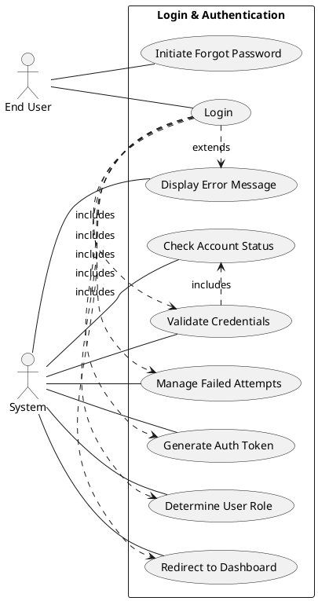

# Product Specification: Login & Authentication

---

## 1. Executive Summary

This Product Specification outlines the requirements for the Login & Authentication feature, a foundational component of the application. Its primary purpose is to enable registered users to securely access the system and receive a tailored experience based on their assigned roles. This document details the functional and non-functional requirements, use cases, and business rules necessary to implement a robust, secure, and user-friendly authentication mechanism, ensuring only authorized individuals can access application resources.

---

## 2. Goals and Objectives

The overarching goal is to provide a secure and efficient mechanism for users to authenticate and access the application.

**2.1 Business Objectives:**
*   **Secure Access:** Ensure only legitimate, registered users can access the application.
*   **Role-Based Personalization:** Facilitate a tailored user experience and access to features based on the user's assigned role.
*   **Data Protection:** Safeguard user credentials and session integrity against unauthorized access and common security threats.
*   **Compliance:** Lay the groundwork for meeting internal and external security standards.

**2.2 Product Objectives:**
*   Provide a clear and intuitive user interface for login.
*   Implement robust server-side validation and authentication processes.
*   Generate and manage secure authentication tokens for session management.
*   Enforce role-based authorization post-authentication.
*   Provide clear and helpful feedback to users during login attempts, including error messages.

---

## 3. Target Users

The primary actors interacting with the Login & Authentication feature are registered users of the system. These users are categorized by their roles, which dictate their post-login experience and access privileges.

*   **End User:** Any registered individual accessing the system, including but not limited to:
    *   **Customers:** Accessing customer-specific functionalities.
    *   **Admins:** Accessing administrative tools and data.
    *   **Employees:** Accessing internal tools and data.
*   **System:** The application's backend services responsible for credential validation, token generation, and authorization.

---

## 4. Functional Requirements

### 4.1. User Login Interface

**FR-001: Display Login Form**
The system SHALL display a login form on the login page.
*   **Acceptance Criteria:**
    *   The form MUST contain input fields for "Email Address" and "Password".
    *   The form MUST contain a "Login" button.
    *   The form MUST contain a "Forgot Password?" link.
*   **Tag:** [DETERMINISTIC]

**FR-002: Email Address Input**
The system SHALL allow users to input their email address into the designated field.
*   **Acceptance Criteria:**
    *   The email input field MUST accept standard email characters (alphanumeric, `@`, `.`, `-`, `_`).
    *   The email input field SHALL have a maximum length of 254 characters.
*   **Tag:** [DETERMINISTIC]

**FR-003: Password Input**
The system SHALL allow users to input their password into the designated field.
*   **Acceptance Criteria:**
    *   The password input field MUST mask the characters entered (e.g., display asterisks or dots).
    *   The password input field SHALL have a minimum length of 8 characters.
    *   The password input field SHALL have a maximum length of 64 characters.
*   **Tag:** [DETERMINISTIC]

**FR-004: Client-Side Input Validation (Empty Fields)**
The system SHALL perform client-side validation to ensure that both the email and password fields are not empty upon "Login" button submission.
*   **Acceptance Criteria:**
    *   If the email field is empty, the system MUST display the message "Email address is required" beneath the field without submitting the form.
    *   If the password field is empty, the system MUST display the message "Password is required" beneath the field without submitting the form.
    *   If both are empty, both messages MUST be displayed.
*   **Tag:** [DETERMINISTIC]

### 4.2. Authentication Process

**FR-005: Credential Submission**
Upon clicking the "Login" button, the system SHALL securely transmit the entered email and password to the server for authentication.
*   **Acceptance Criteria:**
    *   Credentials MUST be transmitted via HTTPS (TLS 1.2 or higher).
    *   The system SHALL prevent submission if client-side validation (FR-004) fails.
*   **Tag:** [DETERMINISTIC]

**FR-006: Server-Side Credential Verification**
The system SHALL verify the submitted email and password against the registered user database.
*   **Acceptance Criteria:**
    *   The system MUST retrieve the user's record based on the provided email address.
    *   The system MUST compare the provided password (after hashing) with the stored encrypted password (FR-BR-001).
*   **Tag:** [DETERMINISTIC]

**FR-007: Failed Login Attempt Tracking**
The system SHALL track the number of consecutive failed login attempts for each user account.
*   **Acceptance Criteria:**
    *   Each failed login attempt for a specific email address MUST increment a counter associated with that account.
    *   The counter MUST reset to zero upon a successful login for that account.
    *   The counter MUST persist across sessions (e.g., stored in the database).
*   **Tag:** [DETERMINISTIC]

**FR-008: Account Lockout**
The system SHALL lock a user account if the number of consecutive failed login attempts exceeds the defined threshold.
*   **Acceptance Criteria:**
    *   If the failed login attempts reach 5 (FR-BR-002), the account MUST be marked as 'locked'.
    *   A locked account MUST NOT be able to log in, even with correct credentials, until unlocked by an administrator or after a predefined timeout (e.g., 30 minutes, to be defined in NFRs).
*   **Tag:** [DETERMINISTIC]

**FR-009: Authentication Token Generation**
Upon successful credential verification, the system SHALL generate a unique, cryptographically secure authentication token.
*   **Acceptance Criteria:**
    *   The token MUST be a JSON Web Token (JWT) or similar industry-standard secure token format.
    *   The token MUST contain claims necessary for identifying the user and their role (e.g., `user_id`, `role`, `exp` for expiration).
    *   The token MUST be signed using a strong cryptographic algorithm (e.g., HS256 or RS256).
*   **Tag:** [DETERMINISTIC]

### 4.3. Authorization & Redirection

**FR-010: Role Determination**
Upon successful authentication, the system SHALL determine the user's assigned role.
*   **Acceptance Criteria:**
    *   The user's primary role MUST be retrieved from the user database or embedded in the authentication token.
    *   The system MUST support at least the roles "Customer", "Admin", and "Employee".
*   **Tag:** [DETERMINISTIC]

**FR-011: Role-Based Dashboard Redirection**
The system SHALL redirect the authenticated user to a specific dashboard URL based on their determined role.
*   **Acceptance Criteria:**
    *   If the user's role is 'Customer', they MUST be redirected to `/dashboard/customer`.
    *   If the user's role is 'Admin', they MUST be redirected to `/dashboard/admin`.
    *   If the user's role is 'Employee', they MUST be redirected to `/dashboard/employee`.
    *   If a user has multiple roles, the system SHALL prioritize redirection based on a predefined hierarchy (e.g., Admin > Employee > Customer, to be defined as a Business Rule if applicable).
*   **Tag:** [DETERMINISTIC]

**FR-012: Enforce Role-Based Authorization**
The system SHALL enforce role-based authorization for all subsequent API calls and UI access attempts.
*   **Acceptance Criteria:**
    *   Every authenticated request MUST include the authentication token.
    *   The system MUST validate the token's signature and expiration with every protected resource access.
    *   The system MUST check the user's role (from the token or retrieved from the database) against the required role for the requested resource/feature.
    *   If a user attempts to access a resource for which they do not have the required role, the system MUST return a `403 Forbidden` HTTP status code.
*   **Tag:** [DETERMINISTIC]

### 4.4. Error Handling & User Feedback

**FR-013: Invalid Credentials Error Message**
If the submitted email and password combination does not match a registered user, the system SHALL display an error message.
*   **Acceptance Criteria:**
    *   The system MUST display the message "Invalid credentials" in a prominent location on the login page.
    *   The message MUST be removed on subsequent user input or page refresh.
*   **Tag:** [DETERMINISTIC]

**FR-014: Account Locked Error Message**
If a user attempts to log in with an account that is locked (FR-008), the system SHALL display a specific error message.
*   **Acceptance Criteria:**
    *   The system MUST display the message "Account is locked" in a prominent location on the login page.
    *   The message MUST be removed on subsequent user input or page refresh.
*   **Tag:** [DETERMINISTIC]

**FR-015: Generic System Error Message**
If an unexpected server-side error occurs during the login process (e.g., database connection failure), the system SHALL display a generic error message.
*   **Acceptance Criteria:**
    *   The system MUST display "An unexpected error occurred. Please try again later." in a prominent location.
    *   The message MUST NOT reveal internal system details (e.g., stack traces).
*   **Tag:** [DETERMINISTIC]

### 4.5. Session Management

**FR-016: Authentication Token Expiration**
The system SHALL ensure that the generated authentication token expires after a specific time.
*   **Acceptance Criteria:**
    *   The token MUST have an expiration (`exp`) claim set to 30 minutes from its generation time (FR-BR-003).
    *   Upon token expiration, any subsequent request using that token MUST be rejected with a `401 Unauthorized` HTTP status code.
*   **Tag:** [DETERMINISTIC]

**FR-017: Forgot Password Redirection**
Upon clicking the "Forgot Password?" link, the system SHALL redirect the user to the password reset flow.
*   **Acceptance Criteria:**
    *   Clicking the "Forgot Password?" link MUST navigate the user's browser to the `/forgot-password` URL or equivalent.
*   **Tag:** [DETERMINISTIC]

---

## 5. Non-Functional Requirements

### 5.1. Security (NFR-SEC)

**NFR-SEC-001: Password Encryption at Rest**
All user passwords stored in the database MUST be encrypted using a strong, one-way hashing algorithm with a salt.
*   **Acceptance Criteria:**
    *   Passwords MUST be hashed using bcrypt or Argon2.
    *   Each password hash MUST include a unique, cryptographically secure salt.
    *   Stored passwords MUST NOT be recoverable in plain text.
*   **Tag:** [DETERMINISTIC]

**NFR-SEC-002: Secure Communication**
All communication between the client and server during the login process MUST be encrypted.
*   **Acceptance Criteria:**
    *   All login-related HTTP requests MUST use HTTPS (TLS 1.2 or higher).
    *   The server MUST redirect all HTTP requests to HTTPS.
*   **Tag:** [DETERMINISTIC]

**NFR-SEC-003: Brute-Force Attack Prevention**
The system MUST implement measures to prevent brute-force attacks on user accounts.
*   **Acceptance Criteria:**
    *   Account lockout (FR-008) MUST be triggered after 5 failed attempts (FR-BR-002).
    *   The lockout duration SHALL be 30 minutes.
    *   The system SHALL implement a rate-limiting mechanism on login attempts from a single IP address (e.g., max 10 attempts per minute).
*   **Tag:** [DETERMINISTIC]

**NFR-SEC-004: Protection Against Injection Attacks**
The system MUST protect against SQL injection and other command injection vulnerabilities.
*   **Acceptance Criteria:**
    *   All database queries involving user input MUST use parameterized queries or prepared statements.
    *   Input sanitization MUST be applied to all user-provided data before processing.
*   **Tag:** [DETERMINISTIC]

**NFR-SEC-005: Protection Against Cross-Site Scripting (XSS)**
The login interface and error messages MUST be protected against XSS attacks.
*   **Acceptance Criteria:**
    *   All user-provided input displayed on the page (e.g., in error messages if echoing input) MUST be properly escaped.
*   **Tag:** [DETERMINISTIC]

**NFR-SEC-006: Secure Token Handling**
Authentication tokens MUST be handled securely throughout their lifecycle.
*   **Acceptance Criteria:**
    *   Tokens MUST be stored client-side in `HttpOnly` and `Secure` cookies, or securely in browser memory (e.g., `localStorage` with appropriate CSRF/XSS mitigations).
    *   Tokens MUST NOT be exposed in URLs or HTTP logs.
    *   The server MUST validate the token signature and expiration on every protected request.
*   **Tag:** [DETERMINISTIC]

**NFR-SEC-007: Auditing and Logging**
All login attempts, both successful and failed, MUST be securely logged.
*   **Acceptance Criteria:**
    *   Logs MUST include timestamp, email address (or user ID on success), IP address, and outcome (success/failure, reason for failure).
    *   Sensitive information like plaintext passwords MUST NOT be logged.
    *   Logs MUST be stored in a centralized, protected logging system with access controls.
    *   Logs MUST be retained for a minimum of 90 days.
*   **Tag:** [DETERMINISTIC]

### 5.2. Performance (NFR-PERF)

**NFR-PERF-001: Login Response Time**
The system SHALL process a successful login request within an acceptable timeframe.
*   **Acceptance Criteria:**
    *   A successful login (from clicking "Login" to dashboard redirection) MUST complete within 2 seconds under normal load conditions (up to 100 concurrent logins/minute).
    *   The authentication API endpoint response time MUST be less than 500 milliseconds (95th percentile).
*   **Tag:** [DETERMINISTIC]

### 5.3. Scalability (NFR-SCAL)

**NFR-SCAL-001: Concurrent Users**
The login system SHALL support a high volume of concurrent login requests.
*   **Acceptance Criteria:**
    *   The system MUST support at least 1,000 concurrent active users without degradation in performance (NFR-PERF-001).
    *   The system MUST gracefully handle spikes up to 2,000 concurrent login attempts without failure, though with potential temporary performance degradation.
*   **Tag:** [DETERMINISTIC]

### 5.4. Usability (NFR-USAB)

**NFR-USAB-001: Clear Error Messages**
Error messages displayed to users SHALL be clear, concise, and actionable.
*   **Acceptance Criteria:**
    *   Error messages (FR-004, FR-013, FR-014, FR-015) MUST be easily distinguishable from other UI elements.
    *   Error messages MUST use simple language, avoiding technical jargon.
*   **Tag:** [DETERMINISTIC]

**NFR-USAB-002: Intuitive User Interface**
The login form SHALL be intuitive and easy for users to navigate.
*   **Acceptance Criteria:**
    *   Input fields MUST have clear labels.
    *   The "Login" button MUST be prominently displayed.
*   **Tag:** [DETERMINISTIC]

### 5.5. Availability (NFR-AVAIL)

**NFR-AVAIL-001: Login System Uptime**
The login functionality MUST be highly available.
*   **Acceptance Criteria:**
    *   The login service MUST maintain an uptime of 99.9% measured monthly.
*   **Tag:** [DETERMINISTIC]

---

## 6. Use Case Analysis

### 6.1. Use Case Diagram

### 6.2. Detailed Use Cases

#### 6.2.1. UC-001: Successful User Login

*   **Description:** The user provides valid credentials (email and password), and the system successfully authenticates them, generates an authentication token, and redirects them to their role-specific dashboard.
*   **Actors:** End User, System
*   **Preconditions:**
    *   User is registered in the system.
    *   User has valid and correct login credentials.
    *   User's account is not locked.
*   **Postconditions:**
    *   User is authenticated and logged into the system.
    *   An authentication token is generated and provided to the user.
    *   User is redirected to their role-specific dashboard.
    *   Failed login attempt counter for the user is reset to zero.

*   **Main Flow:**
    1.  End User navigates to the login page.
    2.  System displays the login form (FR-001).
    3.  End User enters their registered email address into the "Email Address" field (FR-002).
    4.  End User enters their correct password into the "Password" field (FR-003).
    5.  End User clicks the "Login" button.
    6.  System performs client-side validation for empty fields (FR-004) – passes.
    7.  System securely transmits credentials to the server (FR-005).
    8.  System performs server-side credential verification (FR-006) – passes.
    9.  System verifies the account is not locked (implicit in FR-008's criteria).
    10. System resets the failed login attempt counter for the user (FR-007).
    11. System generates a secure authentication token (FR-009).
    12. System determines the user's role (FR-010).
    13. System redirects the End User to the appropriate role-based dashboard (FR-011).

#### 6.2.2. UC-002: Login with Invalid Credentials

*   **Description:** The user attempts to log in with an incorrect email or password, and the system denies access, displays an error message, and tracks the failed attempt.
*   **Actors:** End User, System
*   **Preconditions:**
    *   User is on the login page.
*   **Postconditions:**
    *   User remains on the login page.
    *   An "Invalid credentials" error message is displayed.
    *   The failed login attempt counter for the provided email is incremented (FR-007).

*   **Main Flow:**
    1.  End User navigates to the login page.
    2.  System displays the login form (FR-001).
    3.  End User enters an email address into the "Email Address" field (FR-002).
    4.  End User enters an incorrect password into the "Password" field (FR-003).
    5.  End User clicks the "Login" button.
    6.  System performs client-side validation for empty fields (FR-004) – passes.
    7.  System securely transmits credentials to the server (FR-005).
    8.  System performs server-side credential verification (FR-006) – fails.
    9.  System increments the failed login attempt counter for the provided email (FR-007).
    10. System displays the error message "Invalid credentials" (FR-013).

#### 6.2.3. UC-003: Login with Empty Fields

*   **Description:** The user attempts to log in without providing either the email address or password, and the system prevents submission and displays client-side validation messages.
*   **Actors:** End User, System
*   **Preconditions:**
    *   User is on the login page.
*   **Postconditions:**
    *   User remains on the login page.
    *   Appropriate client-side validation messages are displayed.
    *   No request is sent to the server.

*   **Main Flow:**
    1.  End User navigates to the login page.
    2.  System displays the login form (FR-001).
    3.  End User (optionally) enters either an email or password, or leaves both empty.
    4.  End User clicks the "Login" button.
    5.  System performs client-side validation for empty fields (FR-004) – fails.
    6.  System displays "Email address is required" if email is empty.
    7.  System displays "Password is required" if password is empty.

#### 6.2.4. UC-004: Login with Locked Account

*   **Description:** The user attempts to log in with an account that has been locked due to excessive failed attempts, and the system denies access and displays a specific error message.
*   **Actors:** End User, System
*   **Preconditions:**
    *   User's account is registered and currently in a locked state (FR-008).
*   **Postconditions:**
    *   User remains on the login page.
    *   An "Account is locked" error message is displayed.
    *   No authentication token is generated.

*   **Main Flow:**
    1.  End User navigates to the login page.
    2.  System displays the login form (FR-001).
    3.  End User enters their email address into the "Email Address" field (FR-002).
    4.  End User enters their password into the "Password" field (FR-003).
    5.  End User clicks the "Login" button.
    6.  System performs client-side validation for empty fields (FR-004) – passes.
    7.  System securely transmits credentials to the server (FR-005).
    8.  System performs server-side credential verification (FR-006).
    9.  System identifies that the account associated with the email address is locked (FR-008).
    10. System displays the error message "Account is locked" (FR-014).

#### 6.2.5. UC-005: Initiate Forgot Password Flow

*   **Description:** The user clicks the "Forgot Password?" link on the login page, and the system redirects them to the password reset flow.
*   **Actors:** End User, System
*   **Preconditions:**
    *   User is on the login page.
*   **Postconditions:**
    *   User is redirected to the password reset page.

*   **Main Flow:**
    1.  End User navigates to the login page.
    2.  System displays the login form (FR-001).
    3.  End User clicks the "Forgot Password?" link.
    4.  System redirects the End User's browser to the password reset URL (FR-017).

---

## 7. Business Rules

The following rules MUST be strictly adhered to by the system:

**FR-BR-001: Password Encryption**
All user passwords stored in the system database MUST be encrypted using a strong, one-way hashing algorithm with a salt (NFR-SEC-001).
*   **Acceptance Criteria:** Passwords stored in the `users` table `password_hash` column MUST be bcrypt or Argon2 hashes, not plain text.

**FR-BR-002: Failed Login Attempts Limit**
A user account SHALL be locked if there are 5 consecutive failed login attempts within a specified period.
*   **Acceptance Criteria:** The `failed_attempts` counter for a user account MUST trigger a lockout (setting `is_locked` to true) when it reaches 5. The lockout period will be 30 minutes (NFR-SEC-003).

**FR-BR-003: Authentication Token Expiration**
All generated authentication tokens SHALL expire after 30 minutes.
*   **Acceptance Criteria:** The `exp` claim within generated JWTs MUST be set to `current_time + 30 minutes`.

**FR-BR-004: Role-Based Authorization Enforcement**
Access to application features and data MUST be strictly controlled based on the authenticated user's assigned role.
*   **Acceptance Criteria:** Any attempt to access a protected resource by a user without the necessary role MUST result in a `403 Forbidden` response.

---

## 8. Constraints, Assumptions, and Risks

### 8.1. Constraints

*   **Existing User Database:** The system MUST integrate with an existing user registration database that stores user profiles, including email, encrypted passwords, and roles.
*   **Fixed Failed Attempt Threshold:** The maximum number of failed login attempts is fixed at 5 before account lockout.
*   **Fixed Token Expiration:** The authentication token must expire after precisely 30 minutes.
*   **HTTPS Requirement:** All network communication for login must be secured with HTTPS.
*   **No Multi-Factor Authentication (MFA):** This specification does not include requirements for MFA; it is out of scope for the initial release.

### 8.2. Assumptions

*   **User Registration Exists:** It is assumed that a separate user registration process is already in place and functional, populating the user database with valid, active users.
*   **Password Reset Flow Exists:** A "Forgot Password" / password reset flow is assumed to be an existing or separately specified feature that the login page can redirect to.
*   **Secure Backend Infrastructure:** The underlying server infrastructure, including database and API gateways, is assumed to be secure and configured to handle sensitive data.
*   **Unique Email Addresses:** It is assumed that all registered user email addresses are unique within the system.

### 8.3. Risks

*   **Security Vulnerabilities:**
    *   **Risk:** SQL injection, XSS, or other attack vectors might be introduced if input validation and secure coding practices are not rigorously followed.
    *   **Mitigation:** Implement comprehensive input sanitization, use parameterized queries, perform regular security audits, and follow OWASP Top 10 guidelines.
    *   **Risk:** Weak password hashing or key management could lead to credential compromise.
    *   **Mitigation:** Use established strong hashing algorithms (bcrypt/Argon2) and secure key management practices for token signing.
*   **Performance Bottlenecks:**
    *   **Risk:** High concurrent login attempts could degrade performance or lead to service unavailability.
    *   **Mitigation:** Implement efficient database queries, optimize API response times, employ caching for non-sensitive data, and design for scalability (load balancing, auto-scaling).
*   **Account Lockout Issues:**
    *   **Risk:** Users might get locked out frequently due to legitimate mistakes or if the lockout mechanism is too aggressive.
    *   **Mitigation:** Ensure clear communication about lockout policy, provide self-service recovery options (via "Forgot Password"), and allow administrators to unlock accounts.
*   **Token Compromise:**
    *   **Risk:** If authentication tokens are stolen, unauthorized access could occur for the duration of the token's validity.
    *   **Mitigation:** Implement short expiration times, use `HttpOnly` and `Secure` cookies, ensure tokens are not logged or exposed, and consider token revocation mechanisms (though not explicitly required in this BRD).
*   **Integration Challenges:**
    *   **Risk:** Issues integrating with the existing user database or the role-based authorization framework.
    *   **Mitigation:** Early and frequent collaboration with database administrators and teams responsible for authorization logic, clear API definitions.