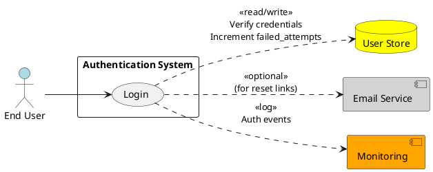
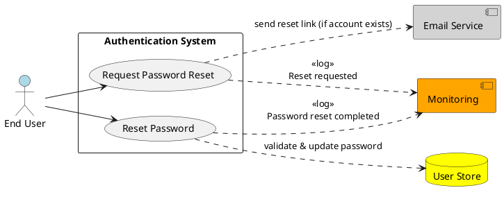
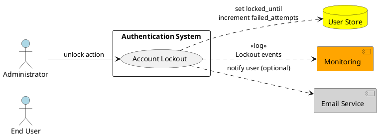
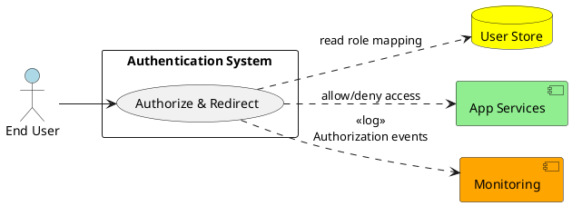

# Requirements Specification

## Feature Goal
Build a secure, reliable email/password authentication system that replaces or augments the current state where users cannot consistently authenticate and access role-specific dashboards. End state: registered users MUST be able to authenticate with email and password, obtain a time-limited authentication token, and be routed to role-appropriate resources; invalid or malicious attempts MUST be defended (rate limiting, lockout) and password material MUST be protected at rest.

## Business Justification
- Business value and user impact
  - Enables authenticated access to application features, increasing user engagement and enabling role-specific experiences (customer, admin, employee).
  - Reduces support load from authentication failures and provides forensicability for security incidents.
- Integration with existing features
  - Integrates with existing user store (Users table/identity store), email provider for password resets, and downstream authorization checks used by application dashboards.
- Problems this solves and for whom
  - Solves unauthorized access prevention for security/compliance teams.
  - Solves access friction for end users by deterministic validation and clear error states.
  - Solves support ambiguity by consistent audit logs and measurable lockout behavior.

## Feature Scope
User-visible behavior:
- Login screen accepts email + password, validates inputs inline, displays non-revealing error messages, and redirects authenticated users to role-specific dashboards.
- Forgot Password flow sends time-limited reset link or OTP without disclosing account existence.
- Account lockout behavior after configurable failed attempts with informative guidance.
- Role-based access enforced server-side; UI redirects only after server confirmation.

Technical requirements:
- Passwords MUST be hashed with a strong adaptive algorithm (Argon2id or bcrypt) and salted.
- Token-based authentication with short-lived access tokens (default 30 minutes) and optional refresh token mechanism for session continuation.
- Rate limiting and account lockout after 5 failed attempts by default.
- All network traffic MUST use TLS 1.2+.
- Audit logging for successful and failed authentication events.
- Secrets (hashing keys, token signing keys) MUST be stored in a secret manager (no hardcoding).

### Success Criteria
- [ ] 98%+ successful authentication rate for valid credentials in production traffic.
- [ ] Median authentication API latency ≤ 300 ms under normal load.
- [ ] Account lockout occurs after 5 failed attempts and unlocks only via configured policy (time-based or admin) 100% of the time.
- [ ] Passwords stored using Argon2id/bcrypt with parameters that meet OWASP recommendations.
- [ ] Reset links or OTPs expire within configured TTL (default: 15 minutes) and are single-use.
- [ ] Unauthorized access attempts are denied; end-to-end authorization enforcement validated by tests and automated checks.

## Functional Requirements

Summary of Functional Requirements
| FR ID | Short description | Tag |
|-------|-------------------|-----|
| FR-001 | Email/password authentication endpoint (login) | [DETERMINISTIC] |
| FR-002 | Input validation for login and reset screens | [DETERMINISTIC] |
| FR-003 | Secure password storage (hashing & salt) | [DETERMINISTIC] |
| FR-004 | Authentication token generation and lifecycle | [DETERMINISTIC] |
| FR-005 | Role-based authorization enforcement and redirect | [DETERMINISTIC] |
| FR-006 | Account lockout policy after failed attempts | [DETERMINISTIC] |
| FR-007 | Forgot password — send reset link/OTP (non-revealing) | [DETERMINISTIC] |
| FR-008 | Rate limiting and brute-force protections (IP + account) | [DETERMINISTIC] |
| FR-009 | Audit logging and monitoring for auth events | [DETERMINISTIC] |
| FR-010 | Security controls: TLS, secure cookies, secret management | [DETERMINISTIC] |
| FR-011 | Optional: Refresh token with rotation & revocation endpoint | [RECOMMENDED][HYBRID] |
| FR-012 | Optional: Admin unlock workflow for locked accounts | [DETERMINISTIC] |
| FR-013 | Error messaging and UX rules (non-revealing) | [DETERMINISTIC] |
| FR-014 | [AI-CANDIDATE] Optional: Adaptive risk-based step-up auth (phase 2) | [AI-CANDIDATE] |

Detailed Functional Requirements (each MUST with acceptance criteria)

- FR-001: [DETERMINISTIC] System MUST provide a POST /auth/login endpoint that accepts email and password, verifies credentials against the user store, and returns an access token on success.
  - Acceptance Criteria:
    - GIVEN a registered user with valid email and password, WHEN the client POSTs to /auth/login, THEN the system MUST return HTTP 200 with a JSON payload containing an access token and user role claim within 300 ms median.
    - GIVEN invalid credentials, WHEN POST /auth/login is called, THEN the system MUST return HTTP 401 with a generic error "Invalid credentials" and increment the failed_attempts counter.
    - Tests: automated unit/integration tests verifying success path, invalid credential path, and that failed_attempts increments.

- FR-002: [DETERMINISTIC] Client and server MUST validate input fields for email and password with deterministic rules (email format, non-empty, length limits) and return inline validation messages.
  - Acceptance Criteria:
    - Server-side validation MUST reject empty email or password with HTTP 400 and a clear codeable error (e.g., validation.email.required).
    - Email MUST match RFC 5322 simplified pattern; password MUST be length ≥ 8 and ≤ 128 characters unless policy overrides; violations return HTTP 400.
    - Client-side MUST present inline messages and focus first invalid field; accessibility checks (screen readers announce errors).
    - Tests: validation unit tests covering empty, malformed, short/long inputs.

- FR-003: [DETERMINISTIC] System MUST store passwords hashed with a secure adaptive algorithm (Argon2id recommended; bcrypt acceptable) with per-user salt and configurable parameters.
  - Acceptance Criteria:
    - All new/updated passwords MUST be hashed with Argon2id with parameters chosen to match current hardware (time/memory) and documented in ops runbook.
    - GIVEN legacy weak hashes exist, the system MUST re-hash to Argon2id on successful login OR provide a documented bulk migration plan.
    - No plaintext passwords or reversible encryption stored.
    - Tests: verify stored password records contain hash parameters and salt; code review confirms use of secure library and no hardcoded secrets.

- FR-004: [DETERMINISTIC] System MUST generate time-limited authentication tokens on successful login. Access tokens MUST expire by default in 30 minutes; refresh tokens MAY be used for session continuation (see FR-011).
  - Acceptance Criteria:
    - Access tokens MUST include user id and role claims, be signed with a key from a secret manager, and have an exp claim set to 30 minutes (configurable).
    - Token validation endpoints or middleware MUST reject expired or tampered tokens with HTTP 401.
    - If using JWT, revocation strategy MUST be defined (blacklist or token rotation). If opaque tokens used, revocation MUST be supported server-side.
    - Tests: token issuance, expiry enforcement, signature verification tests.

- FR-005: [DETERMINISTIC] System MUST enforce role-based authorization server-side and MUST redirect authenticated users to role-specific dashboards only after authorization checks.
  - Acceptance Criteria:
    - On successful authentication, the server MUST include role in token; client redirect logic MUST request server for post-login target (or the server SHALL return redirect URL).
    - Access to protected endpoints MUST verify role claim and deny unauthorized roles with HTTP 403.
    - Tests: role mapping tests and integration tests asserting unauthorized roles cannot access protected resources.

- FR-006: [DETERMINISTIC] System MUST lock user accounts after 5 consecutive failed login attempts and MUST record lockout timestamp; lockout duration MUST be configurable (default: 15 minutes) or require admin unlock.
  - Acceptance Criteria:
    - After the 5th failed attempt, the account’s status MUST be set to locked and login attempts MUST return HTTP 423 (Locked) with message "Account is locked" (non-revealing about reasons beyond lock).
    - Locked accounts MUST NOT accept password login until locked_until has passed or admin unlock performed via secure admin endpoint.
    - Failed_attempts MUST reset on successful login.
    - Tests: simulate repeated failed logins and verify lockout and timing behavior.

- FR-007: [DETERMINISTIC] System MUST provide a Forgot Password flow (POST /auth/forgot-password) that sends a single-use, time-limited reset link or OTP via registered email without revealing account existence.
  - Acceptance Criteria:
    - When a user submits an email, the system MUST respond with HTTP 200 and message "If an account exists, you will receive reset instructions" regardless of email existence.
    - If the email exists, the system MUST generate a signed reset token (or OTP) valid for 15 minutes, store necessary state to enforce single-use, and send via the configured transactional email provider.
    - Reset link/OTP MUST expire after first use or TTL and MUST be invalidated after use.
    - Tests: verify email sent when user exists, verify non-disclosure behavior, verify token expiry and single-use.

- FR-008: [DETERMINISTIC] System MUST apply rate limiting and brute-force protections per IP and per account, with configurable thresholds and exponential backoff or CAPTCHA integration.
  - Acceptance Criteria:
    - Default thresholds: per-IP 100 requests/min for auth endpoints (configurable), per-account progressive delay after X failed attempts, and integration point for CAPTCHA after configurable threshold.
    - Requests exceeding rate limits MUST return HTTP 429 with Retry-After header.
    - Tests: rate limit unit tests, integration tests verifying behavior under simulated attack.

- FR-009: [DETERMINISTIC] System MUST log audit events for authentication actions (successful login, failed login, lockout, password reset requested/used, token revocation) to centralized logging and monitoring with PII redaction.
  - Acceptance Criteria:
    - Each auth event MUST include timestamp, user id (or hashed identifier for unknown email), source IP, outcome, and correlation id; logs MUST NOT contain plaintext passwords or tokens.
    - Alerts MUST be configured for anomalous patterns (e.g., spikes in failed logins).
    - Tests: audit logging must be present in login flows; retention policy documented.

- FR-010: [DETERMINISTIC] System MUST enforce security controls: TLS 1.2+, secure cookie flags (HttpOnly, Secure, SameSite), secret management, parameterized queries for DB access, and CSP/HSTS headers where applicable.
  - Acceptance Criteria:
    - All auth endpoints MUST be served over HTTPS and certificate management in ops must be documented.
    - Cookies used for session MUST set HttpOnly and Secure and SameSite=Strict (or Lax where required).
    - DB access for auth MUST use parameterized queries/ORM to prevent injection.
    - Tests: security integration tests and scanning (Snyk/npm-audit/pip-audit) results documented; automated checks in CI.

- FR-011: [HYBRID] System SHOULD support refresh tokens with rotation and revocation endpoints for long-lived sessions; refresh tokens MUST be stored securely and support one-time rotation to reduce replay risk.
  - Acceptance Criteria:
    - If implemented, refresh tokens MUST be stored in a secure store, rotated on use, and revocation endpoint MUST invalidate tokens.
    - Tests: refresh token rotation tests simulating reuse (replay) and ensuring reuse is detected and rejected.

- FR-012: [DETERMINISTIC] System SHOULD provide an admin unlock endpoint (/admin/users/{id}/unlock) accessible only to authorized admin roles to unlock user accounts.
  - Acceptance Criteria:
    - Admin endpoint MUST require admin role and log the unlock event with admin id, timestamp, and target user id.
    - Tests: RBAC tests for admin-only access and unlock functionality.

- FR-013: [DETERMINISTIC] System MUST present non-revealing error messages and accessible UI behavior for all auth flows (generic messages for unknown emails).
  - Acceptance Criteria:
    - Messages for failed login and forgot-password MUST not confirm existence of an account.
    - UI MUST focus first invalid field and announce errors to screen readers.
    - Tests: UI accessibility tests (keyboard navigation, screen reader assertions).

- FR-014: [AI-CANDIDATE] Future/optional: System MAY incorporate an adaptive risk-based step-up authentication component that analyzes signals (IP reputation, device fingerprint, behaviour) to recommend step-up (MFA, CAPTCHA).
  - Acceptance Criteria:
    - Proof-of-concept MUST present risk score and recommended action; any suggested automatic enforcement MUST require PO approval and documented human override policy.
    - Data use and models MUST be auditable and tested for fairness and bias.

## Use Case Analysis

### Actors & System Boundary
- Primary Actor: End User — registered person who authenticates to access role-specific resources.
- Secondary Actor: Administrator — support or security operator who may unlock accounts and view audit logs.
- System Actor(s):
  - Email Service (SMTP/Transactional provider) — sends reset links/OTPs.
  - User Store (Database) — stores user records and auth metadata.
  - Auth Service (this system) — responsible for validation, token issuance, lockout, logging.
  - Monitoring/Logging System — receives audit events and alerts.

### Use Case Specifications

#### UC-001: Login with Email & Password
- Actor(s): End User
- Goal: Authenticate with email and password and be redirected to role-specific dashboard.
- Preconditions:
  - User account exists in user store and is not currently locked.
  - Client can reach /auth/login over TLS.
- Success Scenario:
  1. User opens login page and enters email and password.
  2. Client performs client-side validation; if valid, POST /auth/login with credentials.
  3. Server validates inputs (server-side) and authenticates credentials against hashed password in DB.
  4. On success, server resets failed_attempts, issues access token (exp 30 min) and returns user role and optional redirect URL.
  5. Client stores token securely (HttpOnly cookie or secure storage per platform) and redirects to role dashboard.
- Extensions/Alternatives:
  - 2a. If client-side validation fails, show inline validation and do not submit.
  - 3a. If credentials invalid, increment failed_attempts and return HTTP 401 with "Invalid credentials".
  - 3b. If failed_attempts reaches threshold, set account locked and return HTTP 423 "Account is locked".
  - 4a. If account locked, display account locked guidance and link to forgot-password or contact support.
- Postconditions:
  - On success: user has valid token and is authorized for role-specific resources.
  - On failure: failed_attempts incremented and potentially account locked; audit log recorded.

Use Case Diagram

#### UC-002: Forgot Password / Reset Flow
- Actor(s): End User
- Goal: Receive reset instructions and reset password without exposing account existence.
- Preconditions:
  - User has access to the registered email address (if registered).
  - Reset tokens not currently active for the same user (system can allow/revoke per policy).
- Success Scenario:
  1. User selects "Forgot Password" and submits an email address.
  2. Server responds with HTTP 200 and non-revealing message regardless of existence.
  3. If email exists, server generates single-use signed reset token or OTP (TTL 15 minutes), stores token state, and sends email with reset link.
  4. User follows link, submits new password satisfying password policy.
  5. Server validates token, updates password with secure hash, invalidates token, resets failed_attempts, and returns success.
- Extensions/Alternatives:
  - 2a. If token expired or invalid, show generic message with option to re-request.
  - 4a. If new password fails policy, show inline errors and do not accept.
- Postconditions:
  - Password updated in user store with secure hash, token invalidated, audit event logged.

Use Case Diagram

#### UC-003: Account Lockout Handling
- Actor(s): End User, Administrator
- Goal: Prevent brute-force compromise by locking accounts after repeated failed attempts and enabling safe unlock.
- Preconditions:
  - Failed_attempts counter is available and incremented on failed auth attempts.
  - Admin role exists with access to unlock endpoint.
- Success Scenario:
  1. System records consecutive failed login attempts for a user.
  2. On the 5th failed attempt, system sets account status locked and locked_until = now + lock_duration (default 15 minutes) or until admin unlock.
  3. System sends an optional notification to userEmail (configurable) about lockout (non-revealing content).
  4. Administrator may unlock via authenticated admin endpoint; audit event logged.
- Extensions/Alternatives:
  - 2a. If lockout policy is time-based, after locked_until, the account automatically becomes active and failed_attempts reset.
  - 3a. User may use Forgot Password flow to reset password and clear lock.
- Postconditions:
  - Locked accounts cannot authenticate until policy conditions satisfied or admin unlock.
  - Lockout and unlock events logged.

Use Case Diagram

#### UC-004: Role-Based Authorization Enforcement & Redirect
- Actor(s): End User
- Goal: Ensure authenticated users access only resources permitted by their role and are redirected to the correct dashboard post-login.
- Preconditions:
  - User token includes role claim signed by auth service.
  - Role-to-dashboard mapping configurable in server config.
- Success Scenario:
  1. After authentication, server determines post-login redirect using role claim or returns redirect URL in login response.
  2. Client navigates to role-specific dashboard.
  3. For subsequent protected resource requests, server-side middleware validates token and role; deny if role insufficient.
- Extensions/Alternatives:
  - 1a. If no role mapping exists, default safe landing page served and admin alerted.
  - 3a. If role claim missing or tampered with, deny access and require re-authentication.
- Postconditions:
  - Authorized access only; unauthorized attempts logged and denied.

Use Case Diagram

## Risks & Mitigations
1. Risk: Brute-force or credential stuffing leading to account takeover.
   - Mitigation: FR-006 lockout, FR-008 rate limiting, CAPTCHA integration, IP reputation checks, monitoring & alerts (FR-009).
2. Risk: Weak password hashing or leaked secrets.
   - Mitigation: FR-003 use Argon2id/bcrypt, secret manager for keys (FR-010), rotation documented.
3. Risk: Token theft and replay attacks.
   - Mitigation: Short-lived access tokens (FR-004), refresh token rotation (FR-011) and server-side revocation support, secure cookies with HttpOnly and Secure flags (FR-010).
4. Risk: UX leakage revealing account existence (privacy exposure).
   - Mitigation: Non-revealing responses in Forgot Password (FR-007) and standardized error messaging (FR-013).
5. Risk: Compliance and audit gaps (missing logs, PII leaks).
   - Mitigation: FR-009 enforce structured audit logs, PII redaction, retention policy and monitoring integration.

## Constraints & Assumptions
1. Assumption: There is an existing canonical user store (database) accessible to the auth service — migration steps needed if schema lacks fields (failed_attempts, locked_until).
2. Constraint: All endpoints MUST be hosted behind TLS; no plaintext HTTP allowed.
3. Assumption: Transactional email provider is available and configured for sending reset emails; if not, reset via admin workflow is required.
4. Constraint: Default lockout threshold is 5 attempts and default token expiry is 30 minutes; these are configurable but implementation SHALL support these defaults.
5. Assumption: MFA is out of scope for phase 1; optional future work (FR-014) may introduce step-up authentication.

---