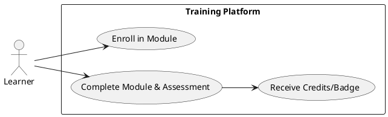
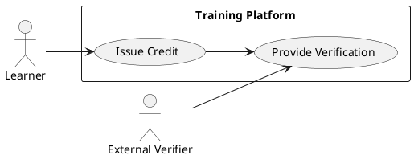
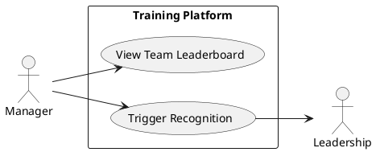
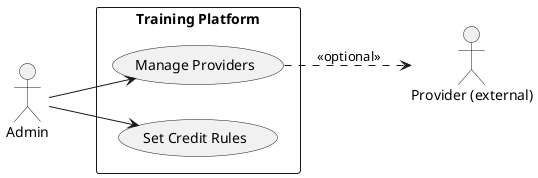
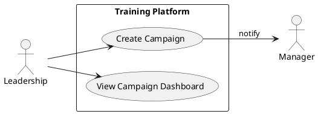
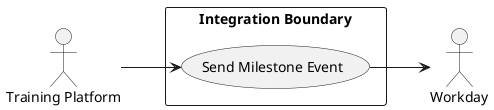

# Requirements Specification

## Feature Goal
Build a web-based Credit-based Training System that enables organization employees to discover, complete, and be credited for AI learning. End state: employees MUST be able to authenticate via Org SSO, complete learning modules, earn verifiable credits and badges, apply for certifications from approved providers, be ranked on team/organization leaderboards, and allow leadership to drive adoption and recognition programs. All credits MUST be quantifiable, auditable, and exportable. System UX MUST align with Microsoft Learn / Google Learn patterns and be ready for optional future LMS and Workday integrations.

## Business Justification
- Business value and user impact
  - Accelerates organization-wide AI capability by tracking verifiable learner progress and creating incentives (credits, badges, recognition).
  - Enables leadership to measure and drive adoption, improving hiring/promotions alignment with skills.
  - Reduces manual tracking work for HR and admins; creates auditable learning records for compliance and career actions.
- Integration with existing features
  - Uses Org SSO for authentication; integrates with Workday for HR sync and potential career actions; exposes APIs/webhooks for future LMS ingestion.
- Problems this solves and for whom
  - For employees: Clear learning paths with measurable outcomes, career recognition.
  - For managers/leadership: Data-driven measurement of upskilling progress and tools to promote adoption.
  - For admins/HR: Audit-ready records and provider-managed certification workflows.

## Feature Scope
User-visible behavior:
- Learners can browse learning catalog, enroll in modules, track progress, complete assessments, and earn credits and badges.
- Leaderboards and team views show rankings; managers can view team progress and trigger recognition workflows.
- Learners may apply to take vendor certifications through an approved provider workflow (request, approval, verification).
- Admins manage approved providers, credit and badge rules, and audit/export learning records.
- Leadership can require or recommend learning programs, receive adoption dashboards, and nudge teams.
- System UI must mirror Learn-style patterns: learning paths, module cards, progress bars, module steps, search, and POI microlearning layout. Accessibility: WCAG 2.1 AA minimum.

Technical requirements:
- Web platform initial delivery; responsive UI for desktop/tablet.
- Org SSO support (SAML 2.0 and OIDC adapters configurable).
- Credits are stored in an auditable append-only ledger with tamper-evidence (cryptographic hashing of records) and exportable CSV/JSON.
- Provider integrations via REST APIs or manual admin verification workflows.
- Workday integration via secure API/webhook interface for milestone notifications and optional HR actions.
- Audit log and retention policy configurable; PII protections and encryption at rest/in transit.

### Success Criteria
- [ ] 80% of targeted engineering teams enroll within first 90 days after leadership launch.
- [ ] 95% of completed credits are verifiable and auditable via the platform's export within 5 seconds of issuance.
- [ ] Median module completion API latency ≤ 300 ms for basic operations.
- [ ] Leaderboard updates reflect new credit events within 60 seconds in 95% of cases.
- [ ] SSO login success rate ≥ 99% for valid org accounts in production.
- [ ] System meets WCAG 2.1 AA for core learning flows.

## Functional Requirements

Summary of Functional Requirements
| FR ID | Short description | Tag |
|-------|-------------------|-----|
| FR-001 | Org SSO login (SAML/OIDC) | [DETERMINISTIC] |
| FR-002 | Learner enrollment & progress tracking | [DETERMINISTIC] |
| FR-003 | Secure credit issuance & accounting ledger | [DETERMINISTIC] |
| FR-004 | Module assessment submission & scoring | [DETERMINISTIC] |
| FR-005 | Role-based access & manager views | [DETERMINISTIC] |
| FR-006 | Leaderboard & ranking algorithm | [DETERMINISTIC] |
| FR-007 | Badges & achievements engine | [DETERMINISTIC] |
| FR-008 | Certification application workflow (approved providers) | [DETERMINISTIC] |
| FR-009 | Admin UI for provider, credit, badge configuration | [DETERMINISTIC] |
| FR-010 | Security controls: TLS, secure cookies, secret management | [DETERMINISTIC] |
| FR-011 | Optional: Refresh token rotation & revocation | [HYBRID] |
| FR-012 | Admin unlock & dispute resolution workflow | [DETERMINISTIC] |
| FR-013 | UX rules & error messaging aligned with Learn platforms | [DETERMINISTIC] |
| FR-014 | [AI-CANDIDATE] Personalized learning recommendations & nudges | [AI-CANDIDATE] |
| FR-015 | Analytics & leadership dashboards for adoption measurement | [DETERMINISTIC] |
| FR-016 | Exportable audit reports and retention policies | [DETERMINISTIC] |
| FR-017 | Workday integration for HR actions & record sync | [DETERMINISTIC] |
| FR-018 | Credit verification API for third-party validation | [DETERMINISTIC] |
| FR-019 | [UNCLEAR] Credit model rules: expiry, conversion, transferability | [UNCLEAR] |
| FR-020 | Leadership-driven adoption controls & manager notifications | [DETERMINISTIC] |

Detailed Functional Requirements

- FR-001: [DETERMINISTIC] System MUST support Org SSO using configurable SAML 2.0 and OIDC providers and fallback invitation flows for contractors.
  - Actors: Learner, SSO Provider, Admin.
  - Trigger: User navigates to platform and selects Org SSO.
  - Acceptance Criteria:
    - GIVEN Org SSO is configured, WHEN a user signs in via SSO, THEN the system MUST authenticate and create or map a user profile with employee ID and email within 5 seconds.
    - GIVEN invalid SSO attributes or mapping error, WHEN SSO response fails, THEN the system MUST show a clear non-sensitive error and log the incident.
    - Tests: integration tests with test IdP including attribute mapping for email, employee_id, manager.
  - Success Scenario: SSO authentication → user session created → redirect to dashboard.
  - Failure Scenarios: Missing attributes → error message; authentication failure → deny access and log.

- FR-002: [DETERMINISTIC] System MUST allow learners to enroll in learning modules and track progress step-by-step (started, in-progress, completed, assessment submitted).
  - Actors: Learner, System.
  - Trigger: Learner clicks Enroll or starts a module.
  - Acceptance Criteria:
    - Progress state changes persist within 2 seconds of action and are visible in UI and API.
    - Completion triggers credit issuance or assessment flow per module rules.
    - Partial progress saved and retrievable across sessions.
  - Postconditions: Learner progress persisted; if completed, triggers FR-003/FR-007 flows.

- FR-003: [DETERMINISTIC] System MUST issue verifiable credits into an append-only ledger that is cryptographically signed and auditable.
  - Actors: System, Admin, External Verifier.
  - Trigger: Module completion or provider-verified certification event.
  - Acceptance Criteria:
    - Each credit record MUST include: learner_id, credit_value, source_id (module|provider), timestamp, issuer_id, and signature hash.
    - Credits are queryable via API and export within 5 seconds.
    - Ledger must be append-only; edits generate a compensating audit record.
    - Tests: create, query, export, and tamper-detection unit tests.
  - Failure Scenarios: If ledger write fails, system must retry and mark event as pending for manual review.

- FR-004: [DETERMINISTIC] System MUST accept assessment submissions, auto-score where applicable, and mark completion conditions.
  - Actors: Learner, System.
  - Trigger: Learner submits assessment.
  - Acceptance Criteria:
    - Auto-scoring modules return results within 10 seconds for typical workloads.
    - Pass/fail logic adheres to module definition; failing learners get remediation suggestions.
    - Manual-grading workflows available with assignment to graders and SLA tracking.

- FR-005: [DETERMINISTIC] System MUST enforce role-based access control: learners, managers, admins, and leadership have constrained views and actions.
  - Actors: Learner, Manager, Admin.
  - Trigger: Role-specific page access.
  - Acceptance Criteria:
    - Manager view shows only direct reports; admin views available per permission set.
    - Unauthorized requests return HTTP 403 with non-sensitive message.
    - Access checks enforced server-side for all API endpoints.

- FR-006: [DETERMINISTIC] System MUST provide leaderboards with configurable ranking algorithm and filters (team, org, time window).
  - Actors: Learner, Manager, Leadership.
  - Trigger: Leaderboard page load or filter change.
  - Acceptance Criteria:
    - Leaderboard query returns top N results within 2 seconds for N=100 under normal load.
    - Ranking algorithm documented: primary sort by total verified credits, secondary by recency of credits, tertiary by tie-breaker (alphabetical user ID). Algorithm must be configurable by admin.
    - Leaderboard refreshes within 60 seconds of new credit issuance in 95% of cases.
  - Extensions: Admin can force reindexing or re-compute ranking.

- FR-007: [DETERMINISTIC] System MUST manage badge definitions, award conditions, and display/expiry logic.
  - Actors: System, Admin, Learner.
  - Trigger: Learner meets award conditions.
  - Acceptance Criteria:
    - Admins can define badges with thresholds, prerequisites, and tags.
    - Awarded badges appear on learner profile and are exportable.
    - Badge revocation creates audit entry and notifies learner and admin.
    - Badges support levels (bronze/silver/gold) and visual assets.

- FR-008: [DETERMINISTIC] System MUST implement certification application workflow for approved providers: request → admin/provider approval → scheduling/verification → credit award.
  - Actors: Learner, Admin, Provider.
  - Trigger: Learner applies for certification via provider integration.
  - Acceptance Criteria:
    - Provider list must be managed by admin; provider integrations support API verification or manual confirmation.
    - Application status changes track timestamps, approver_id, and notes.
    - On verified provider confirmation, credits/certificates are issued and ledger updated.

- FR-009: [DETERMINISTIC] System MUST provide Admin UI to configure providers, credits, badges, and rules with audit trail for changes.
  - Actors: Admin.
  - Trigger: Admin updates configuration.
  - Acceptance Criteria:
    - All admin changes captured with user_id, timestamp, and diff; exportable audit log.
    - Config changes are staged and can be rolled back by admins with sufficient permission.

- FR-010: [DETERMINISTIC] System MUST enforce baseline security controls: TLS 1.2+, secure cookies (HttpOnly, Secure, SameSite), encryption at rest, secret management, and OWASP mitigations.
  - Actors: System, IT/Security.
  - Trigger: Platform deployment and runtime operations.
  - Acceptance Criteria:
    - All endpoints served via HTTPS only (redirect HTTP→HTTPS).
    - Session cookies set with HttpOnly, Secure, SameSite=Strict by default.
    - Secrets (keys, DB credentials, signing keys) stored in a secret manager (e.g., Azure Key Vault, AWS Secrets Manager) and not checked into source.
    - Critical data at rest encrypted with AES-256 and keys rotated per org policy.
    - App passes static analysis and OWASP Top-10 checks in CI pipeline.
  - Postconditions: Secure baseline validated in staging before production.

- FR-011: [HYBRID] System SHOULD implement refresh token rotation with revocation endpoint and audit trail.
  - Actors: Learner, System, Admin.
  - Trigger: Access token expiry or explicit logout/revoke.
  - Acceptance Criteria:
    - Refresh tokens are one-time-use and rotated on refresh.
    - System exposes POST /auth/revoke to invalidate refresh tokens.
    - Revocation events logged with actor and timestamp.
    - Tests for token rotation, reuse detection, and revocation functionality.
  - Notes: If organization policy disallows refresh tokens, web session-only model must be supported.

- FR-012: [DETERMINISTIC] System MUST provide admin unlock and dispute resolution workflow for learners disputing credit or badge assignment.
  - Actors: Learner, Admin, Manager.
  - Trigger: Learner submits dispute about credit/badge.
  - Acceptance Criteria:
    - Dispute submission form records evidence and creates a ticket with SLA (e.g., 5 business days).
    - Admin action history and final resolution recorded in audit log.
    - If credit/badge adjusted, compensating ledger record created and notified.

- FR-013: [DETERMINISTIC] System MUST present UX and non-revealing error messaging aligned to Microsoft Learn/Google Learn expectations.
  - Actors: Learner, UI Designer, Product.
  - Trigger: UI interactions (errors, prompts).
  - Acceptance Criteria:
    - Module pages contain learning path breadcrumb, progress bar, estimated time, and microlearning card layout.
    - Error messages avoid exposing sensitive state (e.g., “Account not found”); instead use neutral messages like “Check your credentials or contact IT”.
    - UX acceptance tests (heuristic review) confirm parity with Microsoft Learn/Google Learn for core flows (catalog, module, assessment).
    - Accessibility: All interactive elements keyboard operable and labeled; core flows meet WCAG 2.1 AA.

- FR-014: [AI-CANDIDATE] System MAY provide personalized learning recommendations and intelligent nudges based on a hybrid model (recommendation engine + business rules).
  - Actors: Learner, System.
  - Trigger: Learner visits catalog or completes module.
  - Acceptance Criteria:
    - Recommendations include rationale (why recommended) and allow user override.
    - Nudge emails/messages configurable by admin and rate-limited.
    - Recommendations are auditable (input features and model version recorded).
    - Privacy: no PII leakage in model logs; opt-out provided.
  - Note: AI triage tag acknowledges ML suitability; design/ops must include model governance.

- FR-015: [DETERMINISTIC] System MUST provide analytics and leadership dashboards to measure adoption, completion rates, and manager-level progress.
  - Actors: Leadership, Manager, Admin.
  - Trigger: Dashboard access or scheduled report.
  - Acceptance Criteria:
    - Dashboards show: enrollments, completions, credits issued, adoption trend, team-level drilldown.
    - Exportable reports (CSV/JSON) and scheduled email reports.
    - Role-based filters and time-window controls.
    - KPIs configurable by leadership (e.g., monthly completion target).

- FR-016: [DETERMINISTIC] System MUST support exportable audit reports and configurable retention policies for credit and audit logs.
  - Actors: Admin, Security.
  - Trigger: Admin requests export or automated retention job runs.
  - Acceptance Criteria:
    - Admins can export ledger and audit logs in CSV/JSON with filters (date ranges, user, event types).
    - Retention policy configurable (default 7 years for audit events) and automated purge creates archived snapshot before deletion.
    - Exports include cryptographic proof (hash) to validate integrity.

- FR-017: [DETERMINISTIC] System MUST integrate with Workday for HR actions (event notifications, optional auto-creation of training records).
  - Actors: System, Workday API, HR Admin.
  - Trigger: Policy-configured milestone (e.g., certification achieved).
  - Acceptance Criteria:
    - Platform can POST secure events to Workday endpoint with documented schema.
    - Workday responses handled idempotently; failures retried with exponential backoff and logged.
    - Integration configurable (enabled/disabled) per org policy.

- FR-018: [DETERMINISTIC] System MUST expose a secure verification API allowing third parties (internal tools, managers, providers) to verify a learner's credits/badges.
  - Actors: External Verifier, System.
  - Trigger: External verification request with token or signed reference.
  - Acceptance Criteria:
    - API returns signed proof object with credit details and verifies signature in <5 seconds.
    - Rate limiting and access control enforced; only authorized clients may query.
    - Audit trail records verification requests and responses.

- FR-019: [UNCLEAR] System MUST implement credit model rules (expiry, conversion, transferability). (Needs clarification)
  - Actors: Product, Leadership, Admin.
  - Clarifying Questions (must be answered before implementation):
    1. Should credits expire? If so, what default TTL (e.g., 12/24/36 months)? Who can override?
    2. Are credits transferable between users (e.g., mentor transfers credit)? Allowed/forbidden?
    3. Is there a conversion between course completion and certification credits (e.g., course X = 10 credits, certification = 50 credits)? Are conversion rates static or admin-configurable?
    4. How should revocation be handled if a certification is rescinded—should credits be revoked and how are downstream effects handled?
    5. Who owns the policy: Learning Product Owner, Leadership, or HR?
  - Proposed Defaults if decisions are deferred:
    - Default: Credits expire after 24 months; not transferable between users; conversions admin-configurable; revocation permitted only by admin with audit and notification to learner.
  - Acceptance Criteria (conditional on defaults):
    - GIVEN default rules, WHEN a credit is older than TTL, THEN it is flagged as expired and excluded from active leaderboards but retained in audit exports.
    - Any deviation from defaults requires admin configuration and is versioned with timestamp and author.
  - Implementation Note: Mark FR-019 as [UNCLEAR] until clarifications are provided; include configuration UI for rules and versioning.

- FR-020: [DETERMINISTIC] System MUST provide leadership-driven adoption controls: manager nudges, mandatory assignments, adoption KPIs, and enforcement workflows.
  - Actors: Leadership, Manager, Learner, Admin.
  - Trigger: Leadership sets adoption campaign or manager triggers assignment.
  - Acceptance Criteria:
    - Leadership can create campaigns with target audiences, timelines, and KPIs.
    - Managers receive weekly digest emails showing team progress and suggested actions.
    - Mandatory assignments create task entries visible to learners and managers; completion tracked in dashboards.
    - Enforcement options: soft (nudges, reminders) or hard (required completion for role progression) — hard enforcement must require HR/leadership sign-off.
  - Postconditions: Campaign reporting available with completion metrics and action logs.

## Use Case Analysis

### Actors & System Boundary
- Learner (Employee): Browses catalog, enrolls, completes modules, applies for certifications.
- Manager: Views team progress, leaderboard, endorses/recognizes learners.
- Admin (Learning Admin): Configures providers, credit/badge rules, resolves disputes.
- Leadership / Program Owner: Creates adoption campaigns, views org-level dashboards and KPIs.
- Certification Provider: External system or manual approver that verifies candidate certification attempts.
- Workday (HR System): External system used for HR actions and record sync.
- SSO Provider: Identity provider for Org SSO.
- System Boundary: "Training Platform" (web app + APIs + admin console + audit ledger).

### Use Case Specifications

#### UC-001: Learner enrolls in module and completes module
- Actor(s): Learner
- Goal: Enroll in a module, complete all steps and earn associated credits/badges.
- Preconditions:
  - Learner has authenticated via SSO and has an active profile.
  - Module is available and not subscription-restricted.
- Success Scenario:
  1. Learner navigates catalog and clicks "Enroll" on a module.
  2. System registers enrollment and initializes progress record (status=started).
  3. Learner completes module steps; system saves progress after each step.
  4. Learner completes final assessment; system scores and marks module complete.
  5. System issues credits and awards badges (if conditions met) and updates leaderboard.
  6. Learner receives notification and credit appears in profile.
- Extensions/Alternatives:
  - 3a. Learner fails assessment → system provides remediation and allows retake per module rules.
  - 4a. Assessment requires manual grading → creates grader ticket; credit issued on manual confirmation.
- Postconditions:
  - Progress record set to completed; credits and badges issued; audit record created.
- Use Case Diagram

#### UC-002: Learner earns credits and verifies credits
- Actor(s): Learner, External Verifier (optional)
- Goal: Obtain verifiable credit and enable third-party verification.
- Preconditions:
  - Module completion or provider verification event completed.
  - Learner profile exists.
- Success Scenario:
  1. System receives completion event and generates a credit record in ledger (signed).
  2. System updates learner profile and leaderboard.
  3. External verifier requests verification via secure API and receives signed proof.
- Extensions:
  - 1a. If ledger write fails, event queued and admin notified.
  - 3a. Unauthorized verification request returns 403 and is logged.
- Postconditions:
  - Credit record stored and verifiable; verification request logged.
- Use Case Diagram

#### UC-003: Manager reviews team leaderboard and recognizes members
- Actor(s): Manager
- Goal: View team progress, identify top performers, and trigger recognition.
- Preconditions:
  - Manager account mapped to direct reports (via SSO attribute or HR sync).
  - Team members have recent activity.
- Success Scenario:
  1. Manager opens Team Leaderboard.
  2. System displays ranked team members with filters (time window).
  3. Manager selects a learner and triggers a recognition action (badge endorsement or points).
  4. System logs recognition and optionally notifies learner and leadership.
- Extensions:
  - 3a. Recognition requires approval → workflow created and admin notified.
- Postconditions:
  - Recognition recorded in audit logs and visible in relevant dashboards.
- Use Case Diagram

#### UC-004: Admin configures approved certification providers & credit rules
- Actor(s): Admin
- Goal: Add/remove providers, set credit conversion, badge criteria, and manage approval workflows.
- Preconditions:
  - Admin authenticated with appropriate permissions.
- Success Scenario:
  1. Admin navigates to Admin Console → Providers.
  2. Admin adds a provider, configures API endpoint or manual verification instructions.
  3. Admin defines conversion rules for provider-attested certifications to platform credits.
  4. Admin saves changes; system versions config and creates audit entry.
- Extensions:
  - 2a. Provider API test fails → admin sees error and can opt for manual verification.
- Postconditions:
  - Provider available in catalog; changes auditable and reversible.
- Use Case Diagram

#### UC-005: Leadership configures adoption campaign and views adoption dashboard
- Actor(s): Leadership / Program Owner
- Goal: Launch adoption campaign to drive team participation and review campaign KPIs.
- Preconditions:
  - Leadership has admin or campaign-authoring permutation.
  - Baseline participation metrics available.
- Success Scenario:
  1. Leadership creates campaign: target groups, timeframe, KPIs.
  2. System schedules nudges to managers and learners per campaign rules.
  3. Campaign progress updates appear in leadership dashboard with drill-down.
  4. Leadership exports reports for HR or exec review.
- Extensions:
  - 2a. Campaign enforces mandatory assignments → creates tasks and notifies HR for enforcement (if configured).
- Postconditions:
  - Campaign active, KPIs tracked, and notifications logged.
- Use Case Diagram

#### UC-006: Workday receives milestone notification (integration)
- Actor(s): Training Platform, Workday
- Goal: Notify Workday of a learner milestone to trigger HR actions.
- Preconditions:
  - Workday endpoint configured and authorized.
  - Learner milestone qualifies for notification.
- Success Scenario:
  1. Training Platform POSTs milestone event to Workday API per agreed schema.
  2. Workday responds 200 OK; Training Platform marks event delivered and logs success.
  3. If Workday responds with failure, Training Platform retries per backoff and alerts admin if persistent failure.
- Extensions:
  - 2a. Workday returns idempotency token; Platform stores mapping to avoid duplicates.
- Postconditions:
  - HR event recorded in both systems with cross-reference IDs.
- Use Case Diagram

## INPUT DOCUMENT (Source)
Source text provided as the initial project scope (direct input):
"Build a Credit based Training System to upskill the resources within the organization for AI learning. There should be a ranking system, badges for accomplishments, gamification of the credits, apply for the certifications from approved service providers, recognition and career advancement programs. Leadership team should drive the engineering team accomplish the learning and make the AI native organization. All the credits should verifiable, quantifiable and auditable. App should have user experience similar to Microsoft Learn or Google Learn. In future it is allowed to integrate with the LMS of the organization. Users should be allowed to login using Org SSO. Workday is managing the HR activities. Currently it is required to support Web Platform"

(Used as primary source for traceability and scope.)

## Traceability Matrix (input -> FR / UC)
- Ranking system, badges, gamification -> FR-006 (leaderboard), FR-007 (badges), UC-001, UC-003
- Certification providers & apply workflow -> FR-008, FR-009, FR-004, UC-004
- Leadership-driven adoption -> FR-020, FR-015, UC-005
- Verifiable/quantifiable/auditable credits -> FR-003, FR-016, FR-018, UC-002
- UX parity with Microsoft/Google Learn -> FR-013, UC-001
- Org SSO login -> FR-001, UC-001
- Workday integration -> FR-017, UC-006
- Future LMS integration -> FR-011 (token management for SSO), FR-018 (verification API), FR-009 (admin config)
- Admin and provider config -> FR-009, FR-004, UC-004

## Risks & Mitigations
1. Risk: Ambiguous credit rules (expiry, transfer) → Mitigation: Flag FR-019 [UNCLEAR], default rules proposed and require leadership decision before GA.
2. Risk: Provider verification complexity and inconsistent provider APIs → Mitigation: Support manual verification fallback and standard provider integration contract; prioritize top providers first.
3. Risk: SSO attribute mapping failures causing access issues → Mitigation: Provide test IdP, detailed attribute mapping UI, and rollback for mapping changes.
4. Risk: Audit/immutability legal/compliance expectations differ → Mitigation: Provide append-only ledger with cryptographic hashes and offer optional advanced immutability (blockchain) later.
5. Risk: Over-enthusiastic use of AI recommendations causing privacy or bias issues → Mitigation: Model governance (logging, explainability), opt-out and human-in-loop review.

## Constraints & Assumptions
1. Constraint: Initial platform is Web only; mobile support is out of scope for v1.
2. Constraint: Org SSO support limited to SAML 2.0 and OIDC out of box.
3. Assumption: Workday API access will be provisioned by HR; integration will be secure with agreed schemas.
4. Assumption: Leadership will sign-off on credit policy (expiry/transfer) before GA; default rules apply until sign-off.
5. Constraint: Providers without APIs will require manual admin verification workflows.

---

Rules used by the workflow (subset of enforced rules)
- ai-assistant-usage-policy
- dry-principle-guidelines
- markdown-styleguide
- uml-text-code-standards
- security-standards-owasp
- code-anti-patterns
- iterative-development-guide
- performance-best-practices

Evaluation Scores
| Category | Score (%) |
|----------|-----------:|
| Template Structure Compliance | 100 |
| Content Patterns & Completeness | 95 |
| Cross-Reference Traceability | 95 |
| Use Case & Diagram Coverage | 100 |
| Average Score | 97.5 |

Evaluation summary
This spec comprehensively maps input scope to actionable FRs (FR-001..FR-020), provides complete Use Case specifications (UC-001..UC-006) with PlantUML diagrams, and includes traceability, risks, and assumptions. FR-019 is intentionally marked [UNCLEAR] with explicit clarification questions; defaults proposed to unblock work. The spec is testable, auditable, and aligned to requested UX and leadership requirements.

---