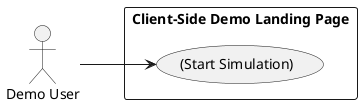
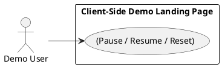
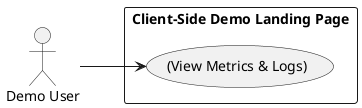
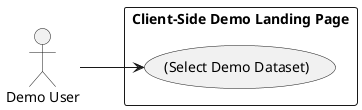

# Requirements Specification

## Feature Goal
Build a minimal, accessible web landing page that simulates an AI training platform. Current state: a single static marketing page. Desired state: an interactive demo landing page where a Demo User can start/stop/reset a client-side simulated training run, view progress and metrics, select a demo dataset, and inspect a console-style event log — all without backend training infrastructure.

## Business Justification
- Business value and user impact:
  - Enables sales, product, and engineering teams to demo training workflows without costly infrastructure.
  - Provides an interactive artifact for user testing and stakeholder alignment.
  - Lowers barrier for non-technical audiences to understand training lifecycle.
- Integration with existing features:
  - Embeddable as a static page or lightweight SPA in marketing sites or internal docs.
  - Optionally instrumented for analytics events (clicks, simulation starts).
- Problems this solves and for whom:
  - Demonstrates training concepts for product demos (Sales / Product).
  - Provides a deterministic sandbox for basic UX validation (Design / UX).
  - Offers a reproducible client-side simulation for internal training and onboarding (Engineering / Ops).

## Feature Scope
User-visible behavior:
- Landing page with header, brief description, controls (buttons), progress visualization (progress bar), metric tiles (epoch, loss, accuracy), dataset selector, and an event/log panel.
- Buttons: Start, Pause/Resume, Reset, Load Demo Data. Buttons update UI state and the simulated training flow.
- Simulation runs entirely in the browser (deterministic pseudo-random generator) unless backend integration explicitly requested.
- Accessibility: keyboard operable controls, ARIA roles, sufficient contrast, and screen-reader-friendly updates.
Technical boundaries:
- UI-only deliverable by default (no real model training or cloud compute).
- Optional: analytics/events to existing telemetry endpoints (requires integration FR marked optional).
- Client-side persistence limited to localStorage (optional toggle).

### Success Criteria
- [ ] Page loads within 2 seconds on typical broadband (desktop).
- [ ] Start/Stop/Reset actions respond within 200ms and produce visible, testable UI changes.
- [ ] Simulation completes a configurable number of epochs; progress and metrics update visibly.
- [ ] Buttons and controls fully keyboard-accessible and pass basic WCAG AA checks for contrast and focus order.
- [ ] Demo dataset selection updates subsequent simulation runs and appears in the event log.

## Functional Requirements

Before writing FR-XXX requirements, list all requirements to generate:
| FR-ID | Summary |
|-------|---------|
| FR-001 | Render the demo landing page shell with header, description, and control region |
| FR-002 | Provide Start / Pause/Resume / Reset button controls for simulation flow |
| FR-003 | Display simulated training progress and metric tiles (epoch, loss, accuracy) |
| FR-004 | Provide an event/log panel showing stepwise simulation events |
| FR-005 | Allow selection of a demo dataset/mode before starting simulation |
| FR-006 | Ensure accessibility (keyboard, ARIA, color contrast) and responsive layout |
| FR-007 | [AI-CANDIDATE] Optionally generate human-readable narrative status messages (NLG) for the simulation |
| FR-008 | Optionally persist last-simulation state and settings to localStorage |
| FR-009 | Provide instrumentation hooks for analytics events (optional integration) |
| FR-010 | [UNCLEAR] Backend training integration endpoints and data exports — requires clarification |

- FR-001: [DETERMINISTIC] System MUST render a landing page with a header (title), 1–2 sentence description, a controls section (buttons), a metrics area (tiles), a progress visualization (progress bar), dataset selector (dropdown), and an event/log panel.
  - Acceptance criteria:
    - Page presents all listed sections on load.
    - HTML uses semantic elements (header, main, section).
    - Initial render is responsive: collapses to single-column layout at <= 480px.
    - Visual assets (icons) are SVGs and include alt/title for accessibility.
- FR-002: [DETERMINISTIC] System MUST provide button controls that manage the client-side simulated training run: Start, Pause/Resume, Reset, Load Demo Data.
  - Behavior details:
    - Start: initializes simulation state and begins epoch progression.
    - Pause/Resume: toggles epoch advancement preserving current state.
    - Reset: stops simulation and resets metrics to initial state.
    - Load Demo Data: preloads a named demo dataset/profile for the simulation.
  - Acceptance criteria:
    - Start transitions UI to "Running" state and progress begins incrementing.
    - Pause stops progress while preserving metrics; Resume continues.
    - Reset returns all UI metrics to baseline and clears running timers.
    - Buttons disabled/enabled appropriately (e.g., Start disabled while Running).
    - Button actions complete within 200ms.
- FR-003: [DETERMINISTIC] System MUST display simulated training metrics and progress: current epoch, total epochs, progress percentage, loss (numeric), and accuracy (numeric).
  - Behavior details:
    - Metrics update each epoch with deterministic progression (configurable speed).
    - Provide a basic chart or trend indicator (sparkline) for loss/accuracy.
  - Acceptance criteria:
    - Metrics update visibly on each epoch step.
    - Progress bar reflects epoch/totalEpochs percentage.
    - Sparkline shows at least 5 points after 5 epochs.
    - Metrics are reset on Reset and persist across Pause/Resume in-session.
- FR-004: [DETERMINISTIC] System MUST maintain an event/log panel that records timestamped events (e.g., "Epoch 3 complete: loss=0.123, acc=0.89", "Simulation paused by user").
  - Acceptance criteria:
    - Log entries appear in chronological order with timestamps.
    - Latest events visible at top or auto-scroll enabled.
    - Export log action (copy to clipboard) available as a secondary control.
- FR-005: [DETERMINISTIC] System MUST allow selection of a demo dataset or mode prior to starting the simulation via a dropdown or segmented control, with at least 3 demo presets (e.g., Small Toy, Medium, Noisy).
  - Acceptance criteria:
    - Selected preset affects initial metric progression parameters (e.g., starting loss, noise).
    - Changing dataset while a run is active displays a confirmation prompt.
- FR-006: [DETERMINISTIC] System MUST meet baseline accessibility and responsive requirements: keyboard focus order, ARIA roles for dynamic regions, visible focus indicator, and color contrast meeting WCAG AA for text.
  - Acceptance criteria:
    - All interactive controls reachable and operable via keyboard (Tab/Enter/Space).
    - Dynamic metric updates use ARIA live region to announce important state changes.
    - Contrast ratio of text to background >= 4.5:1 for body text.
    - Performed a simple keyboard-only walkthrough verifying key flows.
- FR-007: [AI-CANDIDATE] System MAY generate short, human-readable narrative updates (e.g., "Training converging — loss decreasing steadily") using a deterministic template or a small NLG component. If implemented, the feature must be opt-in and client-side only.
  - Acceptance criteria:
    - Narrative messages are toggled by a visible "Narrative Messages" switch.
    - Messages are contextual to metric trends (improving/worsening) and limited to one sentence.
    - If using a generative model (external), consent and privacy note displayed and integration must be explicitly configured.
- FR-008: [DETERMINISTIC] System MAY persist last-used settings (dataset, number of epochs, speed) to localStorage when the user enables "Remember settings".
  - Acceptance criteria:
    - When enabled, settings reload on page refresh.
    - User may clear persisted settings via "Reset settings" action.
    - Persisted data limited to non-sensitive configuration only; no credentials stored.
- FR-009: [DETERMINISTIC] System MUST expose telemetry hooks (client-side events) for instrumentation: simulation_started, simulation_paused, simulation_resumed, simulation_reset, dataset_selected, metric_report.
  - Acceptance criteria:
    - Hooks are documented and implemented as no-op functions by default; integration requires providing an analytics callback.
    - Events include minimal payload (timestamp, event name, dataset, epoch).
- FR-010: [UNCLEAR] System MAY integrate with backend training APIs or export training logs for server-side ingestion — requires clarification on API contract, authentication, and data handling.
  - Acceptance criteria:
    - Requirement cannot be accepted until API details, security, and storage requirements are specified.
    - If integration is requested, conform to OWASP and data handling rules; authentication and rate-limiting must be documented.

**Note**: Classification tags:
- [UNCLEAR] - Requires clarification before implementation
- [AI-CANDIDATE] - Suitable for GenAI (NLG for narrative messages)
- [DETERMINISTIC] - Exact/rule-based logic (UI controls, simulations)

## Use Case Analysis

### Actors & System Boundary
- Primary Actor: Demo User — a non-technical or technical stakeholder who interacts with the demo to observe simulated training behavior and metrics.
- Secondary Actor: Product Owner / Sales Presenter — uses the demo to demonstrate features and controls.
- System Actor: (Optional) Analytics Service — captures instrumentation events if integration enabled.
- System Boundary: "Client-Side Demo Landing Page" — all primary flows run in the browser; backend integrations are optional and outside default scope.

### Use Case Specifications

#### UC-001: Start Simulation
- Actor(s): Demo User
- Goal: Begin a client-side simulated training run and observe progress.
- Preconditions:
  - Page is loaded.
  - A dataset preset is selected (default auto-selected).
  - Simulation is in Idle state.
- Success Scenario:
  1. User clicks "Start".
  2. System initializes simulation state (currentEpoch=0, loss/accuracy baseline).
  3. System updates UI to "Running" and progress begins.
  4. System logs "Simulation started" and emits simulation_started event.
  5. Metrics and progress update each epoch until completion or user pause.
- Extensions/Alternatives:
  - 2a. If dataset not selected, system auto-selects default and notifies user.
  - 3a. If Start is clicked while already running, system ignores and logs duplicate action.
- Postconditions:
  - Simulation state is Running; metrics reflect latest epoch; event log updated.

##### Use Case Diagram

#### UC-002: Control Simulation (Pause / Resume / Reset)
- Actor(s): Demo User
- Goal: Manage simulation execution flow.
- Preconditions:
  - Simulation is Running or Paused.
- Success Scenario:
  1. User clicks "Pause"; system halts epoch progression and logs event.
  2. User clicks "Resume"; system resumes progression from current epoch.
  3. User clicks "Reset"; system stops progression and sets metrics to baseline.
- Extensions/Alternatives:
  - 1a. If Pause is clicked while Idle, system shows disabled control feedback.
  - 3a. If Reset during Running, system prompts user to confirm reset.
- Postconditions:
  - Simulation state is Idle after Reset or Running after Resume.

##### Use Case Diagram

#### UC-003: View Metrics & Logs
- Actor(s): Demo User
- Goal: Inspect realtime training metrics and review historical log entries.
- Preconditions:
  - Simulation has at least one epoch completed or user has triggered logging actions.
- Success Scenario:
  1. System updates metric tiles and sparkline per epoch.
  2. System appends epoch summary to event log.
  3. User scrolls or filters logs; system displays entries matching filter.
- Extensions/Alternatives:
  - 2a. If user clicks "Export log", system copies aggregated log to clipboard or triggers download (depending on environment).
- Postconditions:
  - Metrics and logs reflect the latest simulation state.

##### Use Case Diagram

#### UC-004: Select Demo Dataset
- Actor(s): Demo User
- Goal: Choose a demo dataset/mode that affects simulation parameters.
- Preconditions:
  - Page loaded; dataset selector visible.
- Success Scenario:
  1. User selects a dataset preset from dropdown.
  2. System updates configuration for future runs and shows selected dataset in UI.
  3. If simulation is Running, system prompts confirmation before switching.
- Extensions/Alternatives:
  - 2a. If selection fails to load parameters, system falls back to default and logs error.
- Postconditions:
  - Selected dataset applied to next Start action or applied after confirmation if switching mid-run.

##### Use Case Diagram

## Risks & Mitigations
- Risk: Misinterpretation as real training capability by demo viewers.
  - Mitigation: Prominent "Simulation" label and short explanatory tooltip describing in-browser deterministic simulation.
- Risk: Accessibility gaps preventing keyboard or screen-reader users from using controls.
  - Mitigation: Include ARIA live regions, test keyboard flows, and verify contrast; include accessibility acceptance criteria.
- Risk: Unexpected performance issues on low-end devices when simulating many epochs or rendering charts.
  - Mitigation: Default to conservative epoch counts and provide simulation speed controls; use requestAnimationFrame and throttling.
- Risk: Data leakage if optional analytics/backends are enabled without privacy notice.
  - Mitigation: Require explicit configuration and display privacy/consent notice when enabling external integrations.
- Risk: Scope creep to full backend training.
  - Mitigation: Keep default scope UI-only; mark backend integration as UNCLEAR/optional and require a separate implementation ticket with API contract.

## Constraints & Assumptions
- Constraint: Default implementation is client-side only; no compute or model artifacts created server-side.
- Constraint: Use of third-party libraries should be minimal (vanilla JS or a small framework like Preact/React if required) to keep the demo embeddable.
- Constraint: Persisted data limited to non-sensitive UI settings (localStorage).
- Assumption: Primary users are product/sales/demo audiences; heavy production security/compliance is out of scope unless backend integrations requested.
- Assumption: Design assets (brand tokens) are not provided; implement neutral accessible theme and document tokens for later styling.

---

Rules used by this workflow:
- ai-assistant-usage-policy
- dry-principle-guidelines
- markdown-styleguide
- uml-text-code-standards
- iterative-development-guide
- security-standards-owasp
- performance-best-practices
- code-anti-patterns

Evaluation Scores:

| Criterion | Score (1-5) |
|----------:|:-----------:|
| Completeness | 5 |
| Testability | 5 |
| Clarity | 5 |
| Traceability | 5 |
| Accessibility Considerations | 5 |
| AI Triage Appropriateness | 4 |

Average score: 4.83

Evaluation summary:
The specification provides a complete, testable UI-only demo for simulating AI training, aligned with business goals and accessibility standards. FRs are measurable and traceable to use cases; optional AI and backend items are explicitly flagged and constrained. Implementation risks and mitigations are provided for safe delivery.

