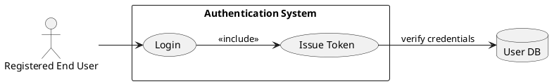
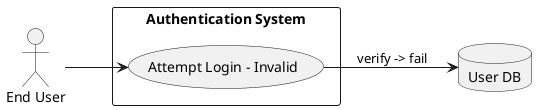
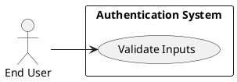
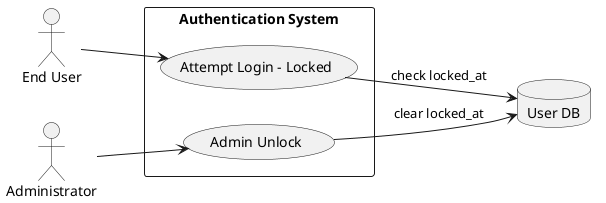
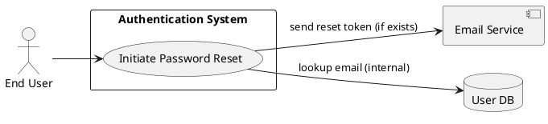
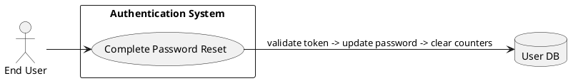
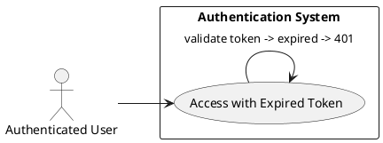
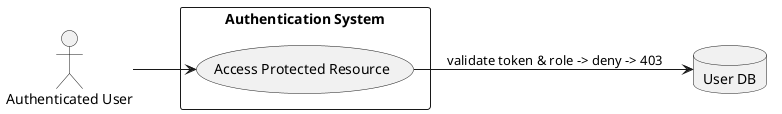
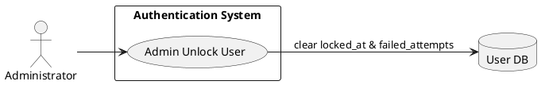

# Requirements Specification

## Executive Summary
The Authentication & Login feature SHALL provide secure, auditable, and role-aware user access to the application. The system SHALL authenticate users by email and password, issue short-lived authentication tokens, enforce role-based routing and authorization, protect accounts from brute-force attacks with configurable lockout and rate-limiting, and provide a secure password-reset flow. The implementation SHALL follow OWASP best practices, use strong password hashing, and be observable for security and operational incidents.

## Feature Goal
Enable registered users to securely log in and access role-appropriate application areas with reliable authentication, deterministic authorization, and robust account recovery while preventing credential abuse.

## Business Justification
- Reduce unauthorized access and account compromise risk by enforcing proven cryptographic and access-control standards.
- Improve user experience and operational cost by delivering reliable login and recovery flows and clear, non-enumerating error messages.
- Support compliance (e.g., GDPR, OWASP) through secure storage, masked logging, and audit trails.
- Integration: This feature SHALL integrate with existing user store, email delivery service, secrets vault, and centralized logging/monitoring.

## Goals and Objectives
- Objective (P0): Securely authenticate registered users and issue role-bearing tokens. Measured by authentication success rate and token correctness.
- Objective (P0): Enforce role-based access and redirect users to role-specific dashboards. Measured by correct redirects and 403 enforcement on protected endpoints.
- Objective (P1): Prevent brute-force attacks via lockout and rate-limiting. Measured by lockout correctness and throttling behavior under test.
- Objective (P1): Ensure tokens expire predictably (default 30 minutes, configurable). Measured by token acceptance before expiry and rejection after.
- Objective (P2): Provide clear validation and recovery UX (forgot/reset flows). Measured by correct reset token lifecycle and password update behavior.

## Target Users
- End User (Customer/Employee): Uses UI to log in and access role-based dashboards.
- Administrator: Views/unlocks accounts, configures thresholds, and reviews audit logs (if admin tooling enabled).
- System Integrations: Email Provider (outbound reset emails), Secrets Vault (key storage), Central Logging/Monitoring.

## Feature Scope
In-Scope:
- Email & password login flow (client + server validation)
- Password hashing with modern adaptive algorithm and migration support
- Token issuance (signed JWT or similar) with claims including user id and roles
- Role-based redirect and authorization enforcement
- Failed-attempt tracking and account lockout after threshold (default 5)
- Password reset initiation (email with single-use token) and completion
- Logging of auth events (success/failure/lockout/reset) with PII masked
- Rate-limiting per IP and per account
Out-of-Scope:
- Social/OAuth/SSO federation (separate deliverable)
- MFA (Multi-Factor Authentication) — can be added later as enhancement
- Full admin UI design (API endpoints for admin actions included; UI separate)

### Success Criteria
- [ ] 99% of valid login attempts succeed and receive tokens within auth SLA (median auth latency <= 300ms)
- [ ] Invalid credentials return generic error; no user enumeration observable
- [ ] Account locked after 5 failed attempts and lockout events are logged
- [ ] Tokens issued contain user ID and role claims and are rejected after configured expiry (default 30 minutes)
- [ ] Password reset tokens are single-use, expire within 1 hour, and reset clears failed attempts and invalidates sessions
- [ ] All auth endpoints operate over TLS only and secrets stored in vault
- [ ] Audit logs for auth events available and searchable in central logging

## Functional Requirements
- FR-001: [DETERMINISTIC] System MUST authenticate users by email and password and, on success, return a signed authentication token that includes the user ID and role claims.  
  - Acceptance criteria:
    - Given valid email & password, when POST /auth/login is called, then response MUST be 200 and contain a signed token and expiry timestamp.  
    - Token MUST include claims: sub (user id), roles (array), iat, exp.  
    - Given invalid credentials, when POST /auth/login is called, then response MUST be 401 with generic message "Invalid credentials".
- FR-002: [DETERMINISTIC] System MUST store user passwords using a modern adaptive hashing algorithm (Argon2id or bcrypt) with per-user salt and documented parameters; plaintext storage is prohibited.  
  - Acceptance criteria:
    - Password column in user store MUST NOT contain plaintext.  
    - System documentation MUST list algorithm and parameters (e.g., Argon2id time/cost/memory) used in production.  
    - Automated tests MUST verify that stored password values cannot be directly used as credentials without proper hashing verification.
- FR-003: [DETERMINISTIC] System MUST validate login inputs client- and server-side: email format and non-empty password field. Validation failures MUST return 400 with field-level error codes/messages.  
  - Acceptance criteria:
    - Missing email or password => 400 and JSON body lists field errors (e.g., {"email":"required"}).  
    - Malformed email => 400 and JSON body {"email":"invalid_format"}.
- FR-004: [DETERMINISTIC] System MUST track consecutive failed login attempts per account and MUST lock the account after 5 consecutive failed attempts (configurable). Locked accounts MUST reject login attempts with 423 or 403 and message "Account is locked".  
  - Acceptance criteria:
    - After 5 failed attempts for a user, user record MUST have locked_at timestamp and failed_count >= 5.  
    - Subsequent login attempts while locked MUST return 423 (Locked) with non-enumerating message.  
    - Successful password reset or admin unlock MUST clear failed_count and locked_at.
- FR-005: [DETERMINISTIC] System MUST issue time-limited tokens with default expiry 30 minutes (configurable). Expired tokens MUST be rejected with 401 and message "Session expired".  
  - Acceptance criteria:
    - Token verification before exp => accepted; after exp => rejected with 401.  
    - System clock skew tolerance MUST be documented (e.g., ±120s).  
    - Config MUST allow changing default expiry and tests MUST cover non-default values.
- FR-006: [DETERMINISTIC] System MUST redirect authenticated users to role-specific dashboards and enforce role-based authorization on protected endpoints.  
  - Acceptance criteria:
    - Login for user with role "admin" => redirect/response indicates admin dashboard URI; role "user" => user dashboard.  
    - Access to endpoints requiring higher privilege MUST return 403 and not reveal resource existence.  
    - Automated tests MUST assert role claim enforcement on sample endpoints.
- FR-007: [DETERMINISTIC] System MUST implement a secure forgot-password flow: initiation endpoint issues a single-use, cryptographically random reset token (expiry default 1 hour) delivered through configured email provider; reset endpoint MUST validate token, allow setting a new password (subject to password policy), and invalidate existing sessions.  
  - Acceptance criteria:
    - When POST /auth/forgot with registered email, system MUST enqueue email with reset link containing token, and return 200 (no user enumeration).  
    - Token stored hashed server-side (or stored with HMAC) and expires after configured TTL; reuse MUST be prevented.  
    - After successful reset, password hash MUST be updated, failed_count and locked_at cleared, and existing sessions/tokens revoked.
- FR-008: [DETERMINISTIC] System MUST log authentication events: login success/failure, lockout events, password reset requested/completed, with timestamp and user ID; PII MUST be masked in logs.  
  - Acceptance criteria:
    - Events MUST be emitted to centralized logging with fields: event_type, user_id (or null), ip, timestamp, outcome.  
    - No logs contain plaintext password or full email if policy requires masking; tests MUST verify masking.
- FR-009: [DETERMINISTIC] All authentication-related endpoints and token exchanges MUST require TLS; secrets and token signing keys MUST be stored in an access-controlled secrets vault.  
  - Acceptance criteria:
    - Production environment MUST not serve auth endpoints over HTTP (automated check).  
    - Token signing keys and email provider credentials MUST reside in vault; no secrets in source/config files.
- FR-010: [DETERMINISTIC] System MUST implement rate-limiting per-IP and per-account to mitigate brute-force, with configurable limits and exponential backoff or progressive delays on repeated failures.  
  - Acceptance criteria:
    - Under simulated attack (high request rate), requests from same IP/account exceeding threshold MUST receive 429 with Retry-After header.  
    - Tests MUST demonstrate per-account vs per-IP limits behaving independently and combined to prevent abuse.

Note: All functional requirements above SHALL include corresponding API contracts, error codes, and sample responses in the engineering ticket.

## Non-Functional Requirements (NFR-XXX)
- NFR-001: [DETERMINISTIC] Performance: Authentication median latency SHALL be <= 300ms under normal load (defined as 95th percentile of expected baseline traffic).  
  - Acceptance criteria: Performance tests show median <= 300ms and p95 <= 800ms under baseline load.
- NFR-002: [DETERMINISTIC] Availability: Auth service SHALL be highly available with SLA >= 99.9% (configurable in infra).  
  - Acceptance criteria: Health checks and failover demonstrated in staging; documentation of vertical/horizontal scaling.
- NFR-003: [DETERMINISTIC] Scalability: System SHALL scale horizontally; token verification logic SHALL be stateless or use shared session store for revocation.  
  - Acceptance criteria: Load tests demonstrate horizontal scaling with no auth-state correctness regressions.
- NFR-004: [DETERMINISTIC] Security: System SHALL comply with OWASP Top 10 mitigations for auth endpoints and use secure defaults (TLS1.2+, strong hashing, no sensitive logging).  
  - Acceptance criteria: Security scan results (SAST/DAST) report zero critical auth issues; documented mitigations for issues found.
- NFR-005: [DETERMINISTIC] Observability: Metrics and logs SHALL capture auth success/failure, lockouts, reset events, and error rates; alerts SHALL be configured for anomalous spikes.  
  - Acceptance criteria: Dashboards with metrics exist and alerts fire under simulated spike conditions.
- NFR-006: [DETERMINISTIC] Privacy & Compliance: PII SHALL be treated according to policy (e.g., masked in logs) and retention policies for audit logs SHALL be documented.  
  - Acceptance criteria: Audit/log retention documented and PII masking tests pass.
- NFR-007: [DETERMINISTIC] Localization & Accessibility: Login and reset UI SHALL support localization and meet WCAG 2.1 AA for forms.  
  - Acceptance criteria: Accessibility audit passes core WCAG checks for login/reset pages; localization keys exist for texts.

## Use Case Analysis

### Actors & System Boundary
- Primary Actor: Registered End User — a person with an account who attempts to authenticate and access role-based areas.
- Secondary Actor: Administrator — authorized operator who can unlock accounts and view audit logs.
- System Actor: Email Service — third-party system used to deliver reset tokens.
- System Actor: User Database — persistent store for user records and hashed passwords.
- System Boundary: "Authentication System" — handles all auth/credential operations, token issuance, lockout logic, and interfaces to email and logging.

### Use Case Specifications

#### UC-001: Login Success
- Actor(s): Registered End User
- Goal: Authenticate and receive an auth token and be redirected to role dashboard.
- Preconditions: User is registered and has a valid email and password.
- Success Scenario:
  1. User submits email and password to POST /auth/login.
  2. System validates inputs (format, non-empty).
  3. System verifies credentials against user DB (hash compare).
  4. System resets failed_attempts counter on success.
  5. System issues signed token with user id and roles and returns 200.
  6. UI redirects user to role-specific dashboard.
- Extensions/Alternatives:
  - 3a. If password mismatches: increment failed_attempts, return generic 401.
  - 4a. If failed_attempts reaches threshold, set locked_at and return 423.
- Postconditions: User has active token; last_login updated; audit log entry created.
- Acceptance Criteria:
  - Valid credentials => 200 + token; token contains required claims; dashboard redirect determined by role.

Use Case Diagram

#### UC-002: Login Invalid Credentials
- Actor(s): End User
- Goal: System returns generic invalid credentials message and increments failed counter.
- Preconditions: User exists or not; provided credentials are incorrect.
- Success Scenario:
  1. User submits invalid credentials to POST /auth/login.
  2. System validates inputs.
  3. System runs credential verification; mismatch found.
  4. System increments failed_attempts and logs failure.
  5. System returns 401 with generic message "Invalid credentials".
- Extensions:
  - 4a. If failed_attempts reaches threshold => lock account and return 423.
- Postconditions: failed_attempts updated; audit log entry created.
- Acceptance Criteria:
  - Invalid credentials => 401; failed_attempts incremented; no user enumeration in response.

Use Case Diagram

#### UC-003: Empty Fields Validation
- Actor(s): End User
- Goal: Provide immediate, field-level validation for missing/invalid inputs.
- Preconditions: None.
- Success Scenario:
  1. User submits empty or malformed form.
  2. Client-side validation triggers (if present) and prevents submission OR server returns 400 with field errors.
  3. UI displays field-specific messages (e.g., "Email is required").
- Extensions:
  - 2a. If client-side disabled, server-side returns 400 with same structured errors.
- Postconditions: No authentication attempt executed.
- Acceptance Criteria:
  - Missing fields => 400 and JSON with field error entries; client-side prevents round-trip when available.

Use Case Diagram

#### UC-004: Account Locked after Failed Attempts
- Actor(s): End User, System
- Goal: Prevent further authentication attempts and notify user when account is locked.
- Preconditions: failed_attempts >= threshold (default 5).
- Success Scenario:
  1. User attempts login while locked.
  2. System checks locked_at and rejects attempt with 423 and "Account is locked" message.
  3. System logs lockout event.
- Extensions:
  - 2a. Admin may unlock via admin API; or user may use forgot-password to reset and auto-unlock.
- Postconditions: Account remains locked until unlock action or configured timeout.
- Acceptance Criteria:
  - Locked account attempts => 423 and audit log entry for lockout; admin unlock clears locked_at.

Use Case Diagram

#### UC-005: Forgot Password Initiation
- Actor(s): End User
- Goal: Send a password reset token to the user's email without revealing whether the account exists.
- Preconditions: End User has access to the email address (if registered).
- Success Scenario:
  1. User submits email to POST /auth/forgot.
  2. System accepts request and always returns 200 (no enumeration).
  3. If email registered, system generates single-use reset token (random, unguessable), stores token (hashed or HMAC), and enqueues email to Email Service with reset link.
  4. System logs password reset request (without plaintext email in logs per policy).
- Extensions:
  - 3a. If email provider fails, system logs failure and retries per configured retry policy.
- Postconditions: Reset token created and sent (if user exists).
- Acceptance Criteria:
  - Endpoint returns 200 for both registered and unregistered emails; registered email receives single-use token via email; token stored securely and expires (default 1 hour).

Use Case Diagram

#### UC-006: Password Reset Completion
- Actor(s): End User
- Goal: Set a new password using a valid reset token; invalidate old sessions and clear lockouts.
- Preconditions: User has valid, unexpired reset token.
- Success Scenario:
  1. User submits new password and token to POST /auth/reset.
  2. System validates token, validates password strength, updates password hash, clears failed_attempts and locked_at, revokes active sessions/tokens.
  3. System logs password reset completion event.
  4. System returns 200 and may prompt user to log in.
- Extensions:
  - 2a. If token invalid/expired => return 400 with generic message "Invalid or expired token".
- Postconditions: New password in effect; previous tokens invalidated as per revocation policy.
- Acceptance Criteria:
  - Valid token + new password => 200; password hash updated; failed counters cleared; sessions invalidated.

Use Case Diagram

#### UC-007: Token Expiry / Session Expired
- Actor(s): Authenticated User
- Goal: Notify user and require re-authentication when token expires.
- Preconditions: User had a token that is now expired.
- Success Scenario:
  1. User requests protected resource with expired token.
  2. System validates token and determines it is expired.
  3. System returns 401 with message "Session expired" and optional refresh instructions.
  4. UI presents re-login flow.
- Extensions:
  - 3a. If refresh-token flow implemented later, follow refresh logic (out of scope for initial release unless configured).
- Postconditions: User must re-authenticate to obtain new token.
- Acceptance Criteria:
  - Expired token => 401; proper message; no access to protected resource.

Use Case Diagram

#### UC-008: Role-based Access Denied
- Actor(s): Authenticated User
- Goal: Deny access to resources outside user's role without leaking information.
- Preconditions: User authenticated with role claim not permitting the requested resource.
- Success Scenario:
  1. User requests a protected endpoint.
  2. System validates token and role claims.
  3. System determines insufficient privileges and returns 403 with generic message.
  4. System logs authorization failure event.
- Extensions:
  - 3a. If resource does not exist, system returns same generic 403/404 policy that prevents enumeration.
- Postconditions: Access denied; logs contain event for auditing.
- Acceptance Criteria:
  - Unauthorized role access => 403; no sensitive information in response.

Use Case Diagram

#### UC-009: Admin Unlock Account
- Actor(s): Administrator
- Goal: Admin unlocks a locked user account via admin API; action is audited.
- Preconditions: Admin is authenticated and authorized to perform unlocks.
- Success Scenario:
  1. Admin calls POST /admin/users/{id}/unlock.
  2. System validates admin authorization.
  3. System clears locked_at and failed_attempts for target user and logs the event.
  4. System returns 200.
- Extensions:
  - 2a. If admin lacks privilege => 403.
- Postconditions: User account unlocked; audit log created.
- Acceptance Criteria:
  - Authorized admin => 200 and user record updated; event logged with admin id.

Use Case Diagram

## Risks & Mitigations
- Risk: Legacy password hashes incompatible with new algorithm (migration required).  
  - Mitigation: Implement migration-on-login: verify legacy hash then re-hash with new algorithm and mark migrated.
- Risk: Account lockout used as DoS vector against users.  
  - Mitigation: Combine per-account lockout with per-IP throttling, progressive delays, CAPTCHA for suspicious flows, admin override, and monitoring to detect abuse.
- Risk: Reset tokens leaked via email or logs.  
  - Mitigation: Store only hashed reset tokens server-side; send token in single-use, short-lived link; do not log tokens; monitor email delivery success and bounces.
- Risk: Token theft leading to session hijack.  
  - Mitigation: Use short token lifetime, optional refresh token rotation (post-launch), secure cookies (HttpOnly, Secure, SameSite), TLS-only transport, session revocation support.
- Risk: Email deliverability failure causing poor recovery UX.  
  - Mitigation: Monitor/email provider SLAs, expose retry queue metrics, provide alternative support path (helpdesk) in UI.

## Constraints & Assumptions
- Constraint: Existing user DB may contain legacy password hashes; migration strategy REQUIRED.
- Constraint: Email delivery depends on third-party provider; deliverability is outside direct control.
- Constraint: Secrets management (keys, credentials) must be available in central vault before production deployment.
- Assumption: UI teams shall implement client-side validation and dashboard routing using server-provided role claims.
- Assumption: Clock skew across services will be within ±120 seconds or handled via NTP; token expiry tolerances documented.

## Data Model Notes (summary)
- User:
  - id (UUID), email (unique), password_hash, password_hash_algo, salt (if stored separately), roles (array), failed_attempts (int), locked_at (timestamp nullable), last_login (timestamp), reset_token_hash (nullable), reset_token_expiry (nullable)
- Session/Token store (optional):
  - token_id, user_id, issued_at, expires_at, revoked (bool)

## Operational Runbook (summary)
- Unlock account: Admin API /admin/users/{id}/unlock — logs event; clear failed_attempts and locked_at.
- Respond to brute-force spikes: Identify source IPs, apply WAF rules/block, increase thresholds temporarily, notify security on abnormal rise.
- Revoke sessions: Revoke tokens by token_id or rotate signing key (with revocation rollout strategy).
- Emergency key rotation: Steps to rotate signing keys in vault and deploy updated key versions with minimal disruption.

## QA & Acceptance Testing Checklist
- Authentication correctness tests (valid/invalid credentials)
- Password hashing and migration tests
- Lockout threshold and unlock behavior
- Reset token lifecycle tests (single-use, expiry, email dispatch)
- Token expiry and protected endpoint rejection
- Role-based access tests for sample endpoints
- Rate-limiting and per-IP/per-account throttling tests
- Security scans (SAST/DAST) and masking verification in logs
- Performance tests (latency p50/p95) and load tests for scaling

## Appendix — Sample API Contracts (summaries)
- POST /auth/login
  - Request: { "email": "...", "password": "..." }
  - Success: 200 { "token": "...", "expires_at": "ISO8601" }
  - Failure: 401 { "error":"Invalid credentials" } or 423 { "error":"Account is locked" }
- POST /auth/forgot
  - Request: { "email": "..." }
  - Success: 200 { "status":"If the email exists, reset instructions will be sent." }
- POST /auth/reset
  - Request: { "token":"...", "new_password":"..." }
  - Success: 200 { "status":"Password updated" }
  - Failure: 400 { "error":"Invalid or expired token" }
- POST /admin/users/{id}/unlock
  - Auth: Admin token required
  - Success: 200 { "status":"User unlocked" }

Previous Analysis and Reasoning:
1) Priority: Implement authentication core and role-based access first (FR-001, FR-006), then security hardening (FR-002, FR-004, FR-005, FR-010), then UX/recovery (FR-003, FR-007), audit/ops (FR-008).
2) Key integration dependencies: Email service, secrets vault, centralized logging, user DB, optional WAF.
3) Decisions required before implementation: choice of token type and transport (JWT in Authorization header vs secure cookie). Recommendation: use signed JWTs for API-first apps; prefer HttpOnly Secure SameSite cookies for browser-first flows when CSRF protections are in place. Confirm preferred pattern before dev begins.
4) Legacy migration: support verify-and-rehash strategy for users with legacy hashes.

— End of Requirements Specification —