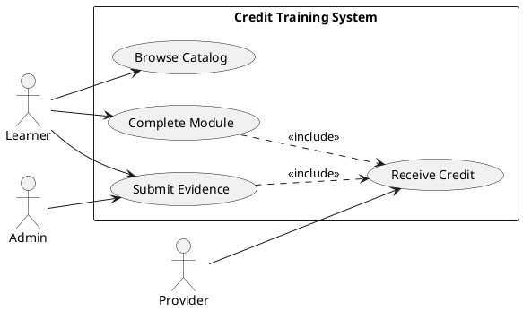
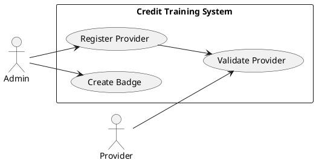
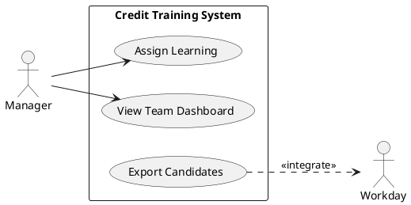
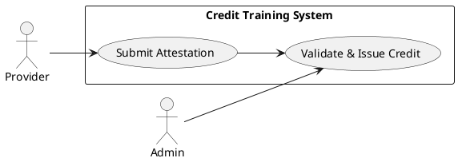
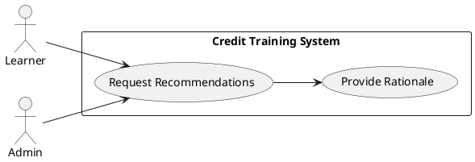

# Requirements Specification

## Feature Goal
Build a web-based, credit-based training system to upskill organization resources in AI. Current state: no centralized, auditable credit ledger, inconsistent recognition workflows, and fragmented UX. Desired end state: employees MUST be able to discover learning, complete verified learning activities, earn verifiable credits and badges, view ranking and leaderboards, request certification recognition from approved providers, and surface credits into recognition/career workflows while integrations (Org SSO, Workday, future LMS) maintain data integrity and auditability.

## Business Justification
- Business value and user impact
  - Enables measurable, auditable upskilling tied to career outcomes and internal mobility.
  - Drives adoption of AI skills by making progress visible (credits, badges, leaderboards) and recognized by leadership.
  - Reduces administrative friction for managers and HR by centralizing evidence and exportable records for promotion/recognition decisions.
- Integration with existing features
  - Integrates with Org SSO (SAML/OIDC), Workday (HR system of record) for user/role sync and events, and exposes APIs/webhooks for future LMS integration (xAPI/LRS, SCORM adapters).
- Problems this solves and for whom
  - Solves lack of verifiable learning records for employees, benefiting learners, managers, HR, and certification providers.
  - Solves inconsistent recognition processes by providing auditable evidence and manager-facing dashboards.

## Feature Scope
User-visible behavior:
- Authenticated web app (Org SSO) where learners can browse learning modules, enroll, complete activities, upload evidence, and view credits/badges and leaderboards.
- Admin console for configuring credits, badge definitions, approved certification providers, and recognition workflows.
- Manager dashboards to assign learning, view team progress, and nominate recognition candidates.
- Provider integration surface for approved service providers to submit attestation of completion/awards.
- Certification application workflow allowing learners to apply for credit recognition from approved providers, with admin/provider approval steps.

Technical requirements:
- Append-only credit ledger with immutable audit trails, cryptographic signing of provider attestations recommended.
- RESTful and webhook API surface for integrations (Workday sync, LMS adapters, provider APIs).
- Web UX aligned to modular learning cards, progress trackers, and accessible responsive layouts (WCAG 2.1 AA).
- Data protection: encryption in transit and at rest, RBAC, data retention policy, and audit export capabilities.
- SSO via SAML 2.0 or OIDC; Workday integration via secure API/webhooks with configurable sync cadence.

### Success Criteria
- [ ] 80% of target pilot population completes at least one verified credit within 90 days of launch.
- [ ] Credit issuance and audit record available and exportable for 100% of issued credits.
- [ ] Leaderboard and badge views load within 500 ms median under normal load.
- [ ] Workday sync success rate ≥ 99% for user/role updates in daily scheduled runs.
- [ ] Provider-attested credit acceptance and auditability validated by integration test harness for at least two providers.

## Functional Requirements

Before expanding, list of requirements to generate:

| FR-ID | Summary |
|-------|---------|
| FR-001 | [DETERMINISTIC] Credit Ledger: record verifiable credits with audit trail |
| FR-002 | [DETERMINISTIC] Badge & Level Management mapped to credit thresholds |
| FR-003 | [DETERMINISTIC] Ranking & Leaderboard computation & display |
| FR-004 | [HYBRID] Personalized learning path recommendations (AI-assisted) |
| FR-005 | [DETERMINISTIC] Certification Application & Provider Attestation workflow |
| FR-006 | [DETERMINISTIC] Provider Registry & Approval workflow (admin) |
| FR-007 | [DETERMINISTIC] Org SSO Authentication (SAML/OIDC) |
| FR-008 | [DETERMINISTIC] Workday Integration (user/role sync, recognition events) |
| FR-009 | [DETERMINISTIC] Evidence Management (artifacts, signed attestations) |
| FR-010 | [DETERMINISTIC] API & Integration: REST, Webhooks, xAPI/LRS support |
| FR-011 | [DETERMINISTIC] Reporting & Dashboards for admins, managers, leaders |
| FR-012 | [AI-CANDIDATE] Content summarization / microlearning generation (optional) |
| FR-013 | [DETERMINISTIC] Audit & Compliance exports (append-only ledger + tamper evidence) |
| FR-014 | [DETERMINISTIC] RBAC & Manager Hierarchies for assignment/visibility |
| FR-015 | [HYBRID] Smart nudges and adaptive reminders (AI-assisted) |
| FR-016 | [DETERMINISTIC] UI/UX: responsive, accessible, search & filters similar to Learn UX |
| FR-017 | [UNCLEAR] Promotion/Recognition automation tied to credits (requires HR policy) |

Detailed Functional Requirements

- FR-001: [DETERMINISTIC] System MUST maintain an append-only Credit Ledger that records each credit issuance event with: credit_id, user_id, issuer_id, provider_id (nullable), credit_type, credit_value (numeric), evidence_reference (URL or artifact id), timestamp (UTC), transaction_hash (if used), and actor (system, provider, admin).
  - Acceptance Criteria:
    - GIVEN a successful credit issuance, WHEN recorded, THEN the ledger MUST contain an immutable record with all fields and a monotonically increasing sequence id.
    - GIVEN an attempt to mutate a past record, WHEN an API call is made, THEN the system MUST reject the mutation and log an integrity violation event.
    - Tests: automated integration test issues credit and verifies immutability via API (attempted update returns 405/403).

- FR-002: [DETERMINISTIC] System MUST allow admins to define Badges and Levels with associated credit thresholds, metadata (name, description, icon), and revocation rules.
  - Acceptance Criteria:
    - GIVEN a badge definition and credit thresholds, WHEN a user’s ledger meets threshold, THEN badge MUST be issued automatically and visible on user profile.
    - GIVEN badge revocation rule triggered (e.g., expired or revoked provider attestation), WHEN evaluated, THEN badge state updates to revoked and an audit entry created.

- FR-003: [DETERMINISTIC] System MUST compute rankings and leaderboards (global, team, cohort) based on configurable scoring rules (e.g., weighted credits).
  - Acceptance Criteria:
    - Leaderboard endpoints return top-N sorted by score, support paging, and have a cache TTL configurable.
    - Ranking recompute obeys scheduled and on-demand triggers; data freshness SLA default 5 minutes.

- FR-004: [HYBRID] System SHOULD provide personalized learning path recommendations using AI-assisted models that suggest modules based on role, completed credits, and career goals; suggestions MUST be presented with explainability and allow user acceptance/rejection.
  - Acceptance Criteria:
    - Recommendations endpoint returns a ranked list with rationale text and confidence score.
    - Users can accept, dismiss, or provide feedback; feedback stored to improve models.
    - Human-in-the-loop control: admin can disable recommendations at org or cohort level.

- FR-005: [DETERMINISTIC] System MUST provide a Certification Application workflow where learners submit an application for credit recognition from approved providers; the workflow includes submission of evidence, provider attestation (signed or API callback), admin/provider approval, and final issuance into the ledger.
  - Acceptance Criteria:
    - Submissions provide required fields and evidence attachments; status transitions tracked (Submitted → Under Review → Approved → Issued/Rejected).
    - Provider attestation via signed token or API webhook must validate cryptographic signature or known provider credentials.

- FR-006: [DETERMINISTIC] System MUST provide an Admin Provider Registry to manage approved certification providers with metadata, public keys (for signed attestations), allowed credit types, SLA expectations, and contact info.
  - Acceptance Criteria:
    - Admin UI/API to add/update providers; new provider entry requires verification step.
    - Only providers marked Approved can issue attested credits automatically.

- FR-007: [DETERMINISTIC] System MUST enable Org SSO via SAML 2.0 or OIDC with user provisioning from IdP (Just-in-time or SCIM) and mapping of enterprise attributes (employee_id, manager_id, department).
  - Acceptance Criteria:
    - Successful SSO login provision creates/updates user profile and maps manager relationships if available.
    - Fallback flow for non-SSO accounts documented for administrators.

- FR-008: [DETERMINISTIC] System MUST integrate with Workday to sync user and role data and to push recognition events (e.g., credit milestones, promotion nominations). Integration options include scheduled API sync and webhooks.
  - Acceptance Criteria:
    - Configurable sync cadence (real-time webhook / nightly batch); configurable field mappings.
    - Failure handling: retry policy and alerting for sync failures; reconciliation reports for mismatches.

- FR-009: [DETERMINISTIC] System MUST support Evidence Management: upload artifacts (pdf, image, transcript), link to external attestations, and store evidence metadata; evidence MUST be retained per data retention policy and presented in audit exports.
  - Acceptance Criteria:
    - Evidence uploads validated for permitted types and virus-scanned; links to provider-signed assertions stored.
    - Evidence access controlled by RBAC; all accesses logged.

- FR-010: [DETERMINISTIC] System MUST expose a documented API (REST/JSON) and Webhook endpoints to support integrations. It MUST support common learning standards (xAPI) or provide adapters.
  - Acceptance Criteria:
    - API documentation published (OpenAPI) and sandbox available; API keys/scopes for integrations.
    - Webhooks signed and retried with dead-letter queue.

- FR-011: [DETERMINISTIC] System MUST provide Reporting & Dashboards for admins and managers with metrics: credits issued, active learners, completion rates, leaderboard snapshots, and exportable CSV/PDF.
  - Acceptance Criteria:
    - Dashboard filters by org unit, time range, and credit type; exports preserve audit trail references.

- FR-012: [AI-CANDIDATE] System MAY provide content summarization and microlearning generation using GenAI to create short recaps or knowledge checks from longer content; outputs MUST be labeled as AI-generated and editable by subject matter experts.
  - Acceptance Criteria:
    - Generated summaries flagged; SME edit audit saved; quality metrics measured (acceptance rate).

- FR-013: [DETERMINISTIC] System MUST support Audit & Compliance exports: full ledger export (CSV/JSON), signed snapshots, and tamper-evidence indicators (hash chains) for compliance reviews.
  - Acceptance Criteria:
    - Admins can generate time-bounded exports with integrity hashes; exports must include full event metadata.

- FR-014: [DETERMINISTIC] System MUST implement RBAC with support for manager hierarchies, admin roles, provider roles, and read-only reporting roles.
  - Acceptance Criteria:
    - Role matrix defined; access enforcement tested for sensitive operations (issuance, revocation, export).

- FR-015: [HYBRID] System SHOULD support smart nudges (adaptive reminders) to learners using AI that prioritizes nudges based on progress and predicted risk of churn; nudges MUST support manual override and frequency caps.
  - Acceptance Criteria:
    - Nudges are logged, recipients can opt-out, and effectiveness metrics tracked.

- FR-016: [DETERMINISTIC] System MUST implement a responsive, accessible UI patterned after modular learning platforms (searchable learning cards, progress trackers, achievements) with WCAG 2.1 AA baseline.
  - Acceptance Criteria:
    - Keyboard navigation, contrast ratios, and screen reader labels pass automated accessibility tests.

- FR-017: [UNCLEAR] System SHOULD support automated promotion/recognition workflows triggered by credit milestones; details require HR policy mapping and legal sign-off before automation.
  - Acceptance Criteria:
    - Placeholder: System supports exportable candidate lists for HR review; automation gated until policy is provided.

## Use Case Analysis

### Actors & System Boundary
- Primary Actor: Learner — an employee who discovers, completes learning, and requests credit/certification recognition.
- Secondary Actor: Manager — assigns learning, views team progress, nominates recognition.
- Secondary Actor: Admin — configures badges, providers, approves provider registry and manages compliance exports.
- External Actor: Provider — approved certification/training vendor that attests to learner completion.
- External System: Workday — HR system of record for user/role data and promotion/recognition events.
- System Boundary: "Credit Training System" (web application + backend services + API surface)

### Use Case Specifications

#### UC-001: Learner: Complete Learning & Earn Credit
- Actor(s): Learner
- Goal: Obtain verifiable credit for completed learning activity
- Preconditions:
  - Learner is authenticated via Org SSO
  - Learning module exists and is eligible for credit
- Success Scenario:
  1. Learner enrolls in module from the catalog.
  2. Learner completes required tasks/quizzes/projects.
  3. System validates completion rules and generates credit issuance event (or requests provider attestation).
  4. Credit appears on Learner profile with evidence reference and badge if threshold met.
- Extensions/Alternatives:
  - 3a. If provider attestation required, system initiates provider verification workflow and waits for attestation webhook/signature.
  - 2a. If automated assessment fails, learner may submit manual evidence for admin/provider review.
- Postconditions:
  - Ledger contains issuance record; badge and leaderboard updated as applicable.

Use Case Diagram

#### UC-002: Admin: Approve Provider & Configure Badges
- Actor(s): Admin
- Goal: Add/approve provider and configure badges
- Preconditions:
  - Admin is authenticated and has provider-management role
- Success Scenario:
  1. Admin registers provider with metadata and public key.
  2. System validates provider (test attestation or admin verification).
  3. Admin creates badge definitions mapped to credit thresholds.
  4. Provider marked Approved; provider can submit attestations that automatically issue credits.
- Extensions/Alternatives:
  - 2a. If automated validation fails, Admin manually verifies and approves.
- Postconditions:
  - Provider is in Approved state; badges available to system.

Use Case Diagram

#### UC-003: Manager: Assign Learning & Review Team Progress
- Actor(s): Manager
- Goal: Assign learning and monitor team credits
- Preconditions:
  - Manager mapped in Workday/IdP with subordinate relationships
- Success Scenario:
  1. Manager selects team or individual and assigns learning path.
  2. System notifies learners and tracks completion progress.
  3. Manager views dashboard showing team credits, badges, and leaderboard positions.
  4. Manager exports candidate list for recognition to Workday or HR.
- Extensions/Alternatives:
  - 1a. Assignment triggers opt-in or mandatory setting per policy.
- Postconditions:
  - Assignments recorded; recognition candidate exports available.

Use Case Diagram

#### UC-004: Provider: Submit Attestation for Credit
- Actor(s): Provider
- Goal: Provide signed attestation or API callback confirming learner completion
- Preconditions:
  - Provider is Approved with public key and registered webhook
- Success Scenario:
  1. Provider submits signed attestation (JWT or signed payload) or invokes API webhook with evidence.
  2. System validates signature and provider identity.
  3. On success, system issues credit into ledger and notifies learner and admin.
- Extensions/Alternatives:
  - 1a. Provider submits manual attestation; Admin reviews and approves.
- Postconditions:
  - Credit recorded and audit log entry created.

Use Case Diagram

#### UC-005: System: Recommend Learning Paths (AI-assisted)
- Actor(s): Learner (primary), Admin (controls)
- Goal: Provide tailored learning recommendations with explainability
- Preconditions:
  - Sufficient profile and completion data available; admin has enabled recommendations
- Success Scenario:
  1. System analyzes profile, role, and credits.
  2. AI model returns recommended modules with rationale.
  3. Learner views recommendations, can accept or dismiss.
- Extensions/Alternatives:
  - 2a. If insufficient data, system returns seed recommendations based on role-defaults.
- Postconditions:
  - User feedback logged for iterative training.

Use Case Diagram

## Risks & Mitigations
- Risk: Provider fraud or invalid attestations → Mitigation: Provider registry with verification, cryptographic signatures, admin review, and rate-limited onboarding.
- Risk: Data privacy and PII leakage → Mitigation: Enforce encryption at rest/in transit, RBAC, data minimization, and retention policies; legal review for HR integrations.
- Risk: Over-reliance on AI recommendations (low-quality suggestions) → Mitigation: Start with HYBRID model (human review), label AI outputs, collect feedback metrics before full automation.
- Risk: Workday integration mismatch and sync failures → Mitigation: Implement reconciliation reports, retry policies, and configurable field mappings; pilot with limited fields.
- Risk: Leaderboard gamification leads to undesirable behavior (gaming the system) → Mitigation: Use weighted scoring, anomaly detection, manual review flags, and recognition tied to qualitative review.

## Constraints & Assumptions
- Constraint: Initial launch is Web-only; no native mobile app required for MVP.
- Constraint: Workday is HR system of record; any automated promotions require HR policy approvals outside project scope.
- Assumption: Approved providers can support programmatic attestation (API or signed tokens) or agree to manual workflows.
- Assumption: Organization will provide SSO IdP and attribute mappings (employee_id, manager_id).
- Assumption: AI features require labeled historical learning/completion data; if unavailable, AI features are deprioritized to HYBRID with human curation.

---

Rules used by the workflow
- ai-assistant-usage-policy
- code-anti-patterns
- dry-principle-guidelines
- iterative-development-guide
- language-agnostic-standards
- markdown-styleguide
- performance-best-practices
- security-standards-owasp
- uml-text-code-standards

Evaluation Scores

| Criterion | Score (1-5) |
|-----------|-------------:|
| Completeness | 5 |
| Testability | 5 |
| Clarity | 4 |
| Traceability | 5 |
| AI Triage Accuracy | 4 |

Average score: 4.6

Evaluation summary
The specification comprehensively captures business goals, stakeholders, functional requirements, testable acceptance criteria, and use cases with PlantUML diagrams. AI-suitable features are marked HYBRID/AI-CANDIDATE and constrained pending data. Key open items: HR policy for automated promotion workflows and provider attestation format — these require clarification before design/implementation.