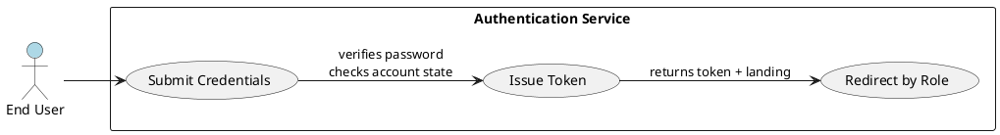
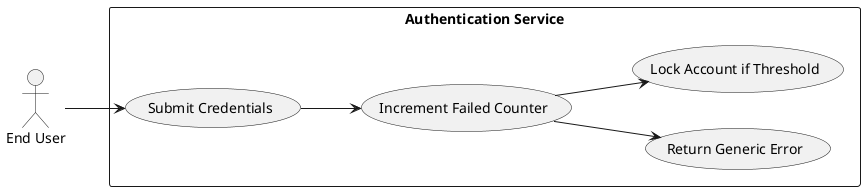
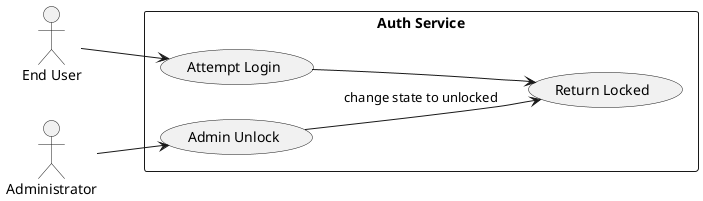
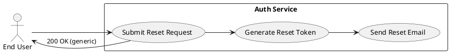
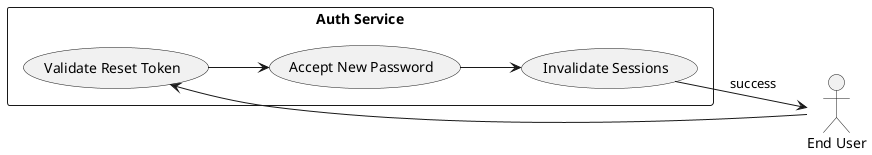
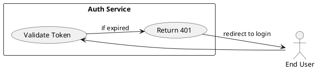
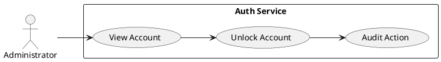
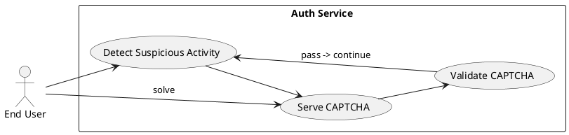

# Requirements Specification

## Feature Goal
Provide a secure, reliable authentication system that allows registered users to sign in with email and password and be granted role-based access to the application. The system SHALL validate credentials, issue short-lived authentication tokens, enforce account lockout after repeated failures, and provide secure recovery flows (forgot-password). The system SHALL be configurable and auditable.

(Executive summary / Goals and Objectives)
- Executive summary: Replace the current minimal login flow with a hardened, auditable authentication service that enforces password security, rate limits, session control, and role-based redirection.
- Goals:
  - Secure authentication with industry-standard password hashing and transport security.
  - Deterministic, testable lockout and token behavior.
  - Usable recovery and admin controls (forgot-password, unlock).
  - Observable and configurable policies for operations teams.

## Business Justification
- Business value and user impact:
  - Protects application data and users from unauthorized access and credential-stuffing attacks.
  - Enables differentiated user experiences via role-based routing (customers, employees, admins).
  - Reduces support cost by providing deterministic lockout/recovery behavior and admin controls.
- Integration with existing features:
  - Integrates with user store (existing DB), email service (SMTP/ESPs), and key management system (KMS/secret vault).
- Problems solved:
  - Eliminates insecure password storage and ambiguous error messages.
  - Prevents brute-force attacks with clear lockout and rate-limiting policy.
  - Ensures consistent session/token lifecycle and revocation capability.

## Feature Scope
User-visible behavior and technical requirements:
- User login with email + password.
- Field validation with accessible messages.
- Deterministic credential verification and account state checks.
- Issue signed authentication tokens (default TTL 30 minutes).
- Enforce maximum 5 failed attempts → account lock for configurable duration (default 15 minutes).
- Password reset request and single-use reset token via email.
- Role-based redirection after successful auth.
- Admin operations: unlock account, view authentication audit logs, adjust configurable policy parameters.
- Observability: authentication events logged with necessary, non-sensitive details.

Target users:
- End users: Customers, Employees, Administrators (login to application).
- Admin operators: Perform account unlocks and policy configuration.
- Security/Compliance teams: Review audit logs and configure policies.

### Success Criteria
- [ ] 98%+ successful login rate for valid credentials under normal load.
- [ ] Median authentication latency < 300 ms (end-to-end for auth API).
- [ ] Default token expiry enforced at 30 minutes (P99 check).
- [ ] Account lockout after 5 failed attempts and auto-unlock after 15 minutes by default.
- [ ] No plaintext passwords stored; all passwords hashed with Argon2id (or bcrypt if Argon2 unavailable).
- [ ] All auth endpoints require TLS 1.2+; no insecure endpoints.
- [ ] Authentication events emitted to logs and metrics with retention and redaction rules.
- [ ] Accessibility: login and recovery flows conform to WCAG 2.1 AA (basic checklist tests pass).

## Functional Requirements
- FR-001: [DETERMINISTIC] System MUST validate login input fields on client and server; email MUST match RFC 5322 basic syntax and password field MUST be non-empty.
  - Acceptance Criteria:
    - Client-side validation prevents submission when email fails regex or password is empty.
    - Server returns 400 with standardized error codes for invalid input.
    - Tests: submit invalid email and empty password to server → 400 within 200 ms; UI displays accessible error text.
- FR-002: [DETERMINISTIC] System MUST verify credentials against the user store using constant-time comparison for password verification and MUST check account state (active, disabled, locked) before authentication success.
  - Acceptance Criteria:
    - Correct credentials → authentication flow continues and token issued.
    - Incorrect credentials → increment failed-attempt counter and return generic "Invalid credentials" message; response time variance ≤ 50 ms to avoid timing enumeration.
    - Locked or disabled accounts → return 423 Locked (or 403) with generic remediation guidance; no account existence leakage.
- FR-003: [DETERMINISTIC] System MUST store passwords hashed with Argon2id (preferred) with per-password salt and configurable cost parameters; if Argon2id unavailable, bcrypt with cost ≥ 12 SHALL be used.
  - Acceptance Criteria:
    - New passwords hashed with Argon2id; password verification tests pass.
    - Plaintext passwords are never present in persistent storage or logs.
    - Hashing cost parameters are configurable via secure config; unit tests cover different cost values.
- FR-004: [DETERMINISTIC] System MUST enforce a maximum of 5 failed login attempts per account within a sliding window of 15 minutes and MUST lock the account for a configurable lockout duration (default 15 minutes) after threshold exceeded.
  - Acceptance Criteria:
    - After 5 failed attempts in 15 minutes: account state = locked, subsequent login attempts return 423 Locked and do not reveal reason beyond generic message.
    - Locked accounts auto-unlock after the configured lockout duration; acceptance tests verify unlock after default 15 minutes (or faster in test mode).
    - Admin user can unlock account immediately via admin API; admin action is audited.
- FR-005: [DETERMINISTIC] System MUST generate signed authentication tokens (JWT or opaque) with a configurable TTL; default TTL SHALL be 30 minutes.
  - Acceptance Criteria:
    - Token contains required claims: user_id, roles, issued_at, expiry.
    - Token validation rejects expired tokens; attempt to use expired token returns 401 Unauthorized.
    - Tokens signed using keys stored in KMS/vault; key rotation supported without downtime (test key rotation).
    - Performance: token issuance latency ≤ 50 ms.
- FR-006: [DETERMINISTIC] System MUST redirect users to a role-specific dashboard after successful authentication based on authoritative role mapping in the user profile.
  - Acceptance Criteria:
    - Role-to-landing mapping exists and is configurable.
    - Tests: given user role A → redirect to URL A within 500 ms of auth success.
    - If multiple roles exist, deterministic precedence logic MUST be applied and documented.
- FR-007: [DETERMINISTIC] System MUST present non-revealing error messages for failed authentication attempts (e.g., "Invalid credentials" for wrong email/password) and SHALL NOT indicate whether an email exists in system.
  - Acceptance Criteria:
    - Responses for invalid login and forgotten-account path are identical in timing and content (generic).
    - Logs contain the detailed root cause but only in secure log storage (not in UI).
- FR-008: [DETERMINISTIC] System MUST provide a "Forgot password" flow: accept a reset request, generate a single-use cryptographically-secure reset token (TTL default 1 hour), send reset email, and allow password reset using the token.
  - Acceptance Criteria:
    - Reset request returns 200 OK for both existing and non-existing emails (generic response).
    - If account exists, email is sent within 60 seconds and token TTL enforced (1 hour); token is single-use.
    - Using token to reset password enforces password policy and invalidates existing sessions (see FR-010).
    - Tests: request reset, receive token, reset password, confirm old token invalidated.
- FR-009: [DETERMINISTIC] System MUST invalidate active sessions/tokens upon password change or forced reset and SHALL provide an API for targeted token revocation (per-user).
  - Acceptance Criteria:
    - After password reset/change, all active tokens for that user are rejected; login with new password issues fresh tokens.
    - Token revocation API returns success and is audited.
- FR-010: [DETERMINISTIC] System MUST log authentication events (success, failed attempt, lockout, password reset request, password reset completion, admin unlock) with timestamp, user_id (when known), source IP, and outcome; logs MUST redact sensitive data (passwords, tokens).
  - Acceptance Criteria:
    - All listed events appear in secure log store; sample queries return events within 60 seconds.
    - Logs do not contain plaintext passwords or full tokens.
    - Retention and access control for logs follow policy (documented separately).
- FR-011: [DETERMINISTIC] System MUST implement rate limiting per IP and per account for authentication endpoints (e.g., per-IP: 100 requests / 15 minutes; per-account: 20 attempts / 15 minutes) and SHALL escalate to CAPTCHA or temporary block on suspicious activity.
  - Acceptance Criteria:
    - Exceeding limits returns 429 Too Many Requests with Retry-After header.
    - CAPTCHA escalation triggered by configurable heuristics (e.g., many IPs hitting same account).
    - Rate-limiting and CAPTCHA thresholds configurable via admin settings.
- FR-012: [DETERMINISTIC] System MUST require TLS 1.2+ for all authentication endpoints; cookies used for session tokens MUST have Secure, HttpOnly, and SameSite=Strict flags by default.
  - Acceptance Criteria:
    - TLS enforcement tested: HTTP requests redirect to HTTPS or are rejected.
    - Cookies include Secure, HttpOnly, SameSite attributes; automated tests validate cookie flags.
- FR-013: [DETERMINISTIC] System MUST provide admin APIs/UI to unlock accounts, view auth audit events, and modify configurable policy parameters (lockout threshold, TTLs, rate limits). All admin actions MUST be authenticated and audited.
  - Acceptance Criteria:
    - Admin actions succeed only with admin role and are recorded in audit logs with admin_id, action, timestamp.
    - Attempts by non-admin to use admin APIs return 403.
- FR-014: [DETERMINISTIC] System MUST support localization for user-facing emails and UI error messages and SHALL meet WCAG 2.1 AA accessibility requirements for login and recovery pages.
  - Acceptance Criteria:
    - Email templates and UI messages support at least two locales on rollout; missing locale falls back to default without error.
    - Accessibility tests: keyboard navigation and screen-reader labels present for login form; automated a11y checks pass baseline WCAG 2.1 AA rules.

**Note**: All Functional Requirements above are tagged as [DETERMINISTIC] — no GenAI behavior is required by the BRD. If future features require AI (e.g., fraud detection based on signals), tag(s) will be updated to [AI-CANDIDATE] or [HYBRID].

## Non-Functional Requirements (NFR-XXX)
- NFR-001: [DETERMINISTIC] Performance: Authentication API MUST have median latency < 300 ms and P95 < 1 second under normal load (defined as expected concurrent user volume).
  - Acceptance Criteria:
    - Performance tests demonstrate median < 300 ms and P95 < 1 s for auth endpoints under expected load profile.
- NFR-002: [DETERMINISTIC] Scalability: The system SHALL be stateless with respect to token validation (JWT) or use a scalable shared session store (Redis) for opaque tokens to support horizontal scaling.
  - Acceptance Criteria:
    - Deployments with N nodes show linear scaling for token validation traffic in load tests.
- NFR-003: [DETERMINISTIC] Availability: Authentication service SHALL target 99.9% availability (or product SLA) and degrade gracefully with clear error messages when dependencies are unavailable.
  - Acceptance Criteria:
    - Chaos/availability tests simulate DB outage and system returns appropriate 503 responses with non-sensitive messages; alerting triggers.
- NFR-004: [DETERMINISTIC] Security: Must comply with OWASP Top 10 mitigations relevant to authentication (parametrized queries, CSRF protections, session fixation prevention).
  - Acceptance Criteria:
    - SAST/DAST scans show no critical vulnerabilities for auth endpoints; CSRF tokens present for stateful interactions.
- NFR-005: [DETERMINISTIC] Observability: Metrics and traces for auth flows (login attempts, failures, lockouts, token issuance latency) MUST be emitted to monitoring systems with dashboards and alerts on abnormal spikes.
  - Acceptance Criteria:
    - Dashboards exist and show real-time metrics; alert rules created for failed login spikes or lockout spikes.
- NFR-006: [DETERMINISTIC] Data retention & privacy: Authentication audit logs MUST follow retention policy (e.g., 1 year) and PII in logs must be minimized and protected (hashed or redacted).
  - Acceptance Criteria:
    - Log storage policy enforces retention and redaction; audits verify compliance.

## Use Case Analysis

### Actors & System Boundary
- Primary Actor: End User — registers and authenticates to access application functionality.
- Secondary Actor: Administrator — manages accounts, unlocks accounts, adjusts policies.
- System Actor: Email Service (SMTP/ESP) — sends password reset emails.
- System Actor: Key Management Service (KMS) / Vault — stores signing keys and secret material.
- System Boundary: "Authentication Service" (API + UI components) — performs validation, token issuance, logging, and admin functions.

### Use Case Specifications

#### UC-001: User Login (Success)
- Actor(s): End User
- Goal: Authenticate with email and password and be redirected to role-specific dashboard.
- Preconditions:
  - User is registered and has active account.
  - User has valid credentials.
  - TLS active.
- Success Scenario:
  1. User submits email and password.
  2. Client performs basic validation; request sent to auth API over HTTPS.
  3. API validates input, checks user record, verifies password (constant-time).
  4. API issues signed token (TTL 30 minutes) and returns 200 with token + redirect URL.
  5. Client stores token (HttpOnly cookie or local storage per policy) and redirects user per role.
- Extensions/Alternatives:
  - 3a. Account locked → API returns 423 Locked; UI shows locked guidance.
  - 3b. Invalid credentials → API returns 401 with generic "Invalid credentials"; failed-attempt counter increments.
- Postconditions:
  - Active session for user; token issued and logged.
- Use Case Diagram


#### UC-002: User Login (Invalid Credentials)
- Actor(s): End User
- Goal: Receive clear guidance when credentials invalid; increment failed counter.
- Preconditions:
  - User exists or not; credentials incorrect.
- Success Scenario:
  1. Submit credentials.
  2. Server validates input and fails verification.
  3. Server increments failed counter and returns 401 with "Invalid credentials".
  4. If threshold reached, server changes account state to locked and emits lockout event.
- Extensions:
  - 3a. If many attempts from same IP → apply rate-limiting/CAPTCHA (see FR-011).
- Postconditions:
  - Failed attempt logged; potential lockout applied.
- Use Case Diagram


#### UC-003: Empty Fields / Client-Side Validation
- Actor(s): End User
- Goal: Block incomplete submissions and show accessible validation messages.
- Preconditions:
  - User on login page.
- Success Scenario:
  1. User attempts submit with empty email or password.
  2. Client shows accessible validation messages and prevents submission.
- Extensions:
  - If client bypassed, server returns 400 and UI shows server-provided validation message.
- Postconditions:
  - No server-side auth attempt logged for client-validated rejection.
- Use Case Diagram
```plantuml
@startuml
left to right direction
skinparam packageStyle rectangle

actor "User" as U
rectangle "Client" {
  usecase (Validate Fields) as V1
}
rectangle "Authentication Service" {
  usecase (Reject Invalid Submission) as R1
}

U --> V1
V1 -->|invalid| U : show message
V1 -->|bypass| R1
@enduml
```

#### UC-004: Account Locked
- Actor(s): End User, Administrator
- Goal: Prevent login after lockout and allow recovery via time-based unlock or admin unlock.
- Preconditions:
  - Account has exceeded failed attempt threshold.
- Success Scenario:
  1. User attempts login; server returns 423 Locked.
  2. User sees guidance to wait or contact support.
  3. Admin may unlock via admin UI/API; action audited.
- Extensions:
  - Automatic unlock after configured duration.
- Postconditions:
  - Account remains locked until unlock or expiry.
- Use Case Diagram


#### UC-005: Forgot Password — Request Reset
- Actor(s): End User
- Goal: Request password reset without revealing account existence.
- Preconditions:
  - User has access to email used for account (may or may not exist).
- Success Scenario:
  1. User submits email to reset form.
  2. Server returns generic 200 response.
  3. If account exists: generate single-use reset token (TTL 1 hour) and send localized email.
  4. Reset request event logged.
- Extensions:
  - Rate-limiting applies; repeated requests trigger CAPTCHA.
- Postconditions:
  - Reset token created (if account exists); email sent.
- Use Case Diagram


#### UC-006: Forgot Password — Reset Completion
- Actor(s): End User
- Goal: Reset password using the token.
- Preconditions:
  - User has a valid reset token.
- Success Scenario:
  1. User follows link with token to reset form.
  2. Server validates token and shows reset UI.
  3. User submits new password; server enforces password policy, updates hash, invalidates token and existing sessions.
  4. Return success and allow user to login with new credentials.
- Extensions:
  - Invalid or expired token → show generic error and link to re-request reset.
- Postconditions:
  - Password updated; old tokens invalidated; event logged.
- Use Case Diagram


#### UC-007: Token Expiry & Session Expiration
- Actor(s): End User
- Goal: Handle expired tokens gracefully by redirecting to login.
- Preconditions:
  - Token TTL expired.
- Success Scenario:
  1. Client attempts action with expired token.
  2. API returns 401 Unauthorized.
  3. Client redirects to login and may display message "Session expired; please sign in again."
- Extensions:
  - Refresh token flow (not in initial scope) can be added later; for now require re-authentication.
- Postconditions:
  - No access granted with expired token.
- Use Case Diagram


#### UC-008: Admin Unlock Account / Override
- Actor(s): Administrator
- Goal: Unlock user accounts and audit the action.
- Preconditions:
  - Admin authenticated with admin role.
- Success Scenario:
  1. Admin views locked account.
  2. Admin issues unlock via admin UI/API.
  3. System updates account state and logs the action.
- Extensions:
  - Admin may also reset password for user (requires email or other verification).
- Postconditions:
  - Account unlocked; action audited.
- Use Case Diagram


#### UC-009: CAPTCHA Escalation (Brute-Force Mitigation)
- Actor(s): End User
- Goal: Challenge suspected automated/bot traffic with CAPTCHA when suspicious signals detected.
- Preconditions:
  - Multiple failed attempts or high volumetric requests from IP/account.
- Success Scenario:
  1. System detects suspicious pattern via rate-limiter heuristics.
  2. System responds with CAPTCHA challenge endpoint.
  3. User solves CAPTCHA; normal auth flow resumes.
- Extensions:
  - If CAPTCHA fails repeatedly, temporary block applied.
- Postconditions:
  - Successful CAPTCHA clears escalation; events logged.
- Use Case Diagram


## Risks & Mitigations
- Risk: Credential stuffing / brute-force attacks leading to mass lockouts or account takeover.
  - Mitigation: Rate limiting per IP and per account, CAPTCHA escalation, monitoring and alerting, progressive backoff.
- Risk: Account lockout used as DoS to lock many users.
  - Mitigation: Admin bulk-unlock tools, anomaly detection to prevent mass lockouts, allow fallback support flow, make lockout configurable and monitor spikes.
- Risk: Token theft or replay attacks.
  - Mitigation: Short token TTL (30 min), token revocation API, secure cookie flags, rotate signing keys, require TLS.
- Risk: Password storage misconfiguration or weak hashing parameters.
  - Mitigation: Enforce Argon2id hashing with policy-managed cost parameters; automated tests to validate hashing.
- Risk: Information leakage through error messages or timing.
  - Mitigation: Use generic error messages, constant-time comparisons where applicable, and redact PII in logs.

## Constraints & Assumptions
- Constraint: KMS/secret vault available for signing key storage and rotation (if not available, design must include immediate procurement).
- Constraint: Email sending infrastructure (SMTP or ESP) available and configured for localized templates.
- Constraint: Existing user database may contain legacy password hashes; migration plan required if hash algorithm differs.
- Assumption: No third-party SSO/IdP (OAuth/SAML) integration required in initial scope; design SHALL allow plug-in later.
- Assumption: MFA not in scope for initial rollout but SHALL be accommodated by design for later addition.

## Acceptance Tests & QA Checklist (summary)
- Verify input validation both client and server.
- Verify password hashing and no plaintext storage.
- Verify login success issues token with correct claims and TTL.
- Verify invalid credentials behavior and failed-attempt counter increments.
- Verify lockout behavior after 5 failed attempts and auto-unlock after configured duration.
- Verify forgot-password request is generic and reset token single-use + TTL.
- Verify tokens invalidated on password change.
- Verify rate limiting and CAPTCHA escalation thresholds.
- Verify TLS enforcement and secure cookies attributes.
- Verify audit logs for required events and log redaction.
- Verify performance targets (median latency and P95).
- Verify accessibility and localization for UI and emails.

## Implementation Notes & Next Questions (for engineering kickoff)
- Decide token type: JWT (stateless) or opaque tokens with shared session store — preference: JWT with revocation list for sensitive events.
- Confirm preferred password hashing library (Argon2id recommended) and platform support.
- Confirm email provider and template localization pipeline.
- Confirm KMS/vault solution for signing keys and rotation policy.
- Confirm SLA/availability targets and expected load profile for sizing.

