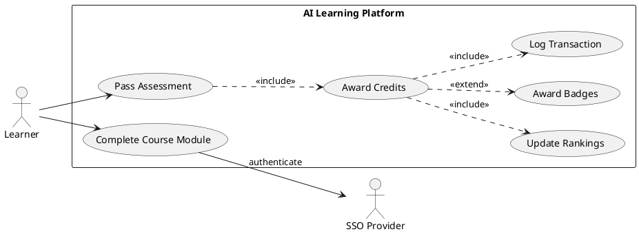
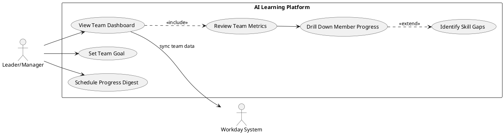
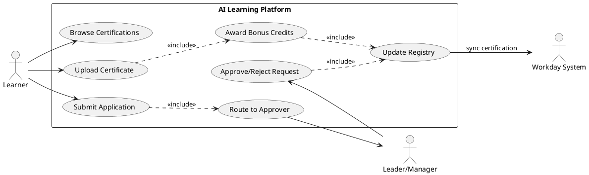
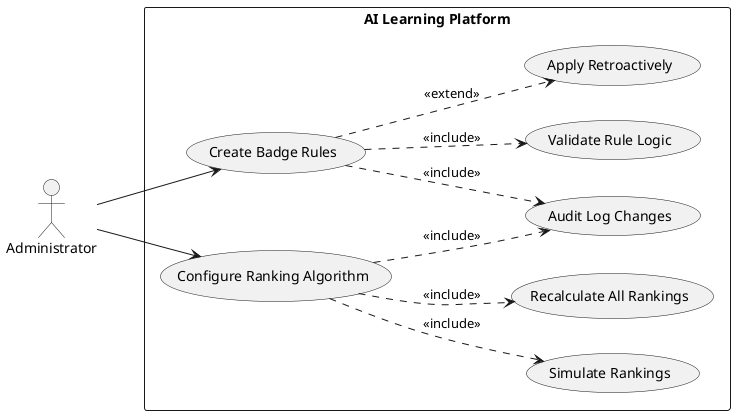
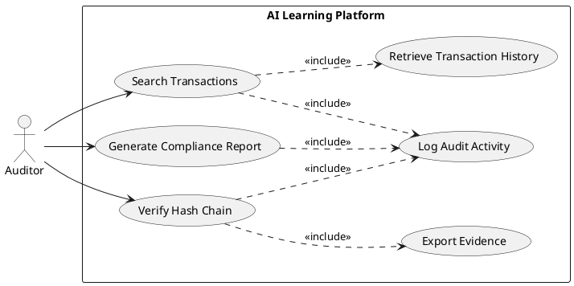
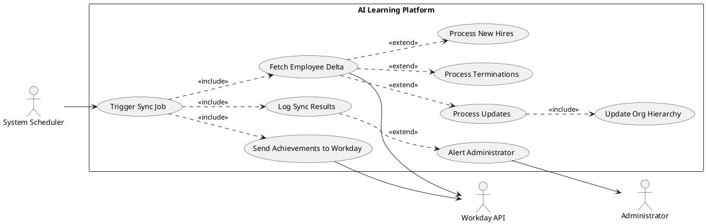

# Requirements Specification: AI Learning & Development Credit System

## Feature Goal

Build a comprehensive credit-based training platform that enables organizational transformation into an AI-native workforce through structured, gamified learning experiences with verifiable outcomes.

**Current State**: Organization lacks a centralized, measurable system for AI skill development and tracking. Learning initiatives are fragmented, progress is unquantified, and there's no systematic approach to recognition or career advancement tied to AI competency.

**Desired State**: A unified web platform providing Microsoft Learn/Google Learn-like user experience where employees can:
- Earn verifiable, quantifiable, and auditable credits through AI learning activities
- Progress through ranking systems and earn achievement badges
- Apply for certifications from approved service providers
- Gain recognition and career advancement opportunities based on demonstrated AI competency
- Enable leadership teams to drive and monitor organizational AI learning outcomes

## Business Justification

- **Strategic Value**: Accelerates organizational transformation to AI-native operations, directly supporting competitive advantage in AI-driven markets
- **Measurable ROI**: Quantifiable skill development through credit tracking enables data-driven decisions on training investments and workforce readiness
- **Employee Engagement**: Gamification elements (badges, rankings, recognition) increase motivation and sustained participation in upskilling programs
- **Career Development**: Direct link between learning achievements and career advancement creates retention incentives for top performers
- **Leadership Visibility**: Provides executive dashboards for monitoring team progress, identifying skill gaps, and driving accountability
- **Compliance & Audit**: Verifiable credit system ensures compliance with professional development requirements and supports audit trails
- **Integration Leverage**: Builds on existing investments in Workday (HR) and organizational SSO, with future extensibility to enterprise LMS platforms
- **User Adoption**: Familiar UX patterns (Microsoft Learn/Google Learn) reduce learning curve and increase platform adoption

### Problems Solved

**For Learners**:
- Lack of clear, structured AI learning paths
- No recognition or visibility for self-directed learning efforts
- Unclear connection between skill development and career progression
- Difficulty tracking personal learning progress and achievements

**For Leadership**:
- Inability to measure organizational AI readiness
- No centralized view of team skill development- Challenges in identifying high performers for advancement
- Limited ability to drive and monitor upskilling initiatives

**For HR/Organization**:
- Fragmented learning data across disconnected platforms
- Non-standardized approach to skill verification
- Difficulty demonstrating compliance with development requirements
- Inefficient manual processes for certification approvals and career advancement decisions

## Feature Scope

### User-Visible Behavior

**Learner Experience**:
- Single sign-on using organizational credentials (SSO)
- Browse AI learning catalog with courses, modules, and learning paths
- Enroll in courses and track progress through intuitive, modern web interface
- Earn credits upon completion of learning activities with instant feedback
- View personal dashboard showing accumulated credits, badges, rankings, and achievements
- Participate in gamified challenges and compete on leaderboards
- Apply for certifications from approved providers through streamlined workflow
- Receive recognition badges and public acknowledgment of accomplishments
- See career advancement opportunities tied to credit milestones

**Leadership Experience**:
- Dashboard showing team learning metrics, progress, and skill distribution
- Ability to set learning goals and track team compliance
- View individual team member progress and achievements
- Identify top performers and skill gaps within teams
- Access reports for career advancement and recognition decisions

**Administrator Experience**:
- Manage learning catalog (courses, modules, paths)
- Configure credit values and badge criteria
- Approve/reject certification applications
- Manage certification provider relationships
- Configure ranking algorithms and leaderboard settings
- Generate audit reports and compliance documentation
- Manage user roles and permissions

### Technical Requirements

- Web-based platform accessible via modern browsers (Chrome, Edge, Firefox, Safari)
- Integration with organizational SSO (SAML 2.0 / OAuth 2.0)
- Integration with Workday API for employee data synchronization
- RESTful API architecture for future LMS integration capabilities
- Responsive design supporting desktop and tablet devices (mobile optimization future consideration)
- Role-based access control (Learner, Leader, Administrator, Auditor roles)
- Audit logging for all credit transactions and certification activities
- Data encryption at rest and in transit (TLS 1.3, AES-256)
- WCAG 2.1 Level AA accessibility compliance
- Performance: Page load < 2 seconds, API response < 500ms (95th percentile)
- Scalability: Support for organization-wide rollout (assume 10,000+ users)

### Success Criteria

- [ ] 80% of employees create accounts and complete onboarding within first quarter post-launch
- [ ] 60% monthly active user rate sustained after initial rollout
- [ ] 70% course completion rate for enrolled learners
- [ ] Average time-to-first-certification reduced by 40% compared to previous manual processes
- [ ] Leadership team dashboard adoption rate of 90% across all departments
- [ ] Zero data breaches or security incidents related to PII or credit data
- [ ] 100% audit trail availability for all credit transactions and certifications
- [ ] Platform availability of 99.5% during business hours
- [ ] Average user satisfaction score of 4.2/5.0 or higher
- [ ] Successful integration with Workday achieving 99% data synchronization accuracy

## Functional Requirements

### Authentication & Identity Management

- FR-001: [DETERMINISTIC] System MUST integrate with organizational SSO provider using SAML 2.0 or OAuth 2.0 protocol for user authentication
- FR-002: [DETERMINISTIC] System MUST enforce session timeout after 30 minutes of inactivity and require re-authentication
- FR-003: [DETERMINISTIC] System MUST support role-based access control with roles: Learner, Leader, Administrator, Auditor
- FR-004: [DETERMINISTIC] System MUST synchronize user profiles with Workday API daily, updating employee data (name, department, role, manager, employment status)
- FR-005: [DETERMINISTIC] System MUST automatically deactivate accounts for terminated employees within 24 hours of Workday status change
- FR-006: [DETERMINISTIC] System MUST log all authentication attempts (successful and failed) with timestamp, user ID, IP address, and outcome

### Learning Catalog & Content Delivery

- FR-007: [DETERMINISTIC] System MUST provide a browsable catalog of AI learning courses organized by categories (Fundamentals, Machine Learning, Deep Learning, NLP, Computer Vision, AI Ethics, etc.)
- FR-008: [DETERMINISTIC] System MUST display course metadata including title, description, estimated duration, credit value, difficulty level, and prerequisites
- FR-009: [DETERMINISTIC] System MUST allow learners to search and filter courses by category, difficulty, duration, and credit value
- FR-010: [HYBRID] System MUST recommend personalized learning paths based on user's current skill level, role, and learning history (AI suggests, user selects)
- FR-011: [DETERMINISTIC] System MUST track course enrollment status (not started, in progress, completed) for each learner
- FR-012: [DETERMINISTIC] System MUST display progress indicators showing percentage completion for enrolled courses
- FR-013: [DETERMINISTIC] System MUST present learning content in structured modules with sequential unlocking based on prerequisite completion
- FR-014: [DETERMINISTIC] System MUST support multiple content types including video, text articles, interactive exercises, quizzes, and hands-on labs
- FR-015: [DETERMINISTIC] System MUST mark courses as complete only when all required modules and assessments are successfully finished
- FR-016: [DETERMINISTIC] System MUST provide a consistent UX pattern similar to Microsoft Learn or Google Learn platforms (card-based layouts, progress bars, module navigation)

### Credit Management System

- FR-017: [DETERMINISTIC] System MUST award credits automatically upon successful course completion based on predefined credit values
- FR-018: [DETERMINISTIC] System MUST maintain a verifiable, immutable ledger of all credit transactions with timestamp, user ID, course ID, credit amount, and transaction type (earned, adjusted, revoked)
- FR-019: [DETERMINISTIC] System MUST display learner's total accumulated credits on personal dashboard with breakdown by category
- FR-020: [DETERMINISTIC] System MUST allow administrators to manually adjust credits with mandatory justification comment logged in audit trail
- FR-021: [DETERMINISTIC] System MUST prevent negative credit balances and reject invalid credit transactions
- FR-022: [DETERMINISTIC] System MUST support credit expiration policies where credits older than configurable period (e.g., 24 months) are marked as expired but retained in history
- FR-023: [DETERMINISTIC] System MUST generate exportable credit transcripts in PDF format with digital signature for verification purposes
- FR-024: [DETERMINISTIC] System MUST provide API endpoint for external systems to verify credit authenticity using unique transaction IDs
- FR-025: [DETERMINISTIC] System MUST calculate and display credit velocity metrics (credits earned per month/quarter) for individual learners and teams

### Gamification Engine

- FR-026: [DETERMINISTIC] System MUST award achievement badges automatically based on predefined criteria (e.g., "First Course Complete", "10 Credits Earned", "AI Fundamentals Master")
- FR-027: [DETERMINISTIC] System MUST display earned badges on learner profile with earned date and criteria description
- FR-028: [DETERMINISTIC] System MUST calculate user rankings using credit-based algorithm considering total credits, recent activity, and course difficulty multipliers
- FR-029: [DETERMINISTIC] System MUST maintain organization-wide leaderboard showing top 100 learners by credit ranking, updated hourly
- FR-030: [DETERMINISTIC] System MUST provide department-specific and team-specific leaderboards filtered by organizational hierarchy
- FR-031: [DETERMINISTIC] System MUST support achievement tiers (Bronze, Silver, Gold, Platinum) based on cumulative credit thresholds
- FR-032: [DETERMINISTIC] System MUST award bonus credits for streak achievements (e.g., completing courses on consecutive weeks)
- FR-033: [DETERMINISTIC] System MUST display learner's current ranking position and percentile within organization and department
- FR-034: [HYBRID] System MUST generate personalized achievement suggestions based on learner's current progress and proximity to next milestone (AI suggests, user pursues)
- FR-035: [DETERMINISTIC] System MUST allow learners to share achievements on internal communication platforms (optional integration with Teams/Slack)

### Certification Management Workflow

- FR-036: [DETERMINISTIC] System MUST maintain a catalog of approved certification providers with provider details (name, website, certification types, costs, prerequisites)
- FR-037: [DETERMINISTIC] System MUST allow learners to submit certification applications including certification provider, certification name, target completion date, and justification
- FR-038: [DETERMINISTIC] System MUST route certification applications to appropriate approver based on cost threshold and organizational policy (manager for < $500, director for >= $500)
- FR-039: [DETERMINISTIC] System MUST notify approvers via email when certification application requires their review
- FR-040: [DETERMINISTIC] System MUST allow approvers to approve or reject applications with mandatory comment
- FR-041: [DETERMINISTIC] System MUST notify learners of application status changes (submitted, approved, rejected, completed)
- FR-042: [DETERMINISTIC] System MUST track certification lifecycle status (applied, approved, in progress, completed, expired)
- FR-043: [DETERMINISTIC] System MUST allow learners to upload certification completion evidence (certificate PDF, badge URL, verification link)
- FR-044: [DETERMINISTIC] System MUST award bonus credits upon certification completion based on certification type and difficulty
- FR-045: [DETERMINISTIC] System MUST maintain certification registry showing all active certifications by employee with expiration tracking
- FR-046: [DETERMINISTIC] System MUST alert learners 60 days before certification expiration with renewal recommendations

### Recognition & Career Advancement Programs

- FR-047: [DETERMINISTIC] System MUST designate "AI Learning Champion" status to top 5% of learners quarterly based on credit ranking
- FR-048: [DETERMINISTIC] System MUST publish recognition announcements on platform homepage and via email notifications
- FR-049: [DETERMINISTIC] System MUST provide exportable achievement portfolio including credits, badges, certifications, and rankings for use in career discussions
- FR-050: [DETERMINISTIC] System MUST flag learners who achieve predefined career advancement milestones (e.g., 100 credits, 3 certifications, Platinum tier)
- FR-051: [DETERMINISTIC] System MUST integrate achievement data into Workday employee profiles via API for performance review access
- FR-052: [HYBRID] System MUST suggest career development opportunities based on learner's achievement pattern and organizational needs (AI suggests, HR/manager decides)
- FR-053: [DETERMINISTIC] System MUST generate quarterly recognition reports for leadership showing top performers by department

### Leadership Dashboard & Analytics

- FR-054: [DETERMINISTIC] System MUST provide leadership dashboard displaying team-level metrics: total credits earned, active learners, course completions, certification applications
- FR-055: [DETERMINISTIC] System MUST show individual team member progress with drill-down capability for leaders to view detailed learner profiles
- FR-056: [DETERMINISTIC] System MUST visualize skill distribution across team showing competency levels in different AI domains
- FR-057: [HYBRID] System MUST identify and highlight skill gaps and recommend targeted training initiatives for teams (AI analyzes patterns, leaders decide actions)
- FR-058: [DETERMINISTIC] System MUST allow leaders to set team learning goals (e.g., "Team average: 20 credits per quarter") and track progress
- FR-059: [DETERMINISTIC] System MUST send weekly digest emails to leaders summarizing team activity and milestone achievements
- FR-060: [DETERMINISTIC] System MUST provide comparative analytics showing team performance against department and organization benchmarks
- FR-061: [DETERMINISTIC] System MUST generate exportable reports in Excel and PDF formats for leadership presentations

### Administration & Content Management

- FR-062: [DETERMINISTIC] System MUST allow administrators to create, update, and deactivate courses in learning catalog
- FR-063: [DETERMINISTIC] System MUST allow administrators to configure credit values for each course with validation rules (minimum: 1, maximum: 100)
- FR-064: [DETERMINISTIC] System MUST allow administrators to define badge criteria using rule-based conditions (credit thresholds, course completions, certifications)
- FR-065: [DETERMINISTIC] System MUST allow administrators to manage certification provider catalog including adding, updating, and removing providers
- FR-066: [DETERMINISTIC] System MUST allow administrators to configure ranking algorithms by adjusting weight factors for credits, recency, and difficulty
- FR-067: [DETERMINISTIC] System MUST allow administrators to customize achievement tiers (names, thresholds, visual representations)
- FR-068: [DETERMINISTIC] System MUST provide bulk import capability for courses via CSV upload with validation and error reporting
- FR-069: [DETERMINISTIC] System MUST allow administrators to schedule content publishing (e.g., new courses available on specific date)
- FR-070: [DETERMINISTIC] System MUST log all administrative actions in audit trail with administrator ID, action type, timestamp, and affected entities

### Audit, Compliance & Reporting

- FR-071: [DETERMINISTIC] System MUST maintain immutable audit log of all credit transactions with cryptographic hash chaining for tamper detection
- FR-072: [DETERMINISTIC] System MUST log all certification applications, approvals, rejections, and completions with full approval chain
- FR-073: [DETERMINISTIC] System MUST provide auditor role access to comprehensive audit trail with advanced search and filtering capabilities
- FR-074: [DETERMINISTIC] System MUST generate compliance reports showing credit distribution, certification rates, and participation statistics
- FR-075: [DETERMINISTIC] System MUST support data retention policies with configurable archival periods for inactive user data (minimum 7 years for audit compliance)
- FR-076: [DETERMINISTIC] System MUST export audit logs in industry-standard formats (JSON, CSV) for external audit tool integration
- FR-077: [DETERMINISTIC] System MUST alert administrators of anomalous activities (e.g., bulk credit adjustments, unusual access patterns)
- FR-078: [DETERMINISTIC] System MUST provide data anonymization capabilities for analytics while preserving audit trail integrity
- FR-079: [DETERMINISTIC] System MUST support GDPR-compliant data subject access requests with full data export within 30 days
- FR-080: [DETERMINISTIC] System MUST implement right-to-be-forgotten functionality while preserving audit trail through pseudonymization

### Integration & Extensibility

- FR-081: [DETERMINISTIC] System MUST provide RESTful API with OpenAPI 3.0 specification for future LMS integration
- FR-082: [DETERMINISTIC] System MUST implement Workday API client for bidirectional employee data synchronization with error handling and retry logic
- FR-083: [DETERMINISTIC] System MUST support webhook notifications for external systems to subscribe to credit earning events, certification completions, and badge awards
- FR-084: [DETERMINISTIC] System MUST support SCORM 1.2 and xAPI (Tin Can) standards for LMS interoperability (future-ready, Phase 2 implementation)
- FR-085: [DETERMINISTIC] System MUST provide data export API for analytics platforms supporting JSON and CSV formats
- FR-086: [DETERMINISTIC] System MUST implement rate limiting on public APIs (100 requests per minute per client) to prevent abuse

## Use Case Analysis

### Actors & System Boundary

**Primary Actors**:
- **Learner**: Organization employee seeking AI skill development. Responsibilities: Enroll in courses, complete learning activities, earn credits, apply for certifications, track personal progress
- **Leader/Manager**: Team lead or department manager monitoring team learning progress. Responsibilities: View team dashboards, set learning goals, approve certification applications, identify skill gaps, drive team engagement
- **Administrator**: Platform administrator managing content and configuration. Responsibilities: Manage course catalog, configure gamification rules, manage certification providers, generate reports, oversee platform operations
- **Auditor**: Compliance officer or internal auditor reviewing learning records. Responsibilities: Access audit trails, verify credit authenticity, generate compliance reports, investigate anomalies

**Secondary Actors**:
- **HR Personnel**: Human resources staff managing career development programs. Responsibilities: Access recognition reports, coordinate career advancement programs, leverage platform data for performance reviews

**System Actors** (External Systems):
- **SSO Provider**: Organizational identity provider (e.g., Azure AD, Okta) handling authentication
- **Workday System**: HR management system providing employee data and receiving achievement updates
- **Certification Providers**: External certification authorities (Microsoft, Google, Coursera, etc.) delivering certifications (indirect integration, manual submission in Phase 1)
- **Future LMS**: Enterprise Learning Management System for potential future integration

### Use Case Specifications

#### UC-001: Learner Completes Course and Earns Credits

- **Actor(s)**: Learner
- **Goal**: Complete an AI learning course and receive verifiable credits
- **Preconditions**: 
  - Learner is authenticated
  - Learner is enrolled in the course
  - All prerequisite courses are completed
- **Success Scenario**:
  1. Learner logs into platform using SSO credentials
  2. Learner navigates to "My Courses" and selects in-progress course
  3. Learner completes final module and passes required assessment
  4. System validates all course requirements are met (100% module completion, passing assessment score)
  5. System awards predefined credits for the course
  6. System creates immutable credit transaction record in audit ledger
  7. System updates learner's total credit balance
  8. System checks and awards any triggered achievement badges
  9. System recalculates learner's ranking position
  10. System displays success notification with credits earned, new badges, and updated ranking
  11. System sends congratulatory email with achievement summary
- **Extensions/Alternatives**:
  - 4a. Assessment not passed: System prompts retry with remaining attempt count
  - 4b. Course prerequisites not met: System displays error and redirects to prerequisite courses
  - 5a. Credit award fails due to technical error: System logs error, queues retry, and notifies administrator
  - 8a. Badge criteria met for multiple badges: System awards all applicable badges simultaneously
- **Postconditions**: 
  - Learner's credit balance is increased
  - Course status is marked as "Completed"
  - Credit transaction is recorded in immutable audit log
  - Any earned badges are visible on learner profile
  - Learner ranking is updated across leaderboards

##### Use Case Diagram

#### UC-002: Leader Reviews Team Progress and Sets Goals

- **Actor(s)**: Leader/Manager
- **Goal**: Monitor team learning progress and establish learning objectives
- **Preconditions**:
  - Leader is authenticated
  - Leader has at least one team member assigned in Workday hierarchy
- **Success Scenario**:
  1. Leader logs into platform using SSO credentials
  2. Leader navigates to "Team Dashboard"
  3. System retrieves team membership from synchronized Workday data
  4. System displays team metrics: total credits, active learners, course completions, top performers
  5. Leader drills down into individual team member profiles to view detailed progress
  6. Leader identifies skill gap in specific AI domain (e.g., Machine Learning)
  7. Leader sets team goal: "Team average 25 credits in Machine Learning by Q2 end"
  8. System saves goal and creates tracking milestone
  9. System sends email notification to all team members about new goal
  10. Leader schedules recurring weekly progress digest emails
  11. System confirms goal creation and displays progress tracking view
- **Extensions/Alternatives**:
  - 3a. Workday sync failed: System displays warning and shows cached data with timestamp
  - 5a. Team member has no learning activity: System highlights inactive members for leader follow-up
  - 7a. Leader sets unrealistic goal: System provides warning with historical team performance for reference
  - 9a. Team member email delivery fails: System logs failure and queues retry
- **Postconditions**:
  - Team goal is created and tracked
  - Team members are notified of new goal
  - Leader receives weekly digest subscription
  - Goal progress is visible on team dashboard

##### Use Case Diagram

#### UC-003: Learner Applies for Certification Approval

- **Actor(s)**: Learner, Leader/Manager
- **Goal**: Submit certification application and obtain manager approval
- **Preconditions**:
  - Learner is authenticated
  - Learner has met minimum platform eligibility (e.g., 20 credits earned)
  - Certification provider exists in approved catalog
- **Success Scenario**:
  1. Learner logs into platform and navigates to "Certifications"
  2. Learner browses approved certification provider catalog
  3. Learner selects desired certification (e.g., "Azure AI Fundamentals")
  4. System displays certification details including cost, prerequisites, and credit bonus upon completion
  5. Learner clicks "Apply for Certification"
  6. Learner fills application form: provider, certification name, target date, business justification
  7. System validates learner eligibility and form completeness
  8. System determines approver based on cost threshold (Manager: < $500, Director: >= $500)
  9. System creates certification application with status "Pending Approval"
  10. System sends email notification to appropriate approver with application details and approval link
  11. System displays confirmation message to learner with expected review timeline
  12. Approver reviews application and clicks "Approve" with comment
  13. System updates application status to "Approved"
  14. System sends approval notification to learner with next steps
  15. Learner completes external certification and uploads certificate PDF
  16. System validates upload and updates status to "Completed"
  17. System awards bonus credits for certification completion
  18. System updates certification registry and syncs to Workday
- **Extensions/Alternatives**:
  - 7a. Learner doesn't meet eligibility: System displays error with requirements to fulfill
  - 8a. Approver cannot be determined: System escalates to default administrator for approval routing
  - 12a. Approver rejects application: System sends rejection notification with approver comments to learner
  - 15a. Learner uploads invalid file format: System rejects upload and requests PDF format
  - 17a. Bonus credit award fails: System logs error and queues manual review by administrator
- **Postconditions**:
  - Certification application is recorded with complete approval trail
  - Upon completion, bonus credits are awarded
  - Certification is added to learner's profile and organization registry
  - Workday employee profile is updated with certification achievement

##### Use Case Diagram

#### UC-004: Administrator Configures Gamification Rules

- **Actor(s)**: Administrator
- **Goal**: Configure badge criteria and ranking algorithms to drive desired learning behaviors
- **Preconditions**:
  - Administrator is authenticated with admin role
  - Platform is in configuration mode or outside peak usage hours
- **Success Scenario**:
  1. Administrator logs into platform and navigates to "Admin Console"
  2. Administrator selects "Gamification Settings"
  3. Administrator creates new achievement badge: "Machine Learning Pioneer"
  4. Administrator defines badge criteria using rule builder:
     - Complete 5 courses in Machine Learning category
     - Earn minimum 50 credits in Machine Learning
     - Achieve within 90 days
  5. System validates rule syntax and logic consistency
  6. Administrator sets badge visual assets (icon, color, tier: Gold)
  7. Administrator saves badge configuration
  8. System applies badge retroactively to existing learners meeting criteria
  9. System sends notification to learners who qualify for new badge
  10. Administrator navigates to "Ranking Configuration"
  11. Administrator adjusts ranking algorithm weights:
      - Total credits: 50%
      - Recent activity (last 90 days): 30%
      - Course difficulty multiplier: 20%
  12. System validates weight sum equals 100%
  13. Administrator previews ranking changes using simulation mode
  14. Administrator confirms and applies new ranking algorithm
  15. System recalculates all learner rankings using new algorithm
  16. System updates leaderboards organization-wide
  17. System logs configuration changes in audit trail
- **Extensions/Alternatives**:
  - 5a. Rule criteria contains logical errors: System highlights errors and prevents saving
  - 8a. No existing learners meet criteria: System confirms badge created but no awards issued
  - 12a. Weight sum does not equal 100%: System displays error and prevents saving
  - 13a. Preview shows unexpected results: Administrator adjusts weights and reruns preview
  - 15a. Ranking recalculation impacts thousands of users: System queues background job and notifies administrator upon completion
- **Postconditions**:
  - New badge is active and available for learners to earn
  - Retroactively earned badges are displayed on learner profiles
  - Ranking algorithm is updated and applied organization-wide
  - All configuration changes are logged in audit trail

##### Use Case Diagram

#### UC-005: Auditor Verifies Credit Authenticity

- **Actor(s)**: Auditor
- **Goal**: Verify the authenticity and integrity of credit transactions for compliance purposes
- **Preconditions**:
  - Auditor is authenticated with auditor role
  - Credit transaction ID or learner ID is available for audit
- **Success Scenario**:
  1. Auditor logs into platform using SSO credentials
  2. Auditor navigates to "Audit & Compliance" section
  3. Auditor enters credit transaction ID or learner email for verification
  4. System retrieves complete credit transaction history from immutable ledger
  5. System displays transaction details: transaction ID, learner, course, credits, timestamp, cryptographic hash
  6. Auditor validates hash chain integrity using "Verify Hash Chain" function
  7. System performs cryptographic verification across all related transactions
  8. System confirms hash chain is intact (no tampering detected)
  9. Auditor exports transaction evidence as PDF with digital signature
  10. System generates tamper-evident PDF including transaction details, hash values, and verification timestamp
  11. Auditor saves exported evidence for compliance documentation
  12. Auditor generates compliance report for date range (Q1 2026)
  13. System aggregates all credit transactions in date range with statistical summary
  14. System produces compliance report showing: total credits awarded, course distribution, top performers, anomaly flags
  15. Auditor reviews report and exports for stakeholder distribution
- **Extensions/Alternatives**:
  - 4a. Transaction ID not found: System displays error and suggests search by learner email
  - 7a. Hash chain verification fails: System flags potential tampering and alerts security team
  - 10a. PDF generation fails: System logs error and offers CSV export alternative
  - 13a. Date range contains millions of transactions: System implements pagination and offers bulk export
- **Postconditions**:
  - Credit transaction authenticity is verified and documented
  - Audit evidence is exported with tamper-evident signatures
  - Compliance report is generated and available for stakeholder review
  - All audit activities are logged in separate auditor action log

##### Use Case Diagram

#### UC-006: System Synchronizes Employee Data with Workday

- **Actor(s)**: Workday System (External), System (Automated Process)
- **Goal**: Maintain accurate employee information synchronized between Workday and learning platform
- **Preconditions**:
  - Workday API credentials are configured and valid
  - Scheduled synchronization job is enabled (daily at 2 AM)
- **Success Scenario**:
  1. System scheduled job triggers at 2:00 AM
  2. System establishes secure connection to Workday API using OAuth 2.0
  3. System requests employee data delta since last successful sync
  4. Workday API returns employee records: new hires, updates, terminations
  5. System validates API response structure and data integrity
  6. For each new hire: System creates learner account with basic profile (name, email, department, role, manager)
  7. For each updated employee: System updates changed fields (department transfer, role change, manager change)
  8. For each terminated employee: System deactivates account and revokes active sessions
  9. System updates organizational hierarchy for team dashboard relationships
  10. System logs all sync activities with record counts and any errors
  11. System sends achievement data to Workday: certifications, credit milestones for performance review integration
  12. Workday API confirms successful update
  13. System marks sync job as successful with timestamp
  14. System sends summary email to administrators: X new accounts, Y updates, Z deactivations
- **Extensions/Alternatives**:
  - 3a. Workday API unavailable: System retries with exponential backoff (3 attempts), then alerts administrator
  - 4a. Large data volume (>1000 records): System implements pagination and processes in batches
  - 5a. Data validation fails for record: System logs error, skips record, continues processing remaining records
  - 7a. Update conflicts with local changes: System prioritizes Workday as source of truth for employee data
  - 11a. Workday API rejects achievement update: System queues for retry and logs for manual review
  - 13a. Sync job fails: System alerts administrator with error details and prepares for next scheduled run
- **Postconditions**:
  - Employee data in platform is synchronized with Workday
  - New accounts are created and terminations are deactivated
  - Organizational hierarchy is updated for accurate team dashboards
  - Achievement data is available in Workday for HR processes
  - Sync status and errors are logged for audit and troubleshooting

##### Use Case Diagram

## Risks & Mitigations

### R-001: Workday Integration Reliability
- **Risk**: Workday API downtime or data sync failures could result in stale employee data, incorrect team hierarchies, and blocked new user onboarding
- **Impact**: High - affects user authentication, team dashboards, and achievement synchronization
- **Mitigation**: 
  - Implement automated retry logic with exponential backoff
  - Cache employee data locally with last-sync timestamps displayed to users
  - Set up monitoring alerts for sync failures with escalation to on-call engineer
  - Maintain manual override capability for critical account activations/deactivations
  - Establish SLA with Workday team for API availability and support response times

### R-002: SSO Provider Compatibility and Authentication Failures
- **Risk**: Organizational SSO provider changes, configuration drift, or service outages could block all user access to platform
- **Impact**: Critical - complete platform inaccessibility affecting organization-wide adoption
- **Mitigation**:
  - Support multiple SSO protocols (SAML 2.0, OAuth 2.0, OpenID Connect) for flexibility
  - Implement health check monitoring for SSO endpoints with real-time alerts
  - Maintain emergency administrator access via alternative authentication mechanism
  - Document SSO configuration requirements and establish change management process with identity team
  - Conduct quarterly SSO integration testing and failover drills

### R-003: Data Privacy and Compliance Violations
- **Risk**: Handling employee PII (personal identifiable information), learning records, and performance data creates exposure to GDPR, privacy regulations, and potential data breaches
- **Impact**: Critical - legal liability, regulatory fines, loss of employee trust, reputational damage
- **Mitigation**:
  - Implement encryption at rest (AES-256) and in transit (TLS 1.3) for all sensitive data
  - Enforce strict RBAC with principle of least privilege for data access
  - Implement comprehensive audit logging for all data access and modifications
  - Conduct annual privacy impact assessments and security audits
  - Provide GDPR-compliant data subject access and right-to-be-forgotten capabilities
  - Establish data retention and archival policies aligned with organizational requirements
  - Conduct security awareness training for all platform administrators

### R-004: Scalability Limitations for Organization-Wide Rollout
- **Risk**: Platform performance degradation under high concurrent user load (10,000+ users) could result in poor user experience, failed transactions, and adoption resistance
- **Impact**: High - jeopardizes organization-wide adoption goals and leadership support
- **Mitigation**:
  - Design for horizontal scalability with load-balanced application servers and database read replicas
  - Implement caching strategies (Redis/Memcached) for frequently accessed data (leaderboards, course catalog)
  - Conduct load testing simulating peak usage scenarios (5000+ concurrent users) before production rollout
  - Establish performance SLAs (page load < 2s, API response < 500ms) with automated monitoring
  - Implement database query optimization and connection pooling
  - Plan phased rollout by department to validate scalability incrementally

### R-005: Low User Adoption and Engagement Rates
- **Risk**: Despite gamification features, employees may not actively engage with platform due to competing priorities, unclear value proposition, or poor UX
- **Impact**: High - failure to achieve AI-native workforce transformation objectives, wasted investment
- **Mitigation**:
  - Align platform launch with leadership-sponsored AI upskilling campaigns
  - Integrate achievement milestones into performance review and promotion criteria (working with HR)
  - Provide dedicated onboarding support and training sessions for initial rollout
  - Conduct user research and usability testing to optimize UX patterns before launch
  - Implement in-app guidance and tooltips for first-time users
  - Establish feedback mechanism for continuous improvement based on user suggestions
  - Leverage leaderboards and recognition programs to create social motivation
  - Set up quarterly check-ins with leadership to review engagement metrics and adjust strategies

## Constraints & Assumptions

### C-001: Web Platform Only (Phase 1)
- **Constraint**: Initial release supports only web browsers (Chrome, Edge, Firefox, Safari) with responsive design for desktop and tablet
- **Rationale**: Focused scope for faster time-to-market; mobile native apps planned for Phase 2 based on adoption success
- **Implication**: User experience on mobile phones will be functional but not optimized; limit heavy interactions during mobile access

### C-002: Manual Certification Provider Integration
- **Constraint**: Certification completion verification relies on manual learner upload of certificates; no automated API integration with certification providers (Microsoft, Google, Coursera) in Phase 1
- **Rationale**: API integrations with multiple external providers require extensive partnership agreements and technical coordination beyond Phase 1 timeline
- **Implication**: Administrators must manually validate uploaded certificates; potential for fraudulent submissions requires spot-check auditing process

### C-003: English Language Only (Initial Release)
- **Assumption**: All learning content, UI text, and communications are in English for initial release
- **Rationale**: Organization's primary business language is English; localization for additional languages deferred to Phase 2 based on international expansion needs
- **Implication**: Non-native English speakers may face comprehension challenges; reduce with simple language and visual aids

### C-004: Prerequisite Workday and SSO Infrastructure
- **Assumption**: Organization has operational Workday API access and enterprise SSO provider (Azure AD, Okta, or equivalent) with established IT support
- **Rationale**: Platform architecture depends on existing identity and HR infrastructure; building these from scratch is out of scope
- **Implication**: Platform launch is blocked until Workday API credentials and SSO configuration are provided by IT teams; requires cross-functional coordination

### C-005: Content Curation Outside Platform Scope
- **Assumption**: AI learning course content (videos, articles, exercises, assessments) will be sourced from existing providers (Microsoft Learn, Coursera, LinkedIn Learning) or created by internal L&D team
- **Rationale**: Platform is focused on credit management, gamification, and tracking infrastructure; content creation is separate investment
- **Implication**: Platform launch requires parallel content acquisition and curation effort; content availability directly impacts user adoption and value realization
