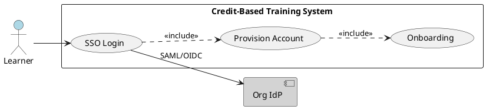
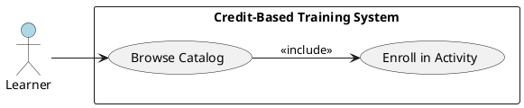
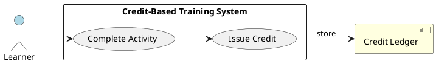
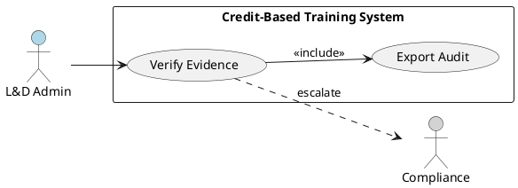
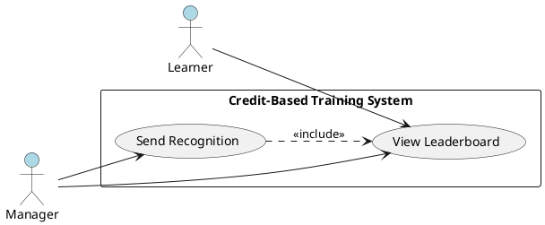
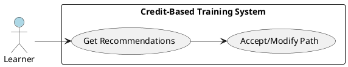
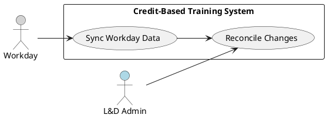
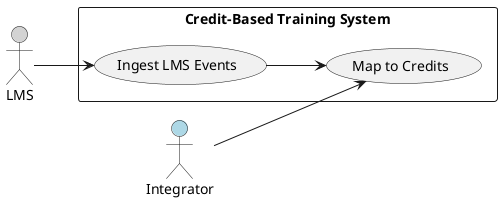
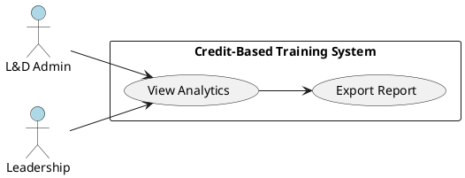

# Requirements Specification

## Feature Goal
Build a web-based, credit-based Training System that enables organization employees to discover, complete, and verify AI upskilling activities, earn auditable credits and badges, apply for external certifications from approved providers, and participate in ranking/gamification tied to recognition and career advancement. The end state: a Microsoft Learn–style web platform with Org SSO, Workday sync for org/manager data, a verifiable credit ledger (auditable, tamper-evident), admin workflows for provider and credit management, and a roadmap for future LMS integration. Current state: no platform exists; Workday is the authoritative HR system.

## Business Justification
- Business value and user impact
  - Increases AI competency across the organization by providing a discoverable, trackable learning experience tied to measurable credits and certification.
  - Drives measurable adoption and engagement via gamification (badges, leaderboards) and manager-driven recognition.
  - Ensures credits are verifiable and auditable for HR and compliance uses (promotion, role placement).
- Integration with existing features
  - Uses Org SSO (SAML/OIDC) for authentication and Workday for employee identity, manager mapping, and org structure.
  - Exposes APIs for future LMS (LTI/xAPI/SCORM) integration and for certification provider interactions.
- Problems this solves and for whom
  - Learners: friction-less enrollment, progress tracking, recognized credentials.
  - L&D / Talent Ops: verifiable credit ledger, provider management, reporting.
  - Leadership: measurable KPIs for AI upskilling and audit-ready evidence for promotions.

## Feature Scope
- User-visible behavior
  - SSO login and onboarding for employees.
  - Searchable, filterable learning catalog with credit values and provider information.
  - Enrollment, completion tracking, evidence upload, and credit issuance.
  - Badge and achievements display on profile; leaderboards and configurable ranking windows (weekly/monthly/quarterly).
  - Certification application flow to approved providers with status tracking and evidence attachment.
  - L&D admin console for provider/credit management, manual verification, audit exports, and analytics dashboard.
- Technical requirements
  - Workday scheduled incremental sync for org structure and manager relationships.
  - Immutable, tamper-evident credit ledger (append-only with cryptographic hash chain or verifiable credential pattern).
  - APIs for provider interactions and future LMS adapters (LTI/xAPI).
  - Accessibility to WCAG 2.1 AA.
  - Security controls aligned to OWASP: input validation, parameterized queries, encryption at rest (AES-256) and in transit (TLS 1.2+), RBAC, session security.

### Success Criteria
- [ ] 95% of Org SSO login attempts succeed and complete in ≤3 seconds for the first login (MVP).
- [ ] 90% of credits issued include attached evidence and an issued-verification record within 24 hours.
- [ ] System uptime ≥ 99.5% in production.
- [ ] Catalog search 95th-percentile response time ≤ 200ms.
- [ ] All credit transactions are exportable and tamper-evident; forensic trace for any credit is available within 30 seconds of query.

## Functional Requirements

Summary of Functional Requirements to be expanded below:
- FR-001: [DETERMINISTIC] System MUST support Org SSO (SAML/OIDC) login and automatic user provisioning.
- FR-002: [DETERMINISTIC] System MUST provide a searchable learning catalog with filters, tags, and credit metadata.
- FR-003: [DETERMINISTIC] System MUST issue verifiable credits to user accounts upon completion and store evidence + provenance.
- FR-004: [DETERMINISTIC] System MUST award badges and record timestamps; badges MUST display in profile and be exportable.
- FR-005: [DETERMINISTIC] System MUST provide certification application workflow to approved providers with lifecycle tracking.
- FR-006: [DETERMINISTIC] System MUST provide an admin UI for provider, credit, and verification management and audit exports.
- FR-007: [DETERMINISTIC] System MUST sync organizational structure and manager relationships from Workday on a scheduled incremental basis.
- FR-008: [DETERMINISTIC] System MUST compute and display leaderboards and rankings with configurable windows and anti-fraud rules.
- FR-009: [DETERMINISTIC] System MUST meet WCAG 2.1 AA accessibility across public UI components.
- FR-010: [DETERMINISTIC] System MUST maintain immutable audit logs for credit-related transactions and support query + export.
- FR-011: [HYBRID] System SHOULD recommend personalized learning paths using a hybrid AI + business-rule approach with user override.
- FR-012: [HYBRID] System SHOULD provide AI-assisted automated evidence parsing and flagging for admin review.
- FR-013: [HYBRID] System SHOULD generate notification/email draft suggestions for manager prompts and certification updates.
- FR-014: [DETERMINISTIC] System MUST provide an analytics dashboard for L&D/KPI tracking and exportable reports.
- FR-015: [DETERMINISTIC] System SHOULD provide adapters (scoped future work) for SCORM/xAPI/LTI to integrate LMS content.
- FR-016: [HYBRID] System SHOULD suggest career advancement eligibility and draft nominations based on credits, manager confirmation required.
- FR-017: [DETERMINISTIC] System MUST expose API endpoints for internal/external credit verification with signed responses.
- FR-018: [DETERMINISTIC] System MUST support audit export and forensic traceability using cryptographic hashes / verifiable credential patterns.

Expanded Functional Requirements

FR-001: [DETERMINISTIC] System MUST support Org SSO (SAML/OIDC) login and automatic user provisioning.
- Who needs it: All employees (learners) and admins.
- Trigger: User attempts to access the web platform.
- Success outcome: User is authenticated by Org IdP; user record provisioned or updated with Workday ID and role.
- Failure scenarios: IdP unreachable; provisioning mismatch; user not authorized.
- Acceptance criteria:
  1. System MUST support SAML 2.0 and OIDC flows; admin can configure IdP metadata endpoint or upload metadata.
  2. 95% of successful logins complete in ≤3 seconds in normal network conditions.
  3. Automatic provisioning MUST create or update user profile with Workday ID and email; no duplicate accounts for same Workday ID.
  4. Unauthenticated requests MUST redirect to IdP; session cookies MUST be HttpOnly, Secure, SameSite=Strict.
- Priority: MUST (M)
- Security controls: Enforce least privilege, validate IdP metadata, rotate SSO certificates, log auth events, rate-limit auth endpoints.
- Dependencies: IdP metadata, test IdP environment, Workday ID mapping.

FR-002: [DETERMINISTIC] System MUST provide a searchable learning catalog with filters, tags, and credit metadata.
- Who needs it: Learners, managers.
- Trigger: User opens catalog or performs search.
- Success outcome: Relevant results displayed sorted by relevance, with filters (skill, level, provider, credit value, completion time).
- Failure scenarios: No results, slow response.
- Acceptance criteria:
  1. Search shall return first page of results within 200ms (95th percentile).
  2. Filters MUST be combinable; results MUST include credit value, estimated completion time, provider, and badges awarded.
  3. Catalog entries MUST have unique IDs and content provenance fields (source, last-updated).
  4. Catalog UI MUST allow enroll action in ≤3 clicks from search result.
- Priority: MUST (M)
- Security controls: Input sanitize search queries; avoid injection; cache content with proper cache-control headers.
- Dependencies: Content ingestion pipeline, provider metadata.

FR-003: [DETERMINISTIC] System MUST issue verifiable credits to user accounts upon completion and store evidence + provenance.
- Who needs it: Learners, L&D admins, HR.
- Trigger: System receives completion signal (internal completion, provider callback, evidence upload + admin verification).
- Success outcome: Credit record created in ledger with user ID, credit amount, evidence pointer(s), timestamp, issuer, and cryptographic hash.
- Failure scenarios: Duplicate credit issuance; evidence missing; provider callback failed.
- Acceptance criteria:
  1. Credits MUST be created as append-only ledger entries with unique transaction IDs and cryptographic hash chain linking to previous state.
  2. Each credit MUST include: user identifier (Workday ID), activity ID, credit amount, issuer (provider ID), timestamp, evidence metadata (type, storage pointer, checksum), and verification status.
  3. System MUST prevent duplicate issuance for the same activity and same evidence; idempotency MUST be guaranteed using dedupe keys.
  4. 90% of provider callbacks processed within 60 seconds; retry & dead-letter handling documented.
- Priority: MUST (M)
- Security controls: Encrypt evidence at rest (AES-256), sign ledger entries, parameterize DB queries, validate all callbacks with HMAC or mutual TLS.
- Dependencies: Storage for evidence (secure blob store), provider integrations, ledger service.

FR-004: [DETERMINISTIC] System MUST award badges and record timestamps; badges MUST display in profile and be exportable.
- Who needs it: Learners, managers.
- Trigger: Credit thresholds or completion of badge-qualifying activities.
- Success outcome: Badge issued, timestamp recorded, badge visible in user profile and exportable in CSV/PDF.
- Failure scenarios: Badge not issued; incorrect badge metadata.
- Acceptance criteria:
  1. Badge issuance MUST be deterministic based on badge rules (thresholds, prerequisites).
  2. Badge records MUST include badge ID, user ID, issuance timestamp, source activity IDs, and metadata (badge image, description).
  3. Profile display MUST show badges and allow export; export size LIMITS documented.
- Priority: SHOULD (S) for engagement; MUST for MVP per business goal (so treated as MUST).
- Security controls: Avoid embedding PII in badge images; export protected by RBAC.
- Dependencies: Badge rule engine, profile UI.

FR-005: [DETERMINISTIC] System MUST provide certification application workflow to approved providers with lifecycle tracking.
- Who needs it: Learners, providers, L&D admins.
- Trigger: Learner initiates certification application for an approved provider.
- Success outcome: Application submitted to provider with attached evidence and status tracked until closed.
- Failure scenarios: Provider rejects application; provider API unavailable.
- Acceptance criteria:
  1. Application form MUST collect required fields per provider template; attachments allowed up to configurable size (default 50MB).
  2. System MUST log application events and show status updates (Submitted, Under Review, Approved, Rejected) with timestamps.
  3. For API-capable providers, system MUST send signed application payloads; for manual providers, system MUST generate exportable package.
  4. Notifications MUST be sent to applicant and manager on status changes within 5 minutes of status update.
- Priority: MUST (M)
- Security controls: Validate and sanitize uploaded files; virus-scan attachments; sign outbound payloads; RBAC for viewing applications.
- Dependencies: Provider API specs or manual acceptance procedures.

FR-006: [DETERMINISTIC] System MUST provide an admin UI for provider, credit, and verification management and audit exports.
- Who needs it: L&D admins, compliance.
- Trigger: Admin requests provider/credit management or exports.
- Success outcome: Admin can create/edit providers, view pending verifications, manually verify evidence, and export audit reports (CSV/PDF).
- Failure scenarios: Unauthorized admin access; export timeout.
- Acceptance criteria:
  1. Admin UI MUST support CRUD for provider records with approval workflow.
  2. Admins MUST be able to view pending evidence items, flag for manual review, accept/reject, and annotate reasons.
  3. Audit export MUST support date ranges, filters (user, provider, activity) and export within 2 minutes for up to 1M records (paged streaming).
  4. All admin actions MUST be logged in audit logs with actor ID and timestamp.
- Priority: MUST (M)
- Security controls: RBAC with least privilege, MFA for admin accounts, audit logging, input validation.
- Dependencies: Audit log system, secure storage.

FR-007: [DETERMINISTIC] System MUST sync organizational structure and manager relationships from Workday on a scheduled incremental basis.
- Who needs it: System, L&D admins.
- Trigger: Scheduled sync or manual run by admin.
- Success outcome: Organization structure and manager mapping in the system reflect Workday within configured sync window.
- Failure scenarios: Sync failures, mapping mismatches.
- Acceptance criteria:
  1. Sync frequency MUST be configurable (default: hourly) and support incremental change tokens.
  2. Sync MUST map unique employee identifier (Workday ID) and manager relationships without creating duplicates.
  3. Reconciliation report MUST list mismatches and create issues for manual resolution.
  4. Sync failures MUST be retried with exponential backoff and surfaced as alerts to support within 30 minutes.
- Priority: MUST (M)
- Security controls: Secure Workday API credentials stored in secret manager; RBAC for sync admin; encrypted transport.
- Dependencies: Workday API access and test environment.

FR-008: [DETERMINISTIC] System MUST compute and display leaderboards and rankings with configurable windows and anti-fraud rules.
- Who needs it: Learners, managers, leadership.
- Trigger: Periodic leaderboard recompute or user view.
- Success outcome: Accurate ranking displayed for configured windows, with fraud mitigation.
- Failure scenarios: Incorrect ranking, performance issues.
- Acceptance criteria:
  1. Leaderboard windows MUST be configurable (weekly, monthly, quarterly) and use deterministic tie-breaking rules.
  2. Ranking compute MUST complete within 2 minutes for org sizes up to 50k users and be incremental for larger datasets.
  3. Anti-fraud rules MUST flag suspicious patterns (rapid repeat crediting, duplicate evidence) and hold affected credits for manual review.
  4. Leaderboard endpoints MUST support pagination and filter by org unit/role.
- Priority: SHOULD (S)
- Security controls: Rate-limit leaderboard endpoints; hide PII in public leaderboards; RBAC to view team-level leaderboards.
- Dependencies: Credit ledger, compute worker service.

FR-009: [DETERMINISTIC] System MUST meet WCAG 2.1 AA accessibility across public UI components.
- Who needs it: All users, compliance officers.
- Trigger: UI rendering and acceptance testing.
- Success outcome: UI components meet WCAG 2.1 AA criteria.
- Failure scenarios: Accessibility violations discovered.
- Acceptance criteria:
  1. All interactive elements MUST be keyboard accessible and have visible focus states.
  2. Color contrast MUST meet 4.5:1 for normal text and 3:1 for large text.
  3. All images and dynamic content MUST have accessible names/ARIA and semantic HTML.
  4. Accessibility tests (automated + manual) MUST pass for 100% of core user flows before release.
- Priority: MUST (M)
- Security controls: N/A (accessibility-focused).
- Dependencies: Frontend design system implementation.

FR-010: [DETERMINISTIC] System MUST maintain immutable audit logs for credit-related transactions and support query + export.
- Who needs it: Compliance, auditors.
- Trigger: Credit transaction or admin action.
- Success outcome: Audit logs show complete chain with cryptographic integrity; queries return ordered events.
- Failure scenarios: Missing logs, tampering suspicion.
- Acceptance criteria:
  1. Audit logs MUST be append-only, timestamped, and include actor ID, action, resource ID, before/after state (if applicable).
  2. Audit data MUST support verifiable integrity via cryptographic signatures or hash chaining; verification routine MUST detect tampering.
  3. Query interface MUST return results within 30s for typical queries and support export (CSV/JSON) for up to 1M events via streaming.
  4. Logs MUST be retained per configurable retention policy and exportable to SIEM.
- Priority: MUST (M)
- Security controls: Store logs in write-once storage or ensure immutability; restrict access; encrypt at rest.
- Dependencies: Ledger service, key management.

FR-011: [HYBRID] System SHOULD recommend personalized learning paths using a hybrid AI + business-rule approach with user override.
- Who needs it: Learners, managers.
- Trigger: User onboarding or "Recommendations" view.
- Success outcome: A ranked list of suggested learning paths tailored to user role, past credits, and career goals.
- Failure scenarios: Irrelevant suggestions; privacy concerns.
- Acceptance criteria:
  1. Recommendations MUST combine deterministic rule filters (role/required skills) and AI model scoring; model outputs MUST include confidence scores and explainable reasons.
  2. Users MUST be able to accept, modify, or dismiss recommendations; dismissed items MUST not be suggested again for a configurable period.
  3. Recommendation latency SHOULD be ≤1s for cached suggestions; ≤3s for on-demand scoring.
  4. The system MUST log model inputs and outputs for audit and model improvement; PII in logged data MUST be minimized.
- Priority: SHOULD (S)
- Security controls: Model input sanitization; least-privilege access to training data; recordkeeping for model decisions per AI governance.
- Dependencies: Recommendation model, data pipeline.

FR-012: [HYBRID] System SHOULD provide AI-assisted automated evidence parsing and flagging for admin review.
- Who needs it: L&D admins, auditors.
- Trigger: Evidence upload or provider callback.
- Success outcome: System extracts structured metadata (transcript, certificate fields) and flags anomalies for manual review.
- Failure scenarios: Parsing errors or false positives.
- Acceptance criteria:
  1. Automated parser MUST extract defined fields (name, provider, date, course ID) with >= 85% accuracy on sample dataset for MVP.
  2. Parsed results MUST be presented to admins with confidence scores and link to original evidence.
  3. System MUST allow admin to accept/override parsed values; overrides MUST update ledger provenance.
  4. All parsing steps MUST be logged; sensitive content redaction MUST be supported.
- Priority: COULD (C) for MVP; recommended in phase 2.
- Security controls: Do not store raw PII longer than needed; encrypt evidence; access controls for parser logs.
- Dependencies: OCR / NLP services, evidence storage.

FR-013: [HYBRID] System SHOULD generate notification/email draft suggestions for manager prompts and certification updates.
- Who needs it: Learners, managers, admins.
- Trigger: Status changes (application update, badge awarded), scheduled nudges.
- Success outcome: Manager receives context-aware draft notification that admin or system can send.
- Failure scenarios: Incorrect recipient; sensitive data leakage.
- Acceptance criteria:
  1. Draft notifications MUST be generated with templated variables and suggested text; admins/users MUST be able to edit before send.
  2. Generated drafts MUST include rationale and link to user profile and evidence.
  3. 95% of generated suggestions MUST adhere to policy templates; flagged suggestions MUST route to compliance review.
- Priority: COULD (C)
- Security controls: Sanitize generated text; restrict who can send notifications; audit sent messages.
- Dependencies: Templating engine, notification service.

FR-014: [DETERMINISTIC] System MUST provide an analytics dashboard for L&D/KPI tracking and exportable reports.
- Who needs it: L&D, leadership.
- Trigger: Admin opens dashboard or requests exported report.
- Success outcome: Dashboard displays adoption KPIs, credit issuance trends, certification counts, and provides filters; exportable.
- Failure scenarios: Stale data, long export times.
- Acceptance criteria:
  1. Dashboard MUST show: active users (30d), credits issued (period), cert applications (pending/approved/rejected), top learners by credits.
  2. Dashboard data MUST be refreshable on demand and reflect events within configured near-real-time (default 15 min latency).
  3. Export MUST support CSV/PDF and scheduled exports.
- Priority: SHOULD (S)
- Security controls: RBAC for dashboard views; anonymized aggregates for leadership as needed.
- Dependencies: Event pipeline, analytics DB.

FR-015: [DETERMINISTIC] System SHOULD provide adapters (scoped future work) for SCORM/xAPI/LTI to integrate LMS content.
- Who needs it: L&D, integration engineers.
- Trigger: Integration request with LMS.
- Success outcome: System can ingest activity/completion and map to credits.
- Failure scenarios: Incompatible formats.
- Acceptance criteria:
  1. Adapter design MUST support xAPI / LTI 1.3 and SCORM 1.2+. Implementation planned as a separate project with defined API contracts.
  2. Adapter MUST map activity statements to internal activity IDs and support idempotent completion events.
- Priority: COULD (C) — future phase.
- Security controls: Validate and authenticate LMS callbacks.
- Dependencies: LMS APIs, adapter implementation.

FR-016: [HYBRID] System SHOULD suggest career advancement eligibility and draft nominations based on credits, manager confirmation required.
- Who needs it: Managers, HR.
- Trigger: Manager views team member profile or periodic eligibility check.
- Success outcome: System suggests eligible employees for advancement; manager confirms or rejects.
- Failure scenarios: False positives; bias.
- Acceptance criteria:
  1. Eligibility rules MUST be transparent and configurable; suggestions MUST include evidence and required thresholds.
  2. Manager confirmation MUST be required to convert suggestion into formal nomination.
  3. System MUST log all suggestions and manager decisions for audit.
- Priority: COULD (C)
- Security controls: Access control to nomination data; audit logs.
- Dependencies: HR policy rules, Workday mapping.

FR-017: [DETERMINISTIC] System MUST expose API endpoints for internal/external credit verification with signed responses.
- Who needs it: External providers, internal HR systems.
- Trigger: External verification request (API call).
- Success outcome: API returns signed verification payload confirming credit details.
- Failure scenarios: Invalid request; signing key compromise.
- Acceptance criteria:
  1. Verification API MUST accept authenticated requests (mutual TLS or OAuth2) and return signed JSON payloads including credit ID, user Workday ID, issuer, timestamp, and verification signature.
  2. Signatures MUST use industry-standard asymmetric keys (e.g., RSA/ECDSA); key rotation MUST be supported.
  3. Rate-limiting and monitoring MUST be applied.
- Priority: SHOULD (S)
- Security controls: Authenticate callers, validate scopes, rotate signing keys, audit verification requests.
- Dependencies: Key management service, API gateway.

FR-018: [DETERMINISTIC] System MUST support audit export and forensic traceability using cryptographic hashes / verifiable credential patterns.
- Who needs it: Compliance, auditors.
- Trigger: Audit export request.
- Success outcome: Exported report verifies ledger integrity and shows trace for selected credits.
- Failure scenarios: Incomplete trace.
- Acceptance criteria:
  1. Export MUST include ledger state snapshots with hash chain information and signed metadata proving integrity.
  2. Forensic trace for a credit MUST return full provenance including all linked evidence and verification steps within 30 seconds.
  3. Exports MUST be verifiable offline using published public keys.
- Priority: MUST (M)
- Security controls: Secure key storage, signed exports, restrict export access.
- Dependencies: Key management, ledger implementation.

## Use Case Analysis

### Actors & System Boundary
- Primary Actor: Learner — an employee who discovers, enrolls, completes learning, uploads evidence, applies for certification, and views badges/leaderboards.
- Secondary Actor: Manager — views team progress, receives notifications, confirms nominations, and provides recognition.
- Secondary Actor: L&D Admin — manages providers, reviews evidence, verifies credits, exports audits and runs analytics.
- System Actor: Workday — authoritative HR system providing employee IDs, manager relationships, org structure.
- System Actor: Org IdP (SAML/OIDC) — authenticates users.
- External Actor: Certification Provider — receives certification applications and returns status (API or manual).
- External Actor: LMS (future) — provides activities and completion events via xAPI/LTI/SCORM.
- System Boundary: "Credit-Based Training System" (web application + APIs + admin console + ledger + storage)

### Use Case Specifications

#### UC-001: User Login & Onboarding
- Actor(s): Learner
- Goal: Authenticate via Org SSO and complete minimal onboarding to start learning.
- Preconditions: Learner has active Org account; IdP configured.
- Success Scenario:
  1. Learner navigates to platform URL.
  2. System redirects to Org IdP for SAML/OIDC authentication.
  3. IdP authenticates user and returns assertion/token.
  4. System validates assertion, provisions or updates user profile (maps Workday ID).
  5. System presents onboarding steps (consent, profile completion) and shows personalized dashboard.
- Extensions/Alternatives:
  - 2a. IdP timeout → Show error and contact support link.
  - 4a. Provisioning conflict (existing user) → Merge flow with admin notification.
- Postconditions: User is authenticated and onboarded; session established; initial recommendation shown.
- Use Case Diagram


#### UC-002: Browse Catalog & Enroll
- Actor(s): Learner
- Goal: Find relevant learning activities and enroll.
- Preconditions: User authenticated; catalog populated.
- Success Scenario:
  1. Learner opens Catalog.
  2. Learner searches or uses filters (skill, level, provider).
  3. System returns results with credit values and estimated time.
  4. Learner clicks Enroll; system confirms enrollment and adds to learner’s active activities.
- Extensions/Alternatives:
  - 2a. No results → Suggest related items or refine filters.
  - 4a. Enrollment requires manager approval → Submit request and notify manager.
- Postconditions: Enrollment recorded; activity appears in learner dashboard.
- Use Case Diagram


#### UC-003: Complete Learning & Earn Credit
- Actor(s): Learner, System
- Goal: Complete activity, provide evidence if required, and receive credit.
- Preconditions: Learner enrolled; activity available (internal or external).
- Success Scenario:
  1. Learner completes activity (internal completion event or evidence upload).
  2. System receives completion signal or evidence.
  3. System runs deterministic checks (activity ID match, dedupe).
  4. System issues credit ledger entry with evidence pointer and verification status (auto-verified or pending admin).
  5. Learner receives notification of credit issuance and badge if threshold met.
- Extensions/Alternatives:
  - 2a. Evidence requires parsing → Automated parser extracts metadata and flags low-confidence items for admin review.
  - 4a. Duplicate detected → System prevents duplicate credit and notifies user.
- Postconditions: Credit recorded in ledger; badge may be awarded.
- Use Case Diagram


#### UC-004: Apply for Certification
- Actor(s): Learner, Certification Provider, L&D Admin
- Goal: Submit application to approved provider and track status.
- Preconditions: Learner has required credits/evidence.
- Success Scenario:
  1. Learner selects provider and starts application.
  2. Learner completes provider form and attaches evidence.
  3. System sends application to provider via API or prepares manual package.
  4. Provider returns status updates; system updates application lifecycle and notifies learner/manager.
- Extensions/Alternatives:
  - 3a. Provider API down → queue and retry with backoff; notify admin if stalled > 24h.
  - 4a. Provider requests more info → system routes request to learner.
- Postconditions: Application tracked to closure; record stored in ledger.
- Use Case Diagram
```plantuml
@startuml
left to right direction
skinparam packageStyle rectangle

actor Learner #add8e6
actor "Certification Provider" #d3d3d3
actor "L&D Admin" #add8e6
rectangle "Credit-Based Training System" {
  usecase (Start Certification Application) as UC4
  usecase (Track Application Status) as UC4b
}

Learner --> UC4
UC4 --> UC4b
UC4 ..> "Certification Provider" : submit
"Certification Provider" --> UC4b : status update
L&D Admin --> UC4b : review
@enduml
```

#### UC-005: Admin Verify Credits / Audit
- Actor(s): L&D Admin, Compliance
- Goal: Review pending evidence, verify credits, and export audit reports.
- Preconditions: Pending verification items exist; admin role assigned.
- Success Scenario:
  1. Admin opens verification queue.
  2. Admin reviews evidence (with parser assistance), accepts or rejects.
  3. System updates ledger verification status and logs admin action.
  4. Admin exports audit report as required.
- Extensions/Alternatives:
  - 2a. Evidence flagged as fraudulent → escalate to compliance.
  - 3a. Admin override updates provenance and notifies learner.
- Postconditions: Credits verified/rejected; audit logs updated.
- Use Case Diagram


#### UC-006: Leaderboard & Recognition
- Actor(s): Learner, Manager
- Goal: Display rankings and enable recognition actions.
- Preconditions: Credits exist and leaderboard compute run.
- Success Scenario:
  1. Learner/manager opens leaderboard.
  2. System displays ranking with configurable window and filters.
  3. Manager may send recognition or nomination actions (which are audited).
- Extensions/Alternatives:
  - 2a. Suspicious activity flagged → hide suspect credits until review.
- Postconditions: Leaderboard reflects current rankings; recognition actions logged.
- Use Case Diagram


#### UC-007: Personalized Recommendation
- Actor(s): Learner
- Goal: Receive personalized learning path recommendations.
- Preconditions: User profile and credit history available.
- Success Scenario:
  1. Learner opens Recommendations.
  2. System computes hybrid recommendations (rules + model) and returns ranked paths with explanations.
  3. Learner accepts or customizes a path; action stored.
- Extensions/Alternatives:
  - 2a. Low confidence → mark recommendations as requiring manual review or show fallback curated content.
- Postconditions: Recommendation accepted/modified/persisted.
- Use Case Diagram


#### UC-008: Workday Sync
- Actor(s): System (Scheduled Job), L&D Admin
- Goal: Sync employees and manager relationships from Workday.
- Preconditions: Workday API credentials configured.
- Success Scenario:
  1. Scheduled job queries Workday incremental API.
  2. System applies changes to user records and org structure.
  3. Reconciliation report created for mismatches.
- Extensions/Alternatives:
  - 1a. API throttled → backoff and retry; notify admin on repeated failures.
- Postconditions: System users reflect Workday state within configured window.
- Use Case Diagram


#### UC-009: LMS Integration (Future)
- Actor(s): System Integrator, LMS
- Goal: Integrate LMS activity statements and map to credits.
- Preconditions: LMS supports xAPI/LTI and credentials available.
- Success Scenario:
  1. Integrator configures LMS adapter.
  2. Adapter ingests completion events and maps to internal activity IDs.
  3. Credits are issued idempotently.
- Extensions/Alternatives:
  - 1a. LMS vendor uses nonstandard schema → create mapping adapter.
- Postconditions: LMS completions reflected as credits.
- Use Case Diagram


#### UC-010: Analytics & Reporting
- Actor(s): L&D Admin, Leadership
- Goal: View KPI dashboard and export reports for adoption and compliance.
- Preconditions: Event pipeline and analytics DB populated.
- Success Scenario:
  1. Admin opens Analytics dashboard.
  2. System displays KPIs with graphs and filters.
  3. Admin requests export; system streams report for download.
- Extensions/Alternatives:
  - 2a. Data staleness → system indicates last update timestamp and refresh option.
- Postconditions: Dashboard accessed and exports generated.
- Use Case Diagram


## Risks & Mitigations
1. Risk: Weak or forged evidence undermines credit integrity.
   - Mitigation: Hybrid verification - require provider attestation or admin verification for high-value credits; automated parsing + manual review; cryptographic ledger to deter tampering.
2. Risk: Low user adoption reducing ROI.
   - Mitigation: Seamless SSO onboarding, manager-driven campaigns, gamification with meaningful recognition, UX modeled after proven platforms (Microsoft Learn).
3. Risk: Data privacy and regulatory violations (PII exposure).
   - Mitigation: Minimize PII stored; encrypt data at rest and in transit (AES-256, TLS 1.2+); retention policy; access controls and audit logs; privacy by design for AI features.
4. Risk: Delays/incompatibility with Workday or provider APIs.
   - Mitigation: Early integration artifacts, test environments, fallback manual ingestion, reconciliation reports, and robust retry/backoff strategies.
5. Risk: Gaming leaderboards or badge inflation.
   - Mitigation: Anti-fraud detection rules, hold suspicious credits for review, deterministic tie-breakers, manual audit trails, and limit behavioral incentives that encourage spurious completions.

## Constraints & Assumptions
1. Constraint: Initial delivery platform is Web only (mobile responsive), native mobile planned later.
2. Assumption: Workday provides API access and unique employee identifiers for mapping.
3. Assumption: Org IdP supports SAML 2.0 or OIDC and can supply metadata for integration.
4. Constraint: MVP must deliver core M features within timebox; advanced AI features (parser, recommendations) may be staged.
5. Assumption: Approved certification providers will either support API callbacks or accept exported application packages; manual/case-by-case handling is supported.

# End of Specification