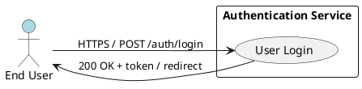
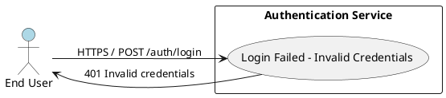
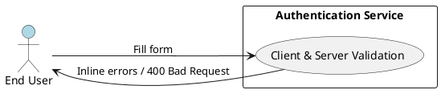
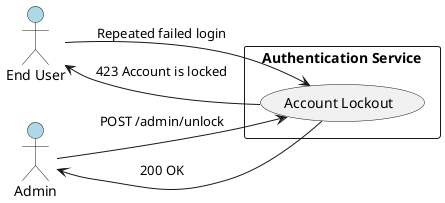
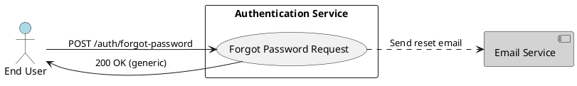
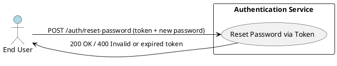
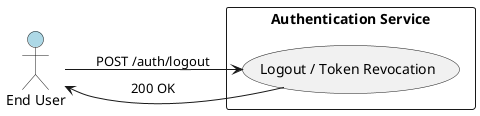
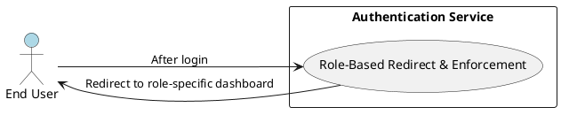

# Requirements Specification

## Feature Goal
Build a secure, auditable, and user-friendly email+password authentication service that replaces or complements the current state (ad-hoc / unspecified) with a production-ready login flow that: validates inputs client- and server-side, authenticates against a hardened user store, issues time-bound authentication tokens, enforces role-based access, and provides self-service recovery (forgot/reset password) while preventing brute-force attacks.

## Business Justification
- Business value and user impact
  - MUST reduce unauthorized access risk and ensure only authenticated users reach role-appropriate dashboards.
  - MUST decrease support load by enabling secure self-service password reset and clear, non-revealing error messaging.
  - MUST provide audit trails and controls required by security/compliance stakeholders.
- Integration with existing features
  - MUST integrate with existing user database (User DB), email delivery provider, and API gateway / web application.
  - SHOULD integrate with existing logging/monitoring and secrets management (KMS / secret store).
- Problems this solves and for whom
  - Solves insecure or inconsistent login handling for end users (customers/admins/employees).
  - Solves lack of recovery/lockout controls for support and security teams.
  - Solves missing auditability for compliance/ops teams.

## Feature Scope
User-visible behavior:
- Users MUST be able to log in with email and password.
- Users MUST see inline validation for empty/format fields and receive non-revealing generic error messages on authentication failure.
- Users MUST be redirected to a role-appropriate dashboard on successful login.
- Users MUST be able to request a password reset via email and complete reset using a single-use token.

Technical requirements:
- Server-side credential verification MUST use a modern hashed password scheme (Argon2id preferred) with algorithm versioning.
- Authentication tokens MUST be generated with a default TTL of 30 minutes (configurable).
- Account lockout MUST occur after 5 failed attempts with configurable lockout duration and admin unlock capability.
- Authentication endpoints MUST be served over TLS and enforce OWASP best-practices (rate limiting, parameterized queries, secure cookies).
- Audit logs MUST be produced for auth events (success/failure/lock/unlock/reset).
- Sensitive data MUST not be returned in API responses or logs.

### Success Criteria
- [ ] Given a registered user with valid credentials, the system MUST authenticate and redirect the user to role-specific dashboard within 2 seconds (95th percentile).
- [ ] Given invalid credentials, the system MUST return 401 Unauthorized and display a non-revealing message "Invalid credentials" (no account existence leakage).
- [ ] Tokens MUST expire after configured TTL (default 30 minutes) and cannot be used after expiry.
- [ ] After 5 failed attempts, account MUST be locked and cannot authenticate until lockout duration expires or admin unlocks.
- [ ] Password reset tokens MUST be single-use, expire within configured window (default 1 hour), and be delivered via configured email provider with delivery success logged.

## Functional Requirements

Summary of all Functional Requirements to generate

| FR-ID | Tag | Short description |
|---|---:|---|
| FR-001 | [DETERMINISTIC] | Allow users to log in with email + password |
| FR-002 | [DETERMINISTIC] | Client- and server-side input validation and non-revealing errors |
| FR-003 | [DETERMINISTIC] | Verify credentials using secure password hashing against User DB |
| FR-004 | [DETERMINISTIC] | Issue authentication tokens (JWT or opaque) with TTL=30m default |
| FR-005 | [DETERMINISTIC] | Enforce role-based redirect and server-side role enforcement |
| FR-006 | [DETERMINISTIC] | Lock account after 5 failed attempts; admin unlock and configurable duration |
| FR-007 | [DETERMINISTIC] | Forgot password flow: single-use reset token via email, expiry |
| FR-008 | [DETERMINISTIC] | Store passwords using Argon2id (or bcrypt) with algorithm versioning |
| FR-009 | [DETERMINISTIC] | Token expiry and logout token invalidation/revocation strategy |
| FR-010 | [DETERMINISTIC] | Audit logging for authentication events and security alerts |
| FR-011 | [HYBRID] | Rate limiting and CAPTCHA for suspicious login attempts (adaptive) |
| FR-012 | [DETERMINISTIC] | Provide optional MFA capability (TOTP) for privileged roles |
| FR-013 | [UNCLEAR] | Support SSO/OAuth2/OpenID Connect integration (scope to be defined) |

Expanded Functional Requirements (each has measurable acceptance criteria)

- FR-001: [DETERMINISTIC] System MUST allow users to log in with email and password.
  - Acceptance Criteria:
    - GIVEN a registered user with active account and correct email/password, WHEN the user submits the login form, THEN the system SHALL return HTTP 200, issue an authentication token, and redirect to role-appropriate dashboard within 2s (95th percentile).
    - GIVEN invalid credentials, WHEN user submits, THEN system SHALL return HTTP 401 and not issue tokens.
    - SHALL NOT expose the password in any API response or logs.
  - Notes: Server SHALL use rate limiting and account lockout (FR-006) to prevent brute force.

- FR-002: [DETERMINISTIC] System MUST validate email and password inputs client-side and server-side and present non-revealing error messages.
  - Acceptance Criteria:
    - Client-side: empty email or password field SHALL show inline validation and prevent submit.
    - Server-side: malformed email SHALL return HTTP 400 with specific field error; authentication failures SHALL return HTTP 401 with message "Invalid credentials" (no indication whether email exists).
    - Error messages SHALL be accessible (aria-live) and localized when available.
  - Security Controls: Input validation SHALL use strict server-side checks and parameterized DB queries to prevent injection.

- FR-003: [DETERMINISTIC] System MUST verify credentials by comparing submitted password to the stored password hash in User DB using secure verification.
  - Acceptance Criteria:
    - Password verification SHALL use constant-time comparison to avoid timing attacks.
    - GIVEN user record with hash, WHEN verifying, THEN algorithm/parameters used SHALL match stored algorithm version or trigger rehash flow.
    - Failed verification SHALL increment failed_attempts counter atomically.
  - Implementation notes: Password verification SHALL be implemented server-side in authentication service.

- FR-004: [DETERMINISTIC] System MUST generate authentication tokens (JWT or opaque) with a default expiry (TTL) of 30 minutes; token type SHALL be configurable and keys managed by KMS.
  - Acceptance Criteria:
    - Tokens SHALL include minimal claims (user_id, roles, issued_at, exp, token_id).
    - By default, tokens SHALL expire after 30 minutes; configuration SHALL be environment-driven.
    - Token signing key SHALL be stored/managed in KMS; tokens SHALL be verifiable by resource servers.
    - If JWT chosen, system SHALL include token_id to support revocation list/blacklist.
  - Security Controls: Token contents SHALL not include sensitive PII.

- FR-005: [DETERMINISTIC] System MUST perform server-side role-based enforcement and redirect users to role-specific dashboards after authentication.
  - Acceptance Criteria:
    - After successful authentication, system SHALL fetch roles and map to application landing path and return redirect location to client.
    - API calls SHALL enforce role checks server-side; access SHALL be denied with HTTP 403 when role insufficient.
    - Acceptance tests SHALL include at least one role-based route protected for each role type.
  - Notes: Role mapping data SHALL be stored in user profile and authoritative at server-side.

- FR-006: [DETERMINISTIC] System MUST lock an account after 5 failed authentication attempts; lockout duration SHALL be configurable and admins SHALL be able to unlock.
  - Acceptance Criteria:
    - System SHALL increment failed_attempts per failed authentication and lock account when count >= 5.
    - Locked account SHALL return HTTP 423 Locked (or 403 with specific code) and message "Account is locked" for login attempts.
    - Admin-facing API SHALL allow unlocking account; successful unlock SHALL reset failed_attempts and locked_until.
    - Locks SHALL be enforced server-side across distributed instances (store in DB or Redis).
  - Performance: Failed attempt counters SHALL be updated atomically to avoid race conditions.

- FR-007: [DETERMINISTIC] System MUST provide a "Forgot Password" flow that issues single-use reset tokens, sends them via configured email provider, and enforces expiration (default 1 hour).
  - Acceptance Criteria:
    - WHEN user requests reset with an email, system SHALL create a cryptographically random token linked to user_id with expiry and store a hashed version.
    - Email SHALL contain a link with token reference; link SHALL be single-use and expire after default 1 hour.
    - Using a valid token SHALL allow user to set new password and invalidate token immediately.
    - Password reset SHOULD NOT reveal whether the email exists (response SHALL be generic: "If an account exists, a reset email has been sent").
  - Security controls: Token generation SHALL be unpredictable (>= 128 bits) and stored hashed.

- FR-008: [DETERMINISTIC] System MUST store passwords using Argon2id (preferred) with parameters appropriate for current hardware and support algorithm versioning and rehash on login.
  - Acceptance Criteria:
    - New passwords SHALL be hashed with Argon2id with parameters documented in config (time, memory, parallelism).
    - Stored user records SHALL include algorithm and version metadata.
    - On successful login, if stored hash uses older algorithm/version, system SHALL rehash password and update record.
    - A migration plan SHALL exist for rehashing legacy bcrypt/other hashes.
  - Compliance: Hash parameters SHALL be reviewed annually and adjusted.

- FR-009: [DETERMINISTIC] System MUST enforce token expiry and provide logout that invalidates tokens per chosen strategy (stateful blacklist or refresh token revocation).
  - Acceptance Criteria:
    - Expired tokens SHALL be rejected with HTTP 401 and clear error indicating expired token.
    - Logout endpoint SHALL invalidate current token so it cannot be used (blacklist token_id or remove session).
    - System SHALL document chosen revocation strategy and measure that revoked tokens are rejected within 1 minute of revocation (when using cache-based blacklist).
  - Note: If stateless JWTs are used, implement short TTL + refresh tokens or maintaining blacklist in Redis.

- FR-010: [DETERMINISTIC] System MUST produce audit logs for authentication events (login success/failure, lock/unlock, password reset request/complete) and surface them to monitoring/SIEM.
  - Acceptance Criteria:
    - Each auth event SHALL emit a structured log entry (JSON) with timestamp, user_id (or email hashed for anonymity where required), event_type, source IP, user agent, and outcome.
    - Logs SHALL NOT contain raw passwords or reset tokens.
    - Logs SHALL be forwarded to configured logging/SIEM pipeline within 30s.
    - Security team SHALL be able to query login failures per user per hour and lockout events.
  - Retention: Audit log retention SHALL comply with org policy and privacy regulations.

- FR-011: [HYBRID] System SHOULD implement rate limiting and CAPTCHA for suspicious login attempts; adaptive rules MAY use ML/heuristics to escalate mitigation.
  - Acceptance Criteria:
    - API gateway SHALL enforce per-IP and per-account rate limits (e.g., 100 requests per 10 minutes per IP default) and return HTTP 429 when exceeded.
    - After abnormal patterns (rapid failed attempts across accounts from same IP), system SHALL present CAPTCHA for client to continue or escalate to temporary block.
    - Adaptive detection (if implemented) SHALL be auditable and allow manual override by security ops.
    - CAPTCHA integration SHALL be optional and configurable per environment.
  - Notes: If ML is used for anomaly detection, label as [AI-CANDIDATE] for future phases; current scope requires deterministic thresholds.

- FR-012: [DETERMINISTIC] System SHOULD support optional Multi-Factor Authentication (MFA) using TOTP for privileged roles and allow enrollment and verification flows.
  - Acceptance Criteria:
    - System SHALL allow user to opt-in to TOTP MFA with QR provisioning and verification.
    - For privileged roles (configurable), MFA SHALL be required at next login.
    - MFA verification failures SHALL count towards account lockout policy.
    - Recovery codes SHALL be generated and displayed once at enrollment; system SHALL store one-way hashed recovery codes.
  - Implementation: MFA SHALL be a pluggable module and not required for baseline login flow.

- FR-013: [UNCLEAR] System MAY support SSO/OAuth2/OpenID Connect integration for enterprise customers; specific providers, flows, and requirements MUST be clarified before implementation.
  - Acceptance Criteria (post-clarification):
    - Integration scope, provider list, claims mapping, and session lifetime implications SHALL be documented in a follow-up specification.
    - Until clarified, the system SHALL allow future extension points (OIDC client configuration).

## Use Case Analysis

### Actors & System Boundary
- Primary Actor: End User (Customer / Employee / Admin) — a human who attempts to authenticate and access application resources.
- Secondary Actor: Administrator / Support Operator — human who can unlock accounts and view audit logs.
- System Actor: Email Service Provider — external system used to deliver password reset emails.
- System Actor: API Gateway / Rate Limiter — external infra that enforces outbound/inbound rate limiting and WAF rules.
- System Boundary: "Authentication Service" — the application component that exposes login, logout, forgot/reset endpoints and enforces role checks.

### Use Case Specifications

#### UC-001: User Login (Happy Path)
- Actor(s): End User
- Goal: Authenticate using email and password and access role-appropriate dashboard.
- Preconditions:
  - User account exists and is active.
  - User knows credentials.
  - System (Auth Service) is available and reachable over TLS.
- Success Scenario:
  1. User navigates to Login page and enters email and password.
  2. Client validates inputs (non-empty, email format).
  3. Client submits POST /auth/login to Authentication Service.
  4. Authentication Service validates inputs server-side, looks up user, verifies password hash.
  5. On successful verification, service issues auth token (with exp), records login success event, resets failed_attempts, and returns redirect location for role.
  6. Client stores token securely (HttpOnly cookie or in-memory) and redirects to dashboard.
- Extensions/Alternatives:
  - 4a. If credentials invalid → increment failed_attempts → return 401 with "Invalid credentials".
  - 4b. If failed_attempts reaches threshold → lock account and return "Account is locked".
  - 5a. If role mapping missing → return HTTP 403 and log event.
- Postconditions:
  - User has active authenticated session with valid token.
  - Auth event logged.

Use Case Diagram

#### UC-002: Login Failed — Invalid Credentials
- Actor(s): End User
- Goal: System rejects invalid credentials without revealing account existence.
- Preconditions:
  - User submits login with email and incorrect password or non-registered email.
- Success Scenario:
  1. Client submits credentials.
  2. Server validates and fails verification.
  3. Server increments failed_attempts and returns HTTP 401 with "Invalid credentials".
  4. Client displays generic error (aria-live).
- Extensions/Alternatives:
  - 2a. If the email does not exist, server SHALL behave identically (no existence leak).
  - 3a. If failed_attempts >= threshold → lock account and return "Account is locked".
- Postconditions:
  - failed_attempts incremented; no sensitive info disclosed.

Use Case Diagram

#### UC-003: Login Validation — Empty/Invalid Fields
- Actor(s): End User
- Goal: Prevent submission of malformed requests and provide accessible inline feedback.
- Preconditions:
  - User opens login page.
- Success Scenario:
  1. User leaves fields empty or types invalid email format.
  2. Client-side validation blocks submit and shows inline errors.
  3. If client-side bypassed, server-side validation returns HTTP 400 with field-level errors.
- Extensions/Alternatives:
  - 2a. If JavaScript disabled, server returns 400 with same validation details (but not indicating account existence).
- Postconditions:
  - No authentication attempt recorded for malformed requests.

Use Case Diagram

#### UC-004: Account Lockout (Failed Attempts -> Locked)
- Actor(s): End User, Administrator
- Goal: Protect accounts by locking after threshold and allow admin unlock.
- Preconditions:
  - User has failed authentication attempts accumulated.
- Success Scenario:
  1. After the Nth failed attempt (N=5 default), Authentication Service sets locked_until timestamp.
  2. Further login attempts return "Account is locked".
  3. Administrator may call Admin API to unlock account; service resets failed_attempts and clears locked_until.
  4. Lock events are logged and alerted if configured.
- Extensions/Alternatives:
  - 2a. Automatic unlock after configured duration.
  - 3a. Self-service unlock via email verification (optional future flow).
- Postconditions:
  - Account remains locked until unlock or expiry; audit entry exists.

Use Case Diagram

#### UC-005: Forgot Password (Request Reset)
- Actor(s): End User, Email Service Provider
- Goal: Allow user to request a password reset without revealing account existence.
- Preconditions:
  - User has access to email for registered address (unknown to system at request time).
- Success Scenario:
  1. User submits email on "Forgot Password" form.
  2. Server generates single-use reset token (stores hashed token + expiry), creates email payload, and requests Email Service Provider to send email.
  3. Server returns generic response: "If an account exists, a reset email has been sent".
  4. Email Service Provider returns delivery status which is logged.
- Extensions/Alternatives:
  - 2a. If email send fails, server SHALL retry per configured policy and log failure.
- Postconditions:
  - Reset token stored hashed and audit event emitted.

Use Case Diagram

#### UC-006: Reset Password (via Emailed Token)
- Actor(s): End User
- Goal: Allow user to set a new password using a valid reset link/token.
- Preconditions:
  - User has valid single-use reset token (not expired) received via email.
- Success Scenario:
  1. User follows reset link and submits new password with token.
  2. Server validates token (hash compare) and expiry.
  3. If valid, server updates password hash, invalidates reset token, logs event, and returns success.
- Extensions/Alternatives:
  - 2a. If token invalid or expired, return HTTP 400 and prompt to request new reset.
- Postconditions:
  - Password updated, reset token invalidated, audit event recorded.

Use Case Diagram

#### UC-007: Logout / Token Revocation
- Actor(s): End User
- Goal: Allow user to logout and prevent reuse of active token.
- Preconditions:
  - User has active token/session.
- Success Scenario:
  1. User calls POST /auth/logout with token/session identifier.
  2. Server invalidates token (adds token_id to blacklist or removes session) and returns 200 OK.
  3. Subsequent uses of the invalidated token SHALL be rejected.
- Extensions/Alternatives:
  - 1a. If token already expired, return 200 OK (idempotent).
- Postconditions:
  - Token invalidated and logout event logged.

Use Case Diagram

#### UC-008: Role-Based Access & Redirect
- Actor(s): End User
- Goal: Ensure post-login redirect and API access restrict by user role.
- Preconditions:
  - User authenticated; roles are present in user profile.
- Success Scenario:
  1. After authentication, server determines landing page from roles and returns redirect.
  2. User tries to access protected API; server enforces role check and allows or denies.
- Extensions/Alternatives:
  - 1a. If roles ambiguous, deny and require admin review.
- Postconditions:
  - User receives role-specific landing; unauthorized resource access returns HTTP 403.

Use Case Diagram

## Risks & Mitigations
- Risk: Credential stuffing / brute force leads to account compromise or service degradation.
  - Mitigation: Implement FR-006 lockout, FR-011 rate limiting/CAPTCHA, and API gateway protections. Monitor and alert on anomaly patterns.
- Risk: Token theft due to poor storage or transport.
  - Mitigation: Enforce HTTPS, use HttpOnly + Secure cookies or secure in-memory token storage; rotate signing keys with KMS and implement revocation (FR-009).
- Risk: Weak password storage or legacy hashes remain in DB.
  - Mitigation: FR-008 mandates Argon2id with rehash-on-login and migration plan for legacy hashes.
- Risk: Information leakage through error messages (account enumeration).
  - Mitigation: FR-002 requires non-revealing messages and consistent responses for missing accounts.
- Risk: Reset token interception or reuse.
  - Mitigation: FR-007 requires single-use, hashed token storage, short expiry, and secure email delivery over TLS.

## Constraints & Assumptions
- Constraint: All endpoints SHALL be served over TLS; it's mandatory and enforced by infra.
- Constraint: Default token TTL SHALL be 30 minutes; refresh tokens optional and must be configured explicitly.
- Constraint: Account lockout threshold SHALL be 5 failed attempts by default; admin can adjust via config.
- Assumption: An external Email Service Provider exists and is available for password reset emails; delivery SLA is outside this feature's scope.
- Assumption: User DB schema can be extended to store password algorithm metadata, failed_attempts, locked_until, and token metadata.

Previous Analysis and Reasoning:
- The above requirements and use cases were derived from the provided BRD and validated against OWASP and NIST guidance. Decisions favor deterministic, auditable implementations for security-critical behavior; AI involvement is restricted to optional/adaptive detection or copy localization (tagged [HYBRID] where applicable). PlantUML diagrams were produced per use case, focusing each diagram on a single goal and relevant actors only.

Security & Implementation Notes (non-functional guidance)
- MUST use parameterized queries / ORM prepared statements for DB access to prevent injection.
- MUST store signing keys and secrets in KMS/secret store and never hard-code keys in code or config.
- MUST set session cookies with HttpOnly, Secure, SameSite=Strict where cookies are used.
- MUST log structured events (JSON), avoid logging secrets, and forward to SIEM.
- MUST perform penetration testing and code review focused on auth flows before production rollout.

End of Requirements Specification.