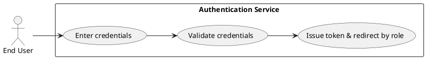
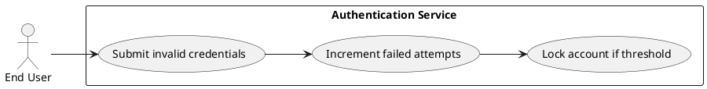
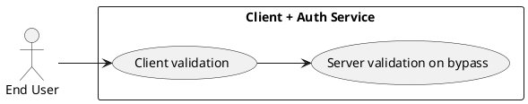
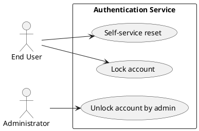
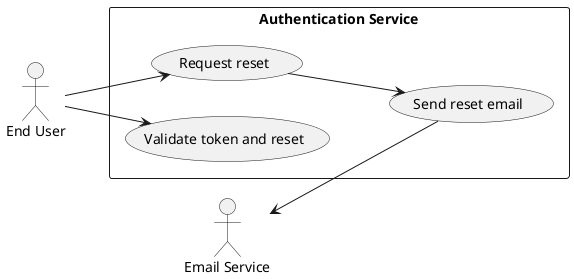
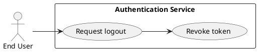

# Requirements Specification

## Feature Goal
The system MUST allow registered users to securely authenticate with email and password and gain access to application functionality based on role. On successful authentication the system SHALL issue an authentication token and redirect the user to the role-appropriate dashboard. Invalid attempts SHALL produce non-revealing error messages and be subject to anti-abuse controls.

## Business Justification
Executive Summary:
- Provide a secure, reliable authentication foundation for the application so users (customers, admins, employees) can access role-specific functionality.
- Replace/standardize authentication behavior across the product to meet security, compliance and usability needs.

Goals and Objectives:
- Objective: Enable secure email/password login with role-based access control (RBAC).
- Objective: Prevent unauthorized access and limit brute-force attacks with deterministic limits and logging.
- Objective: Provide a recoverable, auditable password reset flow.
- Objective: Provide operational visibility (audit logs, metrics) and admin controls for account management.

Target Users:
- End User (Customer/Employee) — needs consistent, fast, accessible login and role-specific landing experience.
- Administrator — needs ability to unlock accounts and view audit evidence.
- System Operator / SRE — needs metrics and alerting to detect auth service issues.
- Security/Compliance Officer — needs secure storage, auditability, and configurable policies.

Integration with existing features:
- Integrate with existing user datastore and role assignment.
- Integrate with SMTP/email provider for reset emails.
- Use secret management (vault/KMS) for signing keys and credentials.

Problems solved:
- Eliminates inconsistent login logic and insecure password handling.
- Mitigates credential stuffing and brute-force attempts.
- Standardizes token lifecycle and revocation behavior.

## Feature Scope
User-visible behavior:
- Login page/form (email + password) with client-side and server-side validation.
- On success: redirect to role-specific dashboard and establish authenticated session/token.
- On failure: show generic "Invalid credentials" message; show "Account is locked" when locked.
- Forgot password flow: request reset, receive email with single-use expiring link, set new password.
- Logout: immediate session/token invalidation.

Technical requirements:
- Passwords SHALL be stored using a modern, slow hash (Argon2id or bcrypt) with configurable cost.
- Account lockout SHALL occur after configurable number of failed attempts (default 5).
- Authentication token SHALL expire after configurable TTL (default 30 minutes); refresh strategy out-of-scope unless confirmed.
- All traffic SHALL use TLS; secrets SHALL be in vault/KMS.
- Audit logging of login events, failed attempts, locks, resets SHALL be emitted.

### Success Criteria
- [ ] Authentication success rate for valid credentials ≥ 99% in normal conditions.
- [ ] Average authentication request latency (server-side processing) < 1s under baseline load.
- [ ] Account lockout triggers after 5 failed attempts by default and prevents further attempts for the configured lock duration.
- [ ] Tokens issued are rejected after expiry; 100% rejection observed in token expiry tests.
- [ ] Password reset: reset token TTL enforced; single-use tokens cannot be reused.
- [ ] Unauthorized requests to protected endpoints return HTTP 401/403 and are blocked.

## Functional Requirements
- FR-001: [DETERMINISTIC] System MUST allow registered users to authenticate using email and password.
  - Acceptance criteria:
    - Given a registered user with valid credentials, when POST /auth/login is called, then the system SHALL return 200 and an authentication token and redirect target within 500ms (average target < 1s).
    - Given invalid credentials, when /auth/login is called, then the system SHALL return 401 with message "Invalid credentials".
    - Authentication SHALL require exact match of stored (hashed) credential using constant-time comparison.

- FR-002: [DETERMINISTIC] System MUST validate input fields client-side and server-side: email format and non-empty password.
  - Acceptance criteria:
    - Empty email or password SHALL produce field-level validation and prevent submission on client.
    - Server SHALL return 400 with structured validation errors when malformed input is received.
    - Validation tests SHALL cover at least: missing fields, invalid email formats, overly long values (limit e.g., 256 chars).

- FR-003: [DETERMINISTIC] System MUST store passwords hashed with a secure algorithm (Argon2id or bcrypt) and never persist plaintext passwords.
  - Acceptance criteria:
    - All password records in DB SHALL be stored as salted hashes.
    - Hashing parameters (memory, iterations) SHALL be configurable and documented.
    - Unit tests SHALL verify that raw passwords cannot be recovered and verification uses secure compare.

- FR-004: [DETERMINISTIC] System MUST generate an authentication token on successful login; token SHALL expire after a configurable TTL (default 30 minutes).
  - Acceptance criteria:
    - Tokens issued SHALL include expiry claim or server-side expiration enforcement.
    - Requests made with expired tokens SHALL receive 401 and be refused.
    - Token TTL configuration SHALL be stored in env/config and covered by unit/integration tests.

- FR-005: [DETERMINISTIC] System MUST enforce role-based redirection and authorization: after authentication users SHALL be redirected to a role-specific dashboard and protected endpoints SHALL enforce RBAC.
  - Acceptance criteria:
    - On login, server SHALL return redirect target determined by user's role; integration tests SHALL verify mapping for at least three roles (customer, employee, admin).
    - Access to protected endpoints SHALL return 403 if user lacks required role.
    - RBAC checks SHALL be enforced server-side for every protected API.

- FR-006: [DETERMINISTIC] System MUST lock an account after a configurable maximum number of consecutive failed login attempts (default 5).
  - Acceptance criteria:
    - After N failed attempts (default 5) within the configured window (e.g., 15 minutes), account SHALL be marked locked and further login attempts SHALL return 423 (Locked) or a 401 with "Account is locked" message.
    - A lock event SHALL be recorded in audit logs with timestamp and IP.
    - Tests SHALL verify lock triggers and prevention of login while locked.

- FR-007: [DETERMINISTIC] System MUST provide a secure forgot-password / reset flow using single-use expiring tokens delivered to registered email addresses.
  - Acceptance criteria:
    - Reset token SHALL be unguessable, single-use, and expire by default in 1 hour.
    - Using a valid token SHALL allow setting a new password; token SHALL be invalidated immediately after use.
    - Requests for reset SHALL be rate-limited to prevent abuse (see FR-010).
    - Tests SHALL verify token expiry, single-use behavior, and successful password change.

- FR-008: [DETERMINISTIC] System MUST present non-revealing, user-friendly error messages (no account existence disclosure).
  - Acceptance criteria:
    - Login failures SHALL show "Invalid credentials" unless the account is locked in which case "Account is locked" SHALL be shown.
    - Forgot-password request responses SHALL not confirm whether an email exists; instead show "If an account exists, a reset link has been sent."

- FR-009: [DETERMINISTIC] System MUST emit audit logs for authentication events: successful login, failed attempt, account lock, password reset request/completion.
  - Acceptance criteria:
    - Each event SHALL include timestamp, user-id or attempted identifier, source IP, outcome code, and event type.
    - Audit logs SHALL be exported to the centralized logging system and retained per retention policy.
    - Integration tests SHALL verify that events are generated for each flow.

- FR-010: [DETERMINISTIC] System MUST apply rate limiting and brute-force protections: per-IP and per-account throttling, and optional CAPTCHA after repeated failures.
  - Acceptance criteria:
    - System SHALL enforce a per-IP rate limit (example: 100 requests/min) configurable.
    - System SHALL enforce per-account failed attempt throttling and exponential backoff after successive failures.
    - CAPTCHA insertion point SHALL be supported after a configurable threshold.
    - Load tests SHALL validate throttling behavior under simulated attack.

- FR-011: [DETERMINISTIC] System MUST provide logout and support server-side revocation for active tokens.
  - Acceptance criteria:
    - Logout endpoint SHALL invalidate the token so further requests with that token are rejected.
    - If JWTs are used, a revocation strategy (revocation list or token versioning) SHALL be implemented and tested to ensure immediate revocation.
    - Tests SHALL verify logout revokes token and subsequent access returns 401.

- FR-012: [DETERMINISTIC] System MUST secure all traffic with TLS and store sensitive secrets in vault/KMS; sensitive DB columns SHALL be encrypted at rest.
  - Acceptance criteria:
    - All endpoints SHALL be accessible only via HTTPS in production; automated checks SHALL fail on plaintext HTTP exposure.
    - DB encryption SHALL be enabled for password hashes and reset token storage per platform capability.
    - Keys SHALL be rotated according to policy and documented.

- FR-013: [HYBRID] System SHOULD provide an administrative endpoint to unlock accounts and view lockout audit history; changes SHALL require admin authentication and be logged.
  - Acceptance criteria:
    - Admin unlock SHALL be available via authenticated admin UI/API and shall record unlocking event in audit logs.
    - Only users with admin role SHALL be permitted; access SHALL return 403 for unauthorized users.
    - Tests SHALL verify unlock operation and audit entry existence.

- FR-014: [AI-CANDIDATE] System MAY provide an optional risk-based assessment component that scores login attempts (IP reputation, velocity) and suggests adaptive controls (e.g., require CAPTCHA or MFA).
  - Acceptance criteria:
    - If enabled, the risk component SHALL provide a numeric score per attempt and yield deterministic action mapping for at least three score ranges (low/medium/high).
    - The feature SHALL be isolated as an opt-in module and shall not be required for initial rollout.
    - Manual review SHALL be possible for flagged attempts; all flagged events SHALL be logged.

**Note**: All FRs above are tagged as [DETERMINISTIC], [HYBRID], or [AI-CANDIDATE] as indicated.

## Use Case Analysis

### Actors & System Boundary
- Primary Actor: End User — registered user who wants to authenticate and access the application.
- Secondary Actor: Administrator — manages accounts (unlock, audit) and reviews logs.
- System Actor: Email Service (SMTP provider) — used to deliver password reset emails.
- System Boundary: "Authentication Service" (the system being specified).

### Use Case Specifications

#### UC-001: Login with valid credentials
- Actor(s): End User
- Goal: Authenticate and receive access to role-specific dashboard
- Preconditions:
  - User is registered and not locked.
  - User has valid email and password.
- Success Scenario:
  1. User enters email and password and submits login form.
  2. Client validates fields; sends POST /auth/login to Auth Service.
  3. Auth Service validates inputs, checks account status, verifies password hash.
  4. Auth Service issues auth token with TTL and determines redirect target by role.
  5. Auth Service responds 200 with token and redirect; Client redirects user to dashboard.
  6. Auth Service logs successful login event.
- Extensions/Alternatives:
  - 3a. If password invalid, increment failed attempts; if threshold reached, lock account and log event.
  - 4a. If token issuance fails, return 500 and log incident.
- Postconditions:
  - Token active; user is authenticated; audit log contains successful login.

Use Case Diagram

#### UC-002: Login with invalid credentials
- Actor(s): End User
- Goal: Prevent access and provide safe feedback
- Preconditions:
  - User exists or attempted identifier provided.
- Success Scenario:
  1. User submits invalid password.
  2. Auth Service verifies failure, increments failed-attempt counter, returns 401 "Invalid credentials".
  3. Auth Service logs failed attempt.
  4. If failed attempts reach configured max, lock account and log lock event.
- Extensions:
  - 2a. If repeated failures from same IP exceed per-IP threshold, rate-limit additional attempts or trigger CAPTCHA.
- Postconditions:
  - No token issued; failed attempt recorded; account possibly locked.

Use Case Diagram

#### UC-003: Empty / client-side invalid input
- Actor(s): End User
- Goal: Prevent submission of invalid payloads and surface field errors
- Preconditions:
  - Login page rendered.
- Success Scenario:
  1. User leaves required fields empty or enters malformed email.
  2. Client-side validation prevents submit and shows field-level messages.
  3. If client bypassed, server returns 400 with structured validation errors.
- Extensions:
  - 2a. Accessibility: screen reader announces field errors per WCAG.
- Postconditions:
  - No network validation attempt or server-side validation recorded as invalid input.

Use Case Diagram

#### UC-004: Account locked on failed attempts
- Actor(s): End User, Administrator
- Goal: Protect accounts after repeated failed attempts and provide recovery options
- Preconditions:
  - Failed attempts counter reaches max threshold.
- Success Scenario:
  1. After N failed attempts, Auth Service marks account locked.
  2. Login attempts return "Account is locked".
  3. User may use Forgot Password to reset or contact admin.
  4. Admin may unlock via admin endpoint (FR-013) and event logged.
- Extensions:
  - 3a. Self-service unlock via successful password reset.
- Postconditions:
  - Account state = locked; audit entry exists.

Use Case Diagram

#### UC-005: Forgot password / reset
- Actor(s): End User
- Goal: Allow user to regain access by creating a new password via secure token
- Preconditions:
  - User has access to registered email.
- Success Scenario:
  1. User requests password reset via /auth/reset-request with email.
  2. Auth Service rate-limits request and, if allowed, generates single-use reset token and sends email via SMTP provider.
  3. User clicks link and is taken to reset form; client validates token via /auth/reset-validate.
  4. User sets new password; server validates and updates hashed password; invalidates token; logs event.
- Extensions:
  - 2a. If email not found, service responds with generic success message (no disclosure).
  - 3a. If token expired or invalid, show generic error and advise to request again.
- Postconditions:
  - Password updated and token invalidated; audit logged.

Use Case Diagram

#### UC-006: Logout / token revocation
- Actor(s): End User
- Goal: Invalidate session token and end authenticated session
- Preconditions:
  - User has active token.
- Success Scenario:
  1. User triggers logout via POST /auth/logout.
  2. Auth Service revokes token server-side (or increments token version) and returns 200.
  3. Subsequent requests with that token are rejected with 401.
  4. Logout event logged.
- Extensions:
  - 2a. If token already expired, return 200 (idempotent).
- Postconditions:
  - Token revoked and unusable.

Use Case Diagram

## Risks & Mitigations
- Risk: Brute-force / credential stuffing.
  - Mitigation: FR-010 rate limiting, per-account throttling, CAPTCHA insertion, monitoring.
- Risk: Token leakage (client-side XSS or insecure storage).
  - Mitigation: Recommend Secure, HttpOnly cookies for web; short token TTL; educate clients to avoid localStorage for tokens; review XSS vectors.
- Risk: Account lockout abuse (attacker locks many accounts).
  - Mitigation: Combine per-IP and per-account thresholds, notify users on lock, enable admin unlock, consider progressive throttling and CAPTCHA prior to lock for suspicious patterns.
- Risk: Weak password hashing or configuration drift.
  - Mitigation: Use Argon2id/bcrypt with enforced configuration and automated checks; periodic security review and migration path for legacy hashes.
- Risk: Email/SMS reset abuse and spam.
  - Mitigation: Rate-limit reset requests, CAPTCHA upon repeated requests, monitoring/alerts on high volume.

## Constraints & Assumptions
Constraints:
- Token model decision: default design assumes short-lived access tokens (30m). Implementation may use JWT or opaque tokens; revocation strategy required if JWTs chosen.
- Existing user datastore schema / legacy password hashes may require migration; migration work is a separate effort.
- SMTP provider availability and deliverability affect reset flow reliability.

Assumptions:
- Users are already registered and have role assigned in user records.
- TLS termination is enforced at load balancer / ingress for all production traffic.
- Admin users exist and have an admin role to manage unlocks.
- MFA/SSO are out of scope for initial delivery unless explicitly requested.

## Non-Functional Requirements (NFR-XXX)

- NFR-001: [DETERMINISTIC] Security — Transport-level encryption: all production traffic SHALL use TLS 1.2+; server SHALL enforce HSTS, CSP, X-Content-Type-Options headers where applicable.
  - Acceptance criteria:
    - Automated tests SHALL fail if any endpoint is reachable over HTTP.
    - Security scans SHALL report no TLS <1.2 endpoints.

- NFR-002: [DETERMINISTIC] Security — Password hashing: password storage SHALL use Argon2id or bcrypt with configured cost; parameters SHALL meet organizational security policy.
  - Acceptance criteria:
    - Hashing configuration SHALL be documented and testable; no plaintext passwords present in DB.
    - Crypto library dependencies SHALL be up-to-date.

- NFR-003: [DETERMINISTIC] Performance — Authentication service SHALL respond to login requests within 1 second median under baseline load.
  - Acceptance criteria:
    - Performance tests SHALL show median latency < 1s and P95 < 2s for auth endpoint under defined baseline load.

- NFR-004: [DETERMINISTIC] Availability & Scalability — Auth service SHALL be horizontally scalable and tolerate expected peak load; session store (if used) SHALL be highly available.
  - Acceptance criteria:
    - Service SHALL support horizontal autoscaling; tests SHALL simulate scale-up with no lost requests.
    - Service-level indicators (SLIs) defined and SLO targets established.

- NFR-005: [DETERMINISTIC] Logging & Monitoring — All auth events SHALL be logged and exported to centralized logging and metrics; alerts SHALL trigger on error spike or abnormal failed attempts.
  - Acceptance criteria:
    - Dashboards for login success/failure rate, lock events, reset event rate SHALL be available.
    - Alerts for >X failed attempts/min (configurable) SHALL be created.

- NFR-006: [DETERMINISTIC] Privacy & Compliance — PII SHALL be minimized and handled per retention policy; reset emails SHALL not leak PII.
  - Acceptance criteria:
    - Data retention rules SHALL be documented and enforced.
    - Privacy review completed prior to release.

- NFR-007: [DETERMINISTIC] Accessibility — Login and reset pages SHALL meet WCAG 2.1 AA.
  - Acceptance criteria:
    - Accessibility audit SHALL pass with no critical failures for forms.

- NFR-008: [DETERMINISTIC] Testability — Unit, integration, and end-to-end tests SHALL cover happy path and failure scenarios for all FRs.
  - Acceptance criteria:
    - CI pipeline SHALL include tests that assert lockout behavior, token expiry, reset token single-use, and RBAC enforcement.

## Previous Analysis and Reasoning:
Approach summary:
- Prioritize deterministic, secure, auditable authentication core as MVP.
- Delay AI-driven risk scoring as optional module (FR-014) so core can be deterministic and testable.
- Decision points needed before implementation: token model (JWT vs opaque), lockout duration and unlock policy (temporary vs manual), password policy parameters, refresh token policy.

Immediate decisions required:
- Decide token model: JWT (requires revocation strategy) OR opaque tokens (session store e.g., Redis).
- Decide lockout semantics: default lock after 5 attempts for 15 minutes OR require admin/unlock or password reset to unlock.
- Confirm password policy (min length, complexity).
- Confirm reset token TTL (default 1 hour) and email template content.

If decisions are confirmed, next steps:
- Produce detailed API contract (endpoints, request/response JSON) and data model additions (user fields: password_hash, failed_attempts, locked_until, token_version).
- Implement and test per acceptance criteria.

## Appendix: Defaults & Configuration (examples to be parameterized)
- Max failed attempts: 5
- Lock duration (if temporary): 15 minutes (configurable)
- Access token TTL: 30 minutes (configurable)
- Reset token TTL: 1 hour (configurable)
- Per-IP rate limit (example): 100 requests/min (configurable)
- Password hashing: Argon2id with organization-specified memory/iterations or bcrypt with cost >= 12

--- End of Specification ---